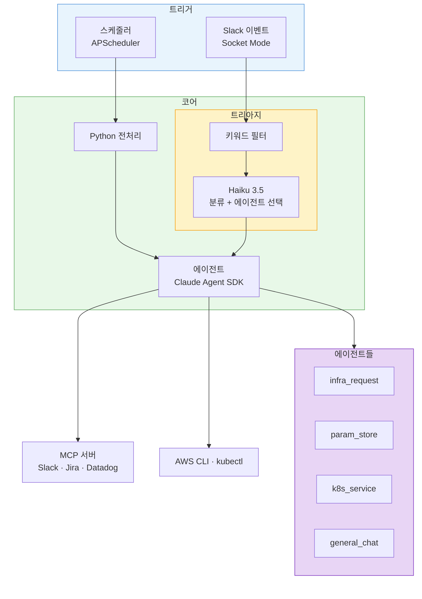
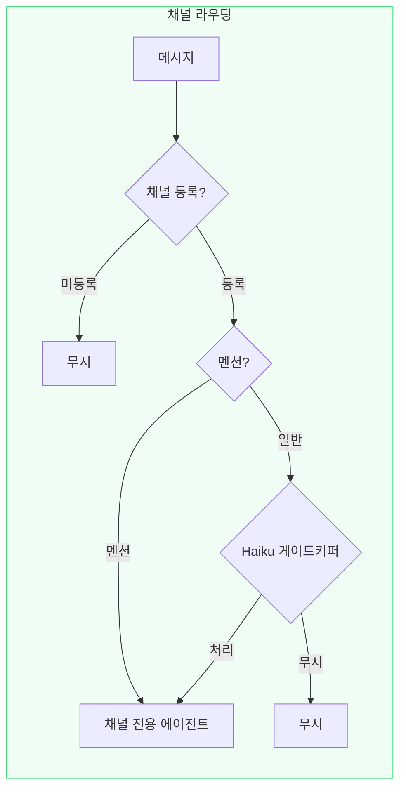

[1편](/ai/ai-infra-automation/)에서는 Claude Agent SDK와 MCP로 Slack 기반 인프라 자동화를 만들었다. 비용 분석, 파라미터 스토어 등록 같은 반복 업무를 AI 에이전트에 맡기는 구조였다.

잘 돌아갔다. 그런데 <span style="color:#1565c0; font-weight:bold">기능을 추가할 때마다 라우팅 규칙이 복잡해졌다.</span>

키워드를 하나 추가하려면 동의어, 오타, 줄임말까지 챙겨야 했고, 트리거를 하나 추가하면 코드 경로가 하나 더 늘었다.

---

## 키워드 라우팅의 한계

1편의 메시지 라우팅 구조를 다시 보면 이렇다.



메시지가 들어오면 키워드 필터를 통과하고, Haiku가 분류해서 적절한 에이전트를 선택한다. 4가지 트리거(report, mention, triage, usergroup)가 각각 다른 코드 경로를 탄다.

동작하는 데는 문제가 없었다. 문제는 기능을 추가할 때 드러났다. 누수 포인트가 두 곳이었다.

### 누수 1: 키워드가 너무 다양하다

새 기능이 들어오면 그걸 통과시킬 키워드를 등록해야 한다. 문제는 같은 의도를 표현하는 방법이 너무 많다는 것이다.

"NAT IP 알려주세요"는 반응하지만 "외부에서 접근하려는데 IP가 뭐야?"는 무시된다. "파라미터"는 매칭되는데 "파라메터"는 안 되고, "배포"는 되는데 "디플로이"는 안 된다.

키워드를 하나 추가하려면 동의어, 오타, 줄임말까지 챙겨야 했다. 등록하지 않은 표현은 에이전트가 없는 것과 같다.

### 누수 2: Haiku가 너무 많은 걸 판단한다

키워드를 통과한 메시지는 Haiku가 분류했다. 메시지의 카테고리를 판단하고, 적절한 에이전트를 골라야 했다. 인프라 요청인지, 파라미터 등록인지, K8s 서비스 문의인지.

채널이 다양해질수록 들어오는 요청의 종류도 늘어난다. 판단해야 할 것이 많아지면 오판 확률도 올라간다. 인프라 요청을 파라미터 에이전트로 보내거나, 단순 공유를 요청으로 처리하는 일이 생긴다.

두 문제 모두 같은 뿌리다. <span style="color:#1565c0; font-weight:bold">다양한 채널에서 다양한 형태로 들어오는 메시지를 하나의 파이프라인이 처리하려 하니 복잡해진 것이다.</span>

---

## 채널이 곧 의도다

Slack은 이미 목적 단위로 채널이 나뉘어 있다. #t_인프라에 글을 쓰는 사람은 인프라 관련 이야기를 하려는 것이고, #noti_aws_cost에 올라오는 건 비용 리포트다.

채널 자체가 의도를 담고 있다면, 굳이 키워드로 의도를 분류할 필요가 없다. 채널 → 에이전트를 1:1로 매핑하면 된다.

이렇게 하면 두 가지 누수가 동시에 사라진다. 키워드 등록이 필요 없으니 어떤 표현이든 반응하고, Haiku가 에이전트를 선택할 필요가 없으니 오판도 없다. 각 채널에서 요구하는 기능은 한정적이기 때문에, 채널 전용 에이전트의 범위도 자연스럽게 좁아진다.



### Haiku의 역할 변화

이전에는 Haiku가 "분류 + 에이전트 선택"을 했다. 메시지를 읽고, 카테고리를 판단하고, 적절한 에이전트를 골라야 했다. 지금은 <span style="color:#1565c0; font-weight:bold">"이 메시지를 처리해야 하는가?"</span> 한 가지만 판단한다. 에이전트 선택은 채널이 이미 결정했기 때문이다.

```
"서버 NAT IP 알려주세요" → 처리 (인프라 요청)
"점심 뭐 먹지"           → 무시 (일상 대화)
"참고로 공유합니다"       → 무시 (FYI)
```

판단해야 할 것이 줄면 정확도가 올라간다. 분류 + 선택이라는 복합 판단에서, 처리 여부라는 단일 판단으로 바뀌었기 때문이다.

@멘션의 경우 게이트키퍼를 거치지 않고 바로 실행된다. 명시적으로 에이전트를 호출했으니 판단할 필요가 없다.

### 사용자에게 달라진 것

결과적으로 에이전트가 하는 일은 같다. 달라진 건 사용자가 해야 하는 것이다.

| | Before | After |
|---|---|---|
| 요청 방법 | @멘션 + 키워드 포함해서 글쓰기 | 채널에 그냥 글쓰기 |
| 반응 조건 | 키워드가 매칭되어야 반응 | 채널에 등록되어 있으면 반응 |
| 형식 제약 | "NAT", "파라미터" 등 특정 단어 필요 | 자연어 그대로 |

### 설정도 단순해졌다

채널을 추가하는 데 필요한 설정도 바뀌었다. 기존에는 3개 파일에 흩어진 키워드와 트리거를 관리해야 했지만, 지금은 yaml에 항목 하나만 추가하면 된다.

```yaml
channel_triggers:
  channels:
    - channel_id: "C06PW1CTU5B"
      name: "t_인프라"
      default_agent: infra_request
    - channel_id: "C09BW8WJVD1"
      name: "웹훅-테스트"
      default_agent: infra_request
```

코드 수정이 필요 없다. 요청이 들어오면 에이전트가 즉시 Jira 티켓을 생성하고, 작업 완료 후 결과를 댓글로 남긴다.

---

## 아직 남은 것들

### 승인 게이트

현재 승인 게이트는 프롬프트에 의존한다. "변경 작업 전에 승인을 받아라"라고 적어놓은 것이다. 대부분 잘 동작하지만, LLM이 판단을 잘못하면 승인 없이 실행될 가능성이 있다.

다음 단계는 SDK 레벨에서 승인을 강제하는 것이다. 특정 도구(AWS CLI write, kubectl apply 등)를 호출하기 전에 코드 레벨에서 승인 상태를 확인하는 구조다. 프롬프트가 아니라 코드가 게이트를 잡아야 한다.

### 프롬프트 품질

채널을 추가하는 것은 yaml 3줄이면 된다. 하지만 그 채널의 에이전트가 좋은 품질로 동작하려면 프롬프트를 잘 작성해야 한다. 현재 infra_request 에이전트의 프롬프트는 수십 번의 테스트를 거쳐 다듬어진 것이다. 새 에이전트를 추가할 때마다 같은 반복이 필요하다.

### 권한 체계

현재는 허용된 사용자 목록으로 접근을 제어한다. 역할별로 요청 가능한 범위를 제한하는 것도 고려하고 있다. 개발자는 조회만, 인프라팀은 변경 요청 가능한 구조다.

---

## 마무리

1편이 "AI 에이전트가 일을 할 수 있는가?"에 대한 답이었다면, 이번 글은 "라우팅을 얼마나 단순하게 만들 수 있는가?"에 대한 답이다.

복잡한 라우팅을 걷어내니 채널 추가가 쉬워졌고, 키워드를 몰라도 에이전트가 반응하게 됐다. 기술적으로 어려운 일은 아니었다. 채널 매핑은 dictionary lookup이다. 어려운 것은 <span style="color:#1565c0; font-weight:bold">"뭘 걷어내야 구조가 단순해지는가"</span>를 찾는 일이었다.

구조는 단순해졌지만, 에이전트가 지금 뭘 하고 있는지 Slack 스레드를 직접 따라가야 하는 문제는 남아있었다. [다음 편](/ai/ai-infra-automation-v3/)에서는 이 문제를 해결한 웹 콘솔 이야기를 한다.
