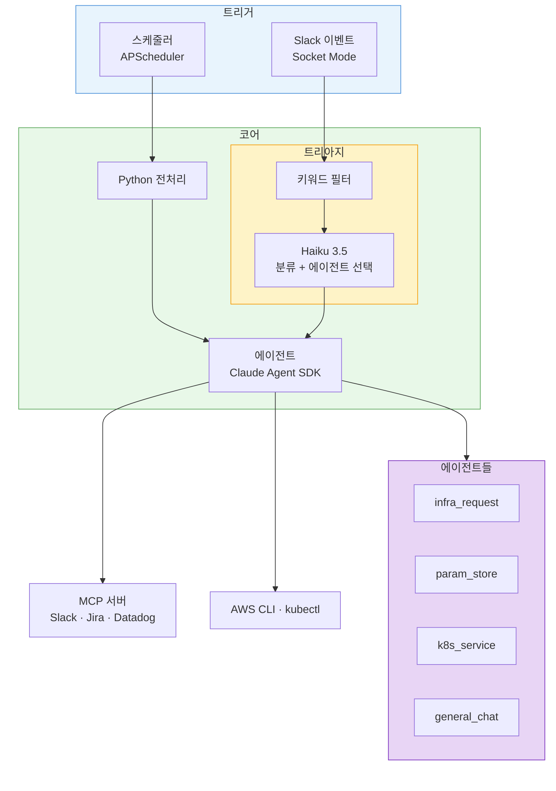
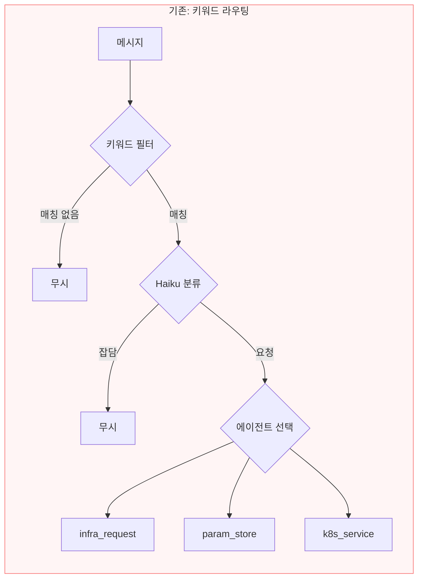
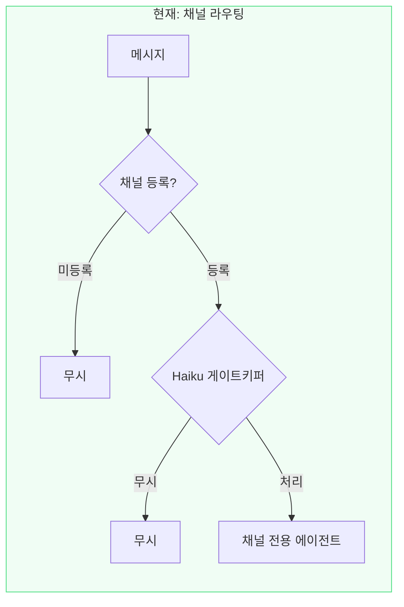
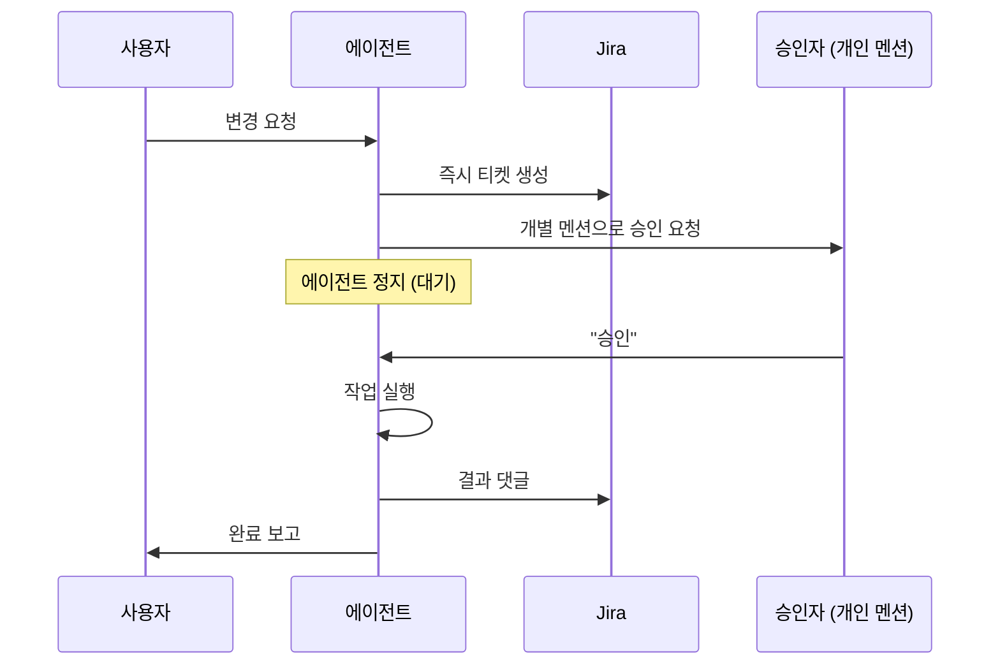
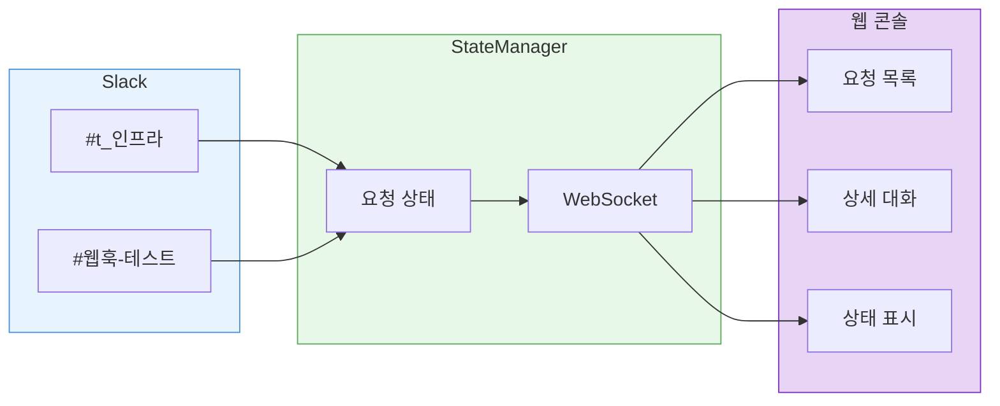
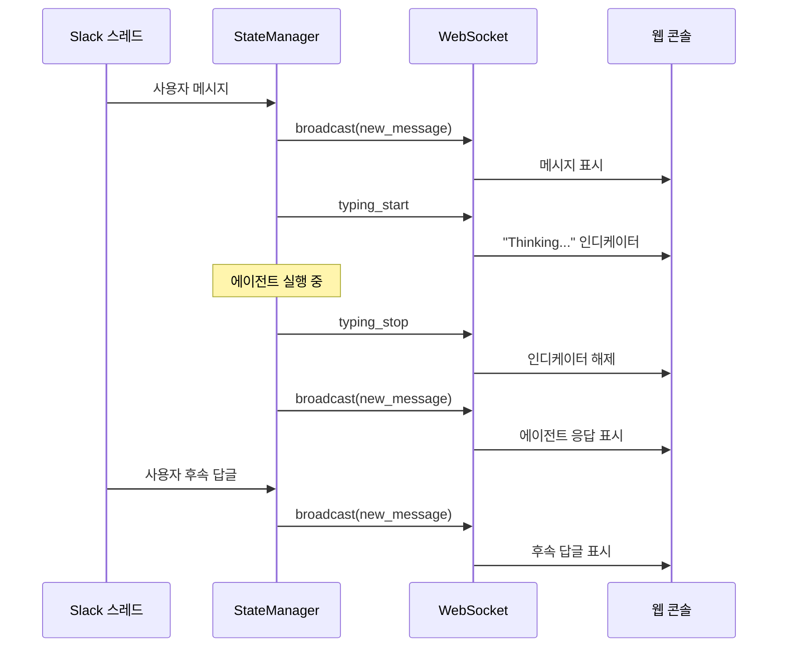
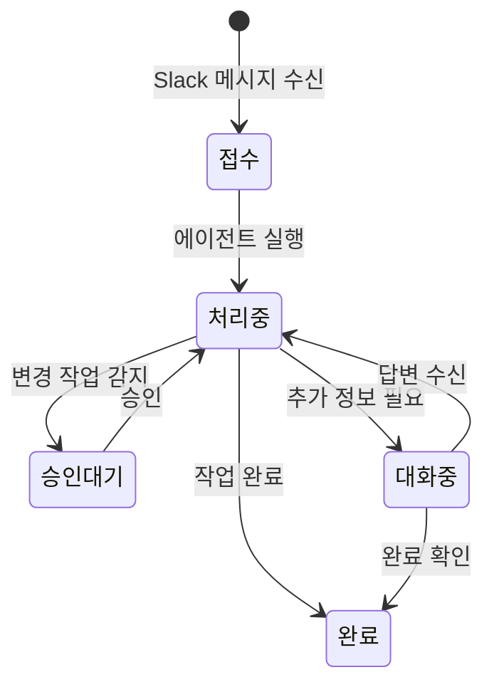

[1편](/ai/ai-infra-automation/)에서는 Claude Agent SDK와 MCP로 Slack 기반 인프라 자동화를 만들었다. 비용 분석, 파라미터 스토어 등록 같은 반복 업무를 AI 에이전트에 맡기는 구조였다.

잘 돌아갔다. 그런데 한 가지 문제가 있었다.

<span style="color:#1565c0; font-weight:bold">나만 쓸 수 있었다.</span>

---

## 혼자 돌리기엔 충분했다

1편의 시스템 구조를 다시 보면 이렇다.



메시지가 들어오면 키워드 필터를 통과하고, Haiku가 분류해서 적절한 에이전트를 선택한다. 4가지 트리거(report, mention, triage, usergroup)가 각각 다른 코드 경로를 탄다.

동작하는 데는 문제가 없었다. 문제는 다른 곳에 있었다.

### 사용자 입장

다른 팀원이 인프라 요청을 하려면:

- **어디에 써야 하는지** 알아야 한다 — 특정 채널에서만 동작
- **어떻게 써야 하는지** 알아야 한다 — 키워드가 없으면 필터에서 무시됨
- **뭘 하고 있는지** 알 수 없다 — 에이전트가 작업 중인지, 승인 대기인지, 완료인지 Slack 스레드를 직접 따라가야 확인 가능

### 개발자 입장

새 채널이나 에이전트를 추가하려면:

| 파일 | 수정 내용 |
|------|----------|
| `event_triggers.yaml` | 트리거 설정 추가 |
| `slack_listener.py` | 라우팅 분기 추가 |
| `triage.py` | 키워드 목록 + Haiku 프롬프트 수정 |

3개 파일을 건드려야 했다. 키워드 목록은 점점 길어지고, 엣지케이스마다 예외를 추가해야 했다. 동작하지만 유지보수가 부담스러운 구조였다.

팀 도구가 되려면 두 가지가 필요했다.

1. **진입장벽을 낮추는 것** — 사용자가 형식을 신경 쓰지 않아도 되게
2. **투명성을 확보하는 것** — 누구나 에이전트 현황을 볼 수 있게

---

## 첫 번째: 진입장벽 낮추기

### 사용자에게 달라진 것

결과적으로 에이전트가 하는 일은 같다. NAT IP를 조회하고, 파라미터를 등록하고, 서비스 상태를 확인한다. 달라진 건 <span style="color:#1565c0; font-weight:bold">사용자가 해야 하는 것</span>이다.

| | Before | After |
|---|---|---|
| 요청 방법 | @멘션 + 키워드 포함해서 글쓰기 | 채널에 그냥 글쓰기 |
| 반응 조건 | 키워드가 매칭되어야 반응 | 채널에 등록되어 있으면 반응 |
| 형식 제약 | "NAT", "파라미터" 등 특정 단어 필요 | 자연어 그대로 |
| 에이전트 선택 | Haiku가 분류해서 결정 | 채널이 결정 (고정) |

예를 들어 기존에는 "서버 NAT IP 알려주세요"라고 정확히 써야 키워드 필터를 통과했다. 지금은 #t_인프라 채널에 "외부에서 우리 서버 접근하려는데 IP가 뭐야?"라고 써도 에이전트가 반응한다.

### 채널이 곧 의도다

핵심 인사이트는 단순하다. #t_인프라 채널에 글을 쓰는 사람은 이미 인프라 관련 이야기를 하려는 의도가 있다. 굳이 키워드로 분류할 필요가 없다.

1편에서 <span style="color:#1565c0; font-weight:bold">"계산은 코드가 해야 한다"</span>는 교훈을 얻었다면, 이번에 얻은 교훈은 <span style="color:#1565c0; font-weight:bold">"라우팅은 구조가 해야 한다"</span>는 것이다. 키워드 필터와 Haiku 분류기가 하던 일을 채널 구조 자체가 대신한다.





Haiku의 역할이 바뀌었다. 이전에는 "분류 + 에이전트 선택"을 했지만, 지금은 <span style="color:#1565c0; font-weight:bold">"이 메시지를 처리해야 하는가?"</span> 한 가지만 판단한다. 에이전트 선택은 채널이 이미 결정했기 때문이다.

```
"서버 NAT IP 알려주세요" → 처리 (인프라 요청)
"점심 뭐 먹지"           → 무시 (일상 대화)
"참고로 공유합니다"       → 무시 (FYI)
```

@멘션의 경우 게이트키퍼를 거치지 않고 바로 실행된다. 명시적으로 에이전트를 호출했으니 판단할 필요가 없다.

### 개발자에게 달라진 것

채널을 추가하는 데 필요한 설정이 바뀌었다.

```yaml
# Before: 3개 파일에 흩어진 설정
mention_triggers:
  keywords: ["NAT", "파라미터", "배포", ...]
  haiku_prompt: "분류하고 에이전트를 선택하세요..."

triage_triggers:
  channels: [...]
  keywords: [...]

usergroup_triggers:
  patterns: [...]
```

```yaml
# After: yaml 3줄로 채널 추가
channel_triggers:
  enabled: true
  haiku_model: "claude-haiku-4-5-20251001"
  channels:
    - channel_id: "C06PW1CTU5B"
      name: "t_인프라"
      default_agent: infra_request
    - channel_id: "C09BW8WJVD1"
      name: "웹훅-테스트"
      default_agent: infra_request
```

채널을 추가하고 싶으면 `channels` 배열에 항목 하나를 추가하면 된다. 코드 수정이 필요 없다.

### 승인 게이트 변경

1편에서는 @infra 그룹에 승인을 요청했다. 그룹 멘션은 누가 봤는지 알 수 없고, 책임이 분산된다.

지금은 개별 승인자에게 직접 멘션한다. 요청이 들어오면 즉시 Jira 티켓도 생성된다.



조회(R)는 승인 없이 바로 실행되고, 생성/수정/삭제(CUD)만 승인을 거친다.

---

## 두 번째: 투명성 확보

### Slack만으로는 부족한 이유

Slack은 좋은 인터페이스지만 한계가 있다.

- **채널에 있어야 볼 수 있다** — 해당 채널에 없는 팀원은 에이전트 활동을 모른다
- **스레드를 따라가야 한다** — 에이전트가 작업 중인지, 승인 대기인지, 완료인지 스레드를 열어봐야 안다
- **전체 현황 파악이 어렵다** — 지금 진행 중인 요청이 몇 개인지, 누가 뭘 요청했는지 한눈에 안 보인다

에이전트가 나 혼자 쓰는 도구였을 때는 괜찮았다. 내가 요청하고, 내가 스레드를 확인하면 된다. 하지만 팀 도구가 되면 이야기가 달라진다. 인프라팀 3명이 각각 다른 채널에서 요청을 하고 있을 때, 전체 현황을 한 곳에서 보고 싶다.

웹 콘솔은 이 문제를 해결한다.



### Slack 스레드와 실시간 동기화

웹 콘솔의 핵심은 Slack 스레드와의 실시간 동기화다. Slack에서 대화가 오가면 웹에도 그대로 반영된다.



에이전트가 생각하는 동안은 Thinking 인디케이터가 표시된다. 채널에 없는 팀원도 웹 콘솔에서 진행 상황을 확인하고, 직접 메시지를 보낼 수도 있다.

### 요청 생명주기

모든 요청은 웹 콘솔에서 상태별로 관리된다.



요청이 들어오면 즉시 Jira 티켓이 생성되고, 웹 콘솔에 카드가 추가된다. 에이전트 실행, 승인 대기, 추가 대화, 완료까지 전체 흐름이 웹에서 추적된다. Slack 채널에 없어도 "지금 어떤 요청이 처리되고 있는지"를 알 수 있다.

---

## 아직 남은 것들

### 승인 게이트의 한계

현재 승인 게이트는 프롬프트에 의존한다. "변경 작업 전에 승인을 받아라"라고 프롬프트에 적어놓은 것이다. 대부분 잘 동작하지만, LLM이 판단을 잘못하면 승인 없이 실행될 가능성이 있다.

다음 단계는 SDK 레벨에서 승인을 강제하는 것이다. 특정 도구(AWS CLI write, kubectl apply 등)를 호출하기 전에 코드 레벨에서 승인 상태를 확인하는 구조다. 프롬프트가 아니라 코드가 게이트를 잡아야 한다.

### 에이전트 프롬프트 품질

채널을 추가하는 것은 yaml 3줄이면 된다. 하지만 그 채널의 에이전트가 좋은 품질로 동작하려면 프롬프트를 잘 작성해야 한다. 현재 infra_request 에이전트의 프롬프트는 수십 번의 테스트를 거쳐 다듬어진 것이다. 새 에이전트를 추가할 때마다 같은 반복이 필요하다.

### 권한 체계

현재는 허용된 사용자 목록으로 접근을 제어한다. 역할별로 요청 가능한 범위를 제한하는 것도 고려하고 있다. 개발자는 조회만, 인프라팀은 변경 요청 가능한 구조다.

---

## 마무리

1편이 "AI 에이전트가 일을 할 수 있는가?"에 대한 답이었다면, 이번 글은 "팀이 함께 쓸 수 있는가?"에 대한 답이다.

기술적으로 어려운 일은 아니었다. 채널 매핑은 dictionary lookup이고, 웹 콘솔은 WebSocket broadcast다. 어려운 것은 <span style="color:#1565c0; font-weight:bold">"어디를 단순화해야 사용자가 편해지는가"</span>를 찾는 일이었다.

복잡한 라우팅을 걷어내니 채널 추가가 쉬워졌고, 눈에 보이게 만드니 다른 사람도 쓸 수 있게 됐다.
