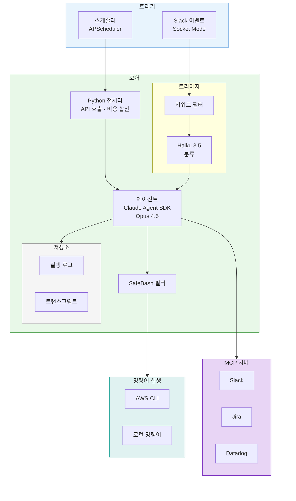
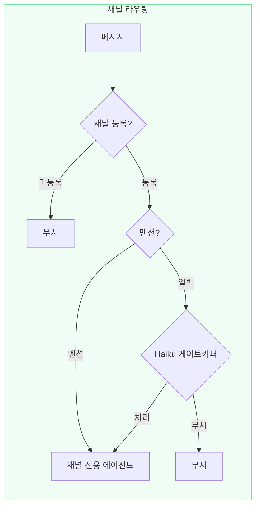

[1편](/ai/ai-infra-automation/)에서는 Claude Agent SDK와 MCP로 Slack 기반 인프라 자동화를 만들었다. 비용 분석, 파라미터 스토어 등록 같은 반복 업무를 AI 에이전트에 맡기는 구조였다.

처음에는 문제 없었다. 그런데 <span style="color:#1565c0; font-weight:bold">기능을 추가할 때마다 라우팅 규칙이 복잡해졌다.</span> 키워드를 등록하고, 동의어를 챙기고, 실제 메시지로 매칭이 되는지 테스트하는 과정이 반복됐다. 새 기능 하나를 추가하는 데 구현보다 라우팅 규칙을 다듬는 시간이 더 걸렸다.

---

## 키워드 라우팅의 한계

기존 메시지 라우팅 구조를 다시 보면 이렇다.



Slack 이벤트가 들어오면 먼저 키워드 필터를 거친다. 메시지에 "파라미터", "NAT", "배포" 같은 등록된 키워드가 있는지 확인하는 단계다. 키워드가 매칭되면 Haiku에게 넘긴다. Haiku는 두 가지를 판단한다. 첫째, 이 메시지가 처리해야 할 요청인지 잡담인지 분류한다. 둘째, 요청이라면 어떤 에이전트가 처리해야 하는지 선택한다. 인프라 요청이면 infra_request, 파라미터 등록이면 param_store, K8s 서비스 문의면 k8s_service.

키워드 필터가 1차 관문, Haiku 분류가 2차 관문이다. 두 단계를 통과해야 에이전트가 실행된다. PoC 단계에서는 충분한 구조였지만 운영으로 넘어가면서 병목이 두 곳에서 드러났다.

### 병목 1: 키워드가 너무 다양하다

새 기능이 들어오면 그걸 통과시킬 키워드를 등록해야 한다. 예를 들어 K8s 서비스 포트 조회 기능을 추가하려면, "K8s", "쿠버네티스", "포트", "서비스" 같은 키워드를 등록하고, 실제 메시지로 매칭되는지 하나씩 테스트해야 한다. 문제는 같은 의도를 표현하는 방법이 너무 많다는 것이다.

"NAT IP 알려주세요"는 반응하지만 "외부에서 접근하려는데 IP가 뭐야?"는 무시된다. "파라미터"는 매칭되는데 "파라메터"는 안 되고, "배포"는 되는데 "디플로이"는 안 된다. 키워드를 하나 추가하려면 동의어, 오타, 줄임말까지 챙겨야 했다. 등록하지 않은 표현은 에이전트가 없는 것과 같다.

### 병목 2: Haiku가 너무 많은 걸 판단한다

키워드를 통과한 메시지는 Haiku가 분류했다. 메시지의 카테고리를 판단하고, 적절한 에이전트를 골라야 했다. 인프라 요청인지, 파라미터 등록인지, K8s 서비스 문의인지. 채널이 다양해질수록 들어오는 요청의 종류도 늘어난다. 판단해야 할 것이 많아지면 오판 확률도 올라간다. 인프라 요청을 파라미터 에이전트로 보내거나, 단순 공유를 요청으로 처리하는 일이 생긴다. 오분류가 발생하면 에이전트가 엉뚱한 도구를 호출하고, 사용자는 재요청해야 한다. 한 번의 오판이 신뢰를 깎는다.

두 문제 모두 같은 뿌리다. <span style="color:#1565c0; font-weight:bold">다양한 채널에서 다양한 형태로 들어오는 메시지를 하나의 파이프라인이 처리하려 하니 복잡해진 것이다.</span>

---

## 채널이 곧 의도다

Slack은 이미 목적 단위로 채널이 나뉘어 있다. #infra-support에 글을 쓰는 사람은 인프라 관련 이야기를 하려는 것이고, #aws-cost-alerts에 올라오는 건 비용 리포트고, #deploy-notifications에 올라오는 건 배포 알림이다.

<span style="color:#1565c0; font-weight:bold">채널 자체가 의도를 담고 있다면, 메시지 내용으로 의도를 분류하는 단계 자체가 불필요하다.</span> 키워드로 걸러낼 필요도 없고, Haiku가 카테고리를 판단할 필요도 없다. 채널 → 에이전트를 1:1로 매핑하면 라우팅이 끝난다.

이렇게 하면 두 가지 병목이 동시에 사라진다. 키워드 등록이 필요 없으니 어떤 표현이든 반응하고, Haiku가 에이전트를 선택할 필요가 없으니 오판도 없다. 채널의 목적이 나뉘어 있으니 에이전트의 책임도 자연스럽게 나뉜다.



### Haiku의 역할 변화

이전에는 Haiku가 "분류 + 에이전트 선택"을 했다. 메시지를 읽고, 카테고리를 판단하고, 적절한 에이전트를 골라야 했다. 지금은 "이 메시지를 처리해야 하는가?" 한 가지만 판단한다. 에이전트 선택은 채널이 이미 결정했기 때문이다.

```
"서버 NAT IP 알려주세요" → 처리 (인프라 요청)
"점심 뭐 먹지"           → 무시 (일상 대화)
"참고로 공유합니다"       → 무시 (FYI)
```

<span style="color:#1565c0; font-weight:bold">판단해야 할 것이 줄면 정확도가 올라간다.</span> 분류 + 선택이라는 복합 판단에서, 처리 여부라는 단일 판단으로 바뀌었기 때문이다. @멘션의 경우 게이트키퍼를 거치지 않고 바로 실행된다. 명시적으로 에이전트를 호출했으니 판단할 필요가 없다.

### 사용자에게 달라진 것

에이전트가 제공하는 기능은 동일하다. 달라진 건 사용자와 에이전트 사이의 인터랙션이다.

| | Before | After |
|---|---|---|
| 요청 방법 | @멘션 + 키워드 포함해서 글쓰기 | 채널에 그냥 글쓰기 |
| 반응 조건 | 키워드가 매칭되어야 반응 | 채널에 등록되어 있으면 반응 |
| 형식 제약 | "NAT", "파라미터" 등 특정 단어 필요 | 자연어 그대로 |

### 설정도 단순해졌다

채널을 추가하는 데 필요한 설정도 바뀌었다. 기존에는 키워드 목록에 단어를 등록하고, 트리거 설정에 채널을 추가하고, 에이전트 매핑 규칙을 수정해야 했다. 3개 파일을 건드려야 채널 하나가 추가됐다. 지금은 yaml에 항목 하나만 추가하면 된다.

```yaml
channel_triggers:
  channels:
    - channel_id: "C01ABCD23EF"
      name: "infra-support"
      default_agent: infra_request
    - channel_id: "C02GHIJ45KL"
      name: "dev-test"
      default_agent: infra_request
```

코드 수정이 필요 없다.

---

## 마무리

1편에서 AI 에이전트가 인프라 업무를 처리할 수 있다는 걸 확인했다. 이번 글에서는 그 에이전트에게 메시지를 전달하는 라우팅 구조를 정리했다.

키워드 필터와 Haiku 분류라는 2단계 트리아지를 걷어내고, 채널 자체를 라우팅으로 삼았다. 구조가 단순해지니 채널 추가도 쉬워졌고, 사용자는 키워드를 외울 필요가 없어졌다.

아직 이 시스템은 나 혼자 쓰고 있다. 팀 전체가 같은 에이전트를 사용하며, 에이전트에게 팀의 경험을 쌓고 누가 요청하든 균일한 응답을 유지할 수 있어야 한다. [다음 편](/ai/ai-infra-automation-v3/)에서는 이 문제를 다룬다.
