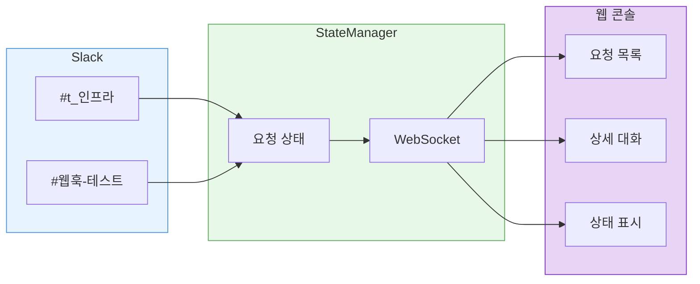
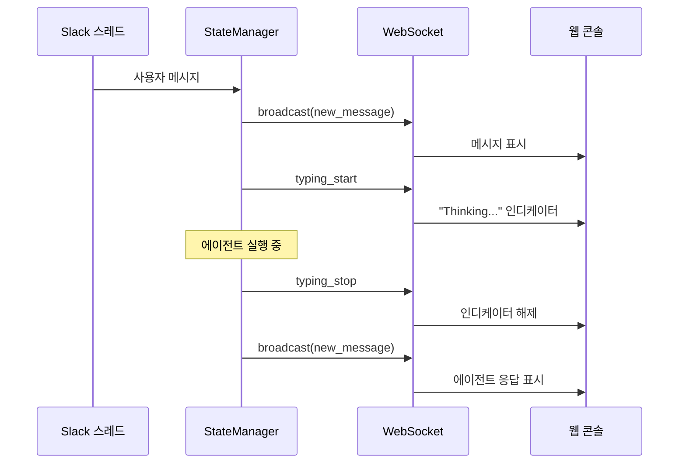
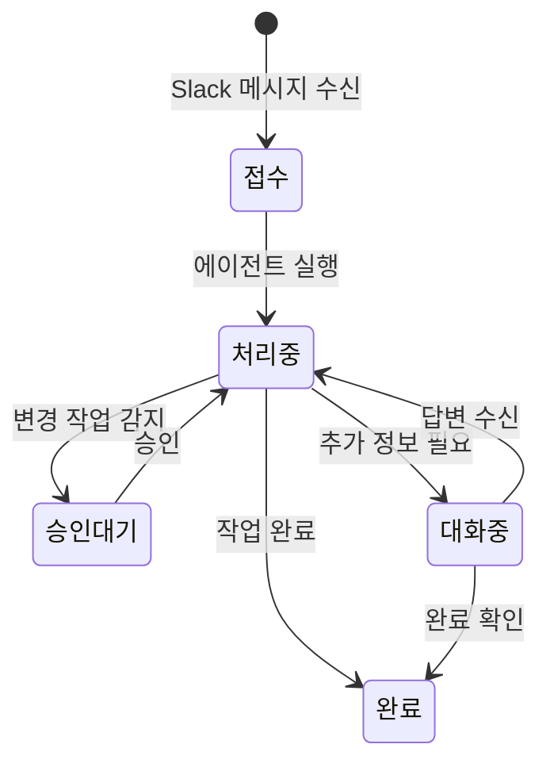

[2편](/ai/ai-infra-automation-v2/)에서 라우팅 구조를 단순화했다. 채널에 글만 쓰면 에이전트가 반응하게 됐고, 키워드를 외울 필요도 없어졌다.

하지만 여전히 한 가지 문제가 있었다.

나만 쓸 수 있었다.

...는 아니고, 정확히는 에이전트가 뭘 하고 있는지 안 보였다. 다른 사람이 쓸 수는 있는데, 지금 뭐가 돌아가고 있는지 모르니까 쓰지 않는 것이다.

---

## Slack만으로는 부족하다

Slack은 좋은 인터페이스지만, 팀 도구의 대시보드로는 한계가 있다.

에이전트에게 요청하면 스레드가 열린다. 에이전트가 작업 중인지, 승인을 기다리고 있는지, 완료됐는지 알려면 스레드를 직접 열어봐야 한다. 해당 채널에 없는 팀원은 에이전트 활동 자체를 모른다.

혼자 쓸 때는 괜찮았다. 내가 요청하고, 내가 스레드를 확인하면 된다. 하지만 인프라팀 3명이 각각 다른 채널에서 요청을 하고 있을 때, "지금 진행 중인 요청이 몇 개인지, 누가 뭘 요청했는지" 한 곳에서 보고 싶어진다.

---

## 웹 콘솔

웹 콘솔을 만들었다. 모든 요청의 상태를 한눈에 보여주는 대시보드다.

좌측에서 상태별로 요청을 분류한다. 대기, 진행 중, 승인 대기, 완료. 채널에 없어도 지금 어떤 요청이 처리되고 있는지 한눈에 파악할 수 있다.

요청을 선택하면 Slack 스레드의 대화가 그대로 보인다.

에이전트 응답, 사용자 답글, 승인 요청까지 전부 웹에서 확인할 수 있다. Slack을 열지 않아도 된다.

---

## 실시간 동기화

웹 콘솔의 핵심은 Slack 스레드와의 실시간 동기화다. Slack에서 메시지가 오가면 WebSocket을 통해 웹에도 즉시 반영된다.

StateManager가 중앙에서 모든 요청 상태를 관리한다. Slack 이벤트가 들어오면 상태를 업데이트하고, WebSocket으로 연결된 모든 클라이언트에 broadcast한다.

에이전트가 생각하는 동안은 Thinking 인디케이터가 표시된다. 몇 초 만에 끝나는 조회 요청이든, 수십 초가 걸리는 분석 작업이든, 진행 중이라는 것을 알 수 있다.

---

## 요청 생명주기

모든 요청은 상태를 가진다. 요청이 들어오면 즉시 Jira 티켓이 생성되고, 웹 콘솔에 카드가 추가된다.

에이전트가 추가 정보를 요청하면 "대화중" 상태로 바뀐다. 변경 작업이 필요하면 "승인 대기"로 넘어간다. 각 상태 전환이 웹 콘솔에 실시간으로 반영되기 때문에, 어느 시점에서든 전체 현황을 파악할 수 있다.

---

## 마무리

2편이 "다른 사람도 쓸 수 있는가?"에 대한 답이었다면, 이번 글은 "같이 볼 수 있는가?"에 대한 답이다.

Slack 스레드 안에 갇혀있던 에이전트 활동을 웹으로 꺼냈다. 기술적으로는 WebSocket broadcast일 뿐이다. 하지만 눈에 보이는 것과 안 보이는 것의 차이는 크다. 안 보이면 쓰지 않는다. 보이면 쓴다.
