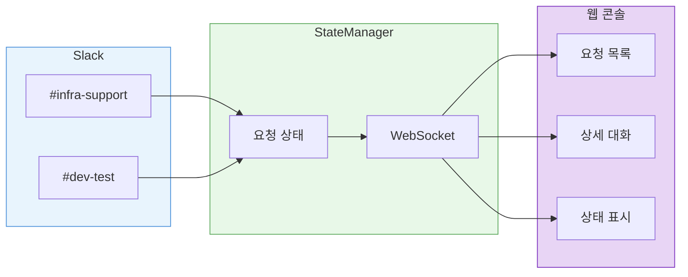

[2편](/ai/ai-infra-automation-v2/)에서 라우팅을 정리하고 나니, 다음 문제가 보였다. 아직 이 시스템은 나 혼자 쓰고 있다.

우리 팀은 각자의 컴퓨터에서 Claude Code를 쓰고 있다. 각자 .md 파일에 노하우를 정리하고, 각자의 프롬프트로 에이전트를 돌린다. 문제는 이 경험이 개인에게 갇힌다는 것이다. A가 시행착오 끝에 찾은 좋은 프롬프트를 B는 모른다. 같은 실수를 반복하고, 같은 질문에 다른 품질의 답이 나온다. 하나의 요청에 여러 명이 각자의 에이전트를 돌리면 토큰은 중복으로 소모되고, 처리 이력은 각자의 컴퓨터에 흩어진다.

하나의 에이전트를 팀 전체가 함께 쓰고, 거기에 경험을 누적할 수 있다면 이 문제가 풀린다. 그러려면 먼저 에이전트가 뭘 하고 있는지 팀 전체가 볼 수 있어야 한다. 그래서 웹 콘솔을 만들기 시작했다.

---

## Slack만으로는 부족하다

Slack은 좋은 인터페이스지만, 팀 도구의 대시보드로는 한계가 있다.

에이전트에게 요청하면 스레드가 열린다. 에이전트가 작업 중인지, 승인을 기다리고 있는지, 완료됐는지 알려면 스레드를 직접 열어봐야 한다. 해당 채널에 없는 팀원은 에이전트 활동 자체를 모른다.

혼자 쓸 때는 괜찮았다. 내가 요청하고, 내가 스레드를 확인하면 된다. 하지만 팀원들이 각각 다른 채널에서 요청을 하고 있을 때, "지금 진행 중인 요청이 몇 개인지, 누가 뭘 요청했는지" 한 곳에서 보고 싶어진다.

스레드 안에서 모든 대화가 이루어지는 구조에도 한계가 있다. 에이전트가 조회한 서버 정보, 계정 정보 같은 민감한 데이터가 채널 참여자 전체에게 노출된다. 대화가 길어지면 도구 호출, 중간 확인, 최종 결과가 뒤섞여 핵심이 매몰된다.

팀이 같은 에이전트를 쓰려면 두 가지가 필요하다. 에이전트가 뭘 하고 있는지 볼 수 있어야 하고, 필요할 때 제어할 수 있어야 한다. Slack 스레드만으로는 둘 다 부족하다.

---

## 웹 콘솔

웹 콘솔을 만들고 있다. 모든 요청의 상태를 한눈에 보여주는 대시보드다.

좌측에서 상태별로 요청을 분류한다. 대기, 진행 중, 승인 대기, 완료. 채널에 없어도 지금 어떤 요청이 처리되고 있는지 한눈에 파악할 수 있다.

요청을 선택하면 Slack 스레드의 대화가 그대로 보인다.

에이전트 응답, 사용자 답글, 승인 요청까지 전부 웹에서 확인할 수 있다. Slack을 열지 않아도 된다.

---

## 실시간 동기화

웹 콘솔의 핵심은 Slack 스레드와의 실시간 동기화다. Slack에서 메시지가 오가면 WebSocket을 통해 웹에도 즉시 반영된다.

StateManager가 중앙에서 모든 요청 상태를 관리한다. Slack 이벤트가 들어오면 상태를 업데이트하고, WebSocket으로 연결된 모든 클라이언트에 broadcast한다.

에이전트가 생각하는 동안은 Thinking 인디케이터가 표시된다. 몇 초 만에 끝나는 조회 요청이든, 수십 초가 걸리는 분석 작업이든, 진행 중이라는 것을 알 수 있다.

---

## 요청 생명주기

모든 요청은 상태를 가진다. 요청이 들어오면 즉시 Jira 티켓이 생성되고, 웹 콘솔에 카드가 추가된다.

에이전트가 추가 정보를 요청하면 "대화중" 상태로 바뀐다. 변경 작업이 필요하면 "승인 대기"로 넘어간다. 각 상태 전환이 웹 콘솔에 실시간으로 반영되기 때문에, 어느 시점에서든 전체 현황을 파악할 수 있다.

---

## 마무리

Slack 스레드 안에 갇혀있던 에이전트 활동을 웹으로 꺼내는 작업을 하고 있다. 요청 목록, 상태 추적, Slack 스레드 동기화까지 기본 기능은 동작한다.

이 구조가 갖춰지면 팀원 각자의 .md 파일에 흩어져 있던 노하우를 하나의 에이전트에 모을 수 있다. 에이전트의 프롬프트와 설정을 git으로 관리하고, 요청 이력에서 드러나는 패턴을 반영해서 개선한다. 누가 요청하든 같은 품질의 응답이 나오는 것이 목표다.

2주 정도 실제 환경에서 테스트하면서 안정성을 확인하고, CI/CD 파이프라인을 추가한 뒤 팀에 공개할 예정이다.
