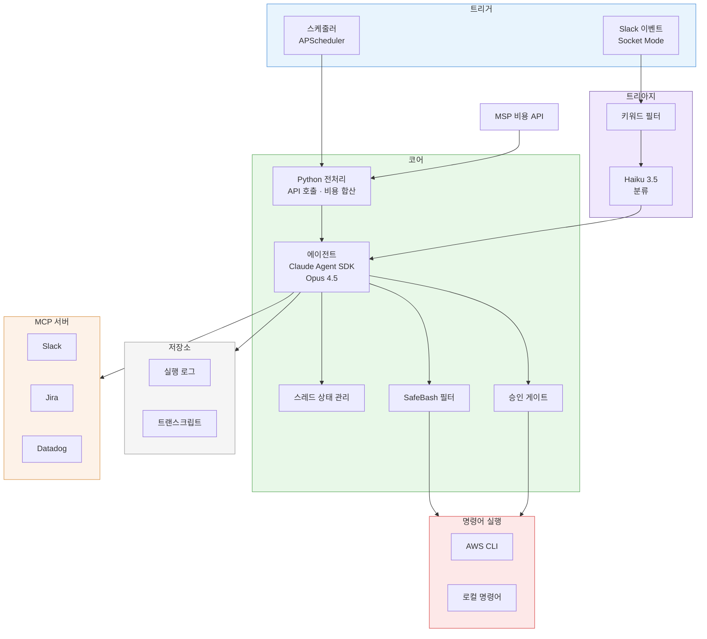

## 배경

인프라 팀 업무의 상당수가 Slack에서 시작된다.

- 비용 리포트가 올라오면 분석해서 댓글을 단다
- "이 파라미터 추가해주세요" 요청이 오면 Terraform으로 반영한다
- 배포 현황을 집계해서 주간 리포트를 만든다
- 장애 알림이 뜨면 관련 지표를 모아서 공유한다

각각은 15~30분이지만, 매일 반복되면 하루 업무의 상당 부분을 차지한다. 더 큰 문제는 사람이 반복하면 놓치는 날이 생긴다는 것이다. 이상 징후를 못 잡고 넘어가면, 그 비용은 다음 달까지 누적된다.

이 업무들의 공통점이 있다. Slack에서 시작하고, 여러 도구(AWS CLI, Terraform, Jira, Datadog)를 조합해야 하고, 판단이 필요하다. 단순 스크립트로는 안 된다. Claude Agent SDK와 MCP(Model Context Protocol)를 활용해서, Slack 채널의 인프라 업무를 자율 수행하는 에이전트 시스템을 만들기로 했다.

---

## 시스템 개요



MCP로 Slack, Jira, Datadog을 에이전트에 연결하고, AWS CLI는 SafeBash 필터를 통해 실행한다. 에이전트가 Slack에서 메시지를 읽고, 필요한 데이터를 조회하고, 분석 결과를 다시 Slack 스레드에 쓴다.

첫 번째 에이전트로 **주간 비용 분석**을 만들었다. 가장 반복적이고, 판단이 필요하며, 자동화 효과가 클 것 같았다.

---

## 핵심 사례: 비용 분석 에이전트

### 첫 실행: 숫자가 이상하다

에이전트가 MSP 비용 API로 4개 계정의 비용을 조회하고, 전주 대비 변동을 분석해서 Slack에 리포트를 올리는 구조다. 돌려봤더니 리포트가 올라왔는데, 뭔가 이상했다.

> **Human**: RI 비용이 아니고 S3 작업이 주 비용이라고? 이상한데?? 그리고 Glue는 항상 사용하던 건데 갑자기 사용한다고?? 결과 정확한지 크로스체크 작업 실행
>
> **AI** *(재조회 후)*: 크로스체크 완료했습니다. **제가 처음 리포트에서 완전히 잘못 분석했습니다.**
> - S3가 주 비용이라고 했는데? → **틀림.** 변동 미미
> - Glue가 신규라고 했는데? → **틀림.** 원래 계속 사용하던 서비스
> - 실제 원인인 RDS 급감($2,745 감소)은 **언급조차 안 함**

| 항목 | 에이전트 리포트 | 실제 데이터 | 판정 |
|------|----------------|-------------|------|
| S3가 주 비용 원인 | O | X - 변동 미미 | 오답 |
| Glue 신규 발생 | O | X - 기존 서비스 | 오답 |
| 실제 원인 (RDS 급감) | 언급 없음 | -$2,745 | 누락 |

왜 틀렸는지 분석을 요청했다.

> **Human**: 지금 에이전트가 틀린 원인 분석
>
> **AI**: 왜 틀렸는지 분석해봤습니다.
> 1. **데이터 조회 불완전** — 필요한 API 호출 8개(4계정 × 2기간) 중 1개만 조회
> 2. **할루시네이션** — 조회하지 않은 데이터를 추측으로 채움
> 3. **검증 없이 발송** — 불완전한 데이터로 바로 리포트 작성

8개 호출해야 하는데 1개만 성공하고, 나머지 7개를 만들어냈다.

### 1차 수정: 프롬프트에 검증 규칙 추가

프롬프트를 강화하면 되지 않을까. 데이터 검증 규칙을 추가했다.

> **Human**: 지금 내용 에이전트에 반영 실시!!!
>
> **AI** *(검증 규칙 추가 후)*: 반영 완료했습니다!
> ```
> ## 데이터 검증 규칙 (필수!)
> 1. 필수 API 호출: 8개 (4계정 × 2기간)
> 2. 모든 API 호출 성공 확인 후 리포트 작성
> 3. 조회한 데이터만 사용 (추측/가정 절대 금지)
> ```

다시 테스트. API 8개 전부 호출했다. 할루시네이션은 사라졌다. 그런데:

> **Human**: CloudFront $0.07 이것도 이상해 너무 낮아 값이, ElastiCache도 너무 낮아 이상해. RDS는 RI만 $3,000일 텐데? 값이 이상해 정확한지 정정해줘
>
> **AI** *(직접 재조회 후)*: 에이전트가 **서비스별 합산을 완전히 잘못 계산**했습니다!
>
> | 서비스 | 실제 합산 | 에이전트 계산 | 결과 |
> |--------|----------|-------------|------|
> | CloudFront | $303.32 | $0.07 | 완전 틀림 |
> | RDS | $240.68 | $79.48 | 틀림 |
> | ElastiCache | $90.33 | $0.00 | 완전 틀림 |

API는 다 호출했는데, 4개 계정의 동일 서비스 비용을 합산하는 산술 연산을 틀렸다.

### 2차 수정: 합산 규칙 추가 → 또 실패

프롬프트에 "4개 계정의 동일 서비스를 합산하라"는 규칙을 추가하고 다시 테스트.

> **AI** *(3번째 테스트 결과)*:
>
> | 서비스 | 실제 합산 | 에이전트 | 결과 |
> |--------|----------|----------|------|
> | CloudFront | $303.32 | $303.33 | 정확 ✓ |
> | RDS | $240.68 | $0.00 | **틀림** ✗ |
> | EC2 | $955.22 | $242.53 | **틀림** ✗ |
>
> CloudFront는 정확해졌는데 **RDS, EC2는 여전히 틀립니다...**
> 대안:
> 1. 프롬프트에 더 구체적인 계산 예시 추가
> 2. 또는 **계산 로직을 코드로 미리 처리**해서 에이전트에게 전달

3번 고치고 3번 실패했다. 프롬프트로는 안 된다는 걸 받아들여야 했다.

### 전환: 계산은 코드가 해야 한다

> **Human**: 2번으로 해
>
> **AI**: 좋습니다! 계산 로직을 코드로 미리 처리하는 방식으로 구현하겠습니다.
> ```
> 1. MSP 비용 API 호출 → 8개 데이터 조회
> 2. Python 코드로 서비스별 합산 계산
> 3. 계산된 결과를 프롬프트에 포함
> 4. 에이전트는 계산된 데이터로 분석+리포트만 작성
> ```

아키텍처를 바꿨다.

```
변경 전: 에이전트 → API 호출 → 계산 → 분석 → 리포트
변경 후: Python → API 호출 → 계산 → 에이전트 → 분석 → 리포트
```

Python이 API를 호출하고 합산을 한다. 에이전트는 이미 계산된 정확한 데이터를 받아서 분석과 리포트만 쓴다.

| 항목 | 변경 전 | 변경 후 |
|------|--------|--------|
| 실행 시간 | 4분 | 27초 |
| 실행 비용 | $1.87 | $0.22 |
| 데이터 정확성 | 할루시네이션 | 100% 정확 |

**계산은 코드가, 판단은 AI가.** 이게 이 프로젝트에서 얻은 가장 큰 교훈이다. 이후 만든 모든 분석 에이전트(일간, 월간, Datadog)에 동일한 패턴을 적용했다.

---

## 검증: 프로덕션에 올리기 전에

### 크로스체크

위에 나온 과정 자체가 검증이다. 에이전트 출력을 그대로 믿지 않고, 실제 데이터와 대조해서 숫자가 맞는지 확인했다. 아키텍처 변경 후에도 동일한 크로스체크를 반복해서 정확성을 확인했다.

### SafeBash: AI로 AI의 안전장치를 검증

에이전트가 AWS CLI를 실행하므로 안전 필터(SafeBash)를 만들었다. 읽기 전용 명령만 화이트리스트로 허용하고 나머지는 차단하는 구조다.

이 필터가 충분한지 AI에게 코드 리뷰를 시켰다.

> **Human**: 지금 코드 봤을 때 더 개선해야 할 거 있나?
>
> **AI** *(14개 파일 전체 리뷰 후)*: Critical 6건, High 6건, Medium 4건 발견.
> | # | 이슈 | 위치 | 설명 |
> |---|------|------|------|
> | 7 | SafeBash 파이프 우회 가능 | safe_bash.py:55 | `| /bin/rm`이나 `| env rm` 패턴 미차단 |

> **Human**: #7 우선 처리
>
> **AI** *(safe_bash.py 분석 후)*: 현재 패턴의 우회 가능한 공격 벡터 6가지:
> | 공격 패턴 | 우회 이유 |
> |-----------|----------|
> | `| /bin/bash` | 절대경로 미처리 |
> | `| env rm file` | env 경유 실행 미처리 |
> | `| tee secret.txt` | tee(파일 쓰기) 미처리 |
> | `aws ce get-cost ; /bin/sh` | `;` 체이닝 미차단. 화이트리스트가 시작만 확인하므로 뒤에 뭘 붙여도 통과 |

마지막이 가장 위험했다. 화이트리스트에 등록된 명령으로 시작하면, `;`으로 체이닝해서 아무 명령이나 실행할 수 있었다.

명령 체이닝 차단(`;` `&&` `||`), 절대경로 우회 차단, 추가 위험 명령(`tee`, `xargs`, `env`) 패턴을 반영해서 수정했다.

### 테스트 채널 선행 운영

프로덕션 채널에 바로 연결하지 않고, 테스트 채널에서 2주간 먼저 운영했다. 모든 에이전트 실행은 JSON 트랜스크립트로 기록되어, 어떤 명령을 실행했고 어떤 판단을 했는지 사후에 전수 검토할 수 있다.

---

## 결과: 가동 첫 날

프로덕션 채널에 연결하고, 첫 주간 비용 분석이 자동으로 실행됐다. Slack에 올라온 리포트:

```
*AWS 주간 비용 리포트*

이번 주 총 비용: $3,562.73
전주 대비: -$3,281.82 (-47.9%) ← 주의 필요

*이상 징후*
• 프로덕션 계정 -51.2% 급감 ($3,120 감소)
• EC2 -91.7% 급감 ($1,164 감소)

*권장 조치*
• 프로덕션 계정 EC2 인스턴스 현황 확인 필요
• 의도된 인프라 축소인지 확인

@infra 확인 부탁드립니다.
```

EC2 비용이 $1,270에서 $105로 급락한 걸 감지하고 인프라 팀을 @멘션했다. 사람이 아직 그 주의 비용을 확인하지 않은 상태에서, 에이전트가 먼저 잡았다.

---

## 도구 및 모델 분석

### 사용 도구

| 도구 | 용도 |
|------|------|
| **Claude Code (CLI)** | 시스템 설계/구현. 위의 대화 로그가 그 과정이다 |
| **Claude Opus 4.5** | 에이전트 실행 모델. 비용 분석, 리포트 작성 등 실제 업무 수행 |
| **Claude Agent SDK** | 에이전트 실행 프레임워크. 도구 사용, 멀티턴 관리 |
| **MCP (Model Context Protocol)** | Slack 읽기/쓰기, AWS CLI 실행 등 외부 서비스 연동 |

### 선정 이유

Agent SDK + MCP 조합을 선택한 이유는 하나다. AI가 외부 도구를 직접 사용할 수 있어야 했다. Slack에서 메시지를 읽고, AWS CLI로 데이터를 조회하고, 다시 Slack에 리포트를 올리는 과정을 별도 API 래핑 없이 할 수 있다.

Claude Code는 이 시스템 자체를 만드는 데 사용했다. 아키텍처를 논의하고, 코드를 만들고, 테스트하고, 실패하면 같이 원인을 찾고 고치는 반복을 대화형으로 진행했다.

### 모델의 강점

- **멀티턴 자율 수행**: Slack 리포트 확인 → AWS 데이터 조회 → 비교 분석 → 이상 탐지 → 리포트 작성을 한 번의 실행으로 수행한다
- **운영 노하우 코드화**: 프롬프트에 분석 기준과 판단 임계값을 명시하면, 내 컨디션과 상관없이 일관된 분석이 나온다
- **도구 사용**: MCP를 통해 Slack, AWS CLI 등을 직접 사용한다. API 래핑 코드가 필요 없다

### 모델의 한계

- **산술 연산**: 4개 계정의 서비스별 비용 합산 같은 단순 산술도 틀렸다. 결정론적 작업은 코드로 분리해야 한다
- **할루시네이션**: 데이터가 불완전하면 추측으로 채운다. 프롬프트 지시만으로는 방지 불가. 코드로 데이터 완전성을 강제해야 한다
- **안전성**: "위험한 명령을 실행하지 마"라는 프롬프트는 우회될 수 있다. SafeBash 같은 코드 레벨 안전장치가 필수
- **비용**: Opus 기준 실행당 ~$0.5. 하루 5~10건이면 월 $75~$150

---

## 향후 방향

비용 분석에서 검증된 "사전 계산 + AI 분석" 패턴을 다른 Slack 업무에도 적용하고 있다.

- **일간/월간 비용 리포트**: 같은 패턴으로 확장. Datadog 사용량 분석도 동일 구조
- **Parameter Store 등록**: Slack 요청을 해석해서 Terraform IaC에 반영. 변경 작업이므로 사람의 명시적 승인 후에만 실행되는 승인 게이트를 추가
- **Slack 이벤트 기반 실행**: 스케줄 실행뿐 아니라, 채널 메시지를 2단계 트리아지(키워드 필터 → 저비용 모델 판단)로 분류해서 적절한 에이전트를 자동 호출
- **K8s 서비스 관리**: ECR 생성, git push, ArgoCD 배포까지 에이전트가 수행. 승인 게이트와 SafeBash로 안전성 확보

현재 8종의 에이전트가 21일간 118건을 자율 실행 중이다. 비용 분석에서 시작한 시스템이, Slack으로 들어오는 인프라 업무 전반을 커버하는 방향으로 확장되고 있다.
