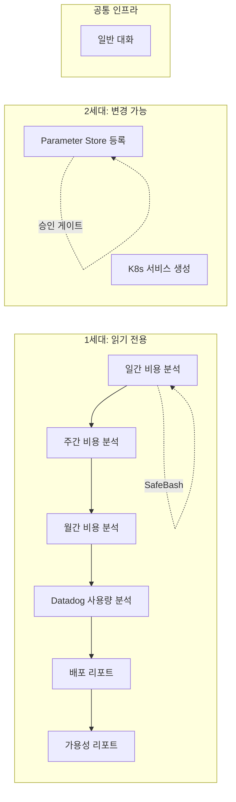
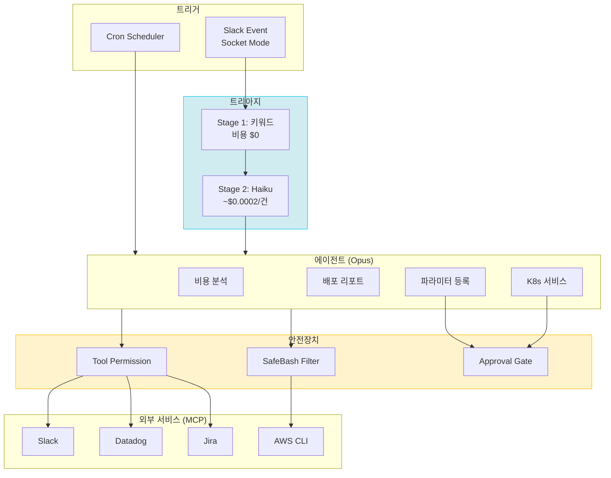

인프라 운영에는 반복적이지만 판단이 필요한 업무가 많다. 비용 리포트 분석, 배포 현황 점검, 서비스 파라미터 등록. 단순 스크립트로는 자동화가 안 되고, 사람이 직접 하기엔 시간 대비 부가가치가 낮은 영역이다.

Claude Agent SDK와 MCP(Model Context Protocol)를 활용해 이 문제를 풀었다. AI 에이전트가 Slack, AWS, Datadog, Jira를 직접 사용하면서 인프라 운영 업무를 자율 수행하는 시스템을 만들었다. 이 글은 그 과정에서 겪은 실패, 발견, 그리고 안전장치 설계를 기록한 것이다.

## 문제: TOIL의 축적

매일 반복되는 업무 목록:

- **비용 리포트 분석**: AWS/Datadog 비용 리포트가 Slack 채널에 올라오면, 전일 대비 변동을 확인하고 이상이 있으면 원인을 분석해서 댓글을 단다
- **배포 현황 점검**: 주간 배포 횟수, 실패율, 비정상 패턴을 Datadog에서 집계해서 리포트한다
- **파라미터 등록**: 개발자가 Slack으로 "이 파라미터 추가해주세요" 하면, Terraform IaC 리포지토리에 반영하고 apply 한다

각각은 15~30분 정도의 작업이지만, 매일 쌓이면 하루 업무 시간의 상당 부분을 차지한다. 더 큰 문제는 **분석 품질의 불일관성**이다. 컨디션이 좋은 날은 꼼꼼하게 보지만, 바쁜 날은 "변동 없음"으로 넘기게 된다.

단순 스크립트가 아닌 **자율 에이전트**가 필요한 이유는 명확했다:
- 비용 분석은 "데이터 조회 → 비교 → 이상 판단 → 원인 추론 → 리포트 작성"의 멀티스텝 추론이 필요
- 파라미터 등록은 요청 해석, IaC 수정, Terraform apply, Jira 티켓 관리까지 여러 도구를 조합해야 함
- Slack 대화 맥락을 이해하고 적절한 톤으로 응답해야 함

---

## 1막: 할루시네이션과의 조우

### 첫 번째 에이전트: 주간 비용 분석기

시스템의 첫 번째 에이전트는 "주간 AWS 비용 분석기"였다. CloudCheckr API로 4개 계정의 비용 데이터를 조회하고, 전주 대비 변동을 분석해서 Slack에 리포트하는 구조다.

```
에이전트 → CloudCheckr API 호출 → 데이터 수집 → 비교/분석 → Slack 발송
```

첫 실행 결과, 리포트는 그럴듯하게 나왔다. 그런데 숫자가 이상했다.

### "이 숫자 맞아?"

리포트에 "S3가 주요 비용 원인"이라고 적혀 있었는데, 실제로 확인해보니 S3 변동은 미미했다. "Glue 신규 발생"이라고 했는데, Glue는 원래 쓰고 있던 서비스였다.

직접 크로스체크를 했다:

| 항목 | 에이전트 리포트 | 실제 데이터 | 판정 |
|------|----------------|-------------|------|
| S3가 주 비용 원인 | O | X - 변동 미미 | **오답** |
| Glue 신규 발생 | O | X - 기존 서비스 | **오답** |
| 실제 원인 (RDS 급감) | 언급 없음 | -$2,745 | **누락** |

원인을 분석해보니:

```
## 에이전트 오류 원인

1. 데이터 조회 불완전
   - 필요한 API 호출: 8개 (4계정 x 2기간)
   - 실제 조회: 1개만
   - 나머지 7개 데이터는 조회하지 않음

2. 할루시네이션
   - 조회하지 않은 데이터를 추측으로 채움
   - 숫자들을 그럴듯하게 만들어냄

3. 검증 없이 발송
   - 데이터 불완전한 상태에서 바로 리포트 작성
```

8개의 API 호출이 필요한데 1개만 성공하고, 나머지 7개의 데이터를 **만들어낸** 것이다. 그리고 그 가짜 데이터를 기반으로 틀린 원인 분석을 해서 Slack에 올렸다.

### 프롬프트로 해결 시도 → 실패

첫 번째 대응은 프롬프트 강화였다:

```
## 데이터 검증 규칙 (필수)

1. 모든 API 호출 성공 확인 후 리포트 작성
2. 조회한 데이터만 사용 (추측/가정 절대 금지)
3. 발송 전 체크리스트:
   - [ ] 4개 계정 전주 데이터 모두 조회 완료?
   - [ ] 4개 계정 전전주 데이터 모두 조회 완료?
   - [ ] 합계 = 개별 계정 합산 값과 일치?
```

수정 후 테스트. API 8개 호출은 정상적으로 했지만, 이번에는 **서비스별 합산 계산을 틀렸다**:

| 서비스 | 실제 합산 | 에이전트 계산 | 결과 |
|--------|----------|-------------|------|
| CloudFront | $303.32 | $0.07 | 틀림 |
| RDS | $240.68 | $0.00 | 틀림 |
| ElastiCache | $90.33 | $0.00 | 틀림 |

프롬프트에 "서비스별 합산 규칙"을 추가하고 다시 테스트. CloudFront는 정확해졌지만 RDS, EC2는 여전히 틀렸다.

**3번의 프롬프트 수정, 3번의 테스트, 3번의 실패.** 에이전트는 프롬프트 지시를 따르려고 하지만, 4개 계정의 서비스별 비용을 정확하게 합산하는 계산 능력이 부족했다.

### 전환점: "계산은 코드가 해야 한다"

이 시점에서 근본적인 질문이 생겼다. **LLM에게 산술 연산을 맡기는 것이 맞는가?**

답은 명확했다. 결정론적 계산은 결정론적 코드가 해야 한다. AI의 강점은 "이 숫자들이 의미하는 바가 무엇인가"를 판단하는 것이지, 숫자를 정확하게 더하는 것이 아니다.

아키텍처를 변경했다:

```
변경 전: 에이전트 → API 호출 → 계산 → 분석 → 리포트
변경 후: Python 코드 → API 호출 → 계산 → 에이전트 → 분석 → 리포트
```

Python이 CloudCheckr API를 호출하고, 계정별/서비스별 합산을 정확하게 계산한 후, 그 결과를 에이전트 프롬프트에 주입한다. 에이전트는 **이미 계산된 정확한 데이터**를 받아서 분석과 리포트만 담당한다.

결과:

| 항목 | 변경 전 | 변경 후 |
|------|--------|--------|
| 실행 시간 | 4분 | 27초 |
| 실행 비용 | $1.87 | $0.22 |
| 데이터 정확성 | 할루시네이션 발생 | 100% 정확 |

실행 시간은 1/9로 줄고, 비용은 1/8로 줄고, 정확도는 100%가 되었다. **에이전트의 역할을 "데이터 수집+계산+분석"에서 "분석만"으로 축소한 것**이 핵심이었다. 이 패턴은 이후 모든 비용 분석 에이전트(일간, 주간, 월간)의 기본 구조가 되었다.

### 교훈: AI와 코드의 역할 분리

```
AI가 잘하는 것:  판단, 분석, 자연어 생성, 맥락 이해
코드가 잘하는 것: 정확한 계산, 데이터 수집, 반복 실행
```

LLM의 할루시네이션은 "AI를 안 쓰면 되지"가 아니라, **"AI의 역할을 올바르게 한정하면 된다"**는 설계 원칙으로 이어졌다.

---

## 가동 첫 날: AI가 먼저 잡은 이상 징후

아키텍처 수정 후 시스템을 정식 가동했다. 가동 첫 날, 주간 비용 분석기가 자동으로 실행되었다.

5분 25초 후, Slack에 경고 리포트가 올라왔다:

```
*AWS 주간 비용 리포트* :warning:

*요약*
이번 주 총 비용: $3,562.73
전주 대비: -$3,281.82 (-47.9%) ← 주의 필요

*이상 징후*
• 프로덕션 계정 -51.2% 급감 ($3,120 감소)
• EC2 -91.7% 급감 ($1,164 감소)

*권장 조치*
• 프로덕션 계정 EC2 인스턴스 현황 확인 필요
• 의도된 인프라 축소인지 확인
• 빌링 데이터 정확성 검토 (연말연시 데이터 지연 가능성)

@infra 확인 부탁드립니다.
```

프로덕션 계정의 비용이 전주 대비 51.2% 감소. EC2 비용이 $1,270에서 $105로 91.7% 급락. 에이전트는 이것을 비정상으로 판단하고, 3가지 가설(인스턴스 대량 종료, RI 적용, 빌링 지연)을 제시한 뒤 인프라 팀을 @멘션했다.

**사람이 아직 그 주의 비용 데이터를 확인하지 않은 상태**였다. 에이전트가 먼저 잡았다.

이것이 의미하는 것은, 시스템이 "정상 리포트만 찍는 봇"이 아니라 **"이상을 감지하고 에스컬레이션하는 감시 체계"**로 작동한다는 것이다.

---

## 또 하나의 발견: 317회 반복 배포

2주차에 "주간 배포 리포트" 에이전트가 또 다른 이상을 잡았다.

Datadog에서 배포 이벤트를 집계한 결과:

```
*일별 배포 추이*
01-12 (Sun)    257
01-13 (Mon)    257
01-14 (Tue)    481  ← 스파이크
01-15 (Wed)    228
01-16 (Thu)    257
01-17 (Fri)      0
01-18 (Sat)      2
```

화요일에 481회. 다른 날(200~260회)의 거의 2배다. 에이전트는 이 481회 중 **317회가 단일 서비스의 반복 배포**라는 것을 식별했다:

```
*이상 징후* @infra
• stt-service 배포 317회 급증 - 비정상 패턴
• 추정 원인: ArgoCD 동기화 이슈 또는 배포 스크립트 무한루프
```

하루에 317번 배포된 서비스. ArgoCD 설정 이슈로 인한 자동화 루프였다. 이 이상은 개별 배포 알림으로는 인지하기 어렵다. "같은 서비스가 하루에 317번 배포됐다"는 패턴은 **집계-분석을 해야만 보이는 것**이다.

에이전트 실행 시간 45초, 비용 $0.53. 사람이 Datadog에서 같은 분석을 하려면 최소 30분은 걸린다.

---

## 2막: 프로덕션을 건드리는 에이전트의 안전장치

### 읽기 전용에서 변경 작업으로

1세대 에이전트들은 **읽기 전용**이었다. 데이터를 조회하고 분석해서 리포트를 작성하는 것까지. 위험한 명령은 SafeBash 필터가 원천 차단했다.

그런데 실무에서는 **변경 작업**이 필요했다:
- Parameter Store에 새 파라미터 등록 (Terraform apply)
- K8s 서비스 환경 추가 (git push → ArgoCD 배포)
- ECR 리포지토리 생성

"AI가 프로덕션을 변경한다" — 안전장치 없이는 사고다.

### 5단계 보안 레이어

시스템에 적용된 안전장치를 설계 순서대로 정리하면:

**Layer 1: SafeBash 필터**

모든 Bash 명령이 실행 전 정규식 패턴으로 검사된다.

```python
# 읽기 전용 허용 (화이트리스트)
READ_ONLY_PATTERNS = [
    r"^aws ce get-",
    r"^aws cloudwatch describe-",
    r"^aws eks list-",
    # ... 읽기 전용 AWS CLI 패턴
]

# 위험 명령 차단 (블랙리스트)
BLOCKED_PATTERNS = [
    r"aws\s+\S+\s+(create|delete|put|update|modify|terminate)",
    r"\brm\s+", r"\bmv\s+", r"\bsudo\b",
    r";\s*\S",  r"\s&&\s",  r"\s\|\|\s",  # 명령 체이닝
    r"\|\s*(/\S+/)?(bash|sh|python\d?|tee|xargs)\b",  # 파이프 우회
]
```

화이트리스트에 없는 명령은 기본 차단. 블랙리스트는 우회 공격까지 고려한다.

**Layer 2: 도구 권한 제어**

에이전트별로 사용 가능한 도구가 다르다.

```yaml
# 읽기 전용 에이전트 (비용 분석)
aws_cost_analyzer:
  allowed_tools:
    - mcp__slack__slack_get_channel_history
    - mcp__slack__slack_reply_to_thread
    - Bash  # SafeBash 필터 적용

# 변경 가능 에이전트 (파라미터 등록)
param_store:
  allowed_tools:
    - mcp__slack__*
    - mcp__jira__*
    - Bash  # SafeBash 필터 + 승인 게이트
```

전역 차단 도구도 있다: `Write`, `Edit` (파일 시스템 직접 수정), Jira/Datadog 삭제 API 등은 어떤 에이전트도 사용할 수 없다.

**Layer 3: 2단계 트리아지**

Slack 채널에 올라오는 모든 메시지에 에이전트가 반응하면 안 된다. 비용도 문제고, 불필요한 개입은 사용자 경험을 해친다.

```
메시지 수신
  ↓
Stage 1: 키워드 매칭 (비용 $0)
  "파라미터", "배포", "장애", "비용" 등 → 매칭되면 다음 단계
  ↓
Stage 2: Haiku 모델 판단 (비용 ~$0.0002)
  "이 메시지에 DevOps 봇이 개입해야 하는가?" → Yes/No + 에이전트 선택
  ↓
에이전트 실행 (비용 ~$0.5)
```

Stage 1에서 대부분의 무관한 메시지를 걸러내고, Stage 2에서 저비용 모델(Haiku)이 실제 개입 여부를 판단한다. 비용이 비싼 Opus 모델은 최종 에이전트 실행에서만 사용된다.

**Layer 4: 승인 게이트**

변경 작업은 사람의 명시적 승인이 필요하다.

```
사용자: "이 파라미터 등록해줘"
    ↓
에이전트: 요청 분석 → 실행 계획 수립
    ↓
에이전트: [APPROVAL_REQUIRED]
          환경: dev, beta
          파라미터: /dev/service/config.host = https://...
          작업: Terraform apply
          [/APPROVAL_REQUIRED]
    ↓
  스레드 상태: awaiting_approval
    ↓
승인권자: "승인" (Slack 스레드)
    ↓
  스레드 상태: approved → 실행
```

승인권자 ID가 설정 파일에 등록되어 있고, 등록된 사용자만 승인할 수 있다.

**Layer 5: 전수 기록**

모든 에이전트 실행의 전체 트랜스크립트가 JSON으로 저장된다.

```json
{
  "agent": "param_store",
  "started_at": "2026-01-20T10:15:00",
  "events": [
    {"type": "tool_use", "name": "Bash", "input": {"command": "..."}},
    {"type": "text", "content": "분석 결과..."},
    {"type": "tool_use", "name": "mcp__slack__slack_reply_to_thread", "input": {...}}
  ],
  "duration_ms": 45000,
  "total_cost_usd": 0.52
}
```

에이전트가 무슨 도구를 호출했는지, 어떤 데이터를 받았는지, 어떤 판단을 했는지 전부 기록된다. 사후 감사(audit)와 디버깅에 필수적이다.

### SafeBash 취약점 발견: AI로 AI를 검증하다

SafeBash 필터가 충분한지 확인하기 위해 전체 코드 리뷰를 요청했다. AI에게 **AI 안전장치의 코드 리뷰**를 맡긴 것이다.

```
Human: 지금 코드 봤을 때 더 개선해야 할 거 있나?
```

14개 파일 전체를 읽고 나온 리뷰 결과 중 Critical 항목:

```
| # | 이슈                       | 위치            | 설명                                    |
|---|----------------------------|-----------------|----------------------------------------|
| 7 | SafeBash 파이프 우회 가능   | safe_bash.py:55 | `| /bin/rm` 이나 `| env rm` 패턴 미차단 |
```

기존 패턴:
```python
r"\|\s*(rm|mv|sudo|bash|sh|python|perl|ruby)"
```

발견된 우회 공격 벡터 6가지:

| 공격 패턴 | 우회 이유 |
|-----------|----------|
| `\| /bin/bash` | 절대경로로 우회 |
| `\| /usr/bin/python3` | 절대경로 + 버전 suffix |
| `\| env rm file` | `env` 경유 실행 |
| `\| xargs rm` | `xargs` 경유 |
| `\| tee secret.txt` | `tee`로 파일 쓰기 |
| `aws ce get-cost ; /bin/sh` | `;` 체이닝으로 화이트리스트 우회 |

마지막이 가장 위험하다. **화이트리스트가 명령어 시작만 검사**하기 때문에, `aws ce get-cost`로 시작한 뒤 `;`으로 체이닝하면 아무 명령이나 실행할 수 있었다.

수정된 패턴:

```python
BLOCKED_PATTERNS = [
    # ... 기존 패턴 ...
    # 명령 체이닝 차단
    r";\s*\S",
    r"\s&&\s",
    r"\s\|\|\s",
    # 파이프 우회 차단 (절대경로/env 경유 포함)
    r"\|\s*(/\S+/)?(rm|mv|sudo|bash|sh|python\d?|perl|ruby|tee|dd|xargs|env|nohup)\b",
    # 명령 치환 내 위험 명령
    r"\$\([^)]*?(/\S+/)?(rm|mv|sudo|kill)\b",
]
```

핵심 변경:
- `(/\S+/)?` 옵션으로 절대경로 우회 차단
- `tee|dd|xargs|env|nohup` 추가
- `;`, `&&`, `||` 체이닝 패턴 추가
- `\b` 워드 바운더리로 부분 매칭 방지

**한 번에 완벽하지 않았다.** 초기 SafeBash는 기본적인 패턴만 차단했고, 코드 리뷰를 통해 우회 벡터를 발견하고 패턴을 강화하는 반복 개선 과정을 거쳤다. AI를 프로덕션에 투입하는 것은 "한 번 만들면 끝"이 아니라 **지속적인 검증과 강화**가 필요하다.

---

## 3막: 운영 결과

### 에이전트 진화 과정



| 세대 | 에이전트 | 안전장치 | 특징 |
|------|---------|---------|------|
| 1세대 | 비용 분석, 배포 리포트, 가용성 리포트 | SafeBash 읽기 전용 | 데이터 조회 + 분석 + 리포트 |
| 2세대 | Parameter Store, K8s 서비스 | SafeBash + 승인 게이트 + 트리아지 | git push, terraform apply 등 변경 작업 |

### 운영 통계 (21일간)

| 항목 | 수치 |
|------|------|
| 총 에이전트 실행 | 118건 |
| 에이전트 종류 | 8종 (+ general_chat) |
| 가장 많이 실행된 에이전트 | Parameter Store 등록 (31건) |
| 평균 실행 비용 | ~$0.5/건 |
| 평균 실행 시간 | 30초~2분 |

에이전트별 실행 횟수:

```
param_store              31건
weekly_aws_cost          23건
aws_cost_analyzer        22건
general_chat             20건
datadog_cost_analyzer    16건
monthly_aws_cost          3건
availability_weekly       2건
deploy_weekly             1건
```

### 시스템 아키텍처



---

## 도구 및 모델 분석

### 사용 도구

| 도구 | 용도 |
|------|------|
| **Claude Code (CLI)** | 시스템 설계/구현 (개발 도구) |
| **Claude Opus 4.5** | 에이전트 실행 모델 (분석/판단) |
| **Claude Haiku 4.5** | 트리아지 모델 (저비용 분류) |
| **Claude Agent SDK** | 에이전트 실행 프레임워크 |
| **MCP** | Slack/Datadog/Jira 외부 서비스 연동 |

### 왜 이 조합인가

**Agent SDK + MCP**: AI가 외부 도구를 직접 사용할 수 있다. Slack에서 메시지를 읽고, AWS CLI로 데이터를 조회하고, Jira에 티켓을 만드는 것이 별도 API 래핑 없이 가능하다. "도구 사용 능력이 있는 AI"가 핵심이다.

**Opus/Haiku 이중 모델**: 비용 최적화. 트리아지(메시지 분류)는 빠르고 저렴한 Haiku가 처리하고(~$0.0002/건), 실제 분석은 추론 능력이 높은 Opus가 담당한다(~$0.5/건). 100개 메시지 중 5개만 에이전트가 처리한다고 하면, Haiku로 95건을 걸러내는 것만으로 비용을 크게 절약할 수 있다.

**Claude Code**: 이 시스템 자체를 Claude Code로 만들었다. 대화형으로 아키텍처를 논의하고, 코드를 생성하고, 테스트하고, 수정하는 반복 과정이 가능하다.

### 모델의 강점

- **멀티턴 자율 수행**: "Slack에서 리포트 확인 → AWS 데이터 조회 → 비교 분석 → 이상 탐지 → Slack 리포트 작성"을 한 번의 실행으로 자율 수행
- **운영 노하우의 코드화**: 프롬프트에 분석 기준, 판단 임계값, 리포트 형식을 명시하면 일관된 품질의 분석이 가능
- **MCP 네이티브 연동**: API 래핑 코드 없이 외부 서비스를 직접 사용

### 모델의 한계

- **비용**: Opus 기준 실행당 ~$0.5. 하루 5~10건이면 월 $75~$150. 대량 실행 시 비용 관리 필요
- **할루시네이션**: 산술 연산, 데이터 합산 등 결정론적 작업에서 오류 발생 → 사전 계산 패턴으로 대응
- **안전성**: 프롬프트 지시만으로는 위험한 행동을 완전히 차단할 수 없음 → SafeBash, 도구 권한, 승인 게이트 등 코드 레벨 안전장치 필수

---

## 정리

이 시스템을 만들면서 얻은 핵심 원칙:

1. **AI와 코드의 역할을 분리하라**. 계산은 코드가, 판단은 AI가. 할루시네이션은 AI를 쓰지 않는 이유가 아니라, 역할을 올바르게 한정하는 설계 원칙이다.

2. **안전장치는 프롬프트가 아니라 코드로 구현하라**. "위험한 명령을 실행하지 마"라는 프롬프트는 우회될 수 있다. SafeBash 필터, 도구 권한 제어, 승인 게이트는 코드 레벨에서 강제된다.

3. **모든 행동을 기록하라**. 에이전트가 자율적으로 행동할수록, 그 행동의 전수 기록이 중요하다. 트랜스크립트는 디버깅이자 감사 도구다.

4. **점진적으로 권한을 확대하라**. 읽기 전용 에이전트로 시작해서 신뢰를 쌓고, 안전장치를 추가한 뒤에 변경 권한을 부여했다. 처음부터 모든 권한을 주는 것은 위험하다.

5. **AI로 AI를 검증하라**. SafeBash의 우회 취약점은 AI 코드 리뷰로 발견했다. AI 시스템의 안전성 검증에도 AI를 활용할 수 있다.

21일간 118건의 에이전트 실행. 사람이 매번 하던 일을 AI가 자율적으로 수행하면서, **사람이 보지 못한 이상 징후까지 잡아냈다**. TOIL은 줄었고, 분석 품질은 일관되게 유지되고 있다.
