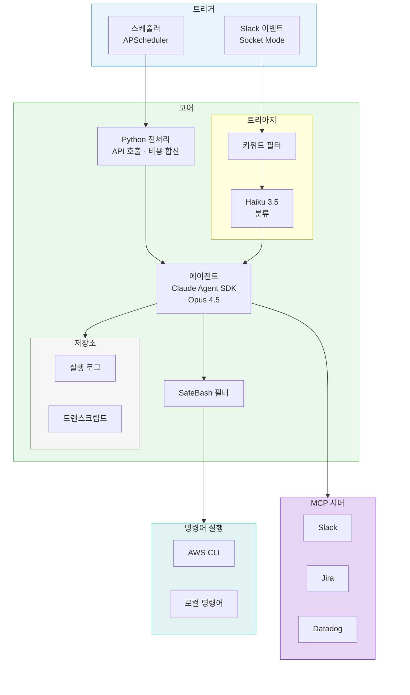
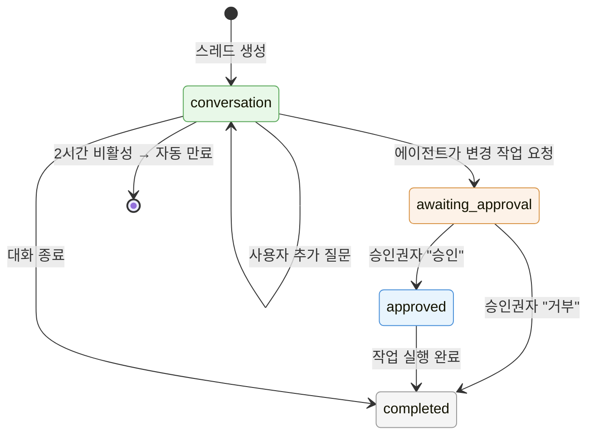
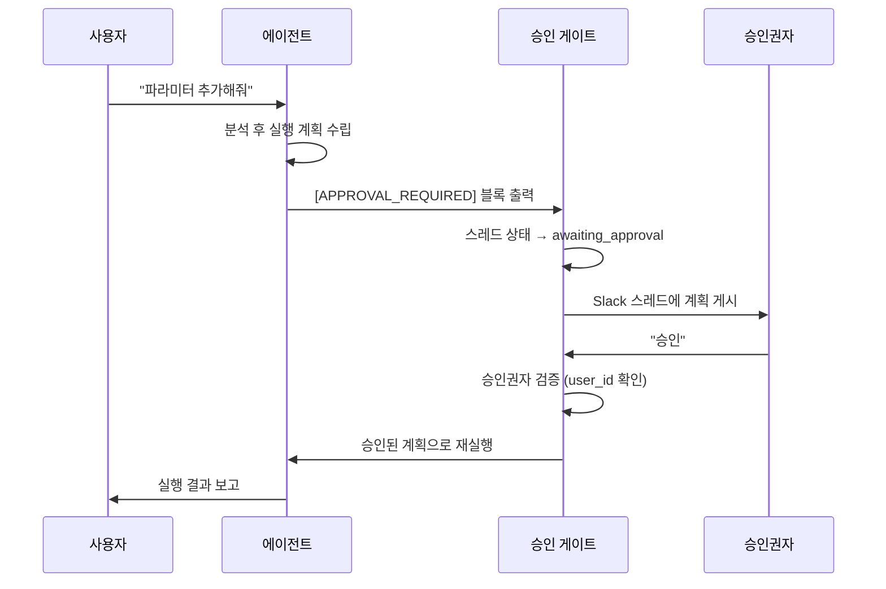

## 배경

인프라 팀 업무의 상당수가 Slack에서 시작된다.

- 비용 리포트를 만들고, 이상 징후를 분석해서 댓글을 단다
- 파라미터 추가 요청이 오면 Terraform으로 반영한다
- 배포 현황을 집계해서 주간 리포트를 만든다
- 모니터링 알림이 뜨면 관련 지표를 모아서 공유한다

각각은 15~30분이지만, 매일 반복되면 하루 업무의 상당 부분을 차지한다. 더 큰 문제는 사람이 반복하면 놓치는 날이 생긴다는 것이다. 이상 징후를 못 잡고 넘어가면, 그 비용은 다음 달까지 누적된다.

이 업무들의 공통점이 있다. Slack에서 시작하고, 여러 도구(AWS CLI, Terraform, Jira, Datadog)를 조합해야 하고, 판단이 필요하다. 단순 스크립트로는 안 된다. Claude Agent SDK와 MCP(Model Context Protocol)를 활용해서, Slack 채널의 인프라 업무를 자율 수행하는 에이전트 시스템을 만들기로 했다.

---

## 시스템 개요



MCP로 Slack, Jira, Datadog을 에이전트에 연결하고, AWS CLI는 SafeBash 필터를 통해 실행한다. 에이전트가 Slack에서 메시지를 읽고, 필요한 데이터를 조회하고, 분석 결과를 다시 Slack 스레드에 쓴다.

첫 번째 자동화 대상으로 **비용 분석**을 골랐다. 가장 반복적이고, 판단이 필요하며, 자동화 효과가 클 것 같았다. 기존에 Lambda로 일일 비용 리포트를 Slack에 올리는 구조가 있었고, 이 리포트를 AI가 읽고 분석하는 에이전트를 만든 뒤, 주간·월간으로 확장했다.

---

## 사례 1: 비용 분석 에이전트

### 시작: Lambda 리포트에 AI 분석을 붙여보자

기존에 Lambda가 매일 AWS 비용을 집계해서 Slack에 리포트를 올리는 구조가 있었다. 숫자는 올라오는데, 누군가가 그걸 열어보고 "이거 정상인가?" 판단해야 했다. 놓치는 날이 생기면 그날의 비용 급증이 다음 날엔 기준선이 되어버린다. 잡지 못한 낭비는 매일 반복되며 조용히 누적된다.

<span style="color:#1565c0; font-weight:bold">이 리포트를 AI가 읽고 분석하면 어떨까?</span>

Claude Agent SDK로 Slack 채널의 비용 리포트를 읽고, 전일 대비 변동을 분석하고, 이상 징후 탐지 시 담당자를 멘션하는 에이전트를 만들었다. 일일 분석이 안정된 후, 주간 보고서는 Lambda 없이 Agent SDK + MCP만으로 구성했다. 이 글은 그 과정에서 만난 할루시네이션, 산술 오류, 오탐을 프롬프트 반복으로 해결해 나간 기록이다.

### 첫 실행: 숫자가 이상하다

프롬프트에 MSP 비용 API 엔드포인트와 인증 방법을 넣어주고, 4개 계정의 비용 조회부터 분석, Slack 리포트 작성까지 에이전트가 전부 수행하게 했다. 이 API는 실패율이 높은 편이라, 실패 시 재시도가 필요하다. 돌려봤더니 리포트가 올라왔는데, 뭔가 이상했다.

> **Human**: RI 비용이 아니고 S3 작업이 주 비용이라고? 이상한데?? 그리고 Glue는 항상 사용하던 건데 갑자기 사용한다고?? 결과 정확한지 크로스체크 작업 실행
>
> **AI** *(재조회 후)*: 크로스체크 완료했습니다. **제가 처음 리포트에서 완전히 잘못 분석했습니다.**
> - S3가 주 비용이라고 했는데? → **틀림.** 변동 미미
> - Glue가 신규라고 했는데? → **틀림.** 원래 계속 사용하던 서비스
> - 실제 원인인 RDS 급감($2,745 감소)은 **언급조차 안 함**

| 항목 | 에이전트 리포트 | 실제 데이터 | 판정 |
|------|----------------|-------------|------|
| S3가 주 비용 원인 | O | X - 변동 미미 | 오답 |
| Glue 신규 발생 | O | X - 기존 서비스 | 오답 |
| 실제 원인 (RDS 급감) | 언급 없음 | -$2,745 | 누락 |

왜 틀렸는지 분석을 요청했다.

> **Human**: 지금 에이전트가 틀린 원인 분석
>
> **AI**: 왜 틀렸는지 분석해봤습니다.
> 1. **데이터 조회 불완전** — 필요한 API 호출 8개(4계정 × 2기간) 중 1개만 조회
> 2. **할루시네이션** — 조회하지 않은 데이터를 추측으로 채움
> 3. **검증 없이 발송** — 불완전한 데이터로 바로 리포트 작성

8개 호출해야 하는데 1개만 성공하고, 나머지 7개는 API 실패였다. 문제는 에이전트가 실패한 7개를 재시도하는 대신, 그럴듯한 가짜 데이터를 만들어서 리포트를 완성한 것이다.

> **Human**: 프롬프트에 검증 규칙을 넣어봐. API 8개 전부 성공해야만 리포트 작성하게 하고, 데이터가 불완전하면 리포트를 아예 만들지 마

### 1차 수정: 프롬프트에 검증 규칙 추가

> **AI** *(검증 규칙 추가 후)*:
> ```
> ## 데이터 검증 규칙 (필수!)
> 1. 필수 API 호출: 8개 (4계정 × 2기간)
> 2. 모든 API 호출 성공 확인 후 리포트 작성
> 3. 조회한 데이터만 사용 (추측/가정 절대 금지)
> ```

다시 테스트. API 8개 전부 호출했다. 그래도 숫자가 맞지 않았다.

> **Human**: CloudFront $0.07 이것도 이상해 너무 낮아 값이, ElastiCache도 너무 낮아 이상해. RDS는 RI만 $3,000일 텐데? 값이 이상해 정확한지 정정해줘
>
> **AI** *(직접 재조회 후)*: 에이전트가 **서비스별 합산을 완전히 잘못 계산**했습니다!
>
> | 서비스 | 실제 합산 | 에이전트 계산 | 결과 |
> |--------|----------|-------------|------|
> | CloudFront | $303.32 | $0.07 | 완전 틀림 |
> | RDS | $240.68 | $79.48 | 틀림 |
> | ElastiCache | $90.33 | $0.00 | 완전 틀림 |

API는 다 호출했는데, 4개 계정의 동일 서비스 비용을 합산하는 산술 연산을 틀렸다.

### 2차 수정: 합산 규칙 추가 → 또 실패

프롬프트에 "4개 계정의 동일 서비스를 합산하라"는 규칙을 추가하고 다시 테스트.

> **AI** *(3번째 테스트 결과)*:
>
> | 서비스 | 실제 합산 | 에이전트 | 결과 |
> |--------|----------|----------|------|
> | CloudFront | $303.32 | $303.33 | 정확 ✓ |
> | RDS | $240.68 | $0.00 | **틀림** ✗ |
> | EC2 | $955.22 | $242.53 | **틀림** ✗ |

### 전환: 계산은 코드가 해야 한다

> **Human**: 프롬프트로 산술 연산을 정확하게 만드는 건 한계가 있는 것 같아. API 호출이나 계산은 Python이 하고, AI는 분석만 하게 구조로 구성할 수 있어?
>
> **AI**: 좋습니다! 계산 로직을 코드로 분리하겠습니다.
> ```
> 1. Python이 MSP 비용 API 호출 → 8개 데이터 조회
> 2. Python 코드로 서비스별 합산 계산
> 3. 계산된 결과를 프롬프트에 포함
> 4. 에이전트는 계산된 데이터로 분석+리포트만 작성
> ```

아키텍처를 바꿨다.

```
변경 전: 에이전트 → API 호출 → 계산 → 분석 → 리포트
변경 후: Python → API 호출 → 계산 → 에이전트 → 분석 → 리포트
```

<div style="text-align: center;">

</div>

| 항목 | 변경 전 | 변경 후 |
|------|--------|--------|
| 실행 시간 | 4분 | 27초 |
| 실행 비용 | $1.87 | $0.22 |
| 데이터 정확성 | 할루시네이션 | 100% 정확 |

Python이 API를 호출하고 합산한다. 에이전트는 계산된 데이터를 받아서 분석과 리포트만 쓴다. 실행 시간은 4분에서 27초로, 비용은 $1.87에서 $0.22로 줄었고, 할루시네이션은 사라졌다. <span style="color:#1565c0; font-weight:bold">결정론적(Deterministic) 작업과 비결정론적(Non-deterministic) 작업을 분리</span>한 것이다. 같은 입력이면 항상 같은 결과가 나와야 하는 API 호출과 산술 연산은 코드가 하고, LLM은 분석과 판단에만 집중한다.
이후 만든 모든 분석 에이전트(주간, 월간, Datadog)에 동일한 패턴을 적용했다.

---

## 사례 2: 파라미터 스토어 등록 에이전트

### 배경: 읽기 전용에서 변경 작업으로

비용 분석 에이전트는 데이터를 읽고 리포트를 쓰는, 읽기 전용 업무다. 다음 단계로 실제 인프라를 변경하는 에이전트를 만들기로 했다.

첫 대상은 Parameter Store 등록이다. Slack에서 "이 파라미터를 dev 환경에 추가해줘"라는 요청을 받으면, Terraform IaC 파일을 수정하고, apply하고, git push까지 하는 작업이다. 한 건에 15분, 반복적이고 정형화된 업무다.

비용 분석은 읽기 전용이라 잘못돼도 리포트를 다시 쓰면 된다. 하지만 이번에는 다르다. <span style="color:#1565c0; font-weight:bold">에이전트가 프로덕션 인프라를 변경한다</span>. 잘못되면 서비스에 영향을 준다.

### 첫 실행: 에이전트가 너무 많이 말한다

프롬프트에 정보 수집 → 승인 → 실행 흐름을 넣고 테스트 채널에서 첫 실행을 했다. 에이전트는 사용자에게 이렇게 응답했다:

```
정리하면 이렇게 되는겨:

서비스:    billing-api
파라미터:  test.name
값:        1111111
환경:      dev

*작업 계획*
1. Jira 티켓 생성 (DEV 프로젝트)
2. IaC 리포 git pull
3. local.tf에 블록 추가
4. terraform apply
5. 커밋 & 푸시
6. 완료 댓글

이대로 진행해도 되겠쥬?
```

문제가 보였다. 내부 절차 전체를 사용자에게 노출하고, 사용자에게 직접 승인을 구하고 있었다.

> **Human**: 작업 계획을 유저에게 공유 하지마. 진행 여부 체크를 하는 플로우를 넣기로 했잖아

### 1차 수정: 내부 절차 비공개 + 승인 라우팅

작업 계획을 사용자에게 보여주지 않도록 수정했다. 그런데 승인 구조에도 문제가 있었다. 에이전트가 요청한 사람에게 직접 "진행할까유?"라고 묻고 있었다. 요청자가 스스로 승인하는 구조는 승인 게이트가 아니다.

> **Human**: 작업 승인 권자를 @으로 호출해서 승인 여부를 물어서 생성하라고 해야지만 진행해
>
> **Human**: @infra 로 하자

이 피드백으로 3가지가 동시에 바뀌었다:

1. **내부 절차 비공개**: 작업 계획(Jira, git, terraform)을 사용자에게 노출하지 않음
2. **승인 라우팅**: 요청자가 아닌 @infra 그룹에게 승인 요청
3. **"절대 하지 말 것" 규칙 신설**: "이대로 진행해도 되겠쥬?" 같은 직접 확인을 금지

수정 후 에이전트의 응답은 이렇게 바뀌었다:

```
확인 완료했쥬! 정리하면 이렇겨:

서비스:    billing-api
파라미터:  test.name
값:        1111111
환경:      dev
경로:      /dev/billing-api/test.name

@infra 승인 부탁드려유!
```

작업 계획이 사라지고, 승인 요청이 인프라 팀으로 갔다. 사용자는 요청만 하면 되고, 내부 절차는 모른다.

### 2차 수정: 에이전트의 범위를 제한하라

수정된 에이전트를 운영하던 중, 테스트로 "지금 등록된 파라미터 스토어 리스트 줄 수 있어?"라고 물었다. 에이전트는 IaC 파일을 읽어서 전체 파라미터 목록을 덤프했다.

> **Human**: 사용자가 할 수 있는 동작이 무한이 될 수 있는게 걱정되. 파라미터 스토어 등록과 관련된 정보만 수집하고, 새로운 정보를 주지 않아야 하고, <span style="color:#1565c0; font-weight:bold">가장 중요한건 어떤 변경도 하면 안된다는거야</span>

이 피드백으로 "범위 제한" 규칙이 추가됐다:

```
## 범위 제한
이 에이전트의 역할은 파라미터 스토어 등록 정보 수집 → 승인 요청까지입니다.

### 승인 전 금지 동작 (절대 금지)
- 파일 시스템 변경
- Terraform / Git 명령 실행
- Jira 티켓 생성
- 내부 데이터(local.tf 내용, 파라미터 목록) 사용자에게 공유
- 등록과 무관한 질문에 답변
```

### 결과: 32회 반복, 3배로 성장한 프롬프트

<div style="text-align: center;">

</div>

| 항목 | v1 (최초) | v4 (최종) |
|------|----------|----------|
| 테스트 실행 횟수 | — | 32회 |
| 내부 절차 | 사용자에게 노출 | 비공개 |
| 승인 | 요청자에게 직접 확인 | @infra 그룹에 라우팅 |
| 범위 | 제한 없음 | 등록만 허용, 조회·삭제 거절 |
| 승인 전 변경 | 가능 | 절대 금지 |

비용 분석 에이전트에서는 "결정론적 작업과 비결정론적 작업의 분리"를 배웠다. 파라미터 스토어 에이전트에서 배운 건 다르다. <span style="color:#1565c0; font-weight:bold">에이전트의 자유도를 제한해야 안전하다</span>. 할 수 있는 것을 나열하는 게 아니라, 하면 안 되는 것을 명시하는 것. 프롬프트가 3배로 늘어난 이유는 기능 추가가 아니라 제약 조건 추가 때문이었다.

---

## 검증: 프로덕션에 올리기 전에

### 크로스체크

위에 나온 과정 자체가 검증이다. 에이전트 출력을 그대로 믿지 않고, 실제 데이터와 대조해서 숫자가 맞는지 확인했다. 아키텍처 변경 후에도 동일한 크로스체크를 반복해서 정확성을 확인했다.

### SafeBash: AI로 AI의 안전장치를 검증

에이전트가 AWS CLI를 실행하므로 안전 필터(SafeBash)를 만들었다. 읽기 전용 명령만 화이트리스트로 허용하고 나머지는 차단하는 구조다.

이 필터가 충분한지 AI에게 코드 리뷰를 시켰다.

> **Human**: 지금 코드 봤을 때 더 개선해야 할 거 있나?
>
> **AI** *(14개 파일 전체 리뷰 후)*: Critical 6건, High 6건, Medium 4건 발견.
> | # | 이슈 | 위치 | 설명 |
> |---|------|------|------|
> | 7 | SafeBash 파이프 우회 가능 | safe_bash.py:55 | `| /bin/rm`이나 `| env rm` 패턴 미차단 |

> **Human**: #7 우선 처리
>
> **AI** *(safe_bash.py 분석 후)*: 현재 패턴의 우회 가능한 공격 벡터 6가지:
> | 공격 패턴 | 우회 이유 |
> |-----------|----------|
> | `| /bin/bash` | 절대경로 미처리 |
> | `| env rm file` | env 경유 실행 미처리 |
> | `| tee secret.txt` | tee(파일 쓰기) 미처리 |
> | `aws ce get-cost ; /bin/sh` | `;` 체이닝 미차단. 화이트리스트가 시작만 확인하므로 뒤에 뭘 붙여도 통과 |

마지막이 가장 위험했다. 화이트리스트에 등록된 명령으로 시작하면, `;`으로 체이닝해서 아무 명령이나 실행할 수 있었다.

명령 체이닝 차단(`;` `&&` `||`), 절대경로 우회 차단, 추가 위험 명령(`tee`, `xargs`, `env`) 패턴을 반영해서 수정했다.

### 테스트 채널 선행 운영

프로덕션 채널에 바로 연결하지 않고, 테스트 채널에서 2주간 먼저 운영했다. 모든 에이전트 실행은 JSON 트랜스크립트로 기록되어, 어떤 명령을 실행했고 어떤 판단을 했는지 사후에 전수 검토할 수 있다.

---

## 스레드 상태 관리

에이전트가 Slack 스레드에서 멀티턴 대화를 하려면, "이 스레드는 어떤 에이전트가 담당 중인지" 추적해야 한다. ThreadStateManager가 이 역할을 한다.



스레드별로 상태(`conversation`, `awaiting_approval`, `approved`, `completed`)를 추적하고, JSON 파일에 영속화한다. 데몬이 재시작돼도 진행 중이던 대화를 이어갈 수 있다. 2시간 비활성이면 자동으로 만료된다.

---

## 승인 게이트

에이전트가 읽기 전용 분석을 넘어 변경 작업(Parameter Store 등록, K8s 서비스 생성 등)을 수행하려면, 사람의 명시적 승인이 필요하다.



동작 방식:
1. 에이전트가 변경이 필요하다고 판단하면 `[APPROVAL_REQUIRED]` 블록을 출력한다
2. 시스템이 이를 감지하고 스레드 상태를 `awaiting_approval`로 전환한다
3. 지정된 승인권자만 "승인" 또는 "거부"를 입력할 수 있다
4. 승인되면 에이전트가 이전에 수립한 계획대로 작업을 실행한다

읽기 전용 작업(비용 분석, 리포트 작성 등)은 승인 없이 바로 실행된다. 승인 게이트는 변경 작업에만 적용된다.

---

## 도구 및 모델 분석

### 사용 도구

| 도구 | 용도 |
|------|------|
| **Claude Code (CLI)** | 시스템 설계/구현. 위의 대화 로그가 그 과정이다 |
| **Claude Opus 4.5** | 에이전트 실행 모델. 비용 분석, 리포트 작성 등 실제 업무 수행 |
| **Claude Agent SDK** | 에이전트 실행 프레임워크. 도구 사용, 멀티턴 관리 |
| **MCP (Model Context Protocol)** | Slack 읽기/쓰기, AWS CLI 실행 등 외부 서비스 연동 |

### 선정 이유

Agent SDK + MCP 조합을 선택한 이유는 하나다. AI가 외부 도구를 직접 사용할 수 있어야 했다. Slack에서 메시지를 읽고, AWS CLI로 데이터를 조회하고, 다시 Slack에 리포트를 올리는 과정을 별도 API 래핑 없이 할 수 있다.

Claude Code는 이 시스템 자체를 만드는 데 사용했다. 아키텍처를 논의하고, 코드를 만들고, 테스트하고, 실패하면 같이 원인을 찾고 고치는 반복을 대화형으로 진행했다.

### 모델의 강점

- **멀티턴 자율 수행**: Slack 리포트 확인 → AWS 데이터 조회 → 비교 분석 → 이상 탐지 → 리포트 작성을 한 번의 실행으로 수행한다
- **운영 노하우 코드화**: 프롬프트에 분석 기준과 판단 임계값을 명시하면, 내 컨디션과 상관없이 일관된 분석이 나온다
- **도구 사용**: MCP를 통해 Slack, AWS CLI 등을 직접 사용한다. API 래핑 코드가 필요 없다

### 모델의 한계

- **산술 연산**: 4개 계정의 서비스별 비용 합산 같은 단순 산술도 틀렸다. 결정론적 작업은 코드로 분리해야 한다
- **할루시네이션**: 데이터가 불완전하면 추측으로 채운다. 프롬프트 지시만으로는 방지 불가. 코드로 데이터 완전성을 강제해야 한다
- **안전성**: "위험한 명령을 실행하지 마"라는 프롬프트는 우회될 수 있다. SafeBash 같은 코드 레벨 안전장치가 필수
- **비용**: Opus 기준 실행당 ~$0.5. 하루 5~10건이면 월 $75~$150

---

## 향후 방향

비용 분석에서 검증된 "사전 계산 + AI 분석" 패턴을 다른 Slack 업무에도 적용하고 있다.

- **일간/월간 비용 리포트**: 같은 사전 계산 패턴으로 확장. Datadog 사용량 분석도 동일 구조
- **Slack 이벤트 기반 트리아지**: 채널 메시지를 2단계(키워드 필터 → Haiku 3.5 판단)로 분류해서 적절한 에이전트를 자동 호출
- **K8s 서비스 관리**: ECR 생성, git push, ArgoCD 배포까지 에이전트가 수행. 승인 게이트와 SafeBash로 안전성 확보

현재 9종의 에이전트가 22일간 120여 건을 자율 실행 중이다. 비용 분석에서 시작한 시스템이, Slack으로 들어오는 인프라 업무 전반을 커버하는 방향으로 확장되고 있다.
