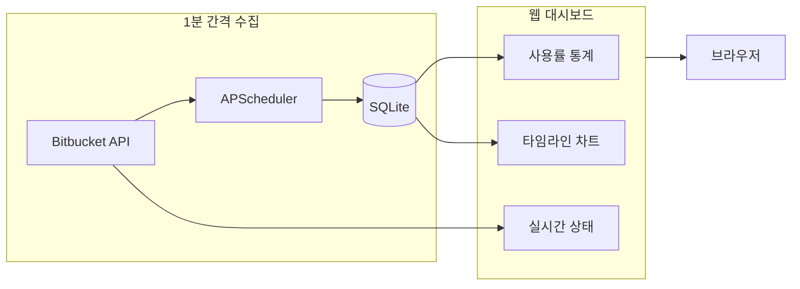

CI/CD 파이프라인의 병목은 코드가 아니라 인프라에서 발생하는 경우가 많다. 특히 self-hosted runner 환경에서는 runner 수가 곧 동시 빌드 수의 상한이 되는데, 이 상한이 적정한지 판단할 데이터가 없다면 감으로 운영하게 된다.

Bitbucket self-hosted runner 3대를 운영하고 있었다. 개발자들이 빌드가 밀린다는 얘기를 했지만, 정확히 하루 중 얼마나 대기가 발생하는지, runner를 몇 대로 늘려야 하는지 판단할 근거가 없었다. Bitbucket에는 runner 사용률을 시계열로 보여주는 기능이 없기 때문이다. AI로 간이 대시보드를 빠르게 만들어 측정하고, 데이터 기반으로 적정 runner 수를 결정한 과정을 공유한다.

## 문제 상황

Bitbucket Pipelines에서 self-hosted runner를 사용하면, runner가 모두 사용 중일 때 새 파이프라인은 `PENDING` 상태로 대기한다.

runner 3대 환경에서 체감적으로 대기가 잦다는 피드백이 있었다. 하지만 다음 질문에 답할 수 없었다:

- 하루 중 runner가 모두 사용 중인 시간이 얼마나 되는가?
- runner를 몇 대로 늘려야 대기가 해소되는가?
- 현재 runner별 사용률은 얼마인가?

## 왜 데이터가 없는가

Bitbucket에는 runner 상태에 대한 시계열 메트릭이 없다. 확인해본 결과:

| 항목 | 지원 여부 |
|------|----------|
| Runner 현재 상태 조회 API | O (internal API) |
| Runner 사용률 히스토리 | X |
| TSDB 형태의 메트릭 export | X |
| Bitbucket 내장 대시보드 | X |
| Atlassian Marketplace 앱 | X (적절한 도구 없음) |

Bitbucket API로 현재 상태는 조회할 수 있지만, **과거 이력을 제공하지 않는다**. 시점 데이터만 있고 시계열 데이터는 없다. 러너가 지금 바쁜지는 알 수 있지만, 오늘 하루 중 얼마나 바빴는지는 알 수 없다.

DevOps 관점에서 이상적인 방향은 Prometheus 같은 시계열 DB에 메트릭을 수집하고 Grafana로 시각화하는 것이다. 하지만 당장 필요한 건 "runner를 늘려야 하는가, 몇 대로 늘려야 하는가"에 대한 답이었다. 본격적인 모니터링 파이프라인을 구축하기 전에, 먼저 간이 도구로 데이터를 수집해서 의사결정을 하기로 했다.

## 간이 대시보드 제작

AI(Claude)를 활용해 Python Flask 기반의 대시보드를 프로토타입으로 빠르게 만들었다. 핵심 아이디어는 단순하다: **Bitbucket API를 주기적으로 폴링해서 SQLite에 기록하고, 누적된 데이터로 통계를 산출한다.**



### 아키텍처

| 구성 요소 | 역할 | 기술 |
|----------|------|------|
| 데이터 수집 | 1분마다 runner 상태 폴링 → DB 저장 | APScheduler + SQLite |
| 실시간 조회 | 현재 runner 상태 Bitbucket API 직접 호출 | Flask REST API |
| 통계 산출 | 업무시간(09:00~20:00) 기준 사용률 계산 | SQL 집계 |
| 시각화 | 러너별 타임라인, 요약 카드 | Vanilla JS |

프레임워크 없이 Python 파일 1개(`server.py`)와 HTML 파일 1개(`index.html`)로 구성했다. 의사결정을 위한 임시 도구이므로, 최소한의 구성으로 빠르게 만드는 게 중요했다.

### 데이터 수집

1분마다 Bitbucket API를 호출해서 각 runner의 상태를 SQLite에 저장한다.

```python
def record_runner_status():
    url = f"https://api.bitbucket.org/internal/workspaces/{WORKSPACE}/pipelines-config/runners"
    response = requests.get(url, auth=(BITBUCKET_USER, BITBUCKET_TOKEN))
    data = response.json()

    conn = sqlite3.connect(DB_PATH)
    c = conn.cursor()
    now = datetime.now()

    for runner in data.get('values', []):
        is_busy = 1 if runner.get('state', {}).get('step') else 0
        repo_name = None
        if is_busy and runner.get('state', {}).get('repository'):
            repo_name = runner['state']['repository'].get('full_name', '')

        c.execute('''
            INSERT INTO runner_snapshots (timestamp, runner_name, status, is_busy, repo_name)
            VALUES (?, ?, ?, ?, ?)
        ''', (now, runner['name'], runner.get('state', {}).get('status'), is_busy, repo_name))

    conn.commit()
    conn.close()
```

저장하는 데이터는 단순하다: **시각, runner 이름, 상태, 사용 여부, 사용 중인 리포지토리명**. 이 정도면 사용률 분석에 충분하다.

### 핵심 통계: Full Busy 비율

가장 중요한 지표는 **Full Busy 비율**이다. 모든 runner가 동시에 사용 중인 시간의 비율을 말한다. 이 비율이 높을수록 파이프라인 대기가 발생할 확률이 높다.

```python
# 전체 러너가 모두 사용 중인 시간 (분)
c.execute('''
    SELECT COUNT(*) FROM (
        SELECT timestamp
        FROM runner_snapshots
        WHERE strftime('%H', timestamp) BETWEEN '09' AND '19'
          AND date(timestamp) = date('now', 'localtime')
        GROUP BY timestamp
        HAVING SUM(is_busy) = ?
    )
''', (runner_count,))
```

업무시간(09:00~20:00) 동안의 데이터만 대상으로 한다. 야간이나 주말의 낮은 사용률이 통계를 왜곡하지 않도록 했다.

### 대시보드 UI


다크 테마의 대시보드는 4가지 정보를 한 화면에 보여준다:

1. **요약 카드**: 전체/사용 중/대기 중 runner 수, 실행 중 빌드 수
2. **Runner 상태**: 각 runner의 현재 상태와 사용 중인 리포지토리
3. **타임라인**: 1분 단위로 러너별 Busy/Idle 히스토리를 시각화
4. **통계**: 수집 레코드 수, Full Busy 시간, Full Busy 비율

### API Rate Limit 고려

Bitbucket API rate limit은 시간당 1,000회다. 1분 간격 수집 시 시간당 60회만 사용하므로 여유가 있다. 다만 대시보드를 브라우저에서 열면 추가 API 호출이 발생한다. 10초 간격 자동 갱신 기준 시간당 360회 정도인데, 다른 CI/CD 연동과 rate limit을 공유하므로 이 점은 운영 시 고려해야 했다.

## 측정 결과

### 4대 운영 시 (160분 모니터링)

먼저 1대를 추가해서 4대로 운영하면서 160분간 모니터링했다.

| 항목 | 수치 |
|------|------|
| Runner 수 | 4대 |
| 모니터링 시간 | 160분 |
| Full Busy 비율 | 8.1% |
| 물리 서버 CPU | ~1% |

8.1%라는 건, 160분 중 약 13분 동안 4대 모두 사용 중이었다는 뜻이다. 그 시간 동안 신규 파이프라인은 대기 상태에 빠졌을 것이다.

### 시뮬레이션 분석

수집된 데이터를 기반으로 runner 수별 Full Busy 비율을 시뮬레이션했다.

| Runner 수 | Full Busy 비율 | 비고 |
|-----------|---------------|------|
| 3대 | 21.12% | 기존 운영 (5분 중 1분은 대기) |
| 4대 | 11.55% | 1대 추가 후 |
| 5대 | 4.62% | - |
| 6대 | 0% (실측) | 최종 결정 |

3대 운영 시 Full Busy 21.12%는 업무시간 중 약 1/5을 전체 대기 상태로 보냈다는 의미다. 개발자 체감이 틀리지 않았다.

## 의사결정

데이터를 기반으로 다음과 같이 결정했다:

1. **우선 9대까지 증설** (물리 서버 CPU 1%대로 리소스 여유 확인)
2. **모니터링하면서 점진적 축소**
3. **최종 6대로 운영** 결정

6대로 결정한 근거:
- 5대에서도 Full Busy 4.62%로 거의 해소되지만, **장애 시 1대 버퍼** 확보
- 물리 서버 리소스 사용량이 미미해서 비용 부담 없음
- 구버전(v3.28.0) runner도 v5.6.0으로 업그레이드하면서 정리

## 결과

| 항목 | Before | After |
|------|--------|-------|
| Runner 수 | 3대 (v3.28.0) | 6대 (v5.6.0) |
| Full Busy 비율 | 21.12% | 0% |
| CI 대기 체감 | 빈번 | 없음 |
| 의사결정 근거 | 체감 | 데이터 |

하루 운영 후 Full Busy 0%를 확인했다. CI 대기 문제가 해소되었다.

## 배운 점

1. **측정 없이는 개선도 없다**: "느리다"는 체감은 있었지만, 얼마나 느린지 모르면 얼마나 늘려야 하는지도 알 수 없다. 간이 도구라도 데이터를 수집하면 의사결정의 질이 달라진다.

2. **AI 프로토타이핑의 효용**: 정식 모니터링 파이프라인(Prometheus + Grafana)을 구축하려면 시간이 걸린다. AI로 간이 대시보드를 빠르게 만들어서 당장의 의사결정에 필요한 데이터를 확보했다. 완벽한 도구가 아니라 충분한 도구가 필요한 순간이 있다.

3. **Observability vs. 실용성의 균형**: 이상적으로는 시계열 DB에 메트릭을 적재하고 Grafana로 시각화하는 게 맞다. 하지만 "runner를 몇 대로 할까"라는 질문에 답하기 위해 그 인프라를 먼저 구축할 필요는 없다. 간이 도구로 문제를 해결하고, 모니터링 고도화는 이후 과제로 남겨두었다.

4. **API 폴링의 한계와 충분함**: 1분 간격 폴링은 정밀한 메트릭과는 거리가 멀다. 하지만 "하루 중 Full Busy 비율이 20%인가 5%인가"를 판단하는 데는 충분하다. 목적에 맞는 정밀도를 선택하는 것이 중요하다.
