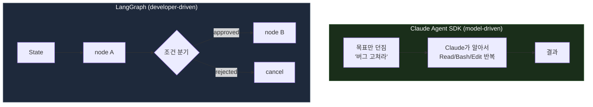
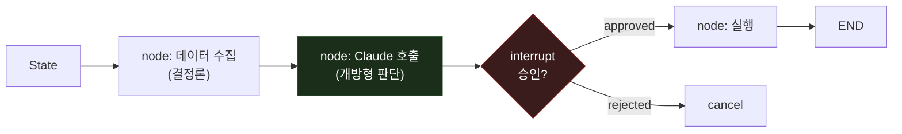

에이전트 프레임워크를 바꾸는 진짜 이유는 "더 좋아 보여서"가 아니다. 바꿔야 하는 건 도구가 아니라 도구가 감당해야 할 워크플로우의 성격일 때가 많다.

Claude Agent SDK로 인프라 자동화를 만들어 오다가, 더 전문가스럽고 나은 구성이 있는지 찾다 LangGraph라는 오케스트레이션 프레임워크를 알게 됐다. 이 글에서는 LangGraph가 무엇인지, Claude Agent SDK와 어떻게 다른지, 그리고 "이 이동이 논리적으로 맞는가"를 어떤 기준으로 판단했는지 정리한다.

## 결론부터: 두 도구는 같은 층위가 아니다

가장 먼저 짚어야 할 것은 **Claude Agent SDK와 LangGraph는 경쟁 관계가 아니라 서로 다른 레이어의 도구**라는 점이다. 이걸 구분하지 않으면 "더 전문가스러워 보이는 쪽"으로 갈아타는 함정에 빠진다.

| 축 | Claude Agent SDK | LangGraph |
| --- | --- | --- |
| **누가 흐름을 결정하나** | 모델이 결정 (model-driven) | 개발자가 그래프로 설계 (developer-driven) |
| **강점** | 개방형(open-ended) 작업. "알아서 판단해서 처리" | 결정론적 워크플로우. "1단계→검증→2단계" |
| **내장 제공** | 에이전트 루프, 내장 툴(Read/Write/Bash 등), 컨텍스트 관리 | 상태 그래프, 체크포인팅, human-in-the-loop |
| **직접 구현해야 하는 것** | 그래프/상태머신 (SDK엔 없음) | 툴 실행 루프, 컨텍스트 관리 |
| **모델 종속** | Claude 전용 | model-agnostic |



**핵심은 개방형이냐 워크플로우냐다.** "알아서 판단해서 인프라를 만져"라면 Agent SDK가 오히려 정답이고, "정해진 단계를 정해진 순서로"라면 LangGraph가 더 나은 선택이다.

## Claude Agent SDK — 지금 쓰는 것

Claude Agent SDK는 Claude Code를 라이브러리로 패키징한 것이다. Python과 TypeScript를 지원하고, Claude Code를 움직이는 것과 동일한 에이전트 루프, 내장 툴, 컨텍스트 관리를 그대로 쓴다.

```python
import asyncio
from claude_agent_sdk import query, ClaudeAgentOptions


async def main():
    async for message in query(
        prompt="auth.py의 버그를 찾아서 고쳐라",
        options=ClaudeAgentOptions(allowed_tools=["Read", "Edit", "Bash"]),
    ):
        print(message)  # Claude가 파일을 읽고, 버그를 찾고, 수정한다


asyncio.run(main())
```

여기서 중요한 건 **툴 실행 루프를 직접 짜지 않는다**는 점이다. Client SDK(Anthropic API 직접 호출)였다면 이렇게 써야 한다.

```python
# Client SDK: 툴 루프를 직접 구현
response = client.messages.create(...)
while response.stop_reason == "tool_use":
    result = your_tool_executor(response.tool_use)
    response = client.messages.create(tool_result=result, **params)
```

Agent SDK가 제공하는 것:

- **내장 툴**: Read, Write, Edit, Bash, Glob, Grep, WebSearch, WebFetch
- **Hooks**: `PreToolUse`, `PostToolUse`, `SessionStart` 등 라이프사이클 개입 지점
- **Subagents**: 전문화된 하위 에이전트에 작업 위임
- **MCP**: 외부 시스템(DB, 브라우저, API) 연결
- **Sessions**: 컨텍스트 유지, `resume`로 이어가기, fork

여기서 첫 번째 발견이 있었다. **내가 "LangGraph로 가야 얻는다"고 생각했던 것 중 일부는 Agent SDK에 이미 있었다.** 관측성과 재현성 측면에서 Hooks, Sessions, resume는 이미 제공되는 기능이었다. 다만 이건 "상태 그래프 수준의 명시적 제어"와는 다르다. 이 차이가 이동 판단의 절반을 가른다.

## LangGraph — 검토한 것

LangGraph의 공식 정의는 "long-running, stateful agent를 만들기 위한 low-level orchestration framework and runtime"이다. 프롬프트 엔지니어링이 아니라 **오케스트레이션**에 초점이 있고, 문서 스스로 초보자에겐 상위 추상화를 권하고 LangGraph는 정교한 제어가 필요한 경우를 위한 것이라고 명시한다.

### 기본 구조

LangGraph는 세 가지 프리미티브로 워크플로우를 모델링한다. 문서의 표현을 빌리면 *"nodes do the work, edges tell what to do next"* (노드가 일하고, 엣지가 다음에 뭘 할지 정한다).

```python
from typing_extensions import TypedDict
from langgraph.graph import StateGraph, START, END

class State(TypedDict):
    input: str
    output: str

def node_1(state: State):
    return {"output": state["input"].upper()}

builder = StateGraph(State)
builder.add_node("process", node_1)
builder.add_edge(START, "process")
builder.add_edge("process", END)

graph = builder.compile()
result = graph.invoke({"input": "hello"})
# {'input': 'hello', 'output': 'HELLO'}
```

| 프리미티브 | 역할 |
| --- | --- |
| **State** | TypedDict 스키마. reducer로 업데이트 병합 방식을 지정 |
| **Node** | state를 받아 부분 업데이트를 반환하는 함수 |
| **Edge** | `add_edge`(고정) / `add_conditional_edges`(동적 분기) |
| **START/END** | 그래프 진입/종료를 표시하는 가상 노드 |

State의 핵심은 **reducer**다. 노드가 반환한 값을 기존 state에 어떻게 합칠지 지정한다. 기본은 덮어쓰기고, 누적하려면 `Annotated`로 감싼다.

```python
from operator import add
from typing import Annotated
from typing_extensions import TypedDict

class State(TypedDict):
    foo: int                          # 기본 reducer: 덮어쓰기
    bar: Annotated[list[str], add]    # 누적

# LLM 대화라면 add_messages reducer 사용
from langgraph.graph.message import add_messages
from langchain.messages import AnyMessage

class GraphState(TypedDict):
    messages: Annotated[list[AnyMessage], add_messages]
```

### Persistence — 재현성의 실체

내가 "재현성/디버깅"을 이유로 LangGraph를 봤는데, 그 실체는 **checkpointer**였다.

```python
from langgraph.checkpoint.memory import InMemorySaver

checkpointer = InMemorySaver()
graph = builder.compile(checkpointer=checkpointer)

result = graph.invoke(
    {"messages": [{"role": "user", "content": "Hi"}]},
    {"configurable": {"thread_id": "thread-1"}},
)
```

| Checkpointer | 용도 |
| --- | --- |
| `InMemorySaver` | 개발용 (프로세스 재시작 시 소실) |
| `SqliteSaver` | 로컬/소규모 |
| `PostgresSaver` | 프로덕션 |

`thread_id`로 대화별 상태를 스코프하고, 상태 스냅샷으로 **time-travel(과거 체크포인트 복원)** 과 **실패 후 재개(durable execution)** 가 된다. 이게 Agent SDK의 Sessions/resume보다 한 단계 더 세밀하다. 그래프의 어느 노드에서든 상태를 들여다보고 되감을 수 있기 때문이다.

### Human-in-the-loop — interrupt

승인 게이트가 필요할 때 `interrupt()`로 그래프를 멈추고, `Command(resume=...)`로 재개한다.

```python
from langgraph.types import interrupt, Command

def approval_node(state):
    ok = interrupt({
        "question": "이 작업을 진행할까요?",
        "details": state["action_details"],
    })
    return Command(goto="proceed" if ok else "cancel")

# 재개
graph.invoke(Command(resume=True), config=config)
```

`interrupt()`는 checkpointer로 상태를 저장한 뒤 외부 입력을 무기한 기다린다. 여기엔 **주의할 함정 세 가지**가 있다.

- **`interrupt()`를 `try/except`로 감싸지 말 것.** interrupt는 예외 메커니즘으로 동작하므로 잡아버리면 재개가 깨진다.
- **interrupt 순서를 고정할 것.** 재개는 인덱스 위치로 매칭되므로, 조건부로 interrupt를 건너뛰면 순서가 어긋난다.
- **interrupt 앞의 side effect는 idempotent하게.** 재개 시 노드가 처음부터 다시 실행되므로, `create`가 아니라 `upsert`여야 중복이 안 생긴다.

이 "한계를 알고 쓰는 것"이 프레임워크 선택에서 가장 중요한 부분이다. 편해 보이는 기능일수록 재실행 모델을 이해하지 못하면 프로덕션에서 데이터를 두 번 쓴다.

### 멀티 에이전트

LangGraph는 여러 멀티 에이전트 패턴을 코드로 설계할 수 있다. 문서는 호출 횟수와 토큰까지 비교해 둔다.

| 패턴 | 언제 | 특징 |
| --- | --- | --- |
| **Subagents** | 큰 컨텍스트, 병렬화 | context isolation으로 토큰 최대 67% 절감. 단순 작업엔 모델 호출 4회 |
| **Handoffs** | 반복 요청, 직접 상호작용 | stateful. 반복 요청 시 2회 호출 |
| **Router** | 멀티 도메인, 병렬 실행 | 입력 분류 후 전문 에이전트로 라우팅 |
| **Skills** | 집중된 단순 작업 | 단일 에이전트가 필요 시 컨텍스트 로드 |
| **Custom Workflow** | 결정론+에이전틱 혼합 | 위 패턴들을 노드로 임베드 |

문서의 핵심 조언: *"패턴을 섞을 수 있다."* 이게 다음 절의 결론으로 이어진다.

## 그래서, 이동이 논리적인가

내가 LangGraph를 보게 된 동기는 네 가지였다. 각각을 판정하면 이렇다.

| 동기 | LangGraph가 답인가 | 근거 |
| --- | --- | --- |
| 복잡한 흐름 제어 (분기/루프/승인) | ✅ 맞음 | 명시적 그래프가 LangGraph의 존재 이유 |
| 멀티 에이전트 오케스트레이션 | ✅ 맞음 | hierarchical/multi-actor를 코드로 설계 |
| 관측성/디버깅/재현성 | ⚠️ 부분적 | checkpointing/time-travel은 강하지만, Agent SDK도 Hooks/Sessions/resume 제공 |
| 벤더 종속 탈피 | ✅ 맞음 | LangGraph는 model-agnostic, Agent SDK는 Claude 전용 |

**가설: 정답은 둘 중 하나가 아니라 조합이다.**

가장 노련한 구성은 하이브리드다.

- **LangGraph를 오케스트레이션 뼈대로** 쓴다 (그래프, 상태, human-in-the-loop, 재현성)
- **개방형 작업이 필요한 노드 안에서 Claude를 호출**한다 (또는 무거운 에이전틱 작업은 노드가 Claude Agent SDK를 호출)

이러면 네 가지 동기를 모두 만족한다. 흐름 제어와 멀티 에이전트는 LangGraph가, 강력한 개방형 에이전트 능력은 Claude가 맡는다.



## 우리 환경에서의 판단

<!-- TODO(as-is): 지금 Claude Agent SDK로 만든 자동화의 실제 구조를 여기 채운다.
     - 무엇을 자동화하는가 (예: 비용 리포트, EKS 런북, param store 승인 flow)
     - 이 작업이 "개방형"인가 "정해진 워크플로우"인가
     - 현재 아픈 지점(pain point)은 구체적으로 무엇인가 — 숫자로
     - LangGraph로 옮기면 실제로 무엇이 나아지는가 / 무엇을 다시 구현해야 하는가
     이 섹션이 이 글의 무게 중심이다. 구체 수치와 실제 사례로 채울 것. -->

## 정리

1. **Claude Agent SDK와 LangGraph는 경쟁이 아니라 다른 레이어다.** 전자는 모델이 흐름을 정하고, 후자는 개발자가 그래프로 정한다.
2. **판단 기준은 "더 전문가스러운가"가 아니라 "워크플로우가 개방형인가 결정론적인가"다.** 개방형이면 Agent SDK, 정해진 단계면 LangGraph.
3. **이미 가진 기능을 다시 사지 마라.** 관측성/재현성 동기의 일부는 Agent SDK의 Hooks/Sessions로 이미 충족된다.
4. **최선은 하이브리드다.** LangGraph를 뼈대로, Claude를 노드 안의 판단 엔진으로.
5. **편한 기능일수록 재실행 모델을 이해하고 써라.** interrupt의 idempotency 함정처럼, 프레임워크의 한계를 아는 것이 선택보다 중요하다.

커뮤니티 대세가 우리 정답은 아니다. 도구를 바꾸기 전에, 바꿔야 하는 게 도구인지 워크플로우의 성격인지 먼저 물어야 한다.

## 참고 자료

- [Claude Agent SDK overview](https://code.claude.com/docs/en/agent-sdk)
- [LangGraph — Graph API](https://docs.langchain.com/oss/python/langgraph/graph-api)
- [LangGraph — Persistence](https://docs.langchain.com/oss/python/langgraph/persistence)
- [LangGraph — Human-in-the-loop (interrupts)](https://docs.langchain.com/oss/python/langgraph/interrupts)
- [LangChain — Multi-agent patterns](https://docs.langchain.com/oss/python/langchain/multi-agent)
