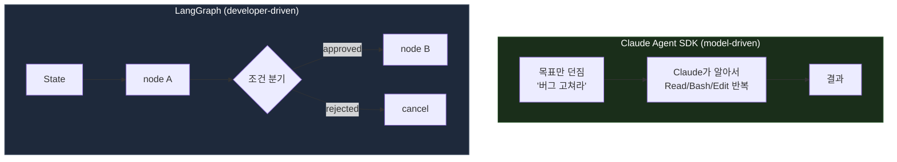

LangGraph를 처음 봤을 때 든 생각은 "이게 왜 필요하지"였다. 인프라 자동화는 Claude Agent SDK로 만들어 왔고, 목표만 던지면 모델이 알아서 처리하는 방식에 익숙했기 때문이다. 그래프를 직접 그리고 상태를 정의하는 건 오히려 번거로워 보였다.

그런데 그 "번거로움"이 정확히 LangGraph의 존재 이유였다. 문제는 도구의 편의성이 아니라, 에이전트가 감당해야 할 흐름의 성격이었다. 이 글에서는 LangGraph가 무엇인지 공식 문서를 기준으로 정리하고, 그 과정에서 모델에게 맡기는 Agent SDK와 접근 방식이 어떻게 다른지 짚는다.

## LangGraph는 무엇인가

LangGraph의 공식 정의는 "long-running, stateful agent를 만들기 위한 low-level orchestration framework and runtime"이다. 핵심 단어는 두 개다.

- **low-level**: 프롬프트나 상위 추상화가 아니라, 흐름을 직접 설계하는 저수준 제어를 제공한다. 문서 스스로 초보자에겐 상위 추상화를 권하고, LangGraph는 정교한 제어가 필요한 경우를 위한 것이라고 명시한다.
- **stateful**: 에이전트의 상태를 명시적으로 정의하고, 그 상태가 노드를 거치며 어떻게 변하는지를 그래프로 표현한다.

한마디로 LangGraph는 **에이전트의 제어 흐름을 상태 그래프(state graph)로 모델링하는 도구**다. "알아서 판단하는 모델"이 아니라 "개발자가 설계한 흐름 위에서 동작하는 에이전트"를 만들 때 쓴다.

이런 종류의 도구를 **에이전트 오케스트레이션 프레임워크(agent orchestration framework)** 라고 부른다. 여러 단계, 여러 에이전트, 상태와 흐름을 조율(orchestrate)하는 계층을 가리키는 이름이다. 넓게는 LangGraph, CrewAI, AutoGen 같은 것들이 모두 **에이전트 프레임워크(agent framework)** 라는 상위 카테고리에 속하고, 그중 LangGraph는 특히 흐름 조율에 초점을 둔 오케스트레이션 계열이다. 상태 그래프 기반이라 **워크플로우 엔진(workflow engine)** 의 성격도 함께 갖는다.

## 세 가지 핵심 프리미티브

LangGraph는 워크플로우를 세 가지로 모델링한다. 문서의 표현을 빌리면 *"nodes do the work, edges tell what to do next"* (노드가 일하고, 엣지가 다음에 뭘 할지 정한다).

| 프리미티브 | 역할 |
| --- | --- |
| **State** | 애플리케이션의 현재 스냅샷. 공유되는 데이터 구조 |
| **Node** | state를 받아 부분 업데이트를 반환하는 함수 |
| **Edge** | 현재 state를 보고 다음에 어느 노드를 실행할지 결정 |

가장 단순한 그래프는 이렇게 생겼다.

```python
from typing_extensions import TypedDict
from langgraph.graph import StateGraph, START, END

class State(TypedDict):
    input: str
    output: str

def node_1(state: State):
    return {"output": state["input"].upper()}

builder = StateGraph(State)
builder.add_node("process", node_1)
builder.add_edge(START, "process")
builder.add_edge("process", END)

graph = builder.compile()
result = graph.invoke({"input": "hello"})
# {'input': 'hello', 'output': 'HELLO'}
```

- `StateGraph(State)`: State 스키마로 그래프를 초기화한다.
- `add_node`: 노드(함수)를 등록한다.
- `add_edge`: 노드 사이를 잇는다. `START`와 `END`는 그래프의 진입/종료를 표시하는 가상 노드다.
- `compile()`: 구조를 검증하고 실행 가능한 그래프로 만든다. 실행 전 항상 필요하다.
- `invoke()`는 최종 state를 반환하고, `stream()`은 중간 단계를 하나씩 흘려준다.

## State와 reducer: 업데이트를 어떻게 합칠 것인가

State의 핵심은 **reducer**다. 노드가 반환한 값을 기존 state에 어떻게 병합할지 지정한다. 기본은 덮어쓰기이고, 누적하려면 `Annotated`로 감싼다.

```python
from operator import add
from typing import Annotated
from typing_extensions import TypedDict

class State(TypedDict):
    foo: int                          # 기본 reducer: 덮어쓰기
    bar: Annotated[list[str], add]    # 누적
```

LLM 대화 상태를 다룰 때는 메시지 전용 reducer인 `add_messages`를 쓴다. 프리빌트 `MessagesState`를 상속해도 된다.

```python
from typing import Annotated
from typing_extensions import TypedDict
from langgraph.graph.message import add_messages
from langchain.messages import AnyMessage

class GraphState(TypedDict):
    messages: Annotated[list[AnyMessage], add_messages]
```

reducer를 이해하면 LangGraph의 상태 모델이 명확해진다. 노드는 전체 state를 다시 쓰는 게 아니라 **부분 업데이트만 반환**하고, 그 업데이트를 state에 합치는 방식을 reducer가 결정한다. 이 지점이 SDK와의 첫 번째 갈림길이다. Agent SDK에서는 상태가 모델의 대화 맥락 안에 암묵적으로 있지만, LangGraph에서는 상태가 코드로 명시된 스키마다.

## 조건부 엣지: 흐름을 분기시키기

고정 엣지만으로는 순차 실행밖에 안 된다. 상태에 따라 흐름을 나누려면 조건부 엣지를 쓴다. 방법은 두 가지다.

```python
# 1) 라우팅 함수가 다음 노드 이름을 직접 반환
def route(state: State):
    return "node_b" if state["foo"] == "value" else "node_c"

builder.add_conditional_edges("node_a", route)
```

라우팅 함수가 노드 이름 문자열을 반환하면, LangGraph가 그 이름의 노드로 넘어간다. 함수가 라벨(예: 불리언)을 반환하게 하고 그 라벨을 노드에 매핑할 수도 있다.

```python
# 2) 라벨을 반환하고, 매핑으로 노드에 연결
def route(state: State):
    return state["foo"] == "value"   # True 또는 False

builder.add_conditional_edges(
    "node_a",
    route,
    {True: "node_b", False: "node_c"},
)
```

두 방식의 차이는 라우팅 함수의 반환값을 노드 이름에 직접 묶느냐, 라벨을 거쳐 묶느냐다. 어느 쪽이든 이것이 분기, 루프, 조건부 재시도 같은 복잡한 제어 흐름을 그래프로 표현하는 방식이다. Agent SDK라면 이런 분기는 모델의 판단에 맡겨진다. LangGraph는 그 판단을 코드로 끌어내려 눈에 보이게 만든다.

## Persistence: 체크포인팅과 재개

LangGraph가 "long-running"을 강조하는 이유가 여기 있다. **checkpointer**가 그래프 상태를 스냅샷으로 저장해, 실패 후 재개하거나 과거 시점으로 되감을 수 있다.

```python
from langgraph.checkpoint.memory import InMemorySaver

checkpointer = InMemorySaver()
graph = builder.compile(checkpointer=checkpointer)

result = graph.invoke(
    {"messages": [{"role": "user", "content": "Hi"}]},
    {"configurable": {"thread_id": "thread-1"}},
)
```

| Checkpointer | 용도 |
| --- | --- |
| `InMemorySaver` | 개발용 (프로세스 재시작 시 소실) |
| `SqliteSaver` | 로컬 / 소규모 |
| `PostgresSaver` | 프로덕션 |

`thread_id`로 대화별 상태를 스코프한다. 같은 `thread_id`로 다시 호출하면 이전 체크포인트에서 이어지고, 새 `thread_id`는 처음부터 시작한다. 이 스냅샷 구조가 **time-travel(과거 체크포인트 복원)** 과 **conversation continuity(대화 연속성)** 를 가능하게 한다.

## Human-in-the-loop: interrupt

승인 게이트가 필요할 때 `interrupt()`로 그래프를 멈추고 외부 입력을 기다린다. 재개는 `Command(resume=...)`로 한다.

```python
from langgraph.types import interrupt, Command

def approval_node(state):
    ok = interrupt({
        "question": "이 작업을 진행할까요?",
        "details": state["action_details"],
    })
    return Command(goto="proceed" if ok else "cancel")

# 재개
graph.invoke(Command(resume=True), config=config)
```

`interrupt()`는 checkpointer로 현재 상태를 저장한 뒤 실행을 멈추고, 넘어온 payload를 호출자에게 보여준다. 그리고 무기한 대기하다가 `Command(resume=값)`이 들어오면 그 값을 `interrupt()`의 반환값으로 삼아 이어간다.

여기엔 알고 써야 할 함정이 세 가지 있다.

- **`interrupt()`를 `try/except`로 감싸지 말 것.** interrupt는 예외 메커니즘으로 동작하므로 잡아버리면 재개가 깨진다.
- **interrupt 순서를 고정할 것.** 재개는 인덱스 위치로 매칭되므로, 조건부로 interrupt를 건너뛰면 순서가 어긋난다.
- **interrupt 앞의 side effect는 idempotent하게.** 재개 시 노드가 처음부터 다시 실행되므로, `create`가 아니라 `upsert`여야 중복이 안 생긴다.

편해 보이는 기능일수록 재실행 모델을 이해하지 못하면 프로덕션에서 데이터를 두 번 쓴다. 이 재실행 특성은 LangGraph의 상태 그래프 모델에서 나오는 자연스러운 결과다. 인프라 승인 흐름처럼 "사람이 반드시 한 번 확인해야 하는" 게이트를 코드로 못 박아야 할 때, 이 명시성은 편의보다 안전에 가깝다.

## 멀티 에이전트 패턴

LangGraph는 여러 에이전트를 조합하는 패턴을 코드로 설계할 수 있다. 공식 문서는 각 패턴의 호출 횟수와 토큰까지 비교해 둔다.

| 패턴 | 언제 | 특징 |
| --- | --- | --- |
| **Subagents** | 큰 컨텍스트, 병렬화 | context isolation으로 토큰 최대 67% 절감. 단순 작업엔 모델 호출 4회 |
| **Handoffs** | 반복 요청, 직접 상호작용 | stateful. 반복 요청 시 2회 호출 |
| **Router** | 멀티 도메인, 병렬 실행 | 입력을 분류해 전문 에이전트로 라우팅 후 결과 종합 |
| **Skills** | 집중된 단순 작업 | 단일 에이전트가 필요 시 컨텍스트를 로드 |
| **Custom Workflow** | 결정론 + 에이전틱 혼합 | 위 패턴들을 노드로 임베드 |

이 표에서 눈여겨볼 건 호출 횟수 차이다. 단순 작업에 Subagents를 쓰면 모델 호출이 4회로 늘고, Handoffs는 반복 요청에서 2회로 줄어든다. 즉 패턴 선택은 취향이 아니라 **비용과 지연을 결정하는 설계 결정**이다. 큰 컨텍스트를 여러 번 다뤄야 하면 context isolation으로 토큰을 아끼는 Subagents가, 같은 사용자와 왕복이 잦으면 상태를 유지하는 Handoffs가 유리하다.

문서의 핵심 조언은 *"패턴을 섞을 수 있다"* 는 것이다. 예를 들어 subagents 구조가 내부에서 custom workflow나 router를 노드로 호출하는 식이다. 각 에이전트를 그래프의 노드 또는 서브그래프로 보고 조합하는 것이 LangGraph의 멀티 에이전트 접근이다.

## Claude Agent SDK와 무엇이 다른가

여기까지 보면 LangGraph의 성격이 드러난다. 그동안 써 온 Claude Agent SDK와 비교하면 차이가 분명해진다.

Claude Agent SDK는 Claude Code를 라이브러리로 패키징한 것으로, 목표를 던지면 **모델이 알아서** 흐름을 결정한다.

```python
from claude_agent_sdk import query, ClaudeAgentOptions

async for message in query(
    prompt="auth.py의 버그를 찾아서 고쳐라",
    options=ClaudeAgentOptions(allowed_tools=["Read", "Edit", "Bash"]),
):
    print(message)  # Claude가 파일을 읽고, 버그를 찾고, 수정한다
```

여기서 개발자는 흐름을 그리지 않는다. "버그를 고쳐라"라고만 하면 Claude가 Read → Bash → Edit를 스스로 판단해 반복한다. 반면 LangGraph는 앞에서 본 것처럼 노드와 엣지로 **개발자가 흐름을 직접 그린다.** 이 차이가 두 도구의 성격을 가른다.

| 축 | Claude Agent SDK | LangGraph |
| --- | --- | --- |
| **흐름을 정하는 주체** | 모델 (model-driven) | 개발자가 그래프로 설계 (developer-driven) |
| **제어 방식** | 목표를 주면 알아서 탐색 | State/Node/Edge로 명시적으로 기술 |
| **내장 제공** | 에이전트 루프, 내장 툴(Read/Write/Bash 등), 컨텍스트 관리 | 상태 그래프, 체크포인팅, human-in-the-loop |
| **직접 구현해야 하는 것** | 그래프/상태 흐름 (SDK엔 없음) | 툴 실행 루프, 툴 자체 |
| **모델 종속** | Claude 전용 | model-agnostic |
| **적합한 작업** | 개방형(open-ended). "알아서 처리해" | 결정론적 워크플로우. "정해진 단계를 정해진 순서로" |



정리하면, 둘은 **경쟁 관계라기보다 서로 다른 층위의 도구**다. Agent SDK는 모델이 흐름을 쥐는 개방형 작업에 강하고, LangGraph는 개발자가 흐름을 못 박는 결정론적 워크플로우에 강하다. 재현성 측면에서도, Agent SDK는 Hooks/Sessions/resume로 재개와 로깅을 제공하지만, LangGraph는 그래프의 어느 노드에서든 상태를 스냅샷으로 되감을 수 있어 제어의 결이 더 세밀하다.

그래서 처음의 "이게 왜 필요하지"라는 의문에는 이렇게 답하게 됐다. "버그를 고쳐라"처럼 끝을 열어두고 모델에게 맡기는 작업이라면 Agent SDK로 충분하다. 하지만 "이 단계에서 반드시 사람 승인을 받고, 실패하면 그 노드부터 재개하고, 이 조건이면 다른 경로로 간다"처럼 흐름 자체가 요구사항인 작업이라면, 그 흐름을 코드로 그릴 수 있는 LangGraph가 필요해진다.

## 정리

1. **LangGraph는 에이전트의 제어 흐름을 상태 그래프로 모델링하는 저수준 오케스트레이션 프레임워크다.** 모델이 흐름을 정하는 게 아니라, 개발자가 그래프로 정한다.
2. **State, Node, Edge가 핵심 프리미티브다.** 노드가 부분 업데이트를 반환하고, reducer가 그 업데이트를 상태에 합치고, 엣지가 다음 노드를 결정한다.
3. **checkpointer가 persistence의 기반이다.** thread_id로 상태를 스코프하고, 실패 후 재개와 time-travel을 지원한다.
4. **human-in-the-loop는 interrupt로 구현한다.** 단, 재실행 모델을 이해하고 idempotency를 지켜야 한다.
5. **멀티 에이전트 패턴 선택은 비용·지연 설계다.** 호출 횟수와 토큰이 패턴마다 다르므로 작업 성격에 맞춰 고른다.
6. **Claude Agent SDK와는 층위가 다르다.** SDK는 모델이 흐름을 쥐는 개방형 작업에, LangGraph는 개발자가 흐름을 못 박는 결정론적 워크플로우에 각각 강하다.

LangGraph의 가치는 화려한 기능이 아니라 명시성에 있다. 흐름과 상태를 코드로 드러내기 때문에, 복잡한 워크플로우를 재현 가능하고 디버깅 가능하게 만든다. Claude Agent SDK가 "모델에게 맡기는" 도구라면, LangGraph는 "흐름을 직접 그리는" 도구다. 도구를 고르기 전에 물어야 할 것은 "어느 쪽이 더 나은가"가 아니라 "내 작업에서 흐름은 모델이 정해도 되는가, 내가 정해야 하는가"이다.

## 참고 자료

- [LangGraph: Graph API](https://docs.langchain.com/oss/python/langgraph/graph-api)
- [LangGraph: Persistence](https://docs.langchain.com/oss/python/langgraph/persistence)
- [LangGraph: Human-in-the-loop (interrupts)](https://docs.langchain.com/oss/python/langgraph/interrupts)
- [LangChain: Multi-agent patterns](https://docs.langchain.com/oss/python/langchain/multi-agent)
