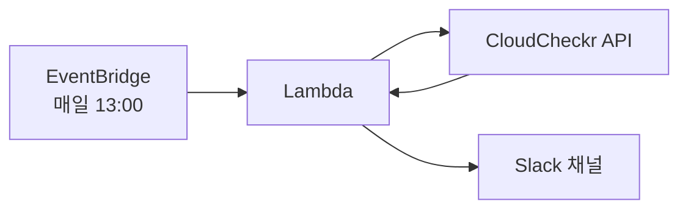
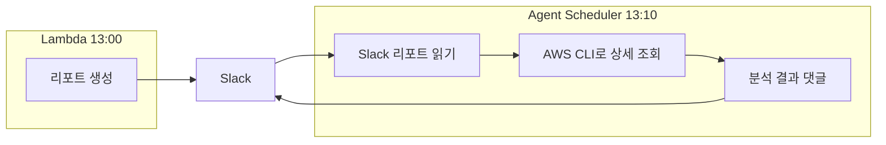
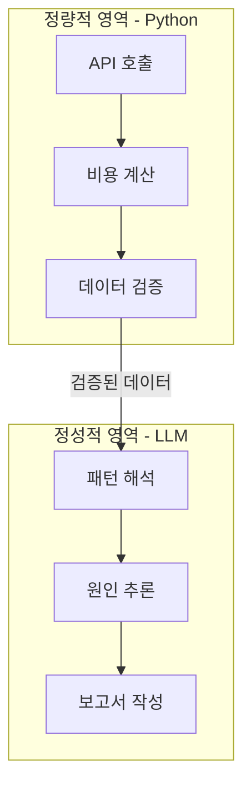

클라우드 비용 관리는 결국 Observability 문제다. 시스템 장애를 모니터링하듯, 비용 이상도 실시간으로 감지하고 원인을 추적할 수 있어야 한다.

기존에는 월 단위 수동 리뷰에 의존하고 있었다. MTTR(Mean Time To Resolve)이 아니라 MTTD(Mean Time To Detect)부터 문제였다. 이상 비용이 발생해도 한 달 뒤에야 알 수 있었다. Lambda로 일 단위 리포트를 자동화하고, Claude Agent로 이상 탐지와 원인 분석까지 자동화한 과정을 공유한다.

## 문제 상황

기존 프로세스는 이랬다:
1. 담당자가 수동으로 AWS/Datadog 콘솔에서 비용 확인
2. 월간 리포트 작성
3. 리뷰 미팅

이 방식의 문제점:
- **늦은 감지**: 월말에 확인하면 이상 비용이 이미 한 달치
- **원인 파악 어려움**: 숫자만 보고는 왜 올랐는지 알 수 없음
- **반복 작업**: 매번 같은 조회 작업을 수동으로

## 1단계: 일일 리포트 자동화 (Lambda)

먼저 일 단위로 비용을 확인할 수 있어야 했다. Lambda로 일일 리포트를 만들었다.

### MSP 환경의 제약

AWS Cost Explorer API를 직접 쓰면 좋겠지만, MSP를 통해 AWS를 사용하고 있어서 CE 권한이 없었다. MSP에서 제공하는 CloudCheckr API를 사용해야 했다.

CloudCheckr 빌링 데이터는 **3일 정도 지연**이 있다. 오늘 조회하면 3일 전 데이터가 나온다. 이 지연을 감안해서 리포트에 기준일을 명시했다.

### API 실패 처리

외부 API는 실패할 수 있다. 계정이 여러 개라 병렬로 조회하는데, 일부 계정이 타임아웃 나는 경우가 있었다. 재시도 로직을 추가하고, 실패한 계정은 로그에 남기도록 했다.

### 리포트 구성

일일 리포트에는 다음 정보를 포함했다:
- 법인별/계정별 비용
- 전일 대비 변화율
- 상위 서비스 비용
- 비용 급증 시 경고 표시

## 2단계: AI 분석 추가 (Agent)

리포트가 오면 숫자는 보이는데, **왜 올랐는지**는 여전히 사람이 확인해야 했다. 비용이 10% 올랐다고 해서 매번 들여다볼 수는 없다. 정상인지 이상인지 판단해주는 게 필요했다.

Claude Agent SDK로 분석 에이전트를 만들었다.

에이전트가 하는 일:
1. Slack에서 리포트 메시지 확인
2. AWS CLI로 상세 데이터 조회 (어떤 서비스가 왜 올랐는지)
3. 분석 결과를 스레드에 댓글로 작성
4. 이상 있으면 담당자 태그

## 핵심 설계: 정량적 데이터와 LLM 분리

여기서 중요한 교훈이 있었다.

처음에는 LLM이 직접 API를 호출해서 비용 데이터를 가져오도록 했다. 문제는 **API가 실패하면 LLM이 숫자를 만들어낸다**는 것이다. 환각(hallucination)이 발생해서 존재하지 않는 비용 데이터를 그럴듯하게 보고했다.

이 문제를 해결하기 위해 구조를 분리했다:

| 영역 | 담당 | 특징 |
|-----|------|------|
| 정량적 데이터 | Python/Lambda | API 호출, 숫자 집계, 실패 시 명확한 에러 |
| 정성적 분석 | LLM (Agent) | 패턴 해석, 원인 추론, 보고서 작성 |

**숫자는 코드가 가져오고, 해석은 LLM이 한다.** 이렇게 하면 LLM이 환각을 일으켜도 숫자 자체는 정확하다. 분석이 틀릴 수는 있어도 데이터가 조작되지는 않는다.

## 3단계: 주간/월간 리포트 확장

일일 리포트가 안정화되자 주간, 월간 리포트도 추가했다. 에이전트가 일일 데이터를 집계해서 주간 트렌드와 월간 요약을 자동으로 생성한다.

주간 리포트에는:
- 전주 대비 비용 변화
- 계정별/서비스별 트렌드
- 특이사항 요약 (25% 이상 변동, 신규 비용 항목 등)
- 모니터링 필요 항목 제안

## 결과

| 항목 | Before | After |
|-----|--------|-------|
| 확인 주기 | 월 1회 | 일/주/월 자동 |
| 이상 감지 | 월말에 발견 | 당일 알림 |
| 원인 분석 | 수동 조사 | 자동 분석 |
| 리포트 작성 | 담당자 수작업 | 에이전트 자동 생성 |

이상이 없으면 리포트만 확인하고 넘어간다. 이상이 있으면 에이전트가 원인을 분석해주고, 필요하면 담당자를 태그한다. 수동 작업이 거의 사라졌다.

## 배운 점

1. **일 단위 모니터링의 중요성**: 월 단위로는 너무 늦다
2. **정량/정성 분리**: LLM에게 숫자를 믿기면 안 된다. 숫자는 코드가, 해석은 LLM이
3. **점진적 확장**: 일일 → 분석 → 주간/월간 순서로 하나씩 추가

아직 개선할 부분이 있다. Datadog 비용 리포트도 같은 구조로 운영 중이고, 비용 예측이나 예산 알림 기능은 다음 단계로 검토 중이다.
