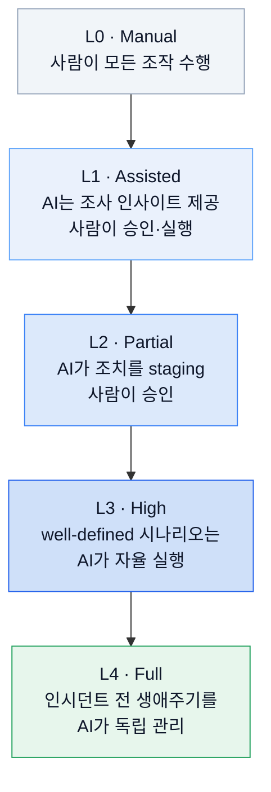
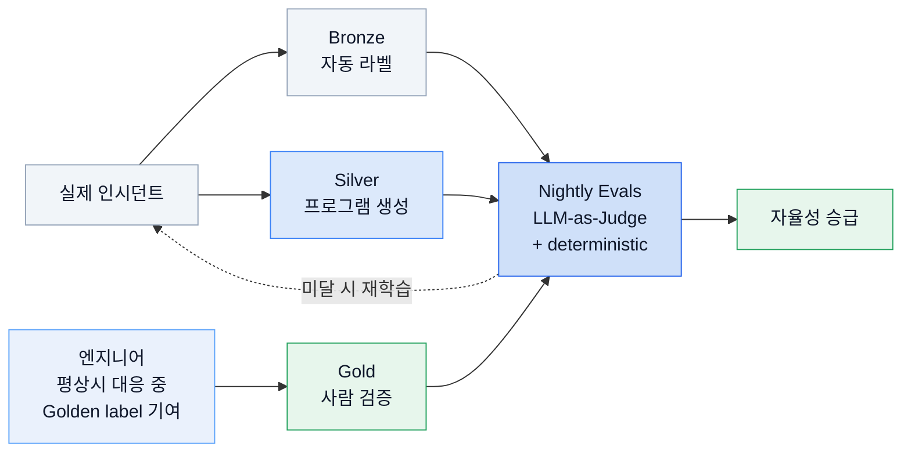
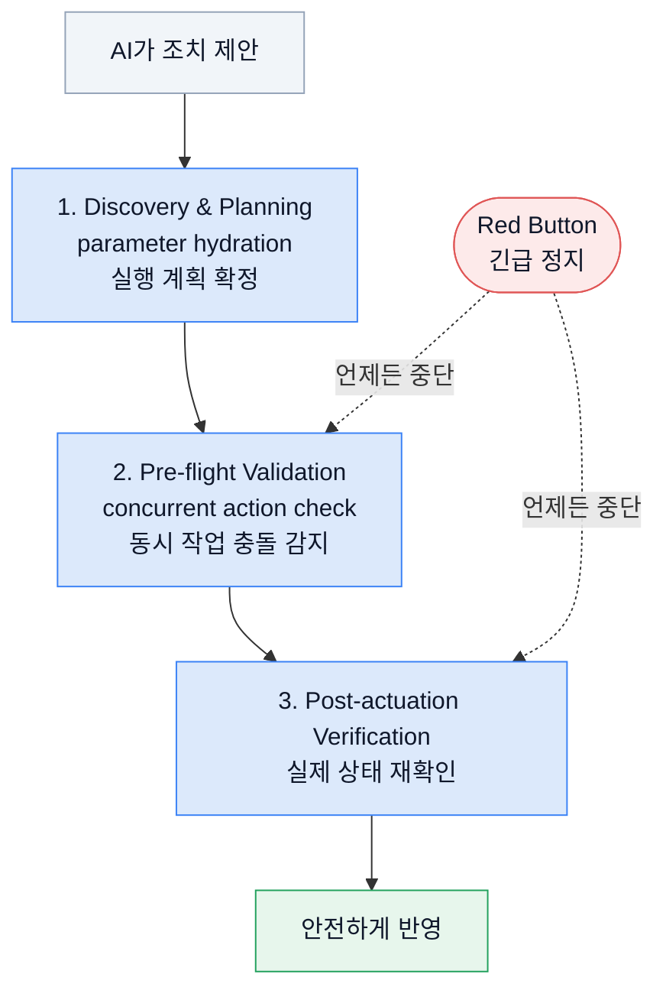

운영에서 가장 비싼 것은 다운타임이 아니라 잘못된 자동화다. 사람이 실수하면 한 번이지만, 자동화가 실수하면 실수를 자동화한다.

Google SRE가 최근 공개한 [AI Engineering for Reliable Operations](https://sre.google/resources/practices-and-processes/ai-engineering-reliable-operations/)를 읽으면서 계속 밑줄을 친 대목이 이거였다. AI가 코드 생성을 몇 배씩 빠르게 만드는 지금, "AI에게 운영을 맡길 것이냐"는 이미 정해진 질문이다. 진짜 질문은 **어떻게 맡겨야 사고가 안 나느냐**다.

이 글에서는 그 문서의 핵심 프레임워크: 자율성 단계 모델, 안전 가드레일, 평가 파이프라인, 실제 배포 시스템을 정리한다. 그리고 이게 왜 우리 같은 인프라 팀의 운영 규칙과 그대로 겹치는지까지 짚는다.

## 진짜 문제는 AI의 성능이 아니다

가장 흔한 오해부터 걷어내자. AI 운영의 어려움은 "AI가 충분히 똑똑한가"가 아니다. 문제는 **AI가 틀렸을 때 그 틀림이 프로덕션에 얼마나 번지느냐**, 즉 blast radius다.

문서가 던지는 명제는 단호하다.

> Safety Through Architecture, Not Faith.
> 안전은 신뢰가 아니라 구조에서 나온다.

AI가 잘 행동하길 바라는 것(faith)은 전략이 아니다. AI가 잘못 행동해도 큰 사고로 이어지지 않는 결정론적 통제(deterministic control)를 먼저 만드는 것이 전략이다. 이 관점 전환이 문서 전체를 관통한다.

그 통제는 세 개의 기둥 위에 선다.

| 기둥 | 의미 | 왜 필요한가 |
| --- | --- | --- |
| **투명성(Transparency)** | AI의 판단 과정(Chain of Thought)을 전부 관측 가능하게 로깅 | 사람이 감사(audit)하고 되돌릴 수 있어야 하니까 |
| **실시간 위험 평가(Real-time Risk Evaluation)** | 프로덕션 액션 직전에 상황 맥락으로 위험도 평가 | 같은 명령도 상황에 따라 위험이 다르니까 |
| **점진적 권한 부여(Progressive Authorization)** | 증명된 신뢰도만큼만 자율성 확대 | 처음부터 큰 권한을 주면 blast radius가 커지니까 |

## 자율성은 레벨이 있다: L0에서 L4까지

이 문서의 핵심 프레임워크는 **SRE Autonomy Levels**다. 자율주행 레벨을 그대로 빌려온 5단계 성숙도 모델이다.

여기서 중요한 건 단계 자체가 아니라 **승급 조건**이다. 시간이 지났다고 L1이 L2가 되지 않는다. 오직 **Golden Data**(사람이 검증한 인시던트 해결 기록)를 상대로 지속적 성공(sustained success)을 입증했을 때만 다음 단계로 올라간다.

이게 왜 중요한가. 전통적 rollout은 고정 soak time(일정 시간 관찰 후 통과) 방식을 쓴다. 하지만 자율성 승급을 시간 기반으로 두면 실제 신뢰도와 무관하게 권한이 올라간다. 문서는 이 gate를 엄격히(strict) 두어, **신뢰의 근거가 데이터로 남고 감사 가능하게** 만든다.

**핵심:** 자율성은 부여하는 게 아니라 획득하는 것이다.

## AI를 믿기 전에, 매일 밤 시험을 본다

AI가 내놓은 답을 그냥 신뢰하지 않는다. 문서는 데이터를 품질별로 3등급으로 나눈다.

| 등급 | 라벨링 방식 | 신뢰도 |
| --- | --- | --- |
| **Bronze** | 기계가 자동 라벨링한 인시던트 | 양 많음, 정확도 보통 |
| **Silver** | 프로그램이 생성 + 신뢰도 보정(calibrated confidence) | 중간 |
| **Gold** | 전문가가 직접 검증한 해결 기록 | 최상 (승급 기준) |

그리고 매일 밤 **Nightly Evals**를 돌린다. 두 채점 방식을 결합한다. 하나는 **LLM-as-Judge**로 다른 LLM이 심판이 되어 답의 품질을 스코어링하고, 또 하나는 **deterministic validation**으로 기계적으로 정답 일치를 검증한다.

특히 영리한 부분은 Golden Data 수집 방식이다. 사람이 따로 시간 내서 라벨링하는 게 아니라, **평상시 인시던트 대응 워크플로우에서 자연스럽게 Golden label을 기여**한다. 그래서 annotation fatigue(라벨링 피로)에 빠지지 않는다.

시스템은 계속 바뀌는데 AI가 옛 지식에 머물면 판단이 어긋난다(drift). 매일 실제 인시던트로 시험을 보는 것은 그 drift를 지속적으로 잡아내기 위한 장치다.

## 실제로 돌아가는 시스템들

이론만 있는 문서가 아니다. 인시던트 생애주기 단계마다 실제 AI 시스템이 배포되어 있고, 문서는 성과 수치까지 공개한다.

| 시스템 | 역할 | 성과 |
| --- | --- | --- |
| **Detectr** | SNS·지원 티켓·포럼 등 비정형 사용자 피드백 집계로 metric 기반 모니터링이 놓친 outage 탐지 | 누적 수백 시간의 impact 절감 |
| **InvD** (AI Alert & Investigation Dashboard) | 알림을 약 2분 내 모니터링·로그·변경·의존성 그래프로 enrich | **MTTM(Mean Time to Mitigate) 약 44% 감소** |
| **Incident Hypothesis** | RAG로 컨텍스트 종합해 근본 원인 후보 + 검증 단계 제시 | L1 지원만으로 **MTTM 10% 감소** |
| **AI Operator** | L2~L3 자율 에이전트. 병렬 조사 → 가설 수립 → 조치 제안/escalate | 수천 건 인시던트 처리, 지속 평가 피드백 루프 |
| **Antigravity CLI** | Gemini 기반 자연어 인터페이스. 표준화된 Skills로 조회·분석·조치 제안 | 프로덕션 조작을 안전 가이드라인이 담긴 모듈로 수행 |

**주의:** MTTM 44%(InvD)와 10%(Incident Hypothesis)는 서로 다른 시스템의 성과다. 44%는 알림 enrich, 10%는 원인 가설 제시가 낸 결과다. 헷갈리기 쉬운 지점이라 명시해 둔다.

## 핵심: AI 혼자서는 사고를 못 내게 만든다

문서에서 가장 중요한 부분은 여기다. 자율성을 주되, **개별 에이전트를 신뢰 대상에서 제외**한다. 이걸 네 가지 가드레일로 강제한다. 문서는 이를 Safety Trifecta라 부른다.

| 가드레일 | 내용 |
| --- | --- |
| **No Ambient Access** | 에이전트는 별도 identity + least-privilege + on-demand credential. 상시 접근권 없음 |
| **Circuit Breakers** | 에이전트별 rate limit + 자동 중단(automated interruption) |
| **Mandatory Dry-Run** | 프로덕션 변경 API는 결과 예측(consequence prediction) 지원 필수 |
| **Zero-Trust Actuation** | 에이전트는 control plane 경유로만 실행. 단독으로 outage를 낼 수 없는 구조 |

이 Zero-Trust Actuation을 실제로 담당하는 control plane이 **Actus**(Mitigation Safety Verification Agent)다. 모든 자율 변경을 세 단계로 검증해 통과시킨다.

핵심은 2단계의 **concurrent action check**다. 같은 자원에 다른 에이전트나 사람의 작업이 동시에 진행 중이면 충돌을 감지해 막는다. 그리고 어느 단계에서든 **Red Button**으로 emergency stop이 가능하다.

이 구조 덕분에 개별 에이전트는 신뢰 대상이 아니어도 된다. 실제 안전은 control plane이 보증한다. **에이전트를 믿는 게 아니라, 에이전트가 사고를 못 내게 만든다.** 이 문장이 문서 전체의 요약이다.

## 사람의 대응이 AI의 교재가 된다

한 가지 더. **IRM-Analyzer**라는 시스템은 인시던트 때 오간 채팅, 인시던트 노트, 실행된 명령을 NLP로 파싱해 **사람의 대응 timeline(trajectory)을 자동 재구성**한다.

이렇게 복원된 trajectory는 두 곳에 쓰인다: 에이전트 학습과 에이전트 평가다. 사람의 노하우가 AI를 더 똑똑하게 만들고, 그 AI를 다시 사람의 기준으로 평가하는 feedback loop가 돈다.

**시사점:** 잘 정리된 인시던트 기록은 문서가 아니라 자산이다. 운영 기억을 체계화하는 것 자체가 AI 신뢰성의 토대다.

## 앞으로 이렇게 하자는 다섯 가지

문서는 미래 권고 다섯 가지로 마무리한다.

1. **사람은 operator에서 architect로.** 직접 조치하기보다 가드레일을 정의하고, Golden Data를 큐레이션하고, 에이전트를 거버넌스한다.
2. **코드 리뷰를 속도에 맞게.** 코드가 몇 배로 쏟아지면 line-by-line 리뷰는 불가능하다. 대신 구현 전 **Design Intent와 Policy를 리뷰**하고, 코드 생성 에이전트와 테스트 에이전트를 분리(Independent Harness)해 상호 견제한다.
3. **Adaptive Progressive Rollout.** 고정 soak time 대신 머신 속도의 연속 프로덕션 검증으로 이상을 downstream 전파 전에 잡는다.
4. **Intervening PR Problem 해결.** 빠른 연속 배포에서 binary rollback은 그 사이 들어간 다른 버그 수정까지 지운다. 그래서 **feature flag로 즉시 비활성화**하고, **AI-Assisted Fix-Forward**로 targeted 패치를 한다.
5. **MCP 표준화.** 도구 역량을 Model Context Protocol이라는 open spec으로 노출해, 에이전트가 프로덕션 조작을 동적으로 discover하고 안전하게 invoke하게 한다.

## 우리 환경에 대입하면

이 문서를 인프라 운영자 관점으로 읽으면 놀랍게도 낯설지 않다. 우리가 이미 지키는(또는 지켜야 하는) 규칙과 거의 1:1로 대응한다.

| Google SRE 개념 | 대응되는 운영 원칙 |
| --- | --- |
| No Ambient Access / least-privilege | bounded read, credential 값 미출력, 최소 권한 |
| L1~L2 사람 승인 단계 | external create/update/delete 승인 게이트 |
| Transparency / Chain of Thought | evidence label(`Verified`/`Documented`/`Drift suspected`) |
| Pre-flight / Post-actuation 검증 | 변경 전 risk summary, 변경 후 bounded read 검증 |
| Golden Data / operational memory | 인시던트 조사 노트, worklog, decision record |
| Mandatory Dry-Run | `terraform plan`, `kubectl --dry-run` 미리보기 |

특히 **Mandatory Dry-Run**은 다시 밑줄 그을 만하다. `terraform plan`을 apply 전에 반드시 읽는 습관, `kubectl apply --dry-run=server`로 결과를 먼저 보는 습관: 이게 문서가 말하는 consequence prediction의 로컬 버전이다. 우리는 이미 이걸 하고 있지만, "승인 요청에 항상 dry-run 결과를 포함한다"는 규칙으로 명시화하면 더 단단해진다.

## 한계와 솔직한 감상

문서 자체가 Google 스케일의 시스템(수천 건 인시던트, 전용 control plane, 매일 밤 평가 인프라)을 전제한다. Detectr, InvD, Actus 같은 시스템을 그대로 복제하는 건 대부분의 조직에 비현실적이다. 여기서 가져갈 것은 **구현이 아니라 원칙**이다.

- 자율성은 단계적으로, 증명된 만큼만.
- 에이전트를 신뢰하지 말고, 에이전트가 사고를 못 내는 control plane을 신뢰하라.
- 프로덕션 변경 전엔 무조건 dry-run.
- 사람의 대응 기록을 자산으로 축적하라.

작은 팀이라면 Actus 대신 "external 변경은 승인 게이트를 반드시 통과"라는 규칙 한 줄로 Zero-Trust Actuation의 90%를 얻을 수 있다. 도구가 없어서 못 하는 게 아니라, 규칙이 없어서 안 하는 경우가 훨씬 많다.

## 정리

> AI에게 운영을 맡기는 것의 본질은 "AI를 얼마나 믿느냐"가 아니라 "AI가 틀려도 안전한 구조를 얼마나 잘 만들었느냐"다.

Google SRE의 결론은 이분법을 모두 거부한다. 사람이 AI에 대체되는 미래도, AI가 있으면 좋은 선택 도구인 현재도 아니다. **수학적으로 검증된 안전 경계 안에서 사람과 AI가 협업하는 collaborative autonomy**다.

그리고 그 경계를 만드는 사람이 바로 SRE고 인프라 엔지니어다. 조치를 실행하는 손에서, 안전을 설계하는 머리로. 이게 이 문서가 그리는 우리 직무의 다음 모습이다.

## 참고 자료

- [Google SRE: AI Engineering for Reliable Operations](https://sre.google/resources/practices-and-processes/ai-engineering-reliable-operations/)
- [Model Context Protocol (MCP) 공식 문서](https://modelcontextprotocol.io/)
- Google SRE Book, *Site Reliability Engineering* (자율성/toil 개념의 원류)
