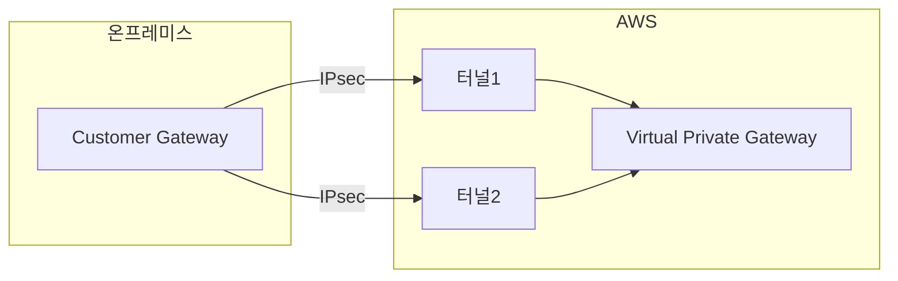

Site-to-Site VPN은 단순한 터널이 아니다. IKE/IPsec 협상, Initiator/Responder 역할, 터널 이중화까지 고려할 게 많다. 특히 AWS는 항상 Responder로 동작한다는 점을 모르면 연결 자체가 안 된다.

AWS Site-to-Site VPN을 개발망에 구성하면서 알게 된 핵심 개념과 구성 시 체크해야 할 항목들을 정리했다.

## 기본 구조

AWS Site-to-Site VPN은 **1개의 VPN Connection = 2개의 터널**을 기본 제공한다.

- 두 터널은 서로 다른 Outside IP, Inside IP, PSK 값을 가짐
- **AWS는 항상 Responder(수동)**, 온프레미스 라우터가 Initiator(능동) 역할
- 8시간 이상 트래픽이 없으면 세션이 내려갈 수 있으며, 이 경우 온프레미스에서 재연결 요청 필요



## 터널 동작 모드

### Active/Passive (권장)

- 터널1을 주 경로로 사용
- 터널1 장애 시 터널2로 자동 전환

### Active/Active (ECMP)

- 동일 Metric 설정 시 두 터널로 트래픽 분산
- 비대칭 라우팅 문제 가능성 있음

## IKE/IPsec 파라미터

### Phase1 (IKE)

| 항목 | 값 |
|------|-----|
| Version | IKEv1 또는 IKEv2 |
| Encryption | AES128 |
| Hash | SHA1 |
| DH Group | 2 |
| SA Lifetime | 28800초 (8시간) |
| Mode | Main |
| DPD | 10초 / 3회 재시도 |

### Phase2 (IPsec)

| 항목 | 값 |
|------|-----|
| Protocol | ESP |
| Encryption | AES128 |
| Hash | SHA1 |
| SA Lifetime | 3600초 (1시간) |
| PFS | DH Group2 |
| Mode | Tunnel |

## 구성 시 유의사항

1. **AWS는 Responder 전용** - 온프레미스에서 Initiator Mode 설정 필수
2. **트래픽 셀렉터** - Local/Remote Subnet이 AWS 설정과 일치해야 함
3. **라우팅 모드** - Static 또는 BGP 선택 가능
4. **이중화** - 운영망에서는 두 터널 모두 설정 권장

## AWS CLI로 상태 확인

```bash
aws ec2 describe-vpn-connections \
  --vpn-connection-ids vpn-xxxxxxxx \
  --query 'VpnConnections[].VgwTelemetry[].[OutsideIpAddress,Status,StatusMessage]' \
  --output table
```

## 운영망 체크리스트

- [ ] 두 터널 모두 설정 완료
- [ ] 터널 상태 모니터링 구성 (CloudWatch)
- [ ] DPD/Keepalive 설정 확인
- [ ] Phase1/Phase2 Lifetime 양쪽 일치
- [ ] 장애 시 온프레미스 재연결 절차 문서화
