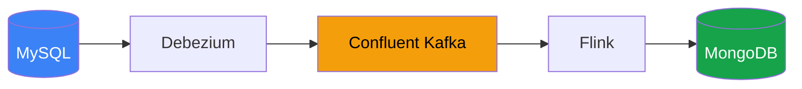
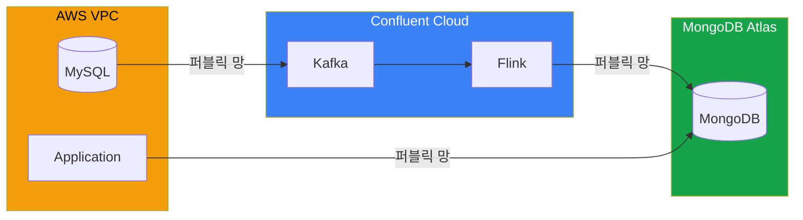
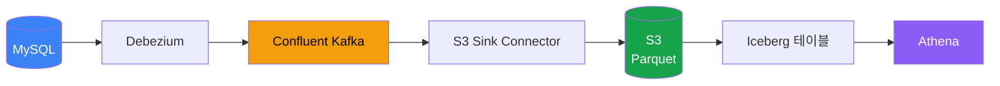

무거운 조인 쿼리가 문제였다. 8개 테이블을 조인하는 쿼리가 프론트엔드 응답 시간을 늘리고 있었다. CQRS 패턴으로 읽기 전용 저장소를 분리하면 해결될 것 같았다.

Confluent Cloud + Flink로 CDC 파이프라인을 PoC 해봤다.

## 아키텍처

```
MySQL → Debezium → Confluent Kafka → Flink → MongoDB
```



- **Debezium**: MySQL binlog를 캡처해서 Kafka로 전송
- **Confluent Kafka**: CDC 이벤트 스트리밍
- **Flink**: 8개 테이블 증분 조인
- **MongoDB**: 조인된 결과 저장 (읽기 전용)

## PoC 결과

### CDC 단일 테이블

| 구간 | 지연 시간 |
|------|----------|
| Debezium capture | 5 ms |
| 네트워크 (AWS → Confluent) | 170 ms |
| 네트워크 (Confluent → MongoDB) | 212 ms |
| **End-to-End** | **383 ms** |

단일 테이블 기준으로 MySQL commit → MongoDB write까지 약 **383ms**.

Confluent 엔지니어 평가: "서비스 운영에 충분히 양호한 성능"

### Flink 8개 테이블 조인

8개 테이블을 CDC 이벤트 기반으로 증분 조인했다:

```
lookup_contract_form, contract_counsel, selected_product,
user, department, customer, contract_payback, contract_relation_reception
```

**지연 시간 측정 결과 (10회):**

| 항목 | 값 |
|------|------|
| 최소 | 1,587 ms |
| 최대 | 5,848 ms |
| 평균 | **3,748 ms** |
| 중앙값 | 3,479 ms |

Confluent 엔지니어 확인: AVRO 포맷 사용 시 **5~10초**로 증가.

데이터 정합성은 정상이었다. MongoDB에서 조회 시 운영 DB와 거의 동일한 최신 상태를 확인할 수 있었다.

## 문제점

### 1. 네트워크 지연



Confluent Cloud를 사용하다 보니 **퍼블릭 망**을 통해야 했다. 전체 383ms 중 네트워크 구간이 382ms였다:

- MySQL → Debezium: 5ms (로컬)
- Debezium → Kafka: 170ms (퍼블릭)
- Kafka → MongoDB: 212ms (퍼블릭)

동일 리전 VPC 피어링이나 Private Link를 적용하면 **60ms 내외**까지 줄일 수 있다고 한다. 하지만 추가 비용과 설정 복잡도가 있다.

### 2. 운영 복잡도

- Debezium Connector 관리
- Kafka 토픽/파티션 설계
- Flink Job 모니터링 (State 크기, TTL, 체크포인트)
- MongoDB 스키마 관리
- **PK 정의 필수**: 불완전하면 조인 정확도가 깨짐

컴포넌트가 많아서 장애 포인트도 많다. 전체 체인(Debezium → Kafka → Flink → MongoDB)의 운영 복잡도가 높다.

### 3. 비용

Confluent Cloud는 **실행 시간 기준 과금**이다.

| 항목 | 단가 | PoC 비용 (12일) |
|------|------|----------------|
| Kafka CKU | $0.915/h | $261.69 (~$21.96/일) |
| Flink CFU | $0.256/h | $72.77 |
| Debezium Connector | $0.61/h | $173.85 |
| MongoDB Sink | $0.366/h | $104.68 |
| S3 Sink | $0.042/h | $10.89 |

**비용 증가 요인:**
- 테이블 수만큼 파티션 필요 → CKU 증가
- Flink SQL이 RUNNING 상태면 트래픽 없어도 과금 (Pause 없음, Stop만 가능)
- 커넥터도 실행 시간 기준 과금

PoC 12일에 약 **$620** 나왔다. 프로덕션이면 월 $1,500+ 예상.

## 결론

| 항목 | 평가 |
|------|------|
| CDC 단일 테이블 | 양호 (383ms) |
| Flink 8테이블 조인 | 평균 3.7초, AVRO 시 5~10초 |
| 프론트엔드 CQRS | **부적합** |
| 분석용 Lakehouse | **적합** |

**프론트엔드에서 실시간 응답이 필요한 CQRS 용도로는 부적합**했다. 평균 3.7초, 최대 6초 지연은 사용자 경험에 영향을 준다.

하지만 **분석용 데이터 파이프라인**으로는 충분히 쓸 만하다.

## 분석용으로는 적합: Lakehouse

같은 PoC에서 Lakehouse 구성도 검증했다.



**구성:**
- S3 Sink Connector: CDC 이벤트를 Parquet로 S3 적재
- flush.size 설정 (예: 1000건)으로 배치 크기 조절
- Lambda/Crontab으로 Iceberg 테이블에 MERGE

**결과:**
- 준실시간 데이터 반영 확인
- Athena에서 SQL로 최신 상태 쿼리 가능
- 운영 DB 덤프 방식 대비 부하 감소

**분석팀이 운영 DB를 주기적으로 덤프하던 방식**을 대체할 수 있다. 실시간성이 필요 없는 분석 용도로는 이 구성이 적합하다.

## 대안

프론트엔드 CQRS가 목적이라면:

1. **애플리케이션 레벨 동기화**: 쓰기 시점에 직접 MongoDB 업데이트
2. **캐시 레이어**: Redis로 자주 조회되는 조인 결과 캐싱
3. **Materialized View**: DB 레벨에서 미리 조인된 뷰 생성

CDC + Flink는 **실시간 분석**, **이벤트 소싱**, **데이터 레이크 구축** 같은 용도에 더 적합해 보인다.
