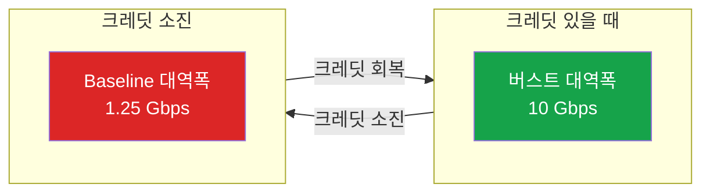

EC2 인스턴스의 CPU 크레딧은 많이 알려져 있다. T 인스턴스가 baseline 이상으로 버스트할 때 크레딧을 소모하고, 크레딧이 바닥나면 쓰로틀링된다. 그런데 **네트워크에도 크레딧 시스템이 있다**는 건 덜 알려져 있다.

더 중요한 건, CPU 크레딧은 Unlimited 모드로 쓰로틀링을 피할 수 있지만, **네트워크 크레딧에는 Unlimited가 없다**.

## 크레딧 시스템 비교

| 항목 | CPU 크레딧 | 네트워크 크레딧 |
|------|-----------|----------------|
| 적용 대상 | T 인스턴스만 (T2, T3, T4g) | "up to X Gbps" 표기된 대부분의 인스턴스 |
| Unlimited 모드 | **있음** (추가 비용으로 쓰로틀링 방지) | **없음** |
| 크레딧 바닥나면 | baseline으로 제한 | baseline으로 제한 |
| 해결책 | Unlimited 켜기 | **인스턴스 업그레이드** |

## "up to X Gbps"의 의미

EC2 콘솔에서 인스턴스 타입을 보면 네트워크 성능이 이렇게 표시된다:

| 인스턴스 | 네트워크 성능 | 의미 |
|---------|-------------|------|
| t3.micro | Up to 5 Gbps | baseline은 더 낮음, 5 Gbps는 버스트 |
| m5.xlarge | Up to 10 Gbps | baseline 1.25 Gbps, 버스트 10 Gbps |
| m5.4xlarge | Up to 10 Gbps | baseline 5 Gbps, 버스트 10 Gbps |
| m5.8xlarge | 10 Gbps | **고정** (크레딧 시스템 없음) |

**"Up to"가 붙어있으면 크레딧 시스템이 적용된다.**



## CPU vs 네트워크: 쓰로틀링 대응

### CPU: Unlimited 모드로 해결

```
T3 인스턴스, CPU 크레딧 바닥
→ Unlimited 모드 켜기
→ 추가 비용 발생하지만 쓰로틀링 없음
```

### 네트워크: 인스턴스 업그레이드만 답

```
m5.xlarge, 네트워크 크레딧 바닥
→ Unlimited 같은 옵션 없음
→ m5.2xlarge로 업그레이드 (baseline 높아짐)
   또는 m5.8xlarge로 (크레딧 시스템 자체가 없음)
```

이게 네트워크가 특이한 이유다. CPU는 돈으로 해결할 수 있지만, 네트워크는 인스턴스 자체를 키워야 한다.

## 모니터링

### CPU 크레딧

CloudWatch에서 쉽게 확인 가능:
- `CPUCreditBalance`: 남은 크레딧
- `CPUSurplusCreditBalance`: Unlimited 모드에서 빌린 크레딧

### 네트워크 크레딧

**크레딧 잔량 메트릭이 없다.** 대신 쓰로틀링 발생 여부만 확인 가능:

| 메트릭 | 의미 |
|--------|------|
| `bw_in_allowance_exceeded` | 인바운드 대역폭 초과 횟수 |
| `bw_out_allowance_exceeded` | 아웃바운드 대역폭 초과 횟수 |
| `pps_allowance_exceeded` | 초당 패킷 수 초과 횟수 |

이 메트릭은 ENA(Elastic Network Adapter) 드라이버에서 제공하며, CloudWatch Agent 설정이 필요하다.

```bash
# 인스턴스에서 직접 확인
ethtool -S eth0 | grep allowance_exceeded
```

## baseline 대역폭 확인 방법

AWS 콘솔에는 baseline 대역폭이 안 나온다. CLI로 확인해야 한다:

```bash
aws ec2 describe-instance-types \
  --instance-types m5.xlarge \
  --query 'InstanceTypes[].NetworkInfo.NetworkCards[].BaselineBandwidthInGbps'
```

## 정리

| 상황 | CPU | 네트워크 |
|------|-----|---------|
| 크레딧 부족 | Unlimited 켜기 | 인스턴스 업그레이드 |
| 모니터링 | CloudWatch 기본 메트릭 | ENA 메트릭 (별도 설정) |
| 크레딧 잔량 확인 | 가능 | **불가능** |

**핵심:**
- "Up to X Gbps"는 버스트 성능이고, baseline은 더 낮다
- 네트워크 쓰로틀링은 Unlimited로 해결 안 됨
- `bw_*_allowance_exceeded` 메트릭이 올라가면 인스턴스 업그레이드 고려

## 참고

- [AWS 공식 문서 - EC2 네트워크 대역폭](https://docs.aws.amazon.com/AWSEC2/latest/UserGuide/ec2-instance-network-bandwidth.html)
- [AWS 공식 문서 - 버스트 인스턴스 크레딧](https://docs.aws.amazon.com/AWSEC2/latest/UserGuide/burstable-credits-baseline-concepts.html)
- [cloudonaut - EC2 Network Performance Cheat Sheet](https://cloudonaut.io/ec2-network-performance-cheat-sheet/)
- [Pinterest Engineering - Handling Network Throttling](https://medium.com/@Pinterest_Engineering/handling-network-throttling-with-aws-ec2-at-pinterest-fda0efc21083)
