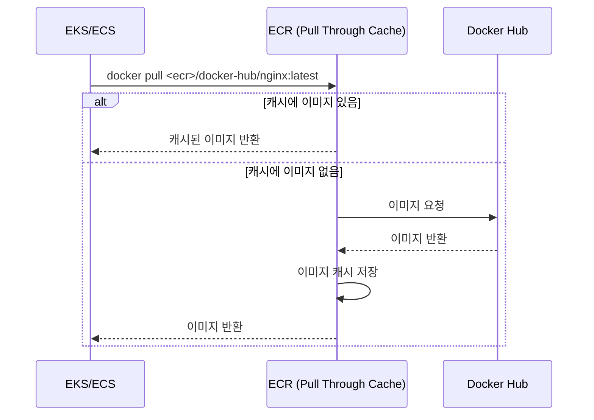

외부 레지스트리에 의존하는 것은 리스크다. 내가 통제할 수 없는 곳에서 이미지가 사라지면, 우리 배포가 멈춘다.

Docker Hub의 이미지가 삭제되어 배포가 실패한 적이 있다. 그때서야 ECR Pull Through Cache 설정이 잘못되어 있다는 걸 알았다. 제대로 설정하고 나니 외부 레지스트리 의존성을 완전히 끊을 수 있었다.

## 문제 상황

배포 파이프라인이 갑자기 실패했다. 에러 메시지를 보니 베이스 이미지를 못 찾는다고 했다.

```
Error: pull access denied for some-image, repository does not exist or may require 'docker login'
```

Docker Hub에서 해당 이미지가 삭제된 것이다. 우리가 통제할 수 없는 외부 요인으로 배포가 막혔다.

## Pull Through Cache가 필요한 케이스

| 상황 | 문제 | Pull Through Cache 효과 |
|------|------|------------------------|
| 이미지 삭제 | 외부 레지스트리에서 이미지 삭제 시 배포 실패 | 캐시된 이미지로 계속 사용 가능 |
| Rate Limit | Docker Hub 무료 플랜 100회/6시간 제한 | ECR에서 가져오므로 제한 없음 |
| 외부 장애 | Docker Hub 장애 시 이미지 pull 불가 | 캐시된 이미지 사용 가능 |
| 네트워크 지연 | 해외 레지스트리에서 다운로드 느림 | 같은 리전 ECR에서 빠르게 다운로드 |

특히 **Docker Hub Rate Limit**은 CI/CD 파이프라인에서 자주 문제가 된다. 빌드가 몰리면 금방 100회를 넘기고, 이후 빌드가 전부 실패한다.

## 동작 원리

Pull Through Cache는 프록시처럼 동작한다.



1. 클라이언트가 ECR에 이미지 요청
2. ECR에 캐시가 있으면 바로 반환
3. 캐시가 없으면 원본 레지스트리에서 가져와서 캐시 후 반환

한 번 캐시되면 원본 레지스트리에서 이미지가 삭제되어도 ECR에서 계속 사용할 수 있다.

## Terraform 설정

### 1. Pull Through Cache Rule 생성

```hcl
# Docker Hub용 Pull Through Cache Rule
resource "aws_ecr_pull_through_cache_rule" "docker_hub" {
  ecr_repository_prefix = "docker-hub"
  upstream_registry_url = "registry-1.docker.io"

  # Docker Hub 인증 (선택사항, rate limit 완화)
  credential_arn = aws_secretsmanager_secret.docker_hub_credentials.arn
}

# Quay.io용 Pull Through Cache Rule
resource "aws_ecr_pull_through_cache_rule" "quay" {
  ecr_repository_prefix = "quay"
  upstream_registry_url = "quay.io"
}

# GitHub Container Registry용
resource "aws_ecr_pull_through_cache_rule" "ghcr" {
  ecr_repository_prefix = "ghcr"
  upstream_registry_url = "ghcr.io"
}
```

### 2. Docker Hub 인증 정보 (선택사항)

Docker Hub 유료 플랜이 있다면 인증 정보를 추가하여 rate limit을 더 완화할 수 있다.

```hcl
resource "aws_secretsmanager_secret" "docker_hub_credentials" {
  name = "ecr-pullthroughcache/docker-hub"
}

resource "aws_secretsmanager_secret_version" "docker_hub_credentials" {
  secret_id = aws_secretsmanager_secret.docker_hub_credentials.id
  secret_string = jsonencode({
    username    = var.docker_hub_username
    accessToken = var.docker_hub_token
  })
}
```

### 3. ECR 레지스트리 정책 (필요시)

Pull Through Cache로 생성되는 리포지토리에 대한 권한 설정이 필요할 수 있다.

```hcl
resource "aws_ecr_registry_policy" "pull_through_cache" {
  policy = jsonencode({
    Version = "2012-10-17"
    Statement = [
      {
        Sid       = "AllowPullThroughCache"
        Effect    = "Allow"
        Principal = {
          AWS = "arn:aws:iam::${data.aws_caller_identity.current.account_id}:root"
        }
        Action = [
          "ecr:CreateRepository",
          "ecr:BatchImportUpstreamImage"
        ]
        Resource  = "*"
      }
    ]
  })
}
```

## 사용 방법

설정 후에는 이미지 경로만 변경하면 된다.

```yaml
# 기존
image: nginx:1.25

# Pull Through Cache 적용
image: 123456789012.dkr.ecr.ap-northeast-2.amazonaws.com/docker-hub/nginx:1.25
```

### Kubernetes 예시

```yaml
apiVersion: apps/v1
kind: Deployment
metadata:
  name: nginx
spec:
  template:
    spec:
      containers:
        - name: nginx
          # ECR Pull Through Cache 경로
          image: 123456789012.dkr.ecr.ap-northeast-2.amazonaws.com/docker-hub/library/nginx:1.25
```

공식 이미지는 `library/` prefix가 붙는다. `nginx` → `library/nginx`

### Dockerfile 예시

```dockerfile
# 기존
FROM python:3.11-slim

# Pull Through Cache 적용
FROM 123456789012.dkr.ecr.ap-northeast-2.amazonaws.com/docker-hub/library/python:3.11-slim
```

## 지원하는 외부 레지스트리

| 레지스트리 | upstream_registry_url |
|-----------|----------------------|
| Docker Hub | registry-1.docker.io |
| Amazon ECR Public | public.ecr.aws |
| Quay | quay.io |
| GitHub Container Registry | ghcr.io |
| Kubernetes Registry | registry.k8s.io |

## 주의사항

### 이미지 경로 변경

기존 Docker Hub 경로를 ECR 경로로 변경해야 한다. Helm chart나 Dockerfile에서 이미지 경로를 일괄 변경하는 작업이 필요하다.

### 첫 Pull 시 지연

캐시에 없는 이미지를 처음 가져올 때는 원본 레지스트리에서 다운로드하므로 시간이 걸린다. 이후부터는 ECR에서 바로 가져온다.

### 스토리지 비용

캐시된 이미지는 ECR에 저장되므로 스토리지 비용이 발생한다. Lifecycle Policy로 오래된 이미지를 정리하면 비용을 관리할 수 있다.

## 정리

Pull Through Cache의 핵심 가치는 **외부 의존성 제거**다.

1. 외부 레지스트리 장애/삭제로부터 보호
2. Rate Limit 회피
3. 이미지 다운로드 속도 향상

한 번 설정해두면 신경 쓸 일이 없다. 외부 이미지 때문에 배포가 실패하는 상황을 미리 방지할 수 있다.
