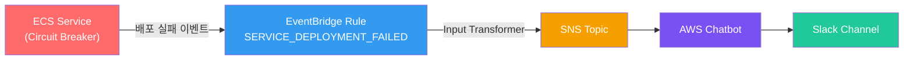
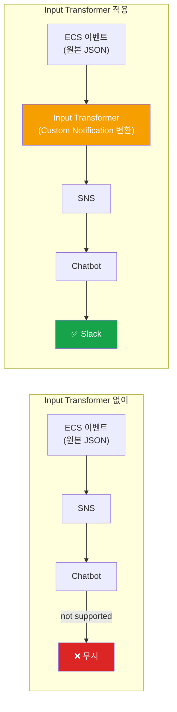
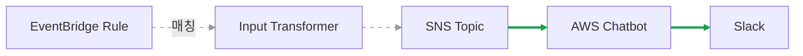
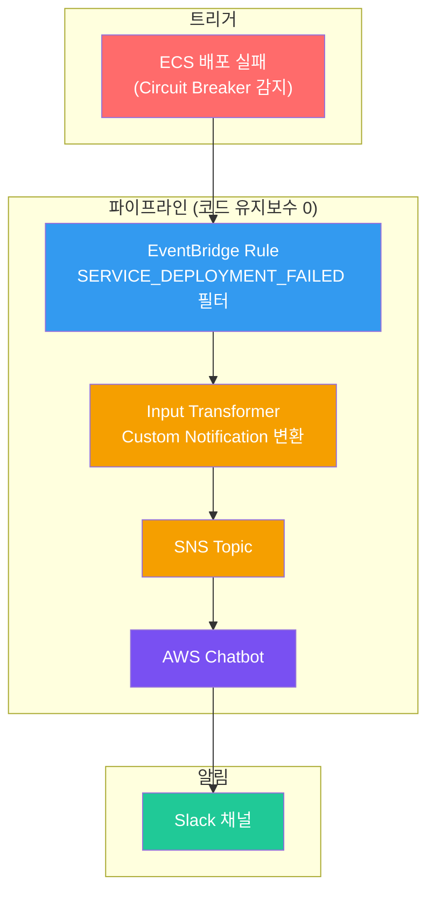

자동 복구가 조용히 성공하면, 근본 원인은 조용히 남는다.

ECS에는 Circuit Breaker라는 배포 안전장치가 있다. 배포가 실패하면 자동으로 이전 버전으로 롤백한다. 문제는 이 롤백이 조용하다는 것이다. 배포한 사람도, 운영하는 사람도 실패 사실을 모른 채 넘어갈 수 있다. Lambda 없이, AWS 네이티브 서비스만으로 배포 실패 알림을 Slack에 보내는 과정을 공유한다.

## 왜 Datadog이 아닌가

처음에는 Datadog 모니터로 해결하려 했다. 하지만 ECS 배포 실패를 감지하기에는 부적합했다.

| 접근 방식 | 문제 |
|----------|------|
| ECS 서비스 메트릭 모니터링 | ECS 서비스 레벨 메트릭을 수집하고 있지 않았다 |
| ECS DIE 이벤트 감지 | 정상 배포(rolling update)에서도 구 태스크 종료 시 발생한다 |
| Running Task Count 감소 | Rolling update는 새 태스크를 먼저 띄우므로 count가 유지된다 |

결국 배포 **실패**만 정확히 잡으려면, ECS가 직접 발행하는 `SERVICE_DEPLOYMENT_FAILED` 이벤트를 잡아야 한다. 이건 EventBridge의 영역이다.

## 설계: Lambda 없는 아키텍처

목표는 단순했다. **코드 유지보수가 0인 알림 파이프라인**.

Lambda를 쓰면 런타임 관리, 코드 배포, 로그 모니터링이 따라온다. Slack Webhook을 쓰면 URL 관리, 인증 갱신이 따라온다. AWS Chatbot은 SNS 메시지를 받아서 Slack 채널로 직접 전달하는 관리형 서비스다. EventBridge → SNS → AWS Chatbot이면 코드 한 줄 없이 끝난다.



## 사전 조건: Circuit Breaker 활성화

ECS 서비스에 Circuit Breaker가 활성화되어 있어야 `SERVICE_DEPLOYMENT_FAILED` 이벤트가 발생한다. ECS 서비스 정의에서 확인한다.

```hcl
deployment_circuit_breaker {
  enable   = true
  rollback = true
}
```

`enable = true`이면 된다. `rollback = true`는 실패 시 자동 롤백까지 해주는 옵션이다.

### Circuit Breaker가 감지하는 실패란?

배포 승인이나 정책 검사 같은 것이 아니다. **배포가 실행된 후, 새 컨테이너가 실제로 정상 기동하지 못하는 상황**을 감지한다. 런타임 레벨의 안전장치다.

```
배포 승인/정책 통과  →  태스크 배포 시작  →  여기서 실패하면 Circuit Breaker 발동
                                            ↑
                                       이 구간의 문제
```

새 태스크가 RUNNING 상태에 안착하지 못하면 실패로 카운트된다. 흔한 실패 원인은 다음과 같다.

| 실패 원인 | 예시 |
|----------|------|
| 컨테이너 시작 실패 | 이미지 pull 실패, entrypoint 에러, OOM |
| 컨테이너 즉시 종료 | 시작 직후 crash (exit code 1), 환경변수 누락으로 DB 연결 실패 |
| 헬스체크 실패 | ELB 또는 컨테이너 health check 미통과 |

배포 중 실패한 태스크 수가 내부 임계값을 넘으면 `SERVICE_DEPLOYMENT_FAILED` 이벤트가 발생하고, `rollback = true`인 경우 이전 태스크 정의로 자동 롤백된다.

## 사전 조건: AWS Chatbot ↔ Slack 워크스페이스 연동

AWS Chatbot이 Slack에 메시지를 보내려면, AWS 계정과 Slack 워크스페이스를 한 번 연결해야 한다. Slack OAuth 인증이 필요해서 **Terraform으로는 불가능**하고, AWS 콘솔에서 1회 수행한다.

1. AWS Console → **AWS Chatbot** → Chat clients
2. **Configure new client** → **Slack** 선택
3. Slack OAuth 페이지에서 **Allow** 클릭
4. 연동 완료 후 **Workspace ID** 확인 (Terraform에서 `slack_team_id`로 사용)

이 작업은 계정당 한 번이다. 이후 채널 추가는 Terraform으로 한다.

## Terraform 코드

### 1. SNS Topic

EventBridge가 이벤트를 발행할 수신 지점이다.

```hcl
resource "aws_sns_topic" "ecs_deploy_events" {
  name = "ecs-deploy-events-topic"
}

resource "aws_sns_topic_policy" "ecs_deploy_events_policy" {
  arn = aws_sns_topic.ecs_deploy_events.arn

  policy = jsonencode({
    Version = "2012-10-17"
    Statement = [
      {
        Sid       = "AllowEventBridgePublish"
        Effect    = "Allow"
        Principal = { Service = "events.amazonaws.com" }
        Action    = "sns:Publish"
        Resource  = aws_sns_topic.ecs_deploy_events.arn
        Condition = {
          StringEquals = {
            "aws:SourceAccount" = data.aws_caller_identity.current.account_id
          }
        }
      }
    ]
  })
}
```

Topic Policy에서 `events.amazonaws.com`이 SNS에 발행할 수 있도록 허용한다. `aws:SourceAccount` 조건으로 다른 계정에서의 발행을 차단한다.

### 2. EventBridge Rule + Input Transformer

ECS 배포 실패 이벤트를 잡아서 SNS로 전달한다. **Input Transformer가 핵심**인데, 이유는 뒤에서 설명한다.

```hcl
resource "aws_cloudwatch_event_rule" "ecs_deployment_failed" {
  name        = "ecs-deployment-failed"
  description = "ECS Service Deployment Failed"

  event_pattern = jsonencode({
    "source"      = ["aws.ecs"]
    "detail-type" = ["ECS Deployment State Change"]
    "detail" = {
      "eventName" = ["SERVICE_DEPLOYMENT_FAILED"]
    }
  })
}

resource "aws_cloudwatch_event_target" "ecs_deploy_failed_to_sns" {
  rule      = aws_cloudwatch_event_rule.ecs_deployment_failed.name
  target_id = "ECSDeployFailedSNS"
  arn       = aws_sns_topic.ecs_deploy_events.arn

  input_transformer {
    input_paths = {
      deploymentId = "$.detail.deploymentId"
      reason       = "$.detail.reason"
      time         = "$.time"
      resources    = "$.resources[0]"
    }
    input_template = <<-EOT
      {
        "version": "1.0",
        "source": "custom",
        "content": {
          "textType": "client-markdown",
          "title": ":rotating_light: ECS Deployment Failed",
          "description": "*Service:* <resources>\n*Reason:* <reason>\n*Deployment ID:* <deploymentId>\n*Time:* <time>"
        }
      }
    EOT
  }
}
```

`event_pattern`에서 `SERVICE_DEPLOYMENT_FAILED`만 필터링한다. 정상 배포 이벤트(`SERVICE_DEPLOYMENT_COMPLETED`)는 무시된다. 계정 내 모든 ECS 서비스의 배포 실패를 잡으므로, 서비스가 추가되어도 Rule을 수정할 필요가 없다.

### 3. AWS Chatbot IAM Role + Slack 채널 설정

```hcl
resource "aws_iam_role" "chatbot_role" {
  name = "AWSChatbotRole"

  assume_role_policy = jsonencode({
    Version = "2012-10-17"
    Statement = [{
      Effect    = "Allow"
      Principal = { Service = "chatbot.amazonaws.com" }
      Action    = "sts:AssumeRole"
    }]
  })
}

resource "aws_chatbot_slack_channel_configuration" "deploy_alerts" {
  configuration_name = "deploy-alerts"
  iam_role_arn       = aws_iam_role.chatbot_role.arn
  slack_channel_id   = "CXXXXXXXXXX"       # Slack 채널 ID
  slack_team_id      = "TXXXXXXXXXX"       # Slack 워크스페이스 ID
  sns_topic_arns     = [aws_sns_topic.ecs_deploy_events.arn]
  logging_level      = "ERROR"
}
```

`slack_channel_id`와 `slack_team_id`는 Slack에서 확인한다. `logging_level = "ERROR"`로 설정하면 Chatbot의 에러 로그가 CloudWatch `/aws/chatbot/<configuration_name>`에 기록된다. 이 로그가 트러블슈팅에 결정적이었다.

### 전체 리소스 요약

| # | 리소스 | 역할 |
|---|--------|------|
| 1 | `aws_sns_topic` | 이벤트 수신 지점 |
| 2 | `aws_sns_topic_policy` | EventBridge → SNS 발행 허용 |
| 3 | `aws_cloudwatch_event_rule` | ECS 배포 실패 이벤트 필터링 |
| 4 | `aws_cloudwatch_event_target` | EventBridge → SNS 연결 + 메시지 변환 |
| 5 | `aws_iam_role` | Chatbot 서비스 역할 |
| 6 | `aws_chatbot_slack_channel_configuration` | Chatbot → Slack 채널 연결 |

`terraform apply` 한 번이면 6개 리소스가 생성된다.

## 삽질 1: "Event received is not supported"

Terraform apply는 깔끔하게 성공했다. SNS 구독도 정상. 테스트 메시지를 SNS에 발행했다. Slack에 아무것도 안 왔다.

Chatbot의 CloudWatch 로그를 확인했다.

```
Event received is not supported
(see https://docs.aws.amazon.com/chatbot/latest/adminguide/related-services.html)
```

**AWS Chatbot은 모든 SNS 메시지를 Slack으로 전달하지 않는다.** 지원하는 AWS 서비스 이벤트 형식만 처리한다.

| 지원됨 | 지원 안 됨 |
|--------|-----------|
| CloudWatch Alarm | **ECS 이벤트** |
| AWS Health | EventBridge 커스텀 이벤트 |
| Security Hub | 임의 JSON |
| AWS Budgets | 일반 텍스트 |

ECS 배포 실패 이벤트는 지원 목록에 없다. EventBridge가 SNS에 잘 전달해도, Chatbot이 "모르는 형식"이라며 무시한다.

### 해결: Custom Notification 형식

AWS Chatbot은 [Custom Notification](https://docs.aws.amazon.com/chatbot/latest/adminguide/custom-notifs.html)이라는 형식을 지원한다. 정해진 JSON 스키마를 따르면 임의의 메시지를 Slack으로 보낼 수 있다.

```json
{
  "version": "1.0",
  "source": "custom",
  "content": {
    "textType": "client-markdown",
    "title": ":rotating_light: ECS Deployment Failed",
    "description": "*Service:* arn:aws:ecs:...\n*Reason:* tasks failed to start."
  }
}
```

핵심 필드:

| 필드 | 설명 |
|------|------|
| `version` | 반드시 `"1.0"` |
| `source` | 반드시 `"custom"` |
| `content.textType` | `"client-markdown"` (Slack 마크다운 사용) |
| `content.title` | 알림 제목 |
| `content.description` | 알림 본문 (Slack mrkdwn 지원) |

이 형식으로 SNS에 메시지를 넣으면 Chatbot이 인식한다. 그래서 EventBridge Target에 **Input Transformer**를 추가한 것이다. ECS 이벤트의 필드를 추출해서 Custom Notification JSON으로 변환한다.



Input Transformer 적용 후 테스트하니 Slack에 정상 도착했다.

## 삽질 2: 테스트의 한계

파이프라인이 완성됐으니 End-to-End 테스트를 하고 싶었다. EventBridge에 가짜 ECS 이벤트를 발행하면 전체 경로를 검증할 수 있다.

```bash
aws events put-events \
  --entries '[{
    "Source": "aws.ecs",
    "DetailType": "ECS Deployment State Change",
    "Detail": "{\"eventName\":\"SERVICE_DEPLOYMENT_FAILED\",\"reason\":\"test\"}"
  }]'
```

결과:

```json
{
  "FailedEntryCount": 1,
  "Entries": [{
    "ErrorCode": "NotAuthorizedForSourceException",
    "ErrorMessage": "Not authorized for the source."
  }]
}
```

**`aws.ecs` 같은 AWS 서비스 소스는 예약되어 있어서, `put-events`로 가짜 이벤트를 발행할 수 없다.** AWS가 서비스 이벤트의 신뢰성을 보장하기 위한 보안 정책이다.

### 가능한 테스트 범위



| 구간 | 테스트 가능 | 방법 |
|------|:---------:|------|
| EventBridge Rule → Input Transformer | ❌ | AWS 예약 소스 제한 |
| SNS → Chatbot → Slack | ✅ | `aws sns publish`로 Custom Notification 직접 발행 |

SNS에 Custom Notification 형식의 메시지를 직접 발행해서 **SNS → Chatbot → Slack** 구간은 검증했다. EventBridge Rule의 이벤트 매칭과 Input Transformer 변환은 실제 배포 실패가 발생해야 확인할 수 있다.

## 결과



Terraform 리소스 6개, Lambda 0개, 코드 유지보수 0. 계정 내 모든 ECS 서비스의 배포 실패를 자동으로 감지한다.

## 교훈

1. **AWS Chatbot은 만능이 아니다.** 지원하는 이벤트 형식이 제한되어 있다. 도입 전에 [지원 서비스 목록](https://docs.aws.amazon.com/chatbot/latest/adminguide/related-services.html)을 반드시 확인한다.

2. **Custom Notification이라는 우회로가 있다.** 지원 목록에 없는 이벤트도 Custom Notification JSON 형식으로 변환하면 Chatbot을 통해 Slack으로 보낼 수 있다. EventBridge Input Transformer와 조합하면 Lambda 없이 가능하다.

3. **AWS 서비스 이벤트는 위조할 수 없다.** `put-events`로 `aws.ecs` 같은 예약 소스의 이벤트를 발행할 수 없다. End-to-End 테스트는 실제 이벤트가 발생해야만 가능하다. SNS 직접 발행으로 부분 검증은 할 수 있다.
