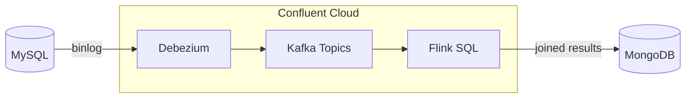
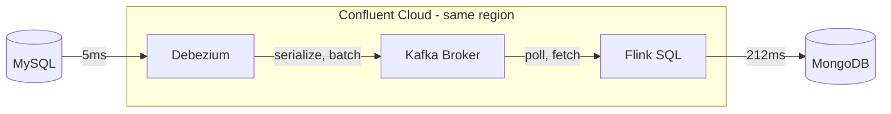
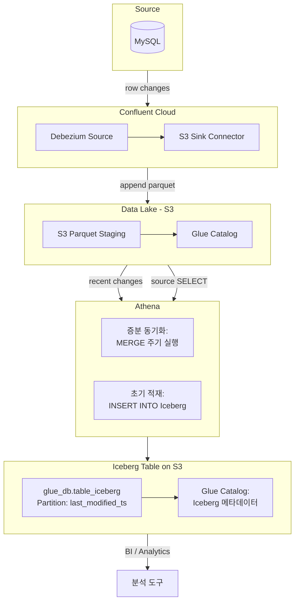

무거운 조인 쿼리에 문제가 있었다. 8개 테이블을 조인하는 쿼리가 프론트엔드 응답 시간을 늘리고 있었다. CQRS 패턴으로 읽기 전용 저장소를 분리하면 해결될 것 같았다.

Confluent Cloud + Flink로 CDC 파이프라인을 PoC 해봤다.

## 아키텍처



- **Debezium**: MySQL binlog를 캡처해서 Kafka로 전송
- **Confluent Kafka**: CDC 이벤트 스트리밍
- **Flink**: 8개 테이블 증분 조인
- **MongoDB**: 조인된 결과 저장 (읽기 전용)

## PoC 결과

### CDC 단일 테이블


| 구간 | 지연 시간 |
|------|----------|
| Debezium capture | 5 ms |
| Debezium → Kafka Broker | 170 ms |
| Kafka → MongoDB Sink | 212 ms |
| **End-to-End** | **383 ms** |

단일 테이블 기준으로 MySQL commit → MongoDB write까지 약 **383ms**.

Confluent 엔지니어 평가: "서비스 운영에 충분히 양호한 성능"

**측정 한계:**
- 단일 샘플(가장 느린 1건) 기준, p50/p95/p99 분포 미확인
- 시스템별 시계 동기화 편차(NTP 오차)로 수~수십 ms 오차 가능
- 커넥터 내부 처리와 네트워크 지연이 합산된 값

### Flink 8개 테이블 조인

8개 테이블을 CDC 이벤트 기반으로 증분 조인했다:

```
lookup_contract_form, contract_counsel, selected_product,
user, department, customer, contract_payback, contract_relation_reception
```

**지연 시간 측정 결과 (10회):**

| 항목 | 값 |
|------|------|
| 최소 | 1,587 ms |
| 최대 | 5,848 ms |
| 평균 | **3,748 ms** |
| 중앙값 | 3,479 ms |

Confluent 엔지니어 확인: AVRO 포맷 사용 시 **5~10초**로 증가.

데이터 정합성은 정상이었다. MongoDB에서 조회 시 운영 DB와 거의 동일한 최신 상태를 확인할 수 있었다.

## 왜 CQRS에 부적합한가

핵심은 **지연 시간**이다.

| 용도 | 허용 지연 | 실측 |
|------|----------|------|
| 프론트엔드 CQRS | ~100ms | ❌ 3.7초 (평균) |
| 분석용 파이프라인 | 분~시간 | ✅ 충분 |

프론트엔드에서 사용자가 데이터를 수정하고 목록으로 돌아왔을 때, **3~6초 동안 이전 데이터가 보인다**. 이건 UX 문제다.

Confluent 엔지니어도 "느린 수준은 아니지만 **반응성이 중요한 프론트엔드 CQRS에는 부적합**"하다고 평가했다.

## 문제점 상세

### 1. 컴포넌트 간 지연



Confluent Cloud는 AWS 동일 리전(ap-northeast-2)에 있어서 퍼블릭 망은 아니다. 그럼에도 지연이 발생한 이유:

- **커넥터 내부 처리**: 직렬화, 배치, 프로듀스 호출
- **브로커 대기**: 컨슈머 폴링, 페치
- **Sink 처리**: MongoDB Write

VPC 피어링이나 Private Link를 적용하면 **60ms 내외**까지 줄일 수 있다고 한다.

### 2. 운영 복잡도

- Debezium Connector 관리
- Kafka 토픽/파티션 설계
- Flink Job 모니터링 (State 크기, TTL, 체크포인트)
- MongoDB 스키마 관리
- **PK 정의 필수**: 불완전하면 조인 정확도가 깨짐

컴포넌트가 많아서 장애 포인트도 많다. 전체 체인(Debezium → Kafka → Flink → MongoDB)의 운영 복잡도가 높다.

### 3. 비용

Confluent Cloud는 **실행 시간 기준 과금**이다.

| 항목 | 단가 | PoC 비용 (12일) |
|------|------|----------------|
| Kafka CKU | $0.915/h | $261.69 (~$21.96/일) |
| Flink CFU | $0.256/h | $72.77 |
| Debezium Connector | $0.61/h | $173.85 |
| MongoDB Sink | $0.366/h | $104.68 |
| S3 Sink | $0.042/h | $10.89 |

**비용 증가 요인:**
- 테이블 수만큼 파티션 필요 → CKU 증가
- Flink SQL이 RUNNING 상태면 트래픽 없어도 과금 (Pause 없음, Stop만 가능)
- 커넥터도 실행 시간 기준 과금

PoC 12일에 약 **$620** 나왔다. 프로덕션이면 월 $1,500+ 예상.

## 결론

| 항목 | 평가 | 이유 |
|------|------|------|
| CDC 단일 테이블 | 양호 | 383ms, 서비스 운영 가능 |
| Flink 8테이블 조인 | 동작함 | 평균 3.7초, AVRO 시 5~10초 |
| 프론트엔드 CQRS | **부적합** | 3~6초 지연은 UX 문제 |
| 분석용 Lakehouse | **적합** | 준실시간 분석에 충분 |

**결론: CDC + Flink는 데이터 파이프라인이지 CQRS 솔루션이 아니다.**

처음부터 아키텍처 선택이 잘못됐다. Kafka + Flink 조합은 **이벤트 스트리밍과 배치 처리**에 최적화된 도구다. 프론트엔드에서 ms 단위 응답이 필요한 CQRS와는 맞지 않는다.

## 분석용으로는 적합: Lakehouse

같은 PoC에서 Lakehouse 구성도 검증했다.




**구성:**
- S3 Sink Connector: CDC 이벤트를 Parquet로 S3 적재
- flush.size 설정 (예: 1000건)으로 배치 크기 조절
- Lambda/Crontab으로 Iceberg 테이블에 MERGE

**결과:**
- 1000건 단위 flush 또는 1시간 주기로 반영 가능
- Athena에서 SQL로 최신 상태 쿼리 가능
- 운영 DB 덤프 방식 대비 부하 감소

**한계:**
- `flush.size=1000` 제약으로 소량 변경 시 반영 지연
- Iceberg MERGE 작업은 Lambda/Crontab 등 별도 스케줄링 필요

**분석팀이 운영 DB를 주기적으로 덤프하던 방식**을 대체할 수 있다. 실시간성이 필요 없는 분석 용도로는 이 구성이 적합하다.

## 대안

프론트엔드 CQRS가 목적이라면:

1. **애플리케이션 레벨 동기화**: 쓰기 시점에 직접 MongoDB 업데이트
2. **캐시 레이어**: Redis로 자주 조회되는 조인 결과 캐싱
3. **Materialized View**: DB 레벨에서 미리 조인된 뷰 생성

CDC + Flink는 **실시간 분석**, **이벤트 소싱**, **데이터 레이크 구축** 같은 용도에 더 적합해 보인다.
