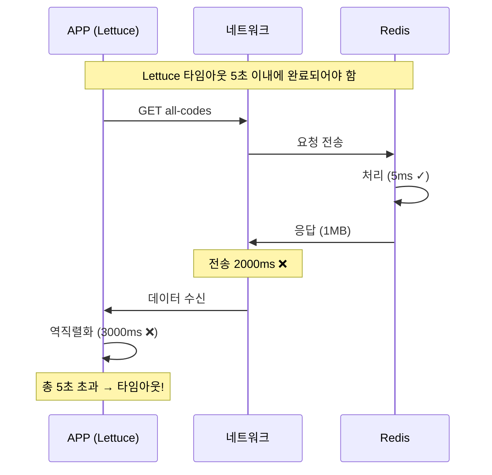
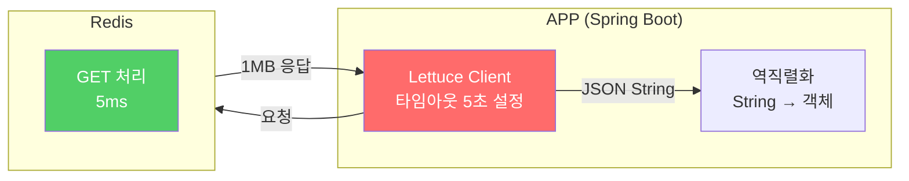

Redis를 도입하고 나서 간헐적으로 타임아웃이 발생했다. 당연히 Redis가 느린 줄 알았는데, slow log를 확인해보니 비어있었다. Redis는 빠르게 응답하고 있었다. 그럼 뭐가 문제였을까?

## 문제 상황

Redis 도입 후 APP에서 간헐적으로 타임아웃 에러가 발생했다.

**증상:**
- APP에서 Redis 요청 타임아웃
- 특정 API에서만 발생
- Redis slow log는 비어있음

```
APP 로그: Redis timeout after 5000ms
Redis slow log: (비어있음)
```

Redis가 느리면 slow log에 기록이 남아야 한다. 근데 비어있다? Redis는 정상이라는 뜻이다.

## 원인 분석

문제는 **데이터 크기**였다.

### 요청 흐름



**Redis slow log가 비어있던 이유:**
- Redis 처리 시간은 5ms로 빠름 (slow log 기준 미달)
- 병목은 네트워크 전송과 APP의 역직렬화

### 타임아웃은 어디서 발생하나

타임아웃은 **Lettuce(Redis 클라이언트)**에서 발생한다. Redis가 아니다.



| 항목 | 설명 |
|------|------|
| **타임아웃 설정 위치** | Lettuce (APP의 Redis 클라이언트) |
| **타임아웃 원인** | 네트워크 전송 + 역직렬화 시간 초과 |
| **Redis** | 빠르게 처리함 (slow log 없음) |

### 역직렬화란

Redis에서 받은 JSON 문자열을 Java 객체로 변환하는 과정이다.

```java
// Redis에서 받은 값 (1MB String)
String json = "[{\"id\":1,\"name\":\"코드1\"}, {\"id\":2,...}, ... 1만건]";

// 역직렬화 = String → Java 객체로 변환
List<Code> codes = objectMapper.readValue(json, new TypeReference<>(){});
```

**역직렬화가 오래 걸리는 이유:**
- JSON 문자열 파싱 (구문 분석)
- 객체 1만 개 생성 (메모리 할당)
- 각 필드에 값 매핑

이 모든 과정이 Lettuce 타임아웃 시간 안에 끝나야 한다. 데이터가 크면 시간 안에 못 끝내고 타임아웃이 발생한다.

### 데이터 크기 확인

확인해보니 문제가 되는 키의 데이터가 **1MB 이상**이었다.

```
# 정상 케이스
GET user:session:123 → 500 bytes → 1ms

# 문제 케이스
GET all-codes → 1MB+ → 타임아웃
```

한 키에 너무 많은 데이터를 저장하고 있었다.

## Redis 권장 데이터 크기

| 크기 | 판정 | 설명 |
|------|------|------|
| < 1KB | 최적 ✓ | 단일 객체, 세션 |
| 1KB ~ 10KB | 양호 ✓ | 작은 리스트, 캐시 |
| 10KB ~ 100KB | 주의 ⚠️ | 모니터링 필요 |
| 100KB ~ 1MB | 위험 ❌ | 분리 권장 |
| > 1MB | 금지 🚫 | 반드시 분리 |

**Redis 기술적 한계는 512MB지만, 권장은 100KB 이하다.**

## 왜 큰 데이터가 문제인가

### 1. 네트워크 전송 시간

```
1KB 전송: ~1ms
1MB 전송: ~수백ms (1000배 차이)
```

### 2. 역직렬화 오버헤드

```java
// 1MB JSON을 객체로 변환
String json = redis.get("all-codes");  // 1MB 문자열
List<Code> codes = objectMapper.readValue(json, ...);  // 역직렬화

// 역직렬화 과정:
// 1. 1MB 문자열 파싱 (JSON 구문 분석)
// 2. 수만 개의 객체 생성 (메모리 할당)
// 3. 각 필드 값 매핑
// → CPU, 메모리 많이 사용, 시간 오래 걸림
```

### 3. Redis는 모른다

Redis 입장에서는 그냥 문자열을 GET 한 것뿐이다. 5ms면 충분히 빠르다. slow log에 남을 이유가 없다.

병목은 Redis 바깥에서 발생한다.

## 해결 방법

### Before: 한 키에 전체 데이터

```java
// 저장
redis.set("all-codes", objectMapper.writeValueAsString(allCodes));  // 1MB

// 조회 - 항상 전체를 가져옴
String json = redis.get("all-codes");  // 1MB 전송 + 역직렬화
List<Code> codes = objectMapper.readValue(json, ...);
```

### After: 데이터 분리

**방법 1: 개별 키로 분리**
```java
// 저장
for (Code code : codes) {
    redis.set("code:" + code.getId(), objectMapper.writeValueAsString(code));
}

// 조회 - 필요한 것만
String json = redis.get("code:001");  // 1KB만 전송
Code code = objectMapper.readValue(json, Code.class);
```

**방법 2: Hash 구조 활용**
```java
// 저장
for (Code code : codes) {
    redis.hset("codes", code.getId(), objectMapper.writeValueAsString(code));
}

// 조회 - 필요한 것만
String json = redis.hget("codes", "001");  // 1KB만 전송
Code code = objectMapper.readValue(json, Code.class);

// 전체 필요하면
Map<String, String> all = redis.hgetall("codes");  // 필요할 때만
```

**방법 3: 페이징**
```java
// 저장 - 페이지 단위로 분리
redis.set("codes:page:1", first100Codes);   // 각 10KB
redis.set("codes:page:2", next100Codes);

// 조회 - 필요한 페이지만
String json = redis.get("codes:page:1");
```

## 결과

데이터 구조를 개선한 후 타임아웃이 사라졌다.

| 항목 | Before | After |
|------|--------|-------|
| 데이터 크기 | 1MB+ | < 10KB |
| 응답 시간 | 타임아웃 | < 10ms |
| 에러율 | 간헐적 발생 | 0% |

## 정리

Redis 타임아웃이 발생했을 때:

1. **slow log 먼저 확인** - 비어있으면 Redis는 정상
2. **데이터 크기 확인** - 100KB 이상이면 의심
3. **병목 지점 파악** - 네트워크 전송, 역직렬화
4. **데이터 구조 개선** - 분리, Hash, 페이징

Redis가 느린 게 아니라 **데이터가 큰 것**이 문제일 수 있다. slow log만 보고 "Redis는 정상이네?" 하고 넘어가면 안 된다.
