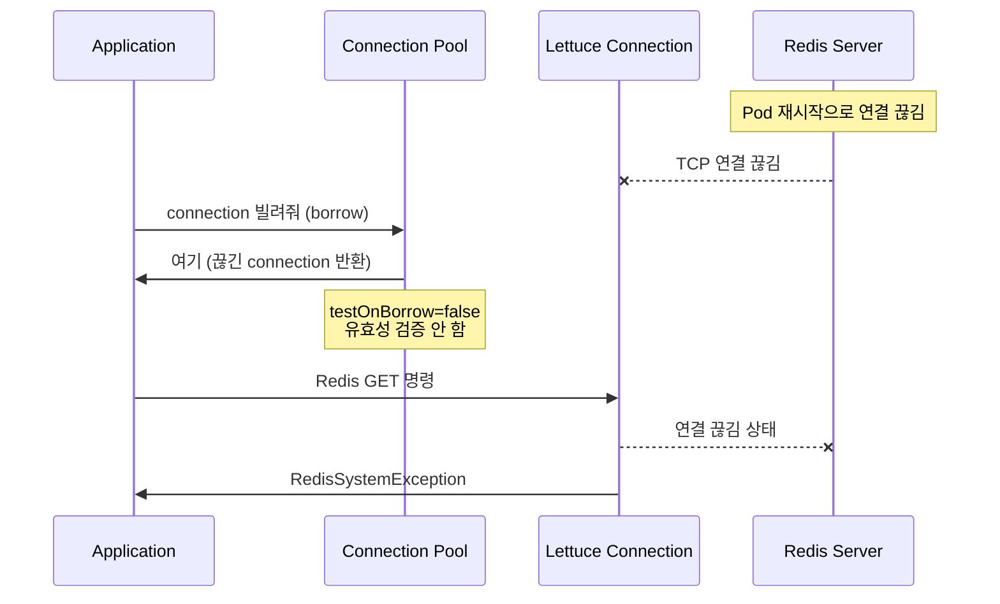
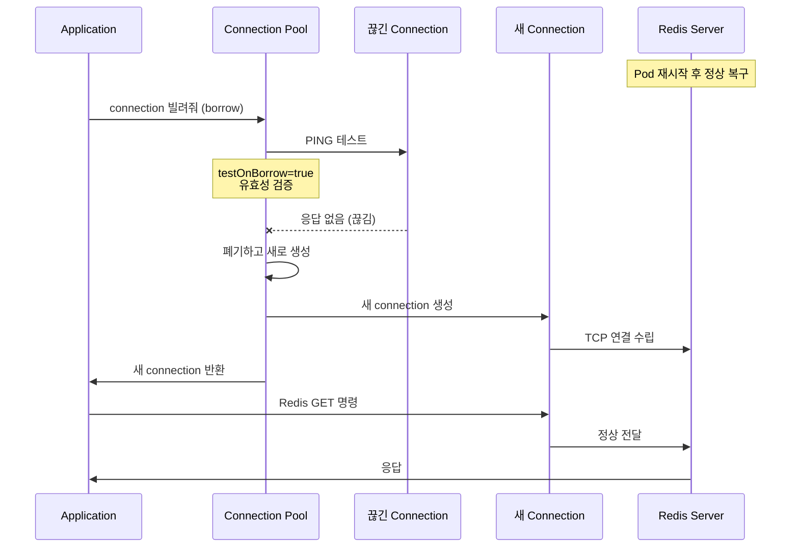

Connection Pool은 연결을 재사용해서 성능을 올려주지만, 풀 안의 연결이 죽었는지 살았는지는 별개 문제다.

EKS 업그레이드 중 valkey(Redis) pod가 재시작되면서 Pool 안의 연결이 전부 끊겼는데, Pool이 유효성 검증 없이 끊긴 연결을 그대로 반환했다. Lettuce에 auto-reconnect이 있는데도 복구가 안 된 이유와, `testOnBorrow`/`testWhileIdle` 설정의 차이를 정리한다.

## 한눈에 보기

| 항목 | 내용 |
|------|------|
| 증상 | RedisSystemException, pod restart 전까지 복구 불가 |
| 원인 | Connection Pool의 testOnBorrow 미설정 |
| 스택 | Spring Boot 3.5.0 + Lettuce 6.5.5 + Commons Pool2 |
| 해결 | `testOnBorrow=true` 또는 `testWhileIdle=true` 추가 |
| 재발 조건 | Redis pod와 앱 pod가 동시에 재생성되는 경우 |

## 문제 상황

pnb-api는 Redis 연결을 Lettuce + Commons Pool2 기반 Connection Pool로 관리하고 있었다.

```java
GenericObjectPoolConfig poolConfig = new GenericObjectPoolConfig();
poolConfig.setMaxTotal(40);
poolConfig.setMaxIdle(20);
poolConfig.setMinIdle(8);
poolConfig.setMaxWait(Duration.ofMillis(1000));
poolConfig.setTimeBetweenEvictionRuns(Duration.ofSeconds(30));
// testOnBorrow 미설정 (기본값 false)
```

EKS 업그레이드 중 valkey pod가 nodeSelector 변경으로 강제 삭제 → 재생성되면서, Pool 안의 connection이 전부 끊겼다. 하지만 Pool은 이를 모른 채 끊긴 connection을 계속 반환했고, 모든 Redis 요청이 `RedisSystemException`으로 실패했다.

## Lettuce auto-reconnect이 있는데 왜?

Lettuce는 auto-reconnect 기능이 있다. 실제로 replica 연결은 자동 재연결에 성공했다.

하지만 Connection Pool과 함께 사용할 때는 다른 문제가 생긴다:

- **auto-reconnect**: 이미 존재하는 connection 객체가 끊기면, 그 객체 자체가 재연결을 시도
- **Connection Pool**: connection 객체를 빌려주고 반납받는 관리자. 빌려줄 때 그 객체가 살아있는지는 **별도로 검증해야** 함

Pool이 "이 connection 아직 살아있나?" 확인 없이 내주면, auto-reconnect이 아무리 잘 돼있어도 이미 깨진 객체를 받게 된다.



## 왜 이번에만 발생했나

평소 배포는 rolling update라서 Redis 연결이 끊기는 시간이 수초다. 이번에는 EKS 업그레이드로 특수한 상황이 겹쳤다:

1. valkey pod의 nodeSelector가 변경되면서 **강제 삭제 → 재생성** (약 18분 다운)
2. pnb-api pod도 동시에 재생성되면서 Pool이 초기화됨
3. Pool 초기화 시점에 valkey primary가 아직 미복구 상태
4. `minIdle=8`에 의해 Pool이 8개 connection을 미리 생성 시도 → 전부 실패한 connection으로 채워짐

일반적인 운영(개별 배포, rolling restart)에서는 발생하지 않는 조건이다.

## 해결: testOnBorrow vs testWhileIdle

Apache Commons Pool2는 두 가지 유효성 검증 옵션을 제공한다.

### testOnBorrow=true

connection을 **빌릴 때마다** PING으로 검증한다.

```java
poolConfig.setTestOnBorrow(true);
```

- Redis 요청 1건 = PING 1건 추가
- 빈틈: **없음** (매번 확인)
- 오버헤드: 매 요청 ~1ms 추가

### testWhileIdle=true

**백그라운드**에서 주기적으로 idle connection을 검증한다.

```java
poolConfig.setTestWhileIdle(true);
// timeBetweenEvictionRuns=30s 설정과 함께 동작
```

- eviction 스레드가 30초마다 idle connection에 PING
- 끊긴 connection 발견 시 폐기 + 새로 생성
- 빈틈: **최대 30초** (eviction 주기)
- 오버헤드: 없음 (백그라운드 처리)

### 어떤 걸 써야 하나

| 상황 | 권장 설정 |
|------|----------|
| 저~중 트래픽 | `testOnBorrow=true` + `testWhileIdle=true` |
| 고트래픽 (초당 수만 건) | `testWhileIdle=true`만 (eviction 주기 짧게) |

`testWhileIdle=true`만 켜도 이번 사고처럼 영원히 복구 안 되는 상황은 방지할 수 있다. `testOnBorrow=true`는 30초 빈틈마저 없애려는 추가 안전장치다.

## 수정 후 동작



## 정리

- Connection Pool의 `testOnBorrow`/`testWhileIdle`은 **DB든 Redis든** 동일하게 적용되는 Apache Commons Pool2 설정이다
- Lettuce auto-reconnect과 Pool 레벨 유효성 검증은 **별개 메커니즘**이다
- `testWhileIdle=true`만으로도 최악 30초 내 복구 가능. 고트래픽이 아니라면 `testOnBorrow=true`까지 함께 설정하는 것이 안전하다
- 이번 이슈는 EKS 업그레이드 시 Redis pod와 앱 pod가 동시에 재생성되는 특수 상황에서 발생했다. 일반적인 운영에서는 재발 가능성이 낮다

## 참고

- [Apache Commons Pool2 GenericObjectPoolConfig](https://commons.apache.org/proper/commons-pool/apidocs/org/apache/commons/pool2/impl/GenericObjectPoolConfig.html)
- [Lettuce Reference - Connection Pooling](https://lettuce.io/core/release/reference/index.html#connection-pooling)
- [Spring Data Redis - Lettuce Pool](https://docs.spring.io/spring-data/redis/reference/redis/connection-modes.html)
