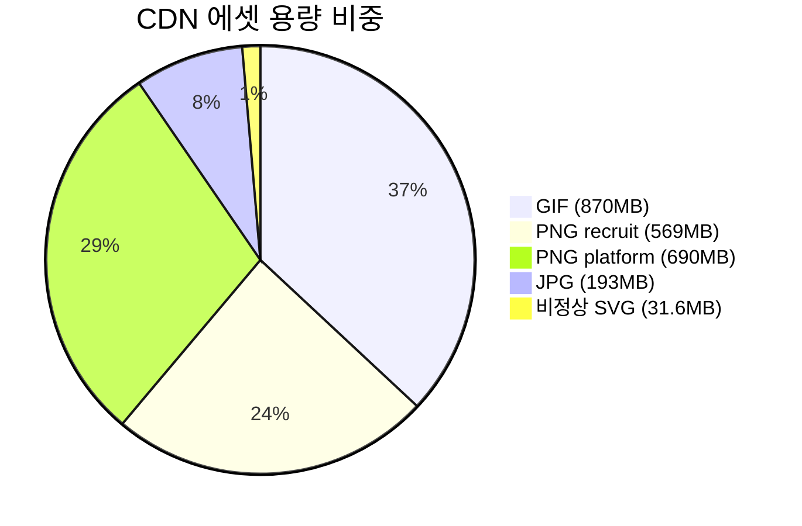
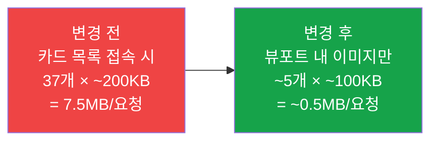

CDN 비용은 대부분 전송량(Data Transfer Out)이 결정한다. 요청 수가 아니라 **한 번에 얼마나 큰 데이터를 보내느냐**가 핵심이다.

주간 비용 리포트에서 CloudFront가 전주 대비 26.6% 올라 있었다. 신규 배포 이후였고, 요청 수는 11% 늘었는데 전송량은 50% 늘었다. 요청당 전송 크기가 비정상적으로 커진 것이다. 원인을 추적해보니 프론트엔드 이미지 처리 방식에 문제가 있었다.

## 문제 발견

매주 자동으로 생성되는 [AWS 비용 리포트](/finops/cost-report-automation/)를 확인하다가 이상 수치를 발견했다.

| 서비스 | 전주 | 이번 주 | 증감 |
|--------|------|---------|------|
| CloudFront | $968 | $1,238 | +$270 (+26.6%) |

주간 $270이면 월로 환산하면 약 $1,170이다. 무시할 수 없는 금액이었다.

## 원인 추적

### 1단계: 어떤 배포판이 문제인가

CloudFront에 여러 배포판(distribution)이 연결되어 있었다. CloudWatch 지표로 배포판별 전송량을 확인했다.

| 지표 | 변경 전 | 변경 후 | 증감 |
|------|---------|---------|------|
| 일평균 전송량 | 694GB | 1,046GB | +50.7% |
| 평균 응답 크기 | 205KB | 278KB | +35.6% |
| 요청 수 | - | - | +11.2% |

CDN 도메인 `cdn.example.com`이 전체 증가분의 대부분을 차지했다. 요청 수는 11.2%만 늘었는데, 평균 응답 크기가 205KB에서 278KB로 35.6% 커졌다. **같은 수의 요청을 처리하는데 더 많은 데이터를 보내고 있었다.**

### 2단계: S3 버킷에 대용량 파일이 추가되었나

CDN 오리진인 S3 버킷을 확인했다. 해당 기간에 변경된 파일은 5개, 총 12MB에 불과했다. 대용량 파일이 새로 올라간 게 아니었다.

### 3단계: 어떤 배포가 트리거인가

배포 이력을 확인했다. 문제 시점에 프론트엔드 프로젝트에서 카드 목록/상세 페이지가 신규 배포되었다.

```
1/21 배포: FE-1234 카드 리스트 및 상세페이지 퍼블리싱 및 API 연동
          - 67개 파일 변경
          - vue-core, vue3-lottie 패키지 추가
```

**새 파일이 S3에 올라간 게 아니라, 기존에 있던 대용량 에셋을 새 페이지에서 참조하기 시작한 것이다.** 카드 이미지들은 이미 CDN에 있었지만, 카드 페이지가 없었을 때는 요청 자체가 없었다.

## 근본 원인: 프론트엔드 이미지 최적화 부재

카드 페이지의 프론트엔드 코드를 확인했다. 두 가지 문제가 있었다.

### 문제 1: Lazy Loading 미적용

카드 목록 페이지에서 이미지를 렌더링하는 코드:

```vue
<!-- 변경 전: 모든 이미지를 즉시 로딩 -->

```

`loading="lazy"` 속성이 없었다. 카드 목록 페이지에 접속하면 **37개 카드 이미지(총 7.5MB)가 한 번에 로딩**되었다. 사용자가 스크롤하지 않아도 화면 밖의 이미지까지 전부 다운로드한다.

### 문제 2: 이미지 포맷 미최적화

CDN 버킷 전체를 점검했다. 최적화되지 않은 에셋이 대량으로 존재했다.

| 대상 | 파일 수 | 현재 용량 | 문제 |
|------|---------|----------|------|
| GIF (애니메이션) | 73개 | 870MB | 동영상 포맷 대비 10~50배 비효율 |
| PNG (recruit) | 158개 | 569MB | WebP 미변환 |
| PNG (platform) | 376개 | 690MB | WebP 미변환 |
| 비정상 SVG | 2개 | 31.6MB | 래스터 이미지가 base64로 임베딩 |
| JPG | 242개 | 193MB | WebP 미변환 |

특히 GIF 파일 중 **10MB를 초과하는 파일이 17개(750MB)** 있었다. GIF는 프레임마다 전체 이미지를 저장하는 포맷이라, 애니메이션 길이가 길어지면 용량이 급격히 커진다.



## 해결

우선순위를 정하고 단계적으로 적용했다.

### 1. Lazy Loading 적용 (즉시 효과)

이미지 컴포넌트를 만들어 lazy loading을 기본 적용했다.

```vue
<!-- 변경 후: AjLazyImage 컴포넌트 -->
<template>
  
</template>
```

HTML5 네이티브 `loading="lazy"` 속성을 사용했다. 브라우저가 뷰포트 근처의 이미지만 로딩하고, 나머지는 스크롤할 때 로딩한다. 별도 라이브러리 없이 브라우저 네이티브 기능만으로 충분했다.

카드 상세 페이지의 슬라이더처럼 즉시 보여야 하는 경우에는 `no-lazy` prop으로 eager 로딩을 유지했다.

### 2. GIF → MP4/WebM 변환

가장 큰 용량 절감 효과를 기대할 수 있는 부분이었다. GIF를 동영상 포맷으로 변환했다.

```html
<!-- 변경 전 -->
  <!-- 15MB -->

<!-- 변경 후 -->
<video autoplay loop muted playsinline>
  <source src="animation.webm" type="video/webm" />
  <source src="animation.mp4" type="video/mp4" />
</video>  <!-- 0.5MB -->
```

| 변환 | 파일 수 | 변환 전 | 변환 후 | 절감 |
|------|---------|---------|---------|------|
| GIF → MP4/WebM | 73개 | 870MB | ~150MB | ~720MB (83%) |

`autoplay loop muted playsinline` 속성으로 GIF와 동일한 사용자 경험을 유지했다. `muted`가 없으면 모바일에서 자동 재생이 안 되므로 주의해야 한다.

### 3. PNG/JPG → WebP 변환

나머지 이미지를 WebP로 변환했다.

| 변환 | 파일 수 | 변환 전 | 변환 후 | 절감 |
|------|---------|---------|---------|------|
| PNG (recruit) → WebP | 158개 | 569MB | ~170MB | ~400MB (70%) |
| PNG (platform) → WebP | 376개 | 690MB | ~210MB | ~480MB (70%) |
| JPG → WebP | 242개 | 193MB | ~93MB | ~100MB (52%) |

WebP는 PNG 대비 70%, JPG 대비 50% 정도 용량이 줄어든다. 브라우저 호환성도 2024년 기준으로 [97% 이상](https://caniuse.com/webp)이라 fallback 없이 사용해도 무방했다.

### 4. 비정상 SVG 정리

14.5MB, 17.1MB짜리 SVG 파일 2개를 확인했더니, 래스터 이미지가 base64로 임베딩되어 있었다. SVG 안에 PNG 데이터가 통째로 들어 있던 것이다. 래스터 부분을 별도 이미지로 분리하고 SVG는 벡터 데이터만 남겼다.

## 결과

### 전송량 변화



### 비용 영향

| 항목 | 변경 전 | 변경 후 | 절감 |
|------|---------|---------|------|
| 주간 CloudFront 비용 | $1,238 | ~$970 | ~$270/주 |
| 월간 환산 | ~$5,360 | ~$4,200 | ~$1,170/월 |

Lazy loading만으로도 카드 페이지의 전송량이 크게 줄었고, 이미지 포맷 변환까지 적용하면 전체 CDN 전송량 자체가 줄어드는 효과가 있었다.

### CDN 버킷 총 용량

| 최적화 | 절감량 |
|--------|--------|
| GIF → MP4/WebM | ~720MB |
| PNG → WebP | ~880MB |
| JPG → WebP | ~100MB |
| SVG 정리 | ~30MB |
| **합계** | **~1,730MB** |

## 교훈

### 비용 모니터링은 배포 파이프라인의 일부다

신규 페이지 배포가 CDN 비용에 영향을 줄 수 있다는 건, 배포 후에 비용 지표도 확인해야 한다는 뜻이다. 기능은 정상 동작하지만 비용은 비정상인 경우가 있다.

### 요청 수가 아니라 전송량을 봐야 한다

이번 케이스에서 요청 수는 11%만 늘었다. 요청 수만 보면 정상이다. 하지만 평균 응답 크기가 35% 커지면서 전송량이 50% 늘었다. CDN 비용 분석 시 **BytesDownloaded**와 **평균 응답 크기**를 함께 봐야 한다.

### 이미지 최적화는 업로드 시점에 해야 한다

S3에 파일을 올리는 시점에 포맷 변환과 리사이징이 되어야 한다. 나중에 일괄 변환하면 기존 URL을 참조하는 코드를 모두 수정해야 하는 문제가 생긴다. 업로드 파이프라인에 이미지 처리를 넣는 게 장기적으로 맞다.

### GIF는 이제 안녕

GIF는 256색 제한, 압축 효율 낮음, 용량 거대. 애니메이션이 필요하면 MP4/WebM을 쓰자. `<video autoplay loop muted playsinline>`으로 GIF와 동일한 UX를 줄 수 있다.
