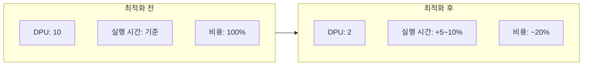

Glue 비용이 매월 100% 이상씩 증가하고 있었다. 원인을 파악하고 최적화한 경험을 공유한다.

## 문제 상황

비용 리포트를 보다가 Glue 비용이 급격히 증가하는 것을 발견했다. 원인을 추적해보니 ETL 실행 주기가 1일에서 1시간 단위로 변경된 것이 메인 원인이었다.

하지만 이건 비즈니스 요구사항이라 변경할 수 없었다. 다른 요소에서 비용을 줄일 방법을 찾아야 했다.

## Glue 비용 구조 분석

먼저 Glue 비용이 어떻게 계산되는지 확인했다.

```
Glue 비용 = DPU 수 × 실행 시간 × DPU 단가
```

| 요소 | 설명 |
|------|------|
| DPU (Data Processing Unit) | 할당된 컴퓨팅 리소스 |
| 실행 시간 | Job이 실행된 시간 (초 단위 과금) |
| DPU 단가 | 리전별, 모드별 상이 |

결국 **실행 시간이 곧 비용**이다. 처음에는 코드를 최적화해서 실행 시간을 줄이려고 했다.

## 코드 분석: I/O 바운드 발견

코드를 분석해보니 예상과 달랐다. 실행 시간의 대부분이 연산이 아니라 **I/O 대기 시간**이었다.

- S3에서 데이터 읽기
- 변환 처리 (실제 연산)
- S3/RDS로 데이터 쓰기

대부분의 시간이 읽기/쓰기에 걸려있었다. 그런데 DPU 설정을 보니 **10 DPU**로 설정되어 있었다.

## 가설: DPU 오버 프로비저닝

여기서 가설을 세웠다.

> 실행 시간의 대부분이 I/O라면, DPU를 줄여도 실행 시간이 비례해서 늘어나지 않을 것이다.

예를 들어 DPU를 10에서 2로 줄이면 (5배 감소):
- **CPU 바운드라면**: 실행 시간 5배 증가 → 비용 동일
- **I/O 바운드라면**: 실행 시간 소폭 증가 → 비용 대폭 감소

I/O 대기 시간은 DPU 수와 관계없이 비슷하기 때문이다.

## 테스트 결과

실제로 테스트를 진행했다.

| DPU | 실행 시간 | 비용 (상대값) |
|-----|----------|--------------|
| 10 | 기준 | 100% |
| 2 | +5~10% | **약 20%** |

DPU를 1/5로 줄였는데, 실행 시간은 5~10%만 증가했다.

이 말은 **성능 하락 거의 없이 비용을 1/5 수준으로 줄일 수 있다**는 뜻이다.

## 적용 결과

검증 후 모든 Glue Job에 동일한 최적화를 적용했다. 결과적으로 비용 증가를 막고, 기존 대비 약 80% 비용을 절감할 수 있었다.



## 다음 단계

현재 Job들이 Standard 모드로 실행되고 있다. Flex 모드로 전환하면 추가 비용 절감이 가능하다.

| 모드 | 특징 | 비용 |
|------|------|------|
| Standard | 즉시 실행, SLA 보장 | 기본 단가 |
| Flex | 유휴 용량 활용, 시작 지연 가능 | 약 34% 저렴 |

배치성 ETL이고 실시간성이 중요하지 않다면 Flex 모드가 적합하다. 아직 적용하지 않았지만, 검토 중인 다음 최적화 포인트다.

## 정리

Glue 비용 최적화의 핵심은 **워크로드 특성 파악**이다.

1. 비용 구조 이해: DPU × 실행 시간
2. 워크로드 분석: CPU 바운드 vs I/O 바운드
3. 가설 수립 및 테스트
4. 점진적 적용

I/O 바운드 워크로드에서 DPU를 무조건 높게 잡는 것은 비용 낭비다. 실제 리소스 사용량을 확인하고 적정 수준으로 조정하는 것이 중요하다.
