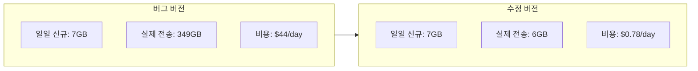

비용 모니터링은 단순한 비용 관리 도구가 아니다. 때로는 성능 모니터링이나 에러 알림보다 먼저 문제를 잡아준다. 시스템은 정상인데 비용만 비정상인 상황, 그게 바로 서드파티 솔루션에서 발생한 문제였다.

주간 AWS 비용 리포트에서 S3 DataTransfer-Out이 $0에서 하루 $44로 뛰었다. 서비스에는 아무 이상이 없었고, 에러 로그도 없었다. 원인은 도입한 로그 수집 솔루션의 버그였다. 하루 7GB의 데이터를 349GB나 반복 전송하고 있었다.

## 문제 발견

자동화된 주간 비용 리포트에서 S3 DataTransfer-Out 항목이 눈에 띄었다. 기존에는 거의 $0이던 항목이 갑자기 하루 $40 이상 찍히고 있었다.

| 날짜 | DataTransfer-Out | 비용 |
|------|-----------------|------|
| 01-26 | 0.002 GB | $0.00 |
| 01-27 | 0.001 GB | $0.00 |
| 01-28 | 177.6 GB | $22.38 |
| 01-29 | 332.4 GB | $41.88 |
| 01-30 | 341.6 GB | $43.05 |
| 01-31 | 349.1 GB | $43.98 |

01-28부터 급증했다. 이 날짜에 뭐가 바뀌었는지가 핵심이었다.

## 원인 추적

### S3 DataTransfer-Out이란?

S3에서 데이터가 외부로 나갈 때 과금된다. 같은 리전 내 EC2에서 읽는 건 무료지만, **인터넷으로 나가는 전송**은 GB당 과금이다.

```
S3 → 같은 리전 EC2/Lambda : 무료
S3 → 인터넷 (외부 서버)   : $0.126/GB (서울 리전)
```

01-28에 바뀐 것을 확인해보니, 보안팀에서 도입한 로그 수집 솔루션이 S3의 WAF 로그를 수집하기 시작한 날이었다. 이 솔루션은 온프레미스 서버에서 실행되고 있었기 때문에, S3 → 인터넷 구간의 DataTransfer-Out이 발생하는 구조였다.


### 전송량이 이상하다

문제는 전송량의 크기였다. WAF 로그 버킷의 일일 신규 데이터는 약 7GB였다. 그런데 DataTransfer-Out은 349GB였다. **약 50배**.

| 항목 | 수치 |
|------|------|
| 일일 신규 WAF 로그 | ~7 GB |
| 일일 DataTransfer-Out | 349 GB |
| 배율 | **약 50배** |

7GB를 읽는 데 349GB가 나갈 수는 없다. 같은 데이터를 수십 번 반복 읽고 있다는 뜻이다.

## 근본 원인: 수집 앱 버그

로그 수집 솔루션 벤더에 전송량 데이터를 공유했다. 확인 결과, **수집 앱(Collection App)의 버그**로 동일한 S3 객체를 반복 읽는 문제가 있었다.

정상 동작이라면:

1. 새로운 S3 객체 감지
2. 해당 객체 한 번 읽기
3. 읽은 위치(offset) 기록
4. 다음 새 객체로 이동

하지만 버그로 인해 offset 기록이 제대로 되지 않아서, 이미 읽은 객체를 계속 다시 읽고 있었다.

## 해결

벤더에서 수정 버전을 배포했고, 수집을 재시작했다. 수정 전후 비교:

| 날짜 | DataTransfer-Out | 비용 | 상태 |
|------|-----------------|------|------|
| 01-31 | 349.1 GB | $43.98 | 버그 버전 (피크) |
| 02-02 | 315.4 GB | $39.74 | 버그 버전 |
| 02-03 | 76.8 GB | $9.68 | 수집 중단 |
| 02-04 | 6.16 GB | $0.78 | 수정 버전 적용 |

수정 후 전송량이 349GB → 6GB로 떨어졌다. 일일 신규 데이터 ~7GB와 거의 일치하는 수치다. 정상 동작이 확인된 것이다.



## 비용으로 보면

이 버그가 일주일간 지속되면서 발생한 비용:

| 기간 | DataTransfer-Out | 비용 |
|------|-----------------|------|
| 01-28 ~ 02-02 (6일) | ~1,875 GB | ~$237 |
| 정상이었다면 | ~42 GB | ~$5 |
| **과다 전송 비용** | | **~$232** |

월 단위로 환산하면 약 $1,100. 연 $13,000. 작은 금액은 아니다.

## 교훈

### 1. 비용 모니터링 = 이상 탐지

이번 사건에서 문제를 잡아준 건 Datadog도 CloudWatch Alarm도 아니었다. [자동화해둔 주간 비용 리포트]()였다.

서비스 입장에서는 정상이었다. 에러 로그도 없고, 응답 시간도 문제없었다. 수집 솔루션이 S3를 아무리 많이 읽어도 서비스에 영향을 주지 않기 때문이다.

비용 리포트가 없었다면, 이 버그는 월 정산 시점에야 발견됐을 것이다.

### 2. 서드파티 솔루션도 비용을 만든다

도입한 솔루션이 인프라 비용을 발생시키는 구조인지 미리 파악해야 한다.

| 구조 | DataTransfer 비용 |
|------|------------------|
| 같은 리전 EC2/Lambda에서 S3 읽기 | 무료 |
| 다른 리전에서 S3 읽기 | 유료 |
| **온프레미스에서 S3 읽기** | **유료 (인터넷 전송)** |

이번 케이스처럼 온프레미스 서버에서 S3를 읽는 구조는 모든 읽기가 DataTransfer-Out 비용으로 잡힌다. 정상 동작이어도 비용이 발생하는 구조다.

### 3. S3 버킷별 전송량 추적이 안 된다

이번에 가장 아쉬웠던 점이다. "이 버킷에서 얼마나 전송됐는지" 확인하려 했지만 불가능했다.

| 방법 | 버킷별 분리 | 설정 상태 |
|------|-----------|----------|
| Cost Explorer | ✗ (서비스 레벨만) | - |
| S3 Request Metrics | ✓ | **미설정** |
| S3 Server Access Logging | ✓ | **미설정** |
| S3 Storage Lens | ✓ | 미확인 |

Cost Explorer는 S3 전체의 DataTransfer-Out만 보여준다. 버킷별로 분리하려면 **S3 Request Metrics**나 **Server Access Logging**이 필요한데, 둘 다 설정되어 있지 않았다.

결국 전체 추이와 버킷 사이즈 증가분을 비교하는 간접적인 방법으로 검증할 수밖에 없었다.

외부 전송이 있는 S3 버킷에는 최소한 Request Metrics를 켜두는 것을 권장한다.

```
S3 버킷 → Properties → Metrics configurations → Create
→ Filter: 전체 또는 prefix 지정
→ CloudWatch에서 BytesDownloaded 확인 가능
```

## 정리

1. **비용 리포트는 비용 관리만을 위한 것이 아니다.** 성능/에러 모니터링이 못 잡는 이상 징후를 비용이 먼저 잡아줄 수 있다.
2. **서드파티 솔루션 도입 시 인프라 비용 구조를 확인해야 한다.** 특히 온프레미스 ↔ 클라우드 간 데이터 이동은 전송 비용이 발생한다.
3. **S3 버킷별 전송량 추적을 위해 Request Metrics를 설정해두자.** 문제가 터진 후에야 "왜 안 켜놨지" 후회하게 된다.
