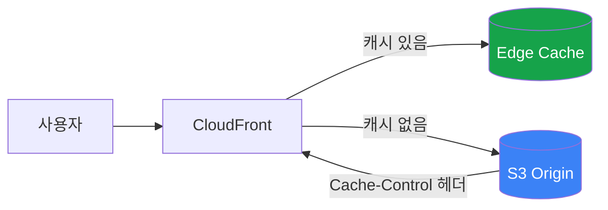

CloudFront 비용을 줄여보려고 트래픽 높은 엔드포인트를 분석했다. 이미지와 동영상 파일이 많았는데, 동영상 일부가 캐시되지 않고 있었다.

## 문제 상황

CloudFront 캐시 적중률(Cache Hit Ratio)을 확인했더니, S3에서 직접 서빙하는 동영상 파일들이 캐시되지 않았다.

**구조:**
```
Amplify (SSR) → CloudFront → 사용자
S3 (정적 파일) → CloudFront → 사용자
```

Amplify로 배포한 프론트엔드는 정상적으로 캐시됐는데, S3에 올린 동영상/이미지만 문제였다.

## 원인: Cache-Control 헤더 없음

CloudFront는 **오리진(S3)이 보내주는 Cache-Control 헤더**를 보고 캐시 여부를 결정한다.

| 출처 | Cache-Control 헤더 | 캐시 |
|------|-------------------|------|
| Amplify (SSR) | 코드에서 응답 헤더 설정 | ✓ |
| S3 | **설정 안 함** | ✗ |

S3 객체는 **메타데이터**로 Cache-Control을 설정해야 하는데, 업로드할 때 아무것도 안 넣었던 거다.

## CloudFront 캐시 동작 방식



**핵심:**
- S3에서 `Cache-Control: max-age=86400` 헤더가 오면 → CloudFront가 24시간 캐시
- 헤더 없으면 → CloudFront 정책에 따라 다름 (기본값은 24시간이지만, 조건에 따라 캐시 안 될 수 있음)

## 해결: S3 메타데이터에 Cache-Control 추가

### 방법 1: AWS Console

1. S3 버킷 → 객체 선택
2. Actions → Edit metadata
3. Add metadata
   - Type: System defined
   - Key: `Cache-Control`
   - Value: `max-age=31536000` (1년)

### 방법 2: AWS CLI

**단일 파일:**
```bash
aws s3 cp s3://버킷/파일.mp4 s3://버킷/파일.mp4 \
  --metadata-directive REPLACE \
  --cache-control "max-age=31536000"
```

**폴더 전체 (재귀):**
```bash
aws s3 cp s3://버킷/videos/ s3://버킷/videos/ \
  --metadata-directive REPLACE \
  --recursive \
  --cache-control "max-age=31536000"
```

**특정 확장자만:**
```bash
aws s3 cp s3://버킷/ s3://버킷/ \
  --metadata-directive REPLACE \
  --recursive \
  --exclude "*" \
  --include "*.mp4" \
  --include "*.webm" \
  --cache-control "max-age=31536000"
```

**주의:** `--metadata-directive REPLACE` 필수. 없으면 메타데이터가 적용 안 됨.

## Cache-Control 값 설정 가이드

| 파일 유형 | 권장 max-age | 이유 |
|----------|-------------|------|
| 동영상 (.mp4, .webm) | 31536000 (1년) | 거의 안 바뀜 |
| 이미지 (.jpg, .png) | 31536000 (1년) | 거의 안 바뀜 |
| JS/CSS (버저닝 있음) | 31536000 (1년) | 파일명에 해시 포함 |
| HTML | 0 또는 3600 | 자주 바뀜, 캐시 주의 |

**`s-maxage` vs `max-age`:**
- `max-age`: 브라우저 + CDN 모두 적용
- `s-maxage`: CDN만 적용 (브라우저 무시)

CDN에만 오래 캐시하고 브라우저는 짧게 하려면:
```
Cache-Control: max-age=60, s-maxage=31536000
```

## 결과

캐시 설정 후 CloudFront 비용 변화:

| 월 | 비용 | 변화 |
|---|------|------|
| 10월 | $4,317 | - |
| 11월 | $4,008 | -7% |

약 **7% 절감**. 기대만큼 드라마틱하진 않았다. 예상 원인:
- 배포할 때마다 CloudFront invalidation을 실행해서 캐시 보존 기간이 짧았을 수 있음
- 사용자 재방문 주기가 길어서 캐시 효과가 제한적이었을 수 있음

그래도 **월 $300 정도 절감** 효과는 있었다.

## 교훈

### S3 업로드 시 Cache-Control 기본 설정

업로드 시점에 메타데이터를 넣어야 한다. 나중에 수정하려면 파일을 자기 자신에게 복사하는 방식이라 번거롭다.

**S3 sync 예시:**
```bash
aws s3 sync ./dist s3://버킷/ \
  --cache-control "max-age=31536000"
```

### Amplify vs S3 차이 인식

| 항목 | Amplify | S3 |
|------|---------|-----|
| 캐시 헤더 설정 | 코드에서 응답 헤더 | 객체 메타데이터 |
| 설정 시점 | 런타임 | 업로드 시 |
| 변경 용이성 | 배포하면 적용 | 객체별로 수정 필요 |

## 체크리스트

| 항목 | 확인 |
|------|------|
| S3 정적 파일에 Cache-Control 메타데이터 설정 | ☐ |
| 동영상/이미지는 max-age 길게 (1년) | ☐ |
| HTML은 max-age 짧게 또는 0 | ☐ |
| 업로드 스크립트에 --cache-control 옵션 추가 | ☐ |
| CloudFront 캐시 적중률 모니터링 | ☐ |

## 참고

- [AWS 공식 문서 - CloudFront 캐시 만료 관리](https://docs.aws.amazon.com/AmazonCloudFront/latest/DeveloperGuide/Expiration.html)
- [S3 Cache-Control 설정 방법 (CLI)](https://how.wtf/set-cache-control-on-s3-objects-using-the-aws-cli.html)
- [CloudFront + S3 캐싱 가이드](https://docs.aws.amazon.com/whitepapers/latest/build-static-websites-aws/controlling-how-long-amazon-s3-content-is-cached-by-amazon-cloudfront.html)
