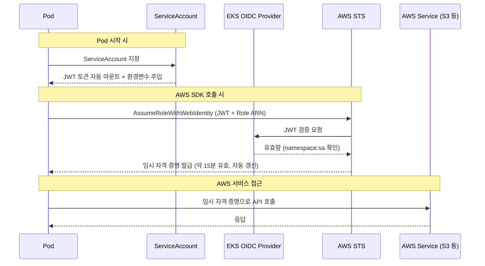

EKS에서 Pod가 S3에 파일을 올리거나 SQS에 메시지를 보내려면 AWS 자격 증명이 필요하다. 예전에는 AWS Access Key를 환경변수나 ConfigMap에 넣어서 해결했다. 동작은 하지만, 키가 유출되면 누구나 해당 권한을 사용할 수 있고, 키 로테이션도 수동이다.

IRSA(IAM Roles for Service Accounts)는 이 문제를 근본적으로 해결한다. Kubernetes의 ServiceAccount와 AWS IAM Role을 OIDC 프로토콜로 연결해서, Pod에 임시 자격 증명을 자동으로 주입한다. 키를 코드에 넣을 필요가 없고, 토큰은 자동 갱신되며, 네임스페이스 단위로 권한을 분리할 수 있다.

이 글에서는 IRSA가 왜 필요한지, 내부적으로 어떻게 동작하는지, 실제로 어떻게 구성하는지를 정리한다.

## IRSA 이전: 뭐가 문제였나

EKS에서 Pod가 AWS 서비스에 접근하는 방법은 크게 3가지가 있었다.

| 방식 | 설명 | 문제점 |
|------|------|--------|
| **Access Key 직접 주입** | 환경변수에 `AWS_ACCESS_KEY_ID` / `SECRET_ACCESS_KEY` 설정 | 키 유출 위험, 로테이션 수동, Git에 노출 가능 |
| **EC2 Instance Profile** | 노드(EC2)의 IAM Role을 Pod가 상속 | 같은 노드의 모든 Pod가 동일 권한 (분리 불가) |
| **kube2iam / kiam** | 오픈소스 프록시로 Pod별 Role 매핑 | 추가 데몬셋 필요, 메타데이터 프록시 오버헤드, 보안 취약점 |

3가지 모두 "워크로드 단위로 최소 권한을 부여한다"는 원칙을 충족하기 어렵다.

IRSA는 AWS가 EKS에 네이티브로 제공하는 솔루션으로, 추가 컴포넌트 없이 ServiceAccount 단위로 IAM 권한 분리가 가능하다.

## 핵심 개념

IRSA를 이해하려면 4가지 구성 요소를 알아야 한다.

### 1. ServiceAccount (K8s)

Kubernetes에서 Pod의 신원을 나타내는 리소스다. Pod가 "나는 누구다"를 증명하는 신분증 같은 것이다.

```yaml
apiVersion: v1
kind: ServiceAccount
metadata:
  name: my-app
  namespace: production
  annotations:
    eks.amazonaws.com/role-arn: arn:aws:iam::123456789012:role/my-app-role
```

`eks.amazonaws.com/role-arn` annotation이 핵심이다. 이 ServiceAccount를 사용하는 Pod는 해당 IAM Role의 권한을 받는다.

### 2. OIDC Provider (EKS)

EKS 클러스터를 만들면 자동으로 OIDC(OpenID Connect) Provider가 생성된다. 이것은 "이 JWT 토큰이 이 클러스터에서 발급된 진짜 토큰이다"를 AWS STS에 증명해주는 역할을 한다.

```bash
# 클러스터의 OIDC Provider URL 확인
aws eks describe-cluster --name my-cluster \
  --query "cluster.identity.oidc.issuer" --output text

# 출력 예: https://oidc.eks.ap-northeast-2.amazonaws.com/id/ABCDEF1234567890
```

### 3. IAM Role (AWS)

Pod가 실제로 사용할 AWS 권한을 정의한다. 일반 IAM Role과 다른 점은 Trust Policy에 OIDC Provider를 지정한다는 것이다.

```json
{
  "Version": "2012-10-17",
  "Statement": [{
    "Effect": "Allow",
    "Principal": {
      "Federated": "arn:aws:iam::123456789012:oidc-provider/oidc.eks.ap-northeast-2.amazonaws.com/id/ABCDEF"
    },
    "Action": "sts:AssumeRoleWithWebIdentity",
    "Condition": {
      "StringEquals": {
        "oidc.eks....:sub": "system:serviceaccount:production:my-app"
      }
    }
  }]
}
```

`Condition`의 `sub` 값이 **"이 네임스페이스의 이 ServiceAccount만 이 Role을 사용할 수 있다"**는 제약이다.

### 4. STS (Security Token Service)

실제 토큰 교환을 수행하는 AWS 서비스다. JWT 토큰을 받아서 검증하고, 임시 자격 증명(Access Key + Secret Key + Session Token)을 발급한다.

## 동작 흐름

IRSA의 전체 흐름을 단계별로 정리한다.



### Pod에 자동 주입되는 것들

IRSA가 설정된 ServiceAccount를 사용하면, EKS가 Pod에 다음을 자동으로 주입한다.

**환경변수:**
```bash
AWS_ROLE_ARN=arn:aws:iam::123456789012:role/my-app-role
AWS_WEB_IDENTITY_TOKEN_FILE=/var/run/secrets/eks.amazonaws.com/serviceaccount/token
```

**Projected Volume:**
```
/var/run/secrets/eks.amazonaws.com/serviceaccount/token
```

이 토큰 파일은 Kubernetes가 자동으로 발급하는 JWT이며, 만료 시 자동 갱신된다. AWS SDK(Java, Python, Go 등)는 이 환경변수를 감지하면 자동으로 `AssumeRoleWithWebIdentity`를 호출한다.

**앱 코드에서 별도로 할 일은 없다.** AWS SDK만 사용하면 나머지는 자동이다.

### JWT 토큰 내부

Pod에 마운트되는 JWT 토큰을 디코딩하면 이런 구조다:

```json
{
  "iss": "https://oidc.eks.ap-northeast-2.amazonaws.com/id/ABCDEF",
  "sub": "system:serviceaccount:production:my-app",
  "aud": "sts.amazonaws.com",
  "exp": 1710000000
}
```

- `iss`: 발급자 (EKS OIDC Provider)
- `sub`: 주체 (namespace:serviceaccount)
- `aud`: 수신자 (AWS STS)
- `exp`: 만료 시간

STS는 `sub` 값과 IAM Role Trust Policy의 `Condition`을 대조해서, 일치하면 임시 자격 증명을 발급한다.

## Terraform으로 구성하기

IRSA를 구성하려면 3가지를 만들어야 한다.

### Step 1. OIDC Provider 등록

EKS 모듈을 사용하면 자동으로 생성된다. 직접 만드는 경우:

```hcl
data "tls_certificate" "eks" {
  url = aws_eks_cluster.main.identity[0].oidc[0].issuer
}

resource "aws_iam_openid_connect_provider" "eks" {
  client_id_list  = ["sts.amazonaws.com"]
  thumbprint_list = [data.tls_certificate.eks.certificates[0].sha1_fingerprint]
  url             = aws_eks_cluster.main.identity[0].oidc[0].issuer
}
```

### Step 2. IAM Role + Policy 생성

```hcl
# Trust Policy: 특정 namespace의 특정 SA만 이 Role을 사용 가능
resource "aws_iam_role" "my_app" {
  name = "my-app-irsa-role"

  assume_role_policy = jsonencode({
    Version = "2012-10-17"
    Statement = [{
      Effect = "Allow"
      Principal = {
        Federated = aws_iam_openid_connect_provider.eks.arn
      }
      Action = "sts:AssumeRoleWithWebIdentity"
      Condition = {
        StringEquals = {
          "${replace(aws_eks_cluster.main.identity[0].oidc[0].issuer, "https://", "")}:sub" =
            "system:serviceaccount:production:my-app"
          "${replace(aws_eks_cluster.main.identity[0].oidc[0].issuer, "https://", "")}:aud" =
            "sts.amazonaws.com"
        }
      }
    }]
  })
}

# Permission Policy: 이 Role이 할 수 있는 것
resource "aws_iam_role_policy" "my_app" {
  role = aws_iam_role.my_app.id

  policy = jsonencode({
    Version = "2012-10-17"
    Statement = [{
      Effect   = "Allow"
      Action   = ["s3:GetObject", "s3:PutObject"]
      Resource = "arn:aws:s3:::my-bucket/*"
    }]
  })
}
```

### Step 3. Kubernetes ServiceAccount 생성

```hcl
resource "kubernetes_service_account" "my_app" {
  metadata {
    name      = "my-app"
    namespace = "production"
    annotations = {
      "eks.amazonaws.com/role-arn" = aws_iam_role.my_app.arn
    }
  }
}
```

또는 Helm chart의 values.yaml로 관리할 수도 있다:

```yaml
serviceAccount:
  create: true
  name: my-app
  annotations:
    eks.amazonaws.com/role-arn: arn:aws:iam::123456789012:role/my-app-irsa-role
```

### 모듈 사용 (간편 버전)

위 3단계를 한 번에 처리해주는 모듈이 있다:

```hcl
module "my_app_irsa" {
  source  = "terraform-aws-modules/iam/aws//modules/iam-role-for-service-accounts-eks"
  version = "~> 5.30"

  role_name = "my-app-irsa-role"

  oidc_providers = {
    main = {
      provider_arn               = module.eks.oidc_provider_arn
      namespace_service_accounts = ["production:my-app"]
    }
  }

  role_policy_arns = {
    policy = aws_iam_policy.my_app.arn
  }
}
```

`namespace_service_accounts = ["production:my-app"]` 한 줄로 Trust Policy의 Condition이 자동 생성된다.

## 검증 방법

구성 후 실제로 동작하는지 확인하는 방법이다.

### 1. ServiceAccount annotation 확인

```bash
kubectl get sa my-app -n production -o yaml | grep role-arn
# eks.amazonaws.com/role-arn: arn:aws:iam::123456789012:role/my-app-irsa-role
```

### 2. Pod에 환경변수 주입 확인

```bash
kubectl exec -it my-app-pod -n production -- env | grep AWS
# AWS_ROLE_ARN=arn:aws:iam::123456789012:role/my-app-irsa-role
# AWS_WEB_IDENTITY_TOKEN_FILE=/var/run/secrets/eks.amazonaws.com/serviceaccount/token
```

### 3. 토큰 파일 존재 확인

```bash
kubectl exec -it my-app-pod -n production -- \
  cat /var/run/secrets/eks.amazonaws.com/serviceaccount/token | \
  cut -d. -f2 | base64 -d 2>/dev/null | jq .
```

### 4. 실제 AWS API 호출 확인

```bash
kubectl exec -it my-app-pod -n production -- \
  aws sts get-caller-identity
# {
#   "Account": "123456789012",
#   "Arn": "arn:aws:sts::123456789012:assumed-role/my-app-irsa-role/..."
# }
```

`assumed-role/my-app-irsa-role`이 보이면 IRSA가 정상 동작하는 것이다.

## 주의사항

### 권한의 단위는 ServiceAccount다

IRSA의 권한 단위는 Pod가 아니라 **ServiceAccount**다. 하나의 namespace에 여러 ServiceAccount를 만들 수 있고, 각각 다른 IAM Role을 연결할 수 있다.

```
production namespace:
  ├── SA: api-server    → S3 읽기만
  ├── SA: batch-worker  → S3 읽기+쓰기 + SQS
  └── SA: cron-job      → SQS만
```

실무에서는 namespace당 하나의 SA를 사용하는 경우가 많아서 사실상 namespace 단위로 권한이 나뉘는 경우가 많다. 하지만 필요하면 같은 namespace 안에서도 세분화가 가능하다.

### ServiceAccount 이름과 namespace는 정확히 일치해야 한다

Trust Policy의 Condition은 `system:serviceaccount:production:my-app` 형태다. namespace나 SA 이름이 하나라도 다르면 `AccessDenied`가 발생한다.

### 기존 Pod는 재시작해야 한다

ServiceAccount에 annotation을 추가한 후, 이미 실행 중인 Pod에는 환경변수가 주입되지 않는다. Pod를 재시작(rollout restart)해야 적용된다.

```bash
kubectl rollout restart deployment/my-app -n production
```

### AWS SDK 버전을 확인해야 한다

Web Identity Token 기반 인증을 지원하는 AWS SDK 버전이어야 한다. 비교적 최신 버전(2019년 이후)이면 대부분 지원한다.

| SDK | 최소 버전 |
|-----|----------|
| AWS SDK for Java v2 | 2.10.11+ |
| AWS SDK for Python (boto3) | 1.9.220+ |
| AWS SDK for Go v2 | 모든 버전 |
| AWS SDK for JavaScript v3 | 모든 버전 |

## IRSA vs Pod Identity

2023년 말에 **EKS Pod Identity**가 출시됐다. IRSA의 후속 솔루션으로, 구성이 더 간단하다.

| 비교 | IRSA | Pod Identity |
|------|------|-------------|
| OIDC Provider 필요 | Yes | No |
| Trust Policy 수동 관리 | Yes | No (자동) |
| Cross-account 지원 | Yes | Yes |
| Kubernetes 버전 | 1.12+ | 1.24+ |
| 설정 복잡도 | 중간 | 낮음 |
| 성숙도 | 높음 (2019~) | 아직 초기 |

Pod Identity는 EKS Agent가 직접 자격 증명을 주입하기 때문에 OIDC Provider나 Trust Policy 설정이 필요 없다. 다만 아직 모든 환경에서 검증된 것은 아니라서, 현재는 IRSA가 여전히 표준적인 선택이다.

## 정리

IRSA는 결국 다음 한 문장으로 요약된다:

> **Kubernetes ServiceAccount의 JWT 토큰을 AWS STS에서 IAM 임시 자격 증명으로 교환하는 메커니즘**

이걸 이해하면:

- Pod에 Access Key를 넣지 않아도 되는 이유
- ServiceAccount annotation 하나로 권한이 연결되는 원리
- namespace + SA 조합으로 권한이 격리되는 구조 (권한 단위는 Pod가 아니라 ServiceAccount)

가 모두 자연스럽게 설명된다.

## 참고 자료

- [AWS 공식: IRSA 기술 개요](https://docs.aws.amazon.com/eks/latest/userguide/iam-roles-for-service-accounts.html)
- [AWS 공식: EKS Pod Identity](https://docs.aws.amazon.com/eks/latest/userguide/pod-identities.html)
- [terraform-aws-modules/iam IRSA 모듈](https://github.com/terraform-aws-modules/terraform-aws-iam/tree/master/modules/iam-role-for-service-accounts)
