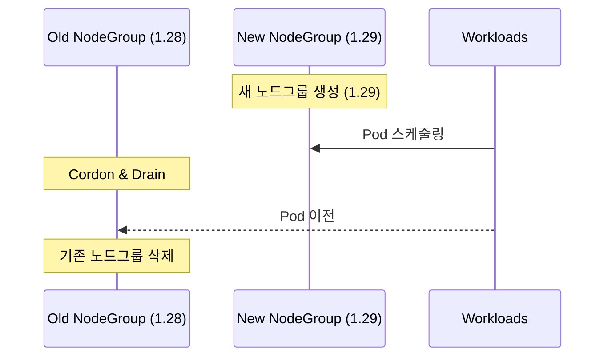

프로덕션 EKS 클러스터를 1.28에서 1.29로 업그레이드한 경험을 공유합니다.

## 업그레이드 프로세스


## 사전 점검 사항

### 1. Deprecated API 확인

```bash
# pluto로 deprecated API 스캔
pluto detect-helm -o wide
pluto detect-files -d manifests/
```

### 2. Add-on 호환성 매트릭스

| Add-on | 현재 버전 | 권장 버전 |
|--------|----------|----------|
| VPC CNI | v1.15.1 | v1.16.0 |
| CoreDNS | v1.10.1 | v1.11.1 |
| kube-proxy | v1.28.2 | v1.29.0 |
| EBS CSI | v1.25.0 | v1.28.0 |

## 업그레이드 실행

### Control Plane

```bash
aws eks update-cluster-version \
  --name my-cluster \
  --kubernetes-version 1.29
```

### Node Group (Blue-Green 방식)



## 교훈

1. **Blue-Green NodeGroup**: 롤백이 쉽고 안전함
2. **Add-on 순서**: metrics-server → CoreDNS → kube-proxy → CNI
3. **충분한 테스트**: staging 환경에서 최소 1주일 검증
