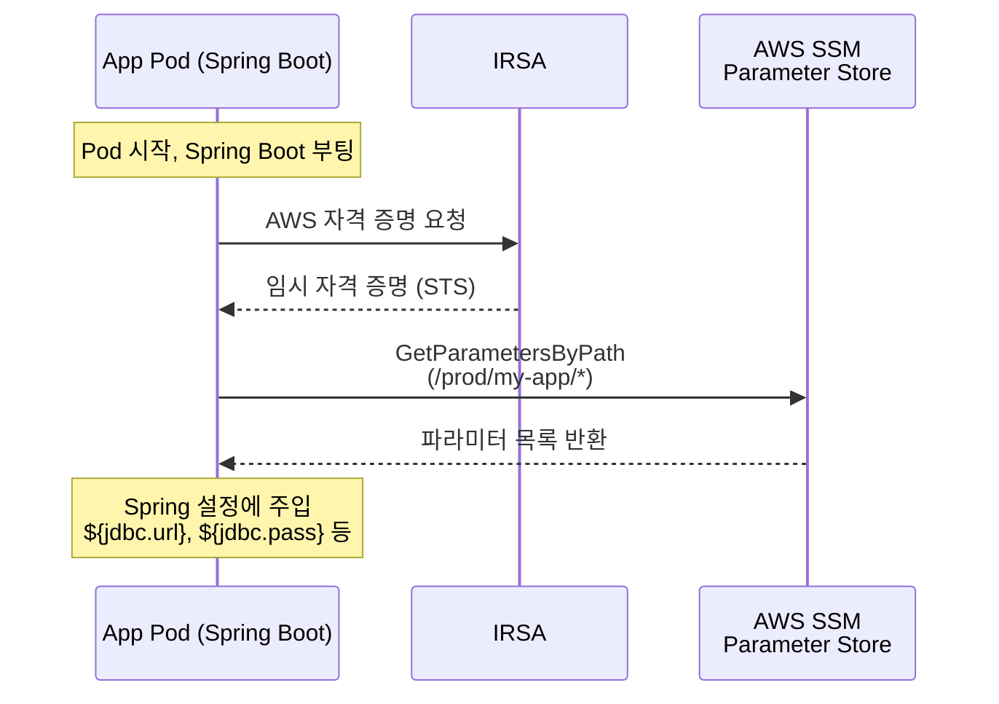
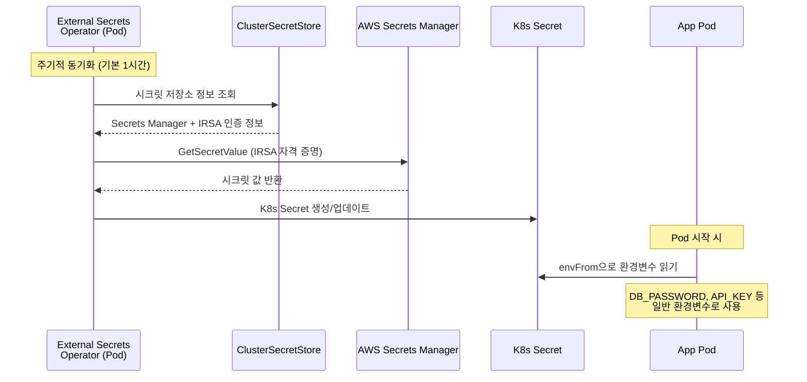
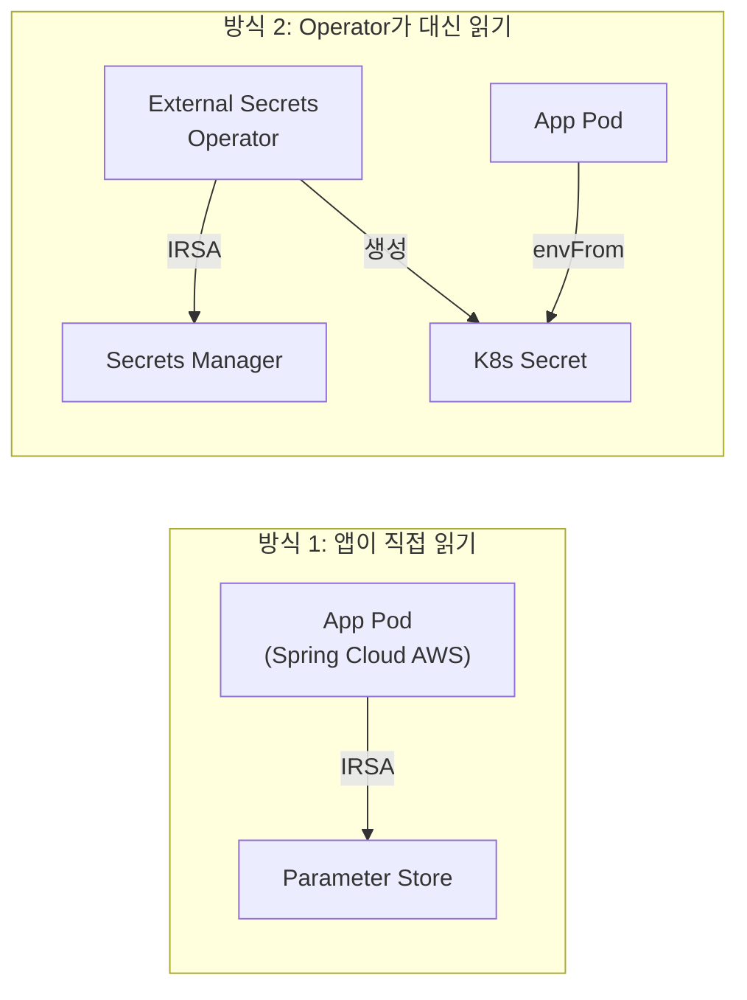

K8s 환경에서 앱이 DB 비밀번호나 API 키 같은 시크릿을 사용하려면, 어딘가에서 가져와야 한다. 이 "어딘가"와 "가져오는 방식"에 따라 아키텍처가 달라진다.

크게 두 가지 접근이 있다. 앱이 AWS API를 직접 호출해서 읽는 방식과, K8s Operator가 대신 읽어서 환경변수로 넣어주는 방식이다. 전자는 Parameter Store 직접 읽기, 후자는 External Secrets Operator다. 각각의 동작 원리와 트레이드오프를 정리한다.

## 방식 1: 앱이 직접 읽기 (Parameter Store)

Spring Boot 기준으로, Spring Cloud AWS가 제공하는 Parameter Store 통합 기능을 사용하는 방식이다.

### 동작 흐름



### 구성 방법

앱 쪽에 두 가지만 설정하면 된다.

**1. 라이브러리 추가:**
```gradle
implementation 'io.awspring.cloud:spring-cloud-aws-starter-parameter-store'
```

**2. application.yml에 경로 지정:**
```yaml
spring:
  config:
    import: 'optional:aws-parameterstore:/${spring.profiles.active}/my-app/'
```

이 한 줄로 해당 경로의 모든 파라미터가 Spring 설정으로 들어온다.

```yaml
# 예: /prod/my-app/jdbc.url 이라는 파라미터가 있으면
datasource:
  url: ${jdbc.url}           # 자동으로 값이 주입됨
  password: ${jdbc.pass}     # /prod/my-app/jdbc.pass 값이 들어옴
```

**인증은 IRSA가 처리한다.** Pod의 ServiceAccount에 SSM 읽기 권한이 있는 IAM Role이 연결되어 있으면, AWS SDK가 자동으로 자격 증명을 획득한다. 앱 코드에서 Access Key를 넣을 필요가 없다.

IRSA의 동작 원리는 [IRSA 완전 정복](/kubernetes/eks-irsa-explained/) 글을 참고한다.

### 특징

- K8s 쪽에는 설정할 게 없다. 앱이 알아서 읽는다.
- 시크릿이 K8s etcd에 저장되지 않는다. 앱 메모리에만 존재한다.
- 시크릿을 바꾸면 앱을 재시작해야 반영된다.
- Spring Cloud AWS 같은 클라우드 전용 라이브러리가 앱에 필요하다.

## 방식 2: Operator가 대신 읽기 (External Secrets)

External Secrets Operator(ESO)가 AWS Secrets Manager에서 시크릿을 가져와서 K8s Secret으로 만들어주는 방식이다.

### 동작 흐름



### 구성 방법

3가지 리소스를 설정해야 한다.

**1. ClusterSecretStore (클러스터 전역, 1회 설정)**

Operator가 어떤 시크릿 저장소를 사용할지 정의한다.

```yaml
apiVersion: external-secrets.io/v1beta1
kind: ClusterSecretStore
metadata:
  name: aws-secrets-manager
spec:
  provider:
    aws:
      service: SecretsManager
      region: ap-northeast-2
      auth:
        jwt:
          serviceAccountRef:
            name: external-secrets-sa       # IRSA가 연결된 ServiceAccount
            namespace: external-secrets
```

Operator의 ServiceAccount에는 Secrets Manager 읽기 권한이 있는 IAM Role이 연결되어야 한다 (IRSA).

**2. ExternalSecret (앱마다 정의)**

어떤 시크릿을 어떤 K8s Secret으로 동기화할지 정의한다.

```yaml
apiVersion: external-secrets.io/v1beta1
kind: ExternalSecret
metadata:
  name: my-app-secrets
  namespace: production
spec:
  refreshInterval: 1h                     # 동기화 주기
  secretStoreRef:
    name: aws-secrets-manager             # 위에서 만든 ClusterSecretStore
    kind: ClusterSecretStore
  target:
    name: my-app-secrets                  # 생성될 K8s Secret 이름
    creationPolicy: Owner
  dataFrom:
    - extract:
        key: prod/my-app                  # Secrets Manager의 시크릿 이름
```

**3. Deployment에서 K8s Secret 참조**

```yaml
spec:
  containers:
    - name: my-app
      envFrom:
        - secretRef:
            name: my-app-secrets          # ExternalSecret이 만든 K8s Secret
```

### 특징

- 앱에 AWS 관련 라이브러리가 필요 없다. 환경변수만 읽으면 된다.
- refreshInterval에 따라 시크릿이 자동 갱신된다. 앱 재시작 없이도 K8s Secret이 업데이트된다 (단, 환경변수로 읽는 경우 Pod 재시작이 필요하다. Volume mount 방식은 자동 반영).
- 시크릿이 K8s etcd에 저장된다.
- Operator Pod가 추가로 필요하다.

## 비교

### 아키텍처 차이



방식 1은 앱이 AWS를 직접 알아야 한다. 방식 2는 Operator가 중간에서 번역해주기 때문에 앱은 K8s Secret만 알면 된다.

### 항목별 비교

| 항목 | Parameter Store 직접 | External Secrets |
|------|---------------------|-----------------|
| **앱 의존성** | 클라우드 SDK/라이브러리 필요 | 없음 (환경변수만) |
| **K8s 설정** | 없음 | ExternalSecret CRD 필요 |
| **시크릿 저장 위치** | 앱 메모리에만 존재 | K8s etcd에 저장됨 |
| **갱신** | 앱 재시작 시 | Operator가 주기적 동기화 |
| **추가 컴포넌트** | 없음 | Operator Pod 필요 |
| **기술 스택 종속** | Spring Boot 등 특정 프레임워크 | 언어/프레임워크 무관 |

### 보안 비교

| 항목 | Parameter Store 직접 | External Secrets |
|------|---------------------|-----------------|
| **전송 구간** | App → AWS API (TLS) | Operator → AWS API → etcd → App |
| **권한 분산** | 각 앱 SA가 자기 것만 읽음 | Operator SA 하나가 전체 시크릿 읽음 |
| **etcd 노출** | 시크릿이 etcd에 없음 | etcd에 저장됨 (`kubectl get secret`으로 조회 가능) |
| **AWS 장애 시** | 앱 부팅 실패 (설정을 못 읽음) | K8s Secret에 캐시됨, 앱 정상 부팅 |

보안 관점에서는 Parameter Store 직접 방식이 더 유리한 부분이 있다. 시크릿이 K8s에 저장되지 않고, 각 앱이 자기 경로만 읽을 수 있다. External Secrets는 Operator에 권한이 집중되고, etcd에 시크릿이 평문으로 남는다.

반면 가용성 관점에서는 External Secrets가 유리하다. AWS 장애 시에도 K8s Secret에 마지막 동기화된 값이 남아있어서 앱이 부팅할 수 있다.

## 어떤 상황에서 뭘 쓸까

**Parameter Store 직접 읽기가 적합한 경우:**
- 앱이 전부 Spring Boot (또는 특정 프레임워크)
- 팀 규모가 크지 않고, 인프라 담당자와 앱 개발자가 가까움
- 이미 잘 돌아가고 있음

**External Secrets가 적합한 경우:**
- 기술 스택이 다양함 (Java, Go, Python, Node 혼재)
- 앱 팀이 AWS를 모르게 하고 싶음
- 시크릿 자동 로테이션이 필요함 (Secrets Manager 네이티브 기능 활용)
- 로컬 개발 시 `.env` 파일만으로 동작하게 하고 싶음

"무조건 External Secrets가 권장"이라기보다, 조건에 따라 적합한 방식이 다르다. 이미 한쪽으로 잘 운영되고 있다면 굳이 바꿀 이유는 없다.

## 참고 자료

- [External Secrets Operator 공식 문서](https://external-secrets.io/latest/)
- [Spring Cloud AWS Parameter Store](https://docs.awspring.io/spring-cloud-aws/docs/current/reference/html/index.html#integrating-your-spring-cloud-application-with-the-aws-parameter-store)
- [AWS Secrets Manager 공식 문서](https://docs.aws.amazon.com/secretsmanager/latest/userguide/intro.html)
- [AWS SSM Parameter Store 공식 문서](https://docs.aws.amazon.com/systems-manager/latest/userguide/systems-manager-parameter-store.html)
