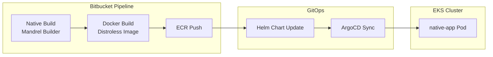

JVM의 Cold Start는 순간 트래픽 상황에서 치명적이다. 스케일 아웃이 되어도 새 Pod가 준비되기까지 시간이 걸리면 이미 늦는다. GraalVM Native Image는 이 문제를 해결한다.

광고 푸시 후 순간 트래픽이 몰리는 서비스에 GraalVM Native 이미지를 적용했다. 개발자가 애플리케이션을 만들고, 나는 CI/CD 파이프라인 구축과 배포, 부하 테스트를 담당했다. 빌드 시간과 이미지 크기를 줄이면서 보안 규격까지 맞춘 과정을 공유한다.

## 서비스 특성

이 서비스는 광고성 메시지를 대량으로 발송한 직후 트래픽이 급증한다. 사용자들이 링크를 클릭하면 반드시 이 서버를 거쳐야 하는 구조다.

**요구사항:**
- 순간 트래픽 급증 대응
- 빠른 스케일 아웃 (Cold Start 최소화)
- 안정적인 응답 시간

JVM 기반이었다면 새 Pod가 뜨고 JIT 웜업까지 시간이 걸렸을 것이다. GraalVM Native는 이런 상황에 적합하다.

## 결과 요약

| 항목 | Before | After | 개선 |
|------|--------|-------|------|
| 빌드 시간 | 6m 44s | 3m 54s | 42%↓ |
| 이미지 크기 | 132MB | 51MB | 61%↓ |
| 응답 시간 | - | 4-14ms | - |
| 메모리 사용량 | - | ~22-40MB | - |

## 아키텍처



## CI/CD 파이프라인

### Native Build

Quarkus + Mandrel(GraalVM 기반) 조합으로 Native 바이너리를 빌드한다.

```yaml
# bitbucket-pipelines.yml
- step: &native-build
    name: Native Build
    image: quay.io/quarkus/ubi9-quarkus-mandrel-builder-image:23.1-jdk-21
    caches:
      - gradle
    runs-on:
      - self.hosted
      - linux
    size: 8x
    script:
      - |
        ./gradlew --no-daemon build \
          -Dquarkus.package.type=native \
          -Dquarkus.native.native-image-xmx=6g \
          -Dquarkus.otel.enabled=true
```

**빌드 시간 최적화 포인트:**
- **Gradle 캐시**: `~/.gradle` 캐싱으로 의존성 다운로드 시간 절약
- **Self-hosted Runner**: 8x 사이즈로 충분한 리소스 확보
- **Mandrel Builder**: GraalVM 기반 빌더, Native Image 빌드에 최적화

### Docker Image 최적화

이미지 크기를 132MB → 51MB로 줄인 핵심은 **Distroless + Multi-stage Build**다.

```dockerfile
# Stage 1: zlib 라이브러리만 추출
FROM debian:12-slim AS zlib-stage
RUN apt-get update && \
    apt-get install -y --no-install-recommends zlib1g && \
    rm -rf /var/lib/apt/lists/*

# Stage 2: Distroless 런타임
FROM gcr.io/distroless/cc-debian12:nonroot
WORKDIR /app/

# 필요한 라이브러리만 복사
COPY --from=zlib-stage /usr/lib/x86_64-linux-gnu/libz.so.1* /usr/lib/x86_64-linux-gnu/

# 애플리케이션 바이너리
COPY --chmod=0755 build/*-runner /app/application

EXPOSE 8080
ENTRYPOINT ["/app/application", "-Dquarkus.http.host=0.0.0.0"]
```

**Distroless 선택 이유:**
| 항목 | UBI Minimal | Distroless |
|------|-------------|------------|
| 크기 | ~100MB+ | ~20MB |
| 쉘 | 있음 | 없음 |
| 패키지 매니저 | 있음 | 없음 |
| CVE | 많음 | 최소화 |

Distroless는 쉘도 없고 패키지 매니저도 없다. 디버깅이 불편하지만 보안 관점에서는 공격 표면이 줄어든다.

### Distroless 적용 시 삽질

처음 Distroless로 전환했을 때 `libz.so.1` 라이브러리가 없어서 바이너리가 실행되지 않았다.

```
error while loading shared libraries: libz.so.1: cannot open shared object file
```

해결책으로 Multi-stage Build를 도입했다. Debian에서 zlib만 추출해서 Distroless 이미지에 복사하는 방식이다.

## 부하 테스트 (K6)

배포 전 K6로 부하 테스트를 진행했다.

### 테스트 시나리오

```javascript
export const options = {
    scenarios: {
        traffic_test: {
            executor: 'constant-arrival-rate',
            rate: 100,           // 초당 100 iteration
            timeUnit: '1s',
            duration: '60s',
            preAllocatedVUs: 200,
            maxVUs: 300,
        },
    },
    thresholds: {
        http_req_failed: ['rate<0.03'],      // 실패율 3% 이하
        encrypt_duration: ['p(95)<300'],     // p95 < 300ms
        lookup_duration: ['p(95)<300'],
    },
};
```

- **200 RPS** (POST + GET 합산)
- **p95 < 300ms** 목표
- **실패율 < 3%** 기준

### 테스트 결과

테스트를 통해 두 가지를 확인했다:

1. **애플리케이션은 문제없다**: 응답 시간 4-14ms로 충분히 빠름
2. **병목은 DB였다**: Dev DB가 Prod DB보다 스펙이 좋아서 Dev에서 더 좋은 결과가 나옴

애플리케이션 레벨에서 더 최적화할 여지는 있겠지만, 현재 병목이 DB라는 것을 확인했으므로 앱 최적화는 우선순위에서 내렸다.

## 운영 현황

현재 Prod에서 문제없이 운영 중이다.

**Datadog APM 기준:**
- 응답 시간: 8-14ms (Prod), 4-5ms (Dev)
- 메모리: ~22-40MB
- 에러율: 거의 0%

GraalVM Native의 장점이 잘 드러나는 수치다. JVM이었다면 메모리만 수백 MB는 썼을 것이다.

## 한계점

몇 가지 한계가 있다.

**테스트 강도**: 소규모 B2B SaaS를 가정한 RPS 산정이다. 더 높은 강도의 테스트도 필요하다.

**JVM 대비 성능**: GraalVM Native는 Cold Start가 빠르지만, 충분히 워밍업된 JVM보다 처리 성능이 떨어질 수 있다. JIT 컴파일러의 런타임 최적화가 없기 때문이다. 지속적인 고부하 상황에서는 JVM이 더 나을 수 있다.

결국 GraalVM Native는 "순간 트래픽 → 빠른 스케일 아웃"이 중요한 경우에 적합하다. 상시 고부하 서비스라면 JVM + 충분한 워밍업이 더 나은 선택일 수 있다.

## 정리

GraalVM Native 이미지 도입의 핵심:

1. **Cold Start 최소화**: 순간 트래픽 시 빠른 스케일 아웃
2. **이미지 경량화**: Distroless + Multi-stage Build
3. **빌드 최적화**: Gradle 캐시, Self-hosted Runner
4. **부하 테스트**: K6로 병목 지점 확인

Native 이미지는 빌드 시간이 오래 걸리고 디버깅이 어렵다는 단점이 있다. 하지만 순간 트래픽 대응이 중요한 서비스에서는 그 단점을 감수할 가치가 있다.
