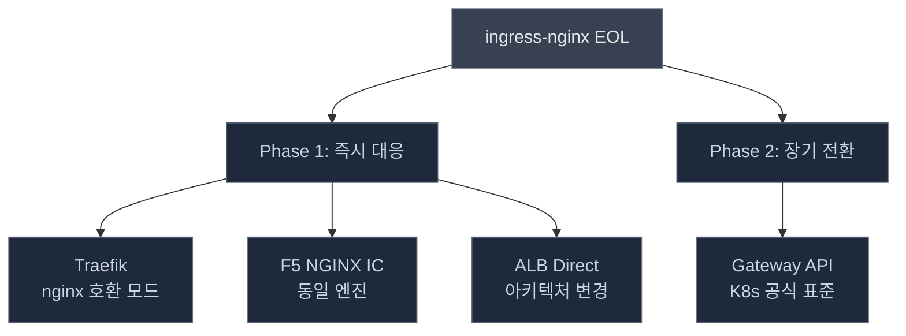
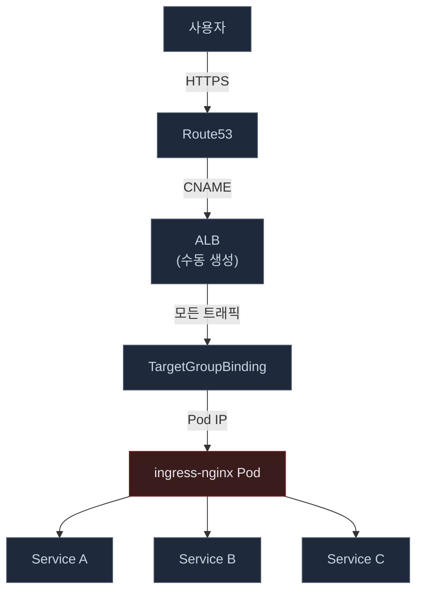
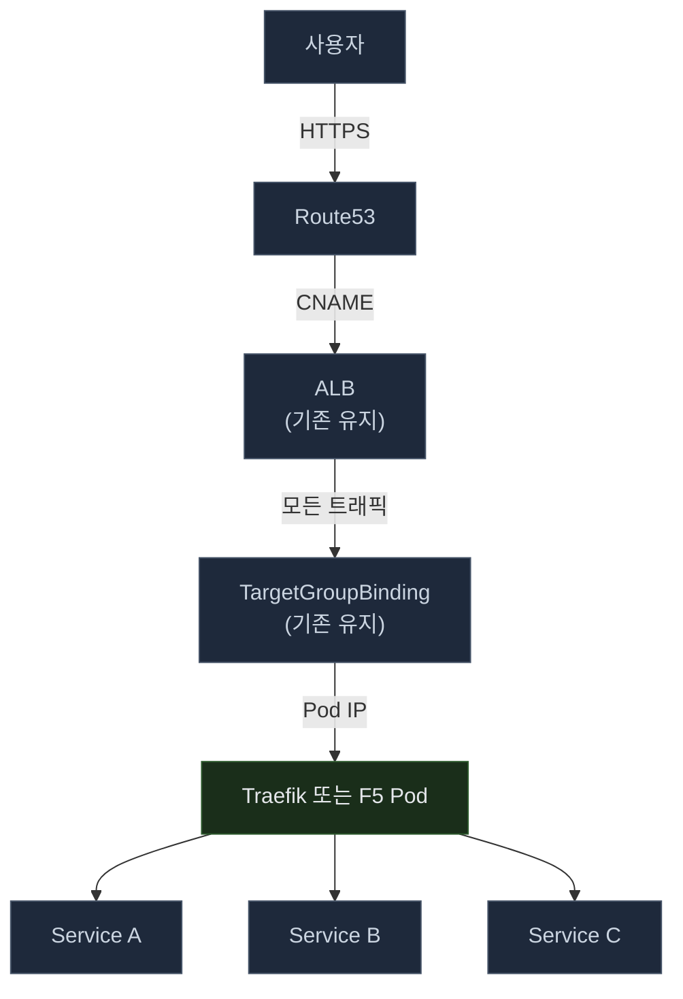
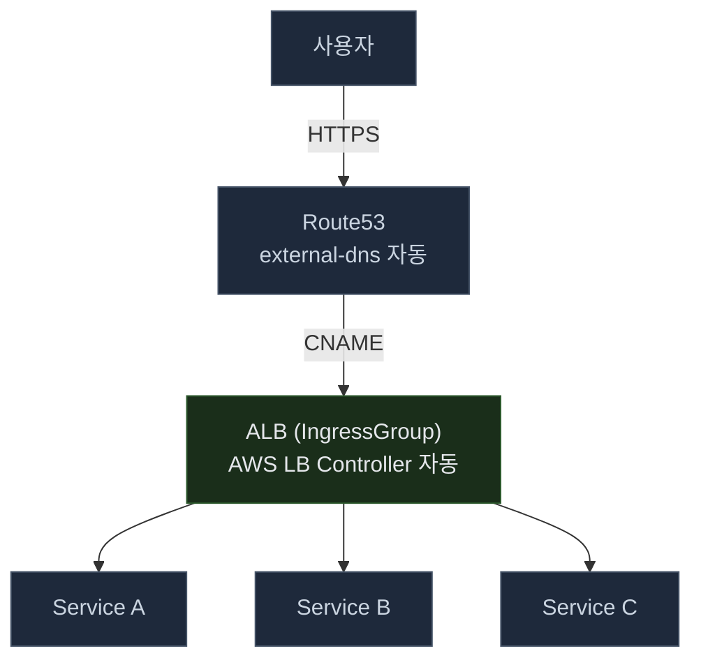
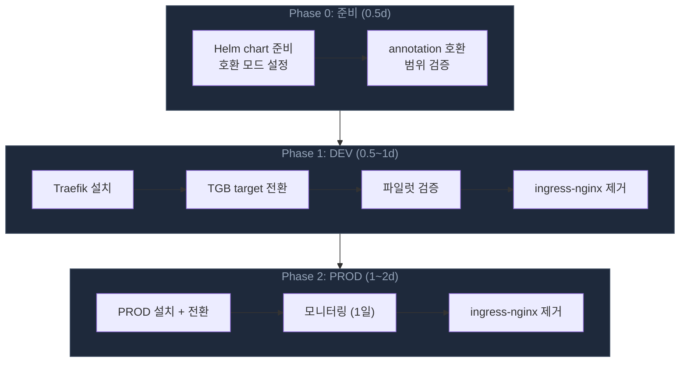
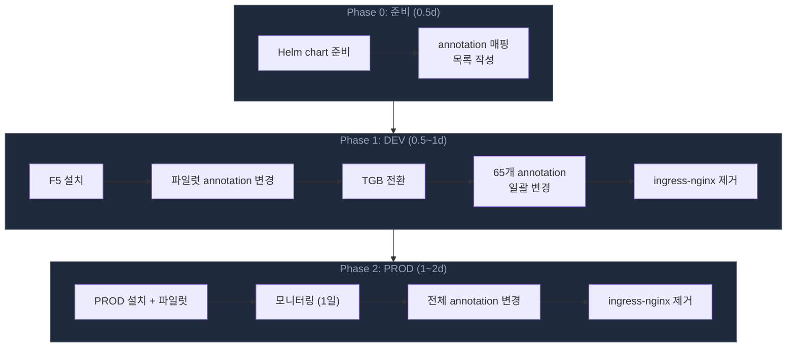
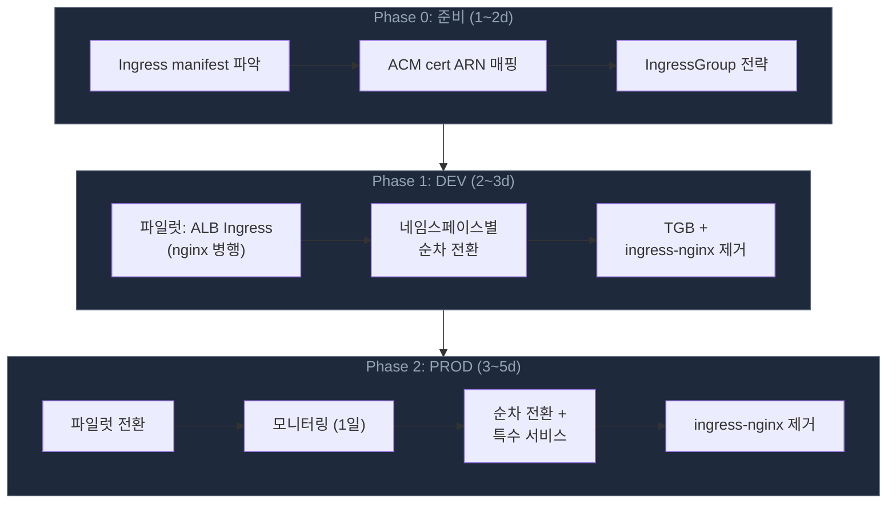
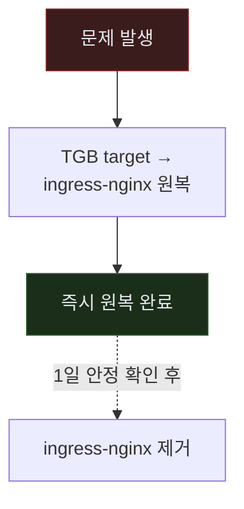
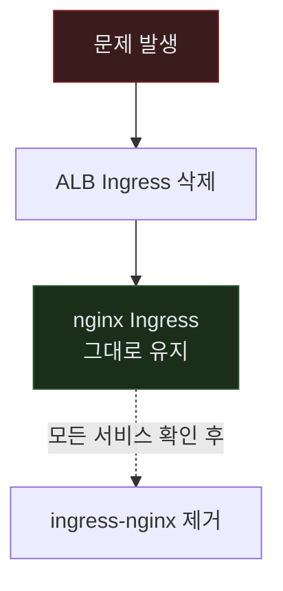
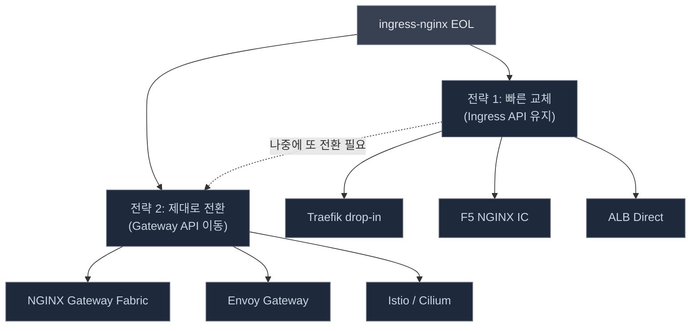

인프라에서 가장 위험한 컴포넌트는 "잘 돌아가고 있어서 아무도 신경 쓰지 않는 것"이다. ingress-nginx가 정확히 그랬다.

2025년 11월, Kubernetes 공식 블로그에서 ingress-nginx의 EOL을 발표했다. 유지보수자 1~2명(자원봉사)이 감당할 수 없는 기술 부채가 쌓였고, 후속 프로젝트(InGate)도 무산됐다. 2026년 3월부터 보안 패치, 버그 수정, 신규 K8s 버전 지원이 모두 중단된다. 클러스터에는 88개의 Ingress 리소스가 이 위에 올라가 있었다. 이 글은 "그래서 뭘로 바꿀 것인가"를 조사한 기록이다.

## EOL 타임라인

| 시점 | 상태 | 의미 |
|------|------|------|
| 2025-11 | EOL 발표 | Kubernetes 공식 블로그에서 retirement 공지 |
| 2026-02 | Best-effort 기간 | 보안 패치 없음, 유지보수자 자발적 대응만 |
| 2026-03 | **Full EOL** | 모든 지원 중단 — 보안 패치, 버그 수정, 신규 K8s 버전 지원 없음 |
| 이후 | Repo Archived | `kubernetes-retired/`로 이관 |

EOL 이후 기존 배포가 즉시 멈추지는 않는다. 하지만 보안 취약점이 발견되어도 패치가 나오지 않는다. 시한부 운영인 셈이다.

참고로 F5 NGINX Ingress Controller(`nginxinc/kubernetes-ingress`)는 별개 프로젝트로 EOL 대상이 아니다. 이름이 비슷해서 혼동하기 쉽다.

## 왜 ingress-nginx를 쓰고 있었나

EOL 대응을 논하기 전에, 왜 ingress-nginx가 필요했는지부터 짚어야 한다. "뭘로 바꿀까"보다 "왜 이걸 쓰고 있었나"를 먼저 이해해야 올바른 대안을 고를 수 있다.

비용 하나 때문이 아니다. ingress-nginx가 사실상 표준이 된 건 여러 요인의 복합이다.

| # | 요인 | 설명 |
|---|------|------|
| 1 | **시간적 선점** | 2016년 탄생. ALB Ingress Controller(2018)보다 2년, EKS GA(2018.06)보다 2년 빠름. 대안이 없었다. |
| 2 | **K8s 공식 구현체** | `kubernetes/ingress-nginx` — K8s 조직 직하 프로젝트. Ingress API의 레퍼런스 구현이자 CKA/CKAD 시험 기본 도구. |
| 3 | **Cloud-Agnostic** | AWS/GCP/Azure/On-prem 어디서든 동일하게 동작. ALB Controller는 AWS 전용. |
| 4 | **NGINX 엔진 성숙도** | 2004년부터 20년 검증된 리버스 프록시. 90+ 어노테이션으로 rewrite, rate limiting, auth, canary 등 ALB보다 풍부한 L7 기능. |
| 5 | **AWS 공식 가이드** | AWS 공식 블로그에서 [NLB + ingress-nginx 조합을 권장](https://aws.amazon.com/blogs/opensource/network-load-balancer-nginx-ingress-controller-eks/)할 정도였다. |
| 6 | **비용 구조** | Ingress 1개 = ALB 1개 문제. LB 1개 + nginx Pod로 서비스 N개를 라우팅하여 비용 절감. |

결국 **경로 의존성(path dependency)**이다. 대안이 없던 시절에 자리잡고, 대안이 생겼을 때는 이미 전환 비용이 너무 커서 그대로 유지된 패턴이다.

**하지만 상황이 바뀌었다.**

| 과거 (2016~2020) | 현재 (2020~) |
|------|------|
| ALB Ingress Controller 미존재 또는 미성숙 | AWS LB Controller가 성숙, 이미 설치되어 있음 |
| Ingress 1개 = ALB 1개 (IngressGroup 없음) | **IngressGroup** annotation으로 Ingress N개 = ALB 1개 가능 |
| ALB는 단순 L7 LB, nginx가 기능 우위 | ALB가 gRPC, WebSocket, 경로 기반 라우팅 네이티브 지원 |
| AWS도 NLB + ingress-nginx 조합을 공식 가이드 | ALB Direct가 권장 아키텍처 |

이 변화의 타임라인을 정리하면 다음과 같다.

| 시점 | 이벤트 |
|------|--------|
| 2016-03 | **ingress-nginx 최초 릴리스** — Ingress API의 공식 레퍼런스 구현으로 탄생 |
| 2018-06 | ALB Ingress Controller가 SIG-AWS에 편입 + **EKS GA 출시**. **Ingress 1개 = ALB 1개**가 기본 동작 |
| 2018-10 | [GitHub Issue #688](https://github.com/kubernetes-sigs/aws-load-balancer-controller/issues/688) — "ALB 공유" feature request 등록. 120개+ ELB 관리 문제 제기 |
| 2020-10 | **v2.0.0 GA 릴리스** — IngressGroup 정식 포함. 리네이밍: ALB Ingress Controller → AWS Load Balancer Controller |

2020년 IngressGroup GA 이후 nginx Pod를 중간에 둘 이유가 사라졌지만, 이미 구축된 아키텍처를 굳이 바꿀 이유가 없어서 그대로 남아 있었던 것이다.

게다가 nginx Pod는 SPOF(단일 장애점)다. 이 Pod가 죽으면 전체 트래픽이 중단된다. ALB는 AWS 관리형으로 자체 고가용성을 보장한다.

EOL이 아니더라도, 지금 ingress-nginx를 계속 쓸 이유는 거의 없다. **EOL은 이 전환을 앞당기는 트리거일 뿐이다.**

## 환경 현황

### 클러스터 현황

| 클러스터 | ingress-nginx 버전 | Pods | Ingress 수 |
|---------|-------------------|------|-----------|
| DEV (EKS) | v1.12.1 | 1 | 65 |
| PROD (EKS) | v1.10.0 | 3 | 23 |

DEV 클러스터 1개, PROD 클러스터 1개. 총 88개 Ingress가 ingress-nginx에 의존하고 있었다.

### 네임스페이스 분포

**DEV (65개)**

| Namespace | Count | 비율 |
|-----------|-------|------|
| dev-team-a | 26 | 40% |
| dev-team-b | 19 | 29% |
| staging-team-b | 7 | 11% |
| staging-team-a | 5 | 8% |
| shared | 4 | 6% |
| infra | 4 | 6% |

**PROD (23개)**

| Namespace | Count | 비율 |
|-----------|-------|------|
| prod-team-a | 8 | 35% |
| prod-team-b | 7 | 30% |
| prod-shared | 2 | 9% |
| monitoring | 2 | 9% |
| infra | 4 | 17% |

### nginx Annotation 사용 현황

마이그레이션 난이도를 결정하는 핵심 변수는 "nginx 고유 annotation을 얼마나 쓰고 있느냐"이다. 88개 Ingress를 전수 조사했다.

| Annotation | DEV | PROD | 비고 |
|-----------|-----|------|------|
| `proxy-body-size` | 24 | 9 | 업로드 크기 제한 |
| `backend-protocol` | 1 | 2 | gRPC 서비스 |
| `proxy-read-timeout` | 0 | 1 | |
| `proxy-send-timeout` | 0 | 1 | |
| `server-snippets` | 0 | 1 | WebSocket |
| `use-regex` | 0 | 1 | |

결론: nginx 고유 annotation 사용이 **매우 적다**. 대부분의 Ingress는 `host`와 `path` 정도만 쓰고 있었다. 어떤 대안을 선택하든 기술적 블로커는 거의 없는 상황이었다.

## 대안 비교

### 후보 목록

조사한 대안은 5가지였다.

| 순위 | Solution | Migration 난이도 | EKS 적합도 | 장기 지속성 | 핵심 요인 |
|-----|----------|-----------------|-----------|-----------|----------|
| 1st | AWS LB Controller (ALB) | Medium | Best | High | 이미 설치됨, AWS native |
| 2nd | F5 NGINX IC | Easy | Good | High | 동일 NGINX 엔진, 최소 노력 |
| 3rd | Gateway API (Envoy 등) | Hard | Good | Highest | K8s 공식 차세대 표준 |
| 4th | Traefik | Medium | Good | High | nginx 호환 모드, CNCF 생태계 |
| 5th | Kong | Hard | Good | High | 순수 Ingress 용도엔 과함 |

순위는 **우리 환경 기준**이다. AWS 공식 블로그에서도 ALB와 nginx를 "모두 유효한 선택지"로 소개하고 있으며, "ingress-nginx 대신 ALB를 쓰라"고 권장한 적은 없다.

### 커뮤니티 트렌드

ingress-nginx EOL 발표 이후 커뮤니티에서 실제로 어떤 선택을 하고 있는지 조사했다.

**커뮤니티 선호도:**

| 순위 | 선택지 | 반응 |
|-----|-------|------|
| 1위 | Traefik | nginx annotation 호환 모드 (사용량 80% 커버, experimental), CORS/rate limiting 네이티브 |
| 2위 | Gateway API (Envoy 등) | K8s 공식 장기 표준. 구현체 성숙도가 빠르게 올라오는 중 |
| 3위 | F5 NGINX IC | 가장 쉬운 전환. OIDC/metrics 등 상용 paywall 우려 |
| 4위 | ALB (AWS) | AWS 환경 유효. CORS/rate limiting 네이티브 미지원 |

커뮤니티에서 가장 많이 논의되는 전략은 **2단계 접근**이었다.

- **Phase 1 (지금)**: Traefik nginx 호환 모드로 drop-in 교체 → EOL 해결
- **Phase 2 (나중에)**: Gateway API + HTTPRoute로 점진 전환 → 아키텍처 개선

단, Traefik의 Gateway API 호환성에 대해서는 주의가 필요하다. 후술하는 [Gateway API 구현체 평가](#gateway-api-구현체-평가)에서 다루지만, 요즘IT 기사 기준으로 Traefik은 Gateway API 적합성 테스트에서 B등급을 받았다 (다만 현재 공식 기준으로는 Conformant를 달성한 상태다). "drop-in 교체는 빠르지만 Gateway API 전환까지 고려하면 Traefik이 최선은 아닐 수 있다"는 시각도 존재한다.

F5에 대해서는 "OSS 버전은 기본만 제공, OIDC/session affinity/상세 metrics는 NGINX Plus(상용) 필요"라는 우려가 다수였다.

### 실제 마이그레이션 사례

| 회사 | 선택 | 규모 | 소요 시간 | 핵심 교훈 |
|------|------|------|----------|----------|
| [Skyscrapers](https://skyscrapers.eu/the-end-of-ingress-nginx-how-were-navigating-the-migration/) (벨기에 MSP) | Traefik + ALB | 1,097 Ingress, 89종 annotation | 진행 중 | F5 paywall로 탈락. snippet 56건이 최대 도전 |
| [CyberArk](https://developer.cyberark.com/blog/ingress-nginx-is-retiring-our-practical-journey-to-gateway-api/) (보안 기업) | Envoy Gateway | ~60 파일 수정 | 2주, 다운타임 0 | 병렬 운영 후 DNS 전환 |
| [codecentric](https://www.codecentric.de/en/knowledge-hub/blog/nginx-ingress-retirement-dont-panic-weve-got-you-covered) (독일 컨설팅) | Traefik | - | - | drop-in 먼저, Gateway API는 나중에 |
| [ayedo](https://ayedo.de/en/posts/ingress-nginx-lauft-aus-so-migrierst-du-bis-marz-2026-sauber/) (독일 MSP) | Traefik | - | - | 병렬 설치 → 점진 전환 → 무중단 |

조사 범위 내에서 **F5를 실제로 선택한 사례를 찾지 못했다**. 커뮤니티에서 대안으로 언급은 되지만, 실제 채택 후기가 없는 상태다.

**Skyscrapers와의 비교:**

| 항목 | Skyscrapers | 우리 |
|------|------------|------|
| Ingress 수 | 1,097개 | 88개 |
| nginx annotation | 89종 | 6종 |
| snippets | 56건 | 1건 |
| CORS/rate limit | 208건 | 0건 |

그들의 최대 난제(snippet 56건)가 우리에게는 해당되지 않는다. annotation 사용이 워낙 적어서 어떤 경로를 택해도 부담이 적다.

## 아키텍처: Before & After

### 현재 구조 (ingress-nginx 경유)

ingress-nginx Pod가 **모든 트래픽의 단일 경유점(SPOF)**이다. 이 Pod가 죽으면 전체 트래픽이 중단된다. ALB는 수동으로 생성했고, TargetGroupBinding이라는 K8s 리소스로 ingress-nginx Pod IP를 Target Group에 자동 등록하는 구조다.

### Path A/B: Ingress Controller 교체 (Traefik 또는 F5)

**구조 변경 없음.** ingress-nginx Pod 자리에 새 컨트롤러가 들어갈 뿐이다. ALB, TargetGroupBinding, DNS 모두 그대로 유지한다.

### Path C: ALB 직접 연결

ingress-nginx Pod 레이어가 사라진다. ALB가 Host 헤더 기반으로 직접 서비스 Pod에 라우팅한다. AWS LB Controller가 Ingress 리소스를 감시하고 ALB 리스너 규칙과 Target Group을 자동으로 생성/관리한다.

**핵심 차이:**

| | Before | After (Path C) |
|---|--------|---------------|
| 경로 | ALB → ingress-nginx Pod → 서비스 Pod (3 hop) | ALB → 서비스 Pod (2 hop) |
| 관리 | ALB, TGB 수동 관리 | Ingress 작성 → ALB, TG, DNS 전부 자동 |
| 장애점 | Pod 장애 = 전체 중단 | ALB = AWS 관리형 고가용성 |
| 보안 | EOL 후 패치 없음 | AWS가 보안/가용성 책임 |

## 3가지 마이그레이션 경로

### 경로 비교

| | Path A: Traefik | Path B: F5 NGINX IC | Path C: ALB Direct |
|---|----------------|--------------------|--------------------|
| **전략** | EOL 해결 (최소 변경) | EOL 해결 (최소 변경) | EOL 해결 + 아키텍처 개선 |
| **구조 변경** | 없음 | 없음 | 있음 (nginx Pod 레이어 제거) |
| **Ingress yaml 수정** | 거의 없음 (호환 모드) | 소폭 (annotation namespace 변경) | 전면 재작성 (88개) |
| **작업량** | 1~3일 | 1~3일 | 7~11일 |
| **3월 데드라인** | 여유 | 여유 | 빠듯 |
| **Gateway API** | 지원 (기사 B등급, 현재 Conformant) | 별도 (NGINX Gateway Fabric) | AWS LB Controller v2.14+ |
| **리스크** | 새 컨트롤러 학습, 호환 모드 검증 | 가장 낮음 (동일 엔진) | 작업량, IngressGroup 설계 |
| **추후 재전환** | 필요할 수 있음 (기사 B등급, 현재 Conformant) | 필요할 수 있음 | 불필요 |

IngressGroup이 있는 지금, ingress-nginx를 계속 쓸 이유가 거의 없다. 이상적으로는 ALB Direct(Path C)가 가장 깔끔하지만, 3월 데드라인 내 88개 Ingress 전면 재작성이 부담이면 Path A/B로 빠르게 EOL 해결 후 별도 전환도 가능하다.

### Path A: Traefik

**장점:**
- nginx annotation 호환 모드 (v3.5)로 기존 Ingress yaml 거의 그대로 사용
- CNCF 생태계, 활발한 개발, 내장 대시보드

**단점:**
- 새 컨트롤러 학습 필요
- 호환 모드의 실제 호환 범위를 검증해야 함
- 고부하 시 NGINX 대비 성능 우려
- Gateway API 적합성: 기사 기준 B등급, 현재 Conformant 달성 (아래 주석 참고)

### Path B: F5 NGINX IC

**장점:**
- 동일 NGINX 엔진 → 동작이 가장 유사하고 리스크가 가장 낮음
- 기존 운영 노하우 그대로 활용 가능
- F5 전담팀 유지, Apache 2.0 라이선스

**단점:**
- 구조적 개선 없음 (Pod 기반 동일)
- 장기적으로 재전환이 필요할 수 있음
- annotation namespace 변경 필요 (`nginx.ingress.kubernetes.io` → `nginx.org`)

### Path C: ALB Direct

**장점:**
- AWS LB Controller가 이미 설치되어 있고, PROD에 검증된 패턴 존재
- 관리형 데이터 플레인 (AWS가 HA 보장)
- 한 번에 EOL + 아키텍처 개선
- WAF, ACM, Shield 직접 연동

**단점:**
- 88개 Ingress 전면 재작성 필요
- IngressGroup 설계 필수 (Ingress당 ALB 1개씩 만들면 비용 폭증)
- 3월 데드라인에 빠듯

## Rollback 전략

**Path A/B:**

**Path C:**

Path A/B는 TGB 하나만 바꾸면 되므로 롤백이 매우 빠르다. Path C는 nginx Ingress와 ALB Ingress를 병행 운영하므로 DNS 전환 전까지 서비스별 개별 롤백이 가능하다.

## 특수 서비스

| 서비스 유형 | 프로토콜 | Traefik | F5 NGINX IC | ALB |
|-----------|---------|---------|------------|-----|
| 모니터링 대시보드 | WebSocket | 기본 지원 | 동일 엔진, 그대로 동작 | native WebSocket + stickiness |
| 메트릭 수집기 | gRPC | 기본 지원 (h2c) | annotation만 변경 | gRPC support + backend-protocol-version |
| GitOps UI | UI + gRPC 혼합 | IngressRoute로 분리 가능 | annotation namespace만 변경 | 별도 검토 필요 |

## Gateway API 구현체 평가

앞서 정리한 3가지 경로는 모두 **Ingress API 기반**이다. 즉, 컨트롤러만 교체하고 기존 Ingress 리소스를 계속 사용하는 접근이다.

하지만 다른 시각도 있다. Kubernetes Gateway API는 Ingress API의 공식 후속 표준으로, 이미 GA(v1.4)에 도달했다. "어차피 Ingress API도 결국 deprecated될 것이라면, 지금 바로 Gateway API로 가는 게 맞지 않느냐"는 주장이다.

### Gateway API가 해결하는 문제

Gateway API는 Ingress API의 구조적 한계를 해결하기 위해 설계됐다.

**1. 역할 분리.** Ingress API는 하나의 리소스에 모든 것이 섞여 있다. Gateway API는 역할별로 분리된다.

| 리소스 | 누가 관리 | 예시 |
|--------|----------|------|
| GatewayClass | 인프라팀 | "우리는 NGINX Gateway Fabric을 쓴다" |
| Gateway | 플랫폼팀 | "443 포트, TLS 인증서, 이 도메인들" |
| HTTPRoute | 개발팀 | "/api → 내 서비스로 보내줘" |

개발팀이 라우팅 규칙만 건드리고, 게이트웨이 설정은 못 건드리게 할 수 있다. 대규모 멀티팀 환경에서 의미가 크다.

**2. Ingress API보다 표현력이 높다.**

| 기능 | Ingress API | Gateway API |
|------|------------|-------------|
| 헤더 기반 라우팅 | annotation 의존 | 네이티브 |
| 트래픽 분할 (카나리) | 불가 | weight 기반 네이티브 |
| 요청 미러링 | 불가 | 네이티브 |
| gRPC 전용 라우트 | annotation | GRPCRoute |
| cross-namespace 라우팅 | 제한적 | 명시적 permission grant |

**3. 벤더 독립성.** ALB Ingress annotation은 AWS 전용이다. Gateway API는 K8s 표준이라 AWS → GCP → on-prem 어디서든 동일한 HTTPRoute가 동작한다.

**4. Ingress API는 이미 동결 상태다.** 새 기능이 추가되지 않는다. Gateway API가 공식 후속이고, 언젠가 Ingress API도 deprecated될 가능성이 있다.

### 우리 환경에서의 판단

다만 냉정하게 보면, **우리 환경에서 Gateway API가 당장 필요한 이유는 거의 없다.**

- **역할 분리** — 팀 규모가 크지 않아서 Ingress 하나에 다 넣어도 문제없다
- **고급 라우팅** — 카나리, 트래픽 미러링을 쓰지 않는다. host + path 라우팅이면 충분하다
- **벤더 독립성** — 100% AWS 환경이고, 클라우드 이전 계획이 없다
- **Ingress deprecated** — 아직 시점이 정해지지 않았고, 수년은 걸릴 것이다

Gateway API는 "대규모 멀티팀 + 멀티클라우드 + 고급 라우팅"에서 빛나는 표준이다. 소규모 단일 클라우드 환경에서는 ALB Direct로 충분하고, Gateway API는 "있으면 좋지만 없어도 문제없는" 수준이다. 도입할 이유가 있다면 딱 하나 — "Ingress API가 deprecated되면 또 마이그레이션해야 하는데, 그걸 두 번 하기 싫다" 정도다. 하지만 그 "언젠가"가 3~5년 뒤일 수 있고, 그때 가서 해도 된다.

### 적합성 테스트 결과

그럼에도 Gateway API를 고려한다면, **어떤 구현체가 실제로 얼마나 잘 작동하는가**가 핵심이다. Kubernetes SIG-Network에서 운영하는 Gateway API 적합성 테스트(100라운드)를 기준으로 정리하면 다음과 같다.

### 적합성 테스트 결과

| 등급 | 구현체 | 특징 |
|-----|-------|------|
| **A등급** (100라운드 통과) | NGINX Gateway Fabric | NGINX의 Gateway API 전용 구현체. F5 NGINX IC와 별개 프로젝트 |
| **A등급** | Envoy Gateway | Envoy 기반. 신규 프로젝트에 적합, 빠른 성장세 |
| **A등급** | Istio | 서비스 메시 기반. 이미 Istio를 쓰고 있다면 자연스러운 선택 |
| **A등급** | Cilium | eBPF 기반. CNI + Gateway API 통합 |
| **B등급** (일부 미통과) | Traefik | 인기는 높지만 Gateway API 적합성에서 일부 미달 |
| **B등급** | Kong | API Gateway 기반. 순수 Ingress 용도엔 과한 면 |

요즘IT 기사 기준으로 **Traefik이 B등급**이라는 점이 눈에 띈다. 다만 Gateway API 공식 implementations 페이지(v1.4.0 기준)에서는 Traefik이 **Conformant**를 달성한 상태다. Kong만 Partially Conformant(v1.2.1)로 남아 있다. 기사 작성 시점과 현재 시점의 차이가 있을 수 있으므로, 실제 도입 시에는 공식 페이지에서 최신 적합성을 확인해야 한다.

**NGINX Gateway Fabric**은 이 조사에서 초기에 고려하지 않았던 옵션이다. F5 NGINX Ingress Controller(Ingress API용)와는 별개 프로젝트로, Gateway API를 위해 새로 만들어진 구현체다. A등급 통과에 NGINX 엔진 기반이라 기존 운영 경험을 살릴 수 있다.

### 두 가지 전략

이 조사를 통해 두 가지 전략이 명확해졌다.

| | 전략 1: 빠른 교체 | 전략 2: 제대로 전환 |
|---|-----------------|------------------|
| **접근** | 컨트롤러만 교체, Ingress API 유지 | Gateway API + HTTPRoute로 이동 |
| **대표 선택지** | Traefik, F5 NGINX IC, ALB | NGINX Gateway Fabric, Envoy Gateway |
| **작업량** | 적음 (1~11일) | 많음 (Ingress → HTTPRoute 전환) |
| **장기 비용** | 재전환 필요할 수 있음 | 한 번에 끝 |
| **리스크** | 낮음 (익숙한 패턴) | 높음 (새 API, 생태계 학습) |
| **적합한 상황** | 데드라인 촉박, 안정성 우선 | 시간 여유, 장기 투자 가치 판단 |

CyberArk 사례(앞서 실제 마이그레이션 사례 참고)가 전략 2의 실증이다. ~60개 파일 수정, 2주, 다운타임 0으로 Envoy Gateway로 전환했다.

## 시사점

조사를 마치고 정리한 판단 기준은 다음과 같다.

**ingress-nginx는 IngressGroup 없던 시절의 유산이다.** 원래 ingress-nginx가 필요했던 이유는 "Ingress 1개 = ALB 1개"라는 비용 문제 때문이었다. IngressGroup이 나온 지금, nginx Pod를 중간에 두고 라우팅할 이유가 없다. EOL은 이 전환을 앞당기는 트리거일 뿐이다.

**우리 환경에서는 ALB Direct가 가장 깔끔하다.** nginx annotation 6종, snippet 1건, CORS/rate limiting 0건. nginx 고유 기능을 거의 쓰지 않고 있다. ALB Controller는 이미 설치되어 있고, PROD에 검증된 패턴도 존재한다. nginx Pod(SPOF)를 제거하고 AWS 관리형 HA를 얻을 수 있다. 다만 88개 Ingress 재작성이라는 물량이 있고, 데드라인이 촉박하면 부담이 된다.

**Gateway API는 지금 당장은 불필요하다.** 대규모 멀티팀, 멀티클라우드, 카나리/트래픽 미러링이 필요한 환경에서 빛나는 표준이다. 소규모 단일 AWS 환경에서는 ALB Direct로 충분하다. Ingress API가 deprecated되더라도 수년은 걸릴 것이고, 그때 가서 전환해도 된다.

**커뮤니티 대세가 우리 정답은 아니다.** 커뮤니티에서는 Traefik이 가장 인기 있지만, 대규모 환경(1,000개+ Ingress, 복잡한 annotation)에서의 선택이다. nginx 고유 기능을 거의 안 쓰는 우리 환경에서는 오히려 불필요한 계층을 하나 더 유지하는 셈이다.

**annotation 사용이 적어 어떤 경로든 부담이 적다.** 1,097개 Ingress에 89종 annotation을 쓰는 Skyscrapers와 비교하면, 우리는 어떤 경로를 택해도 기술적 블로커가 거의 없다. 이는 역설적으로 "가장 올바른 경로"를 선택할 자유가 있다는 뜻이다.

아직 최종 경로를 결정하지 않았다. 이 글은 판단 재료를 모은 것이고, 실제 전환 작업과 그 과정에서의 삽질은 다음 글에서 다룰 예정이다.

## 참고 자료

- [Kubernetes Blog - ingress-nginx Retirement](https://kubernetes.io/blog/2025/11/11/ingress-nginx-retirement/)
- [Gateway API - Migrating from ingress-nginx](https://gateway-api.sigs.k8s.io/guides/getting-started/migrating-from-ingress-nginx/)
- [AWS Samples - NGINX to ALB Migration](https://github.com/aws-samples/eks-nginx-aws-lb-controller-migration)
- [F5 Blog - The ingress-nginx Alternative](https://blog.nginx.org/blog/the-ingress-nginx-alternative-open-source-nginx-ingress-controller-for-the-long-term)
- [Skyscrapers - EOL Migration](https://skyscrapers.eu/the-end-of-ingress-nginx-how-were-navigating-the-migration/)
- [CyberArk - Gateway API Journey](https://developer.cyberark.com/blog/ingress-nginx-is-retiring-our-practical-journey-to-gateway-api/)
- [요즘IT - ingress-nginx EOL, 어떤 Gateway API 구현체를 선택해야 할까?](https://yozm.wishket.com/magazine/detail/3559/)
- [Gateway API - Official Implementations](https://gateway-api.sigs.k8s.io/implementations/)
