인프라에서 가장 위험한 컴포넌트는 "잘 돌아가고 있어서 아무도 신경 쓰지 않는 것"이다. ingress-nginx가 정확히 그랬다.

2025년 11월, Kubernetes 공식 블로그에서 ingress-nginx의 EOL을 발표했다. 유지보수자 1~2명(자원봉사)이 감당할 수 없는 기술 부채가 쌓였고, 후속 프로젝트(InGate)도 무산됐다. 2026년 3월부터 보안 패치, 버그 수정, 신규 K8s 버전 지원이 모두 중단된다. 클러스터에는 88개의 Ingress 리소스가 이 위에 올라가 있었다. 이 글은 "그래서 뭘로 바꿀 것인가"를 조사한 기록이다.

## EOL 타임라인

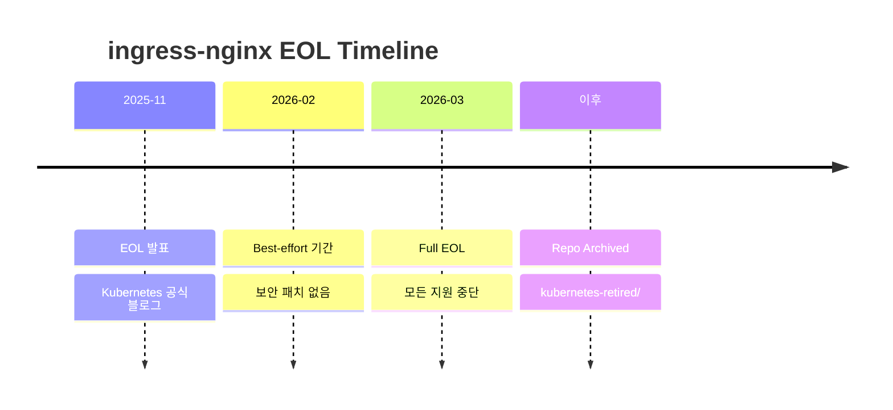

핵심: EOL 이후 기존 배포가 즉시 멈추지는 않는다. 하지만 보안 취약점이 발견되어도 패치가 나오지 않는다. 시한부 운영인 셈이다.

참고로 F5 NGINX Ingress Controller(`nginxinc/kubernetes-ingress`)는 별개 프로젝트로 EOL 대상이 아니다. 이름이 비슷해서 혼동하기 쉽다.

## 환경 현황

### 클러스터 현황

| 클러스터 | ingress-nginx 버전 | Pods | Ingress 수 |
|---------|-------------------|------|-----------|
| DEV (EKS) | v1.12.1 | 1 | 65 |
| PROD (EKS) | v1.10.0 | 3 | 23 |

DEV 클러스터 1개, PROD 클러스터 1개. 총 88개 Ingress가 ingress-nginx에 의존하고 있었다.

### 네임스페이스 분포

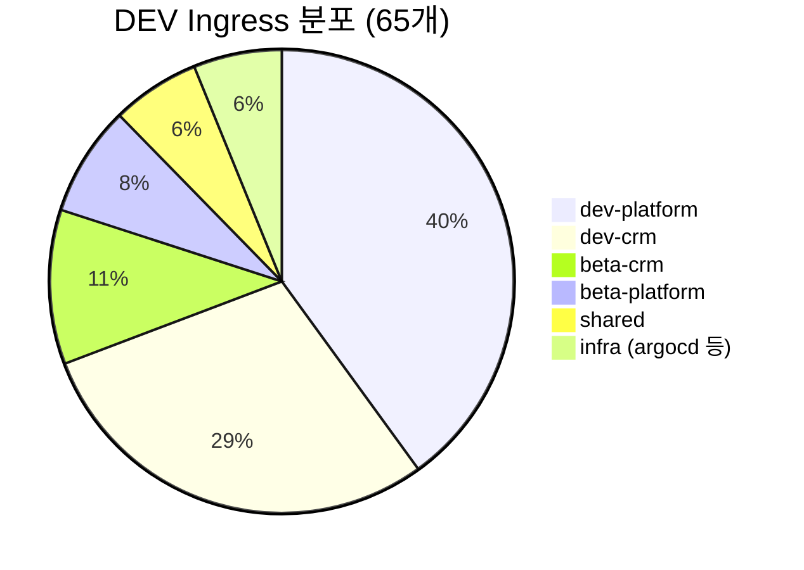

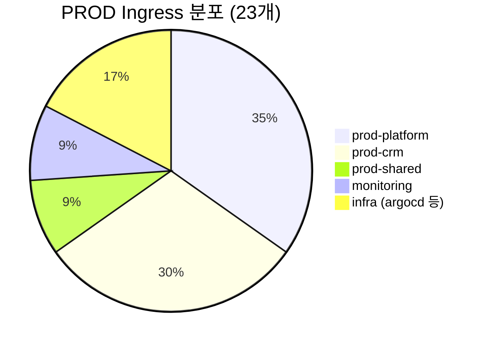

### nginx Annotation 사용 현황

마이그레이션 난이도를 결정하는 핵심 변수는 "nginx 고유 annotation을 얼마나 쓰고 있느냐"이다. 88개 Ingress를 전수 조사했다.

| Annotation | DEV | PROD | 비고 |
|-----------|-----|------|------|
| `proxy-body-size` | 24 | 9 | 업로드 크기 제한 |
| `backend-protocol` | 1 | 2 | gRPC 서비스 |
| `proxy-read-timeout` | 0 | 1 | |
| `proxy-send-timeout` | 0 | 1 | |
| `server-snippets` | 0 | 1 | WebSocket |
| `use-regex` | 0 | 1 | |

결론: nginx 고유 annotation 사용이 **매우 적다**. 대부분의 Ingress는 `host`와 `path` 정도만 쓰고 있었다. 어떤 대안을 선택하든 기술적 블로커는 거의 없는 상황이었다.

## 대안 비교

### 후보 목록

조사한 대안은 5가지였다.

| 순위 | Solution | Migration 난이도 | EKS 적합도 | 장기 지속성 | 핵심 요인 |
|-----|----------|-----------------|-----------|-----------|----------|
| 1st | AWS LB Controller (ALB) | Medium | Best | High | 이미 설치됨, AWS native |
| 2nd | F5 NGINX IC | Easy | Good | High | 동일 NGINX 엔진, 최소 노력 |
| 3rd | Gateway API (Envoy 등) | Hard | Good | Highest | K8s 공식 차세대 표준 |
| 4th | Traefik | Medium | Good | High | nginx 호환 모드, CNCF 생태계 |
| 5th | Kong | Hard | Good | High | 순수 Ingress 용도엔 과함 |

순위는 **우리 환경 기준**이다. AWS 공식 블로그에서도 ALB와 nginx를 "모두 유효한 선택지"로 소개하고 있으며, "ingress-nginx 대신 ALB를 쓰라"고 권장한 적은 없다.

### 커뮤니티 트렌드

ingress-nginx EOL 발표 이후 커뮤니티에서 실제로 어떤 선택을 하고 있는지 조사했다.

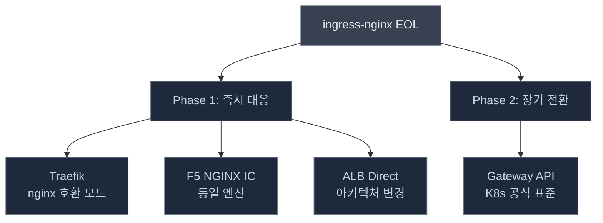

**커뮤니티 선호도:**

| 순위 | 선택지 | 반응 |
|-----|-------|------|
| 1위 | Traefik | nginx annotation 80% 호환 모드, Gateway API 내장, CORS/rate limiting 네이티브 |
| 2위 | Gateway API (Envoy 기반) | K8s 공식 장기 표준. 생태계 미성숙으로 즉시 전환은 비권장 |
| 3위 | F5 NGINX IC | 가장 쉬운 전환. OIDC/metrics 등 상용 paywall 우려 |
| 4위 | ALB (AWS) | AWS 환경 유효. CORS/rate limiting 네이티브 미지원 |

커뮤니티에서 가장 많이 논의되는 전략은 **2단계 접근**이었다.

- **Phase 1 (지금)**: Traefik nginx 호환 모드로 drop-in 교체 → EOL 해결
- **Phase 2 (나중에)**: Gateway API + HTTPRoute로 점진 전환 → 아키텍처 개선

F5에 대해서는 "OSS 버전은 기본만 제공, OIDC/session affinity/상세 metrics는 NGINX Plus(상용) 필요"라는 우려가 다수였다.

### 실제 마이그레이션 사례

| 회사 | 선택 | 규모 | 소요 시간 | 핵심 교훈 |
|------|------|------|----------|----------|
| [Skyscrapers](https://skyscrapers.eu/the-end-of-ingress-nginx-how-were-navigating-the-migration/) (벨기에 MSP) | Traefik + ALB | 1,097 Ingress, 89종 annotation | 진행 중 | F5 paywall로 탈락. snippet 56건이 최대 도전 |
| [CyberArk](https://developer.cyberark.com/blog/ingress-nginx-is-retiring-our-practical-journey-to-gateway-api/) (보안 기업) | Envoy Gateway | ~60 파일 수정 | 2주, 다운타임 0 | 병렬 운영 후 DNS 전환 |
| [codecentric](https://www.codecentric.de/en/knowledge-hub/blog/nginx-ingress-retirement-dont-panic-weve-got-you-covered) (독일 컨설팅) | Traefik | - | - | drop-in 먼저, Gateway API는 나중에 |
| [ayedo](https://ayedo.de/en/posts/ingress-nginx-lauft-aus-so-migrierst-du-bis-marz-2026-sauber/) (독일 MSP) | Traefik | - | - | 병렬 설치 → 점진 전환 → 무중단 |

조사 범위 내에서 **F5를 실제로 선택한 사례를 찾지 못했다**. 커뮤니티에서 대안으로 언급은 되지만, 실제 채택 후기가 없는 상태다.

**Skyscrapers와의 비교:**

| 항목 | Skyscrapers | 우리 |
|------|------------|------|
| Ingress 수 | 1,097개 | 88개 |
| nginx annotation | 89종 | 6종 |
| snippets | 56건 | 1건 |
| CORS/rate limit | 208건 | 0건 |

그들의 최대 난제(snippet 56건)가 우리에게는 해당되지 않는다. annotation 사용이 워낙 적어서 어떤 경로를 택해도 부담이 적다.

## 아키텍처: Before & After

### 현재 구조 (ingress-nginx 경유)

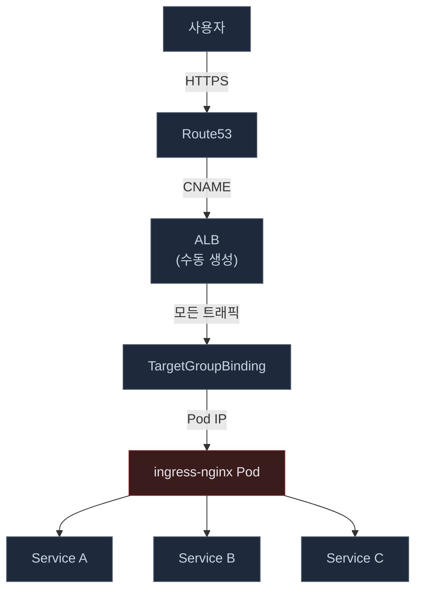

ingress-nginx Pod가 **모든 트래픽의 단일 경유점(SPOF)**이다. 이 Pod가 죽으면 전체 트래픽이 중단된다. ALB는 수동으로 생성했고, TargetGroupBinding이라는 K8s 리소스로 ingress-nginx Pod IP를 Target Group에 자동 등록하는 구조다.

### Path A/B: Ingress Controller 교체 (Traefik 또는 F5)

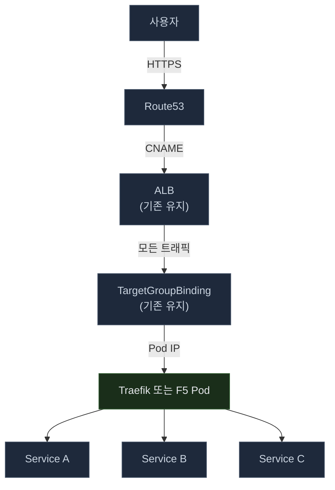

**구조 변경 없음.** ingress-nginx Pod 자리에 새 컨트롤러가 들어갈 뿐이다. ALB, TargetGroupBinding, DNS 모두 그대로 유지한다.

### Path C: ALB 직접 연결

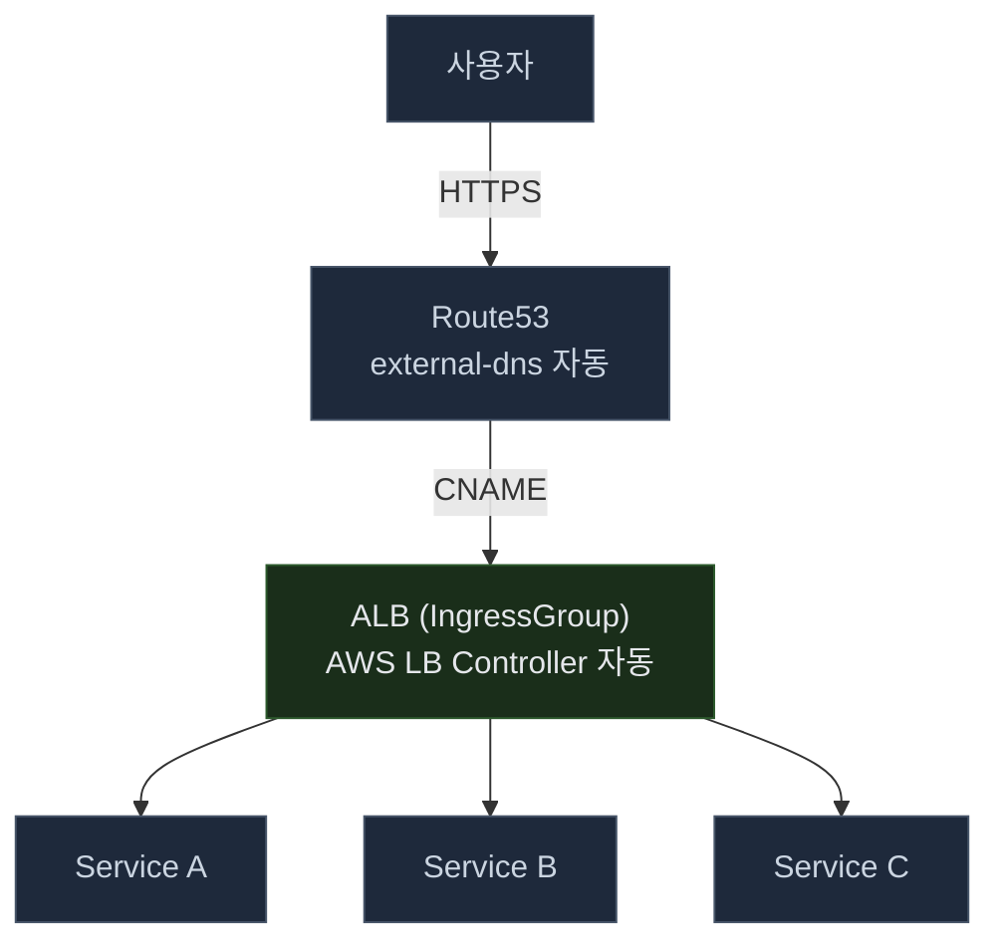

ingress-nginx Pod 레이어가 사라진다. ALB가 Host 헤더 기반으로 직접 서비스 Pod에 라우팅한다. AWS LB Controller가 Ingress 리소스를 감시하고 ALB 리스너 규칙과 Target Group을 자동으로 생성/관리한다.

**핵심 차이:**

| | Before | After (Path C) |
|---|--------|---------------|
| 경로 | ALB → ingress-nginx Pod → 서비스 Pod (3 hop) | ALB → 서비스 Pod (2 hop) |
| 관리 | ALB, TGB 수동 관리 | Ingress 작성 → ALB, TG, DNS 전부 자동 |
| 장애점 | Pod 장애 = 전체 중단 | ALB = AWS 관리형 고가용성 |
| 보안 | EOL 후 패치 없음 | AWS가 보안/가용성 책임 |

## 3가지 마이그레이션 경로

### 경로 비교

| | Path A: Traefik | Path B: F5 NGINX IC | Path C: ALB Direct |
|---|----------------|--------------------|--------------------|
| **전략** | EOL 해결 + Gateway API 준비 | EOL 해결 (최소 변경) | EOL 해결 + 아키텍처 개선 |
| **구조 변경** | 없음 | 없음 | 있음 (nginx Pod 레이어 제거) |
| **Ingress yaml 수정** | 거의 없음 (호환 모드) | 소폭 (annotation namespace 변경) | 전면 재작성 (88개) |
| **작업량** | 1~3일 | 1~3일 | 7~11일 |
| **3월 데드라인** | 여유 | 여유 | 빠듯 |
| **Gateway API** | 기본 내장 | 별도 (NGINX Gateway Fabric) | AWS LB Controller v2.14+ |
| **리스크** | 새 컨트롤러 학습, 호환 모드 검증 | 가장 낮음 (동일 엔진) | 작업량, IngressGroup 설계 |
| **추후 재전환** | 불필요 (자체 Gateway API 지원) | 필요할 수 있음 | 불필요 |

핵심 구분: **EOL 대응**(ingress-nginx 교체)과 **아키텍처 개선**(ALB 직접 연결)은 별개 문제다. 3월 데드라인에는 EOL 대응이 우선이다.

### Path A: Traefik

**장점:**
- nginx annotation 호환 모드 (v3.5)로 기존 Ingress yaml 거의 그대로 사용
- Gateway API 기본 내장 → 장기적으로 재전환 불필요
- CNCF 생태계, 활발한 개발, 내장 대시보드

**단점:**
- 새 컨트롤러 학습 필요
- 호환 모드의 실제 호환 범위를 검증해야 함
- 고부하 시 NGINX 대비 성능 우려

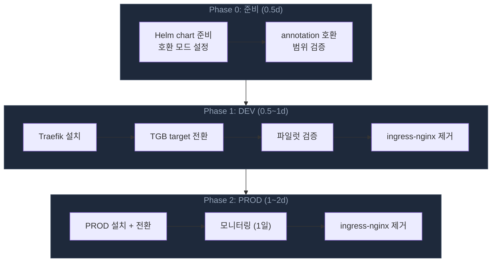

### Path B: F5 NGINX IC

**장점:**
- 동일 NGINX 엔진 → 동작이 가장 유사하고 리스크가 가장 낮음
- 기존 운영 노하우 그대로 활용 가능
- F5 전담팀 유지, Apache 2.0 라이선스

**단점:**
- 구조적 개선 없음 (Pod 기반 동일)
- 장기적으로 재전환이 필요할 수 있음
- annotation namespace 변경 필요 (`nginx.ingress.kubernetes.io` → `nginx.org`)

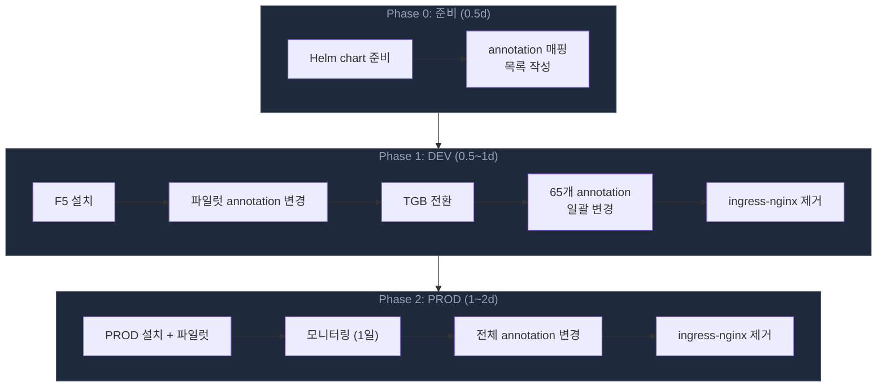

### Path C: ALB Direct

**장점:**
- AWS LB Controller가 이미 설치되어 있고, PROD에 검증된 패턴 존재
- 관리형 데이터 플레인 (AWS가 HA 보장)
- 한 번에 EOL + 아키텍처 개선
- WAF, ACM, Shield 직접 연동

**단점:**
- 88개 Ingress 전면 재작성 필요
- IngressGroup 설계 필수 (Ingress당 ALB 1개씩 만들면 비용 폭증)
- 3월 데드라인에 빠듯

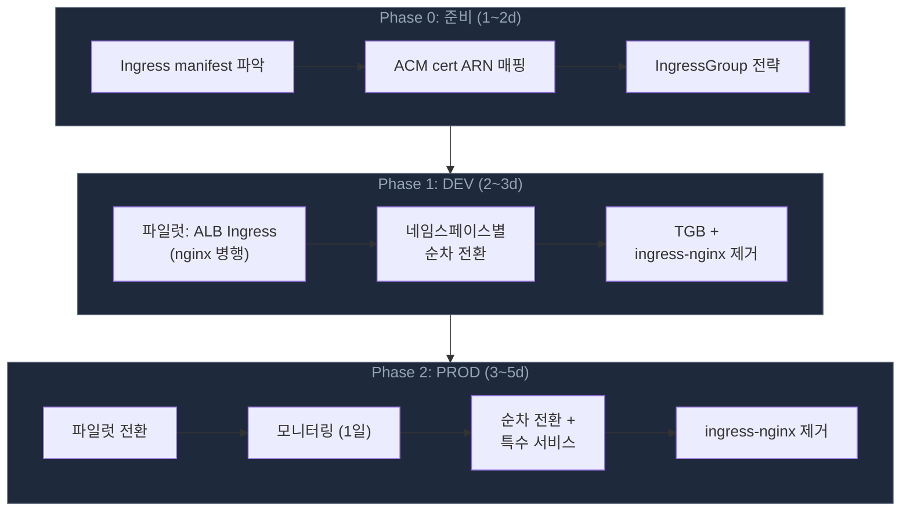

## Rollback 전략

**Path A/B:**

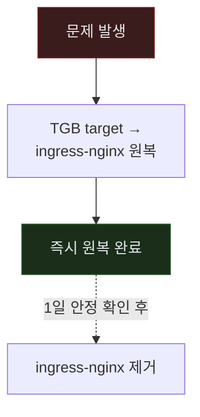

**Path C:**

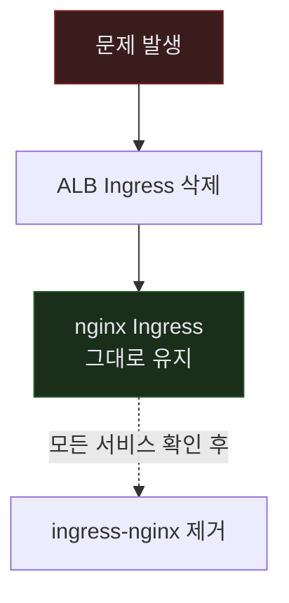

Path A/B는 TGB 하나만 바꾸면 되므로 롤백이 매우 빠르다. Path C는 nginx Ingress와 ALB Ingress를 병행 운영하므로 DNS 전환 전까지 서비스별 개별 롤백이 가능하다.

## 특수 서비스

| 서비스 유형 | 프로토콜 | Traefik | F5 NGINX IC | ALB |
|-----------|---------|---------|------------|-----|
| 모니터링 대시보드 | WebSocket | 기본 지원 | 동일 엔진, 그대로 동작 | native WebSocket + stickiness |
| 메트릭 수집기 | gRPC | 기본 지원 (h2c) | annotation만 변경 | gRPC support + backend-protocol-version |
| GitOps UI | UI + gRPC 혼합 | IngressRoute로 분리 가능 | annotation namespace만 변경 | 별도 검토 필요 |

## 시사점

조사를 마치고 정리한 판단 기준은 다음과 같다.

**데드라인이 핵심이다.** 3월까지 EOL 대응이 우선이고, 아키텍처 개선은 이후에 해도 된다. Path A/B는 1~3일, Path C는 7~11일이다.

**annotation 사용이 적어 유리하다.** nginx annotation 6종, snippet 1건. 1,097개 Ingress에 89종 annotation을 쓰는 Skyscrapers와 비교하면 어떤 경로든 부담이 적다.

**커뮤니티는 Traefik을 가장 많이 선택하고 있다.** 2단계 접근(Traefik drop-in → Gateway API 점진 전환)이 대세다. 다만 F5 paywall 문제에 해당되지 않는 환경이라면 F5도 여전히 유효하다.

**F5 실채택 사례는 찾지 못했다.** 커뮤니티에서 언급은 되지만 실제 후기가 없다. "당장은 쉽지만 장기적으로 재전환 필요"라는 의견이 다수다.

**ALB는 장기적으로 가장 깔끔하다.** AWS 환경에서 이미 LB Controller가 설치되어 있다면 고려할 가치가 있다. 다만 Ingress 재작성이라는 물량이 있고, 데드라인이 촉박하면 부담이 된다.

아직 최종 경로를 결정하지 않았다. 이 글은 판단 재료를 모은 것이고, 실제 전환 작업과 그 과정에서의 삽질은 다음 글에서 다룰 예정이다.

## 참고 자료

- [Kubernetes Blog - ingress-nginx Retirement](https://kubernetes.io/blog/2025/11/11/ingress-nginx-retirement/)
- [Gateway API - Migrating from ingress-nginx](https://gateway-api.sigs.k8s.io/guides/getting-started/migrating-from-ingress-nginx/)
- [AWS Samples - NGINX to ALB Migration](https://github.com/aws-samples/eks-nginx-aws-lb-controller-migration)
- [F5 Blog - The ingress-nginx Alternative](https://blog.nginx.org/blog/the-ingress-nginx-alternative-open-source-nginx-ingress-controller-for-the-long-term)
- [Skyscrapers - EOL Migration](https://skyscrapers.eu/the-end-of-ingress-nginx-how-were-navigating-the-migration/)
- [CyberArk - Gateway API Journey](https://developer.cyberark.com/blog/ingress-nginx-is-retiring-our-practical-journey-to-gateway-api/)
