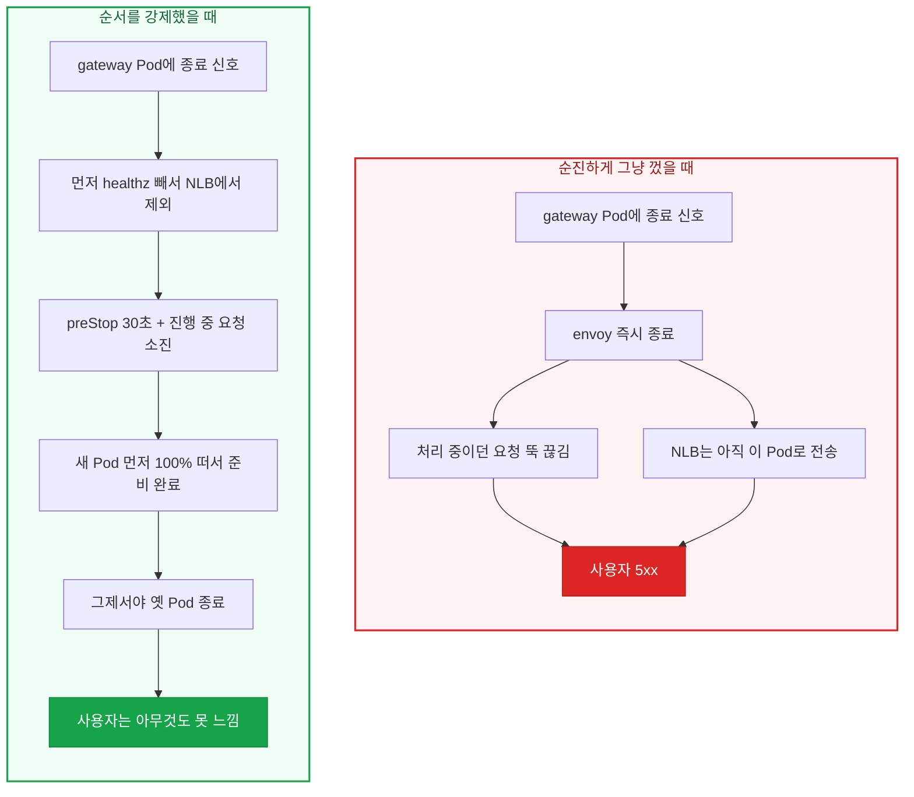
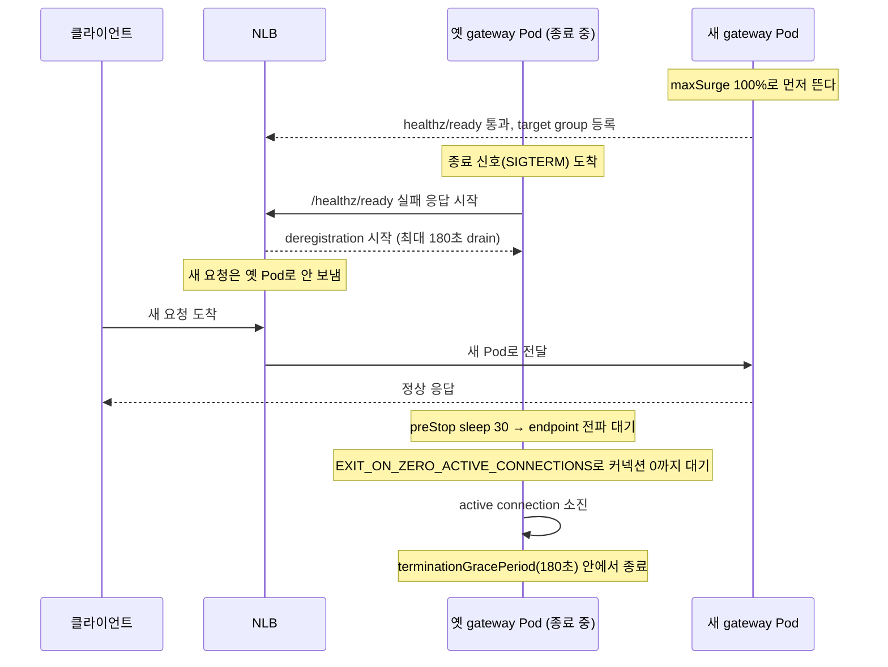

인프라에서 가장 무서운 재시작은 "모든 트래픽이 지나가는 길목"을 재시작하는 것이다. 앱 Pod 하나가 잠깐 흔들리면 그 앱만 아프지만, ingress gateway가 흔들리면 그 뒤에 있는 서비스 전부가 동시에 아프다. gateway는 전형적인 SPOF(단일 장애점, single point of failure)다.

그런데 어느 날 밤, prod 클러스터에서 gateway를 포함한 워크로드 10종(Pod 수백 개)을 하나씩 껐다 켰는데 사용자 화면에는 5xx가 사실상 0이었다. [앞 글](/kubernetes/pod-graceful-shutdown/)에서 앱 Pod의 우아한 종료를 다뤘다면, 이 글은 그 한 단계 위, **모든 트래픽이 지나가는 ingress gateway 계층을 무중단으로 롤아웃하는 방법**을 정리한다. 핵심은 하나다. 끄는 순서를 강제하는 것.

## 문제: gateway 재시작은 앱 재시작과 다르다

[앞 글의 502 문제](/kubernetes/pod-graceful-shutdown/)와 근본 원인은 같다. Pod에 SIGTERM을 보내는 것과 로드밸런서 endpoint에서 그 Pod를 빼는 것이 **비동기로 동시에** 일어난다는 것. endpoint가 빠지기 전에 Pod가 먼저 죽으면, 그 시간차에 도착한 요청이 끊긴다.

다만 gateway 계층에는 앱 계층에 없는 변수가 두 개 더 있다.

- **바깥에 NLB(Network Load Balancer)가 붙어 있다.** 앱 Pod는 클러스터 내부 Service endpoint만 신경 쓰면 되지만, gateway는 클러스터 바깥의 NLB target group에서도 빠져야 한다. endpoint를 뺄 지점이 두 곳(kube-proxy iptables + NLB)이고, 둘의 전파 속도가 다르다.
- **gateway Pod 안에는 envoy proxy가 있다.** gateway는 그 자체가 envoy다. envoy가 커넥션을 붙잡은 채 죽으면 진행 중이던 요청이 끊긴다. "커넥션이 0이 될 때까지 죽지 마라"를 envoy에게 직접 시켜야 한다.

즉 앞 글이 "앱을 우아하게 끄는 법"이었다면, 이 글은 "**NLB, envoy, Kubernetes 세 주체의 종료 순서를 한 줄로 세우는 법**"이다.

## 무중단의 핵심은 순서다

먼저 큰 그림. 아무 준비 없이 그냥 껐을 때와, 순서를 강제했을 때가 어떻게 갈리는지 보자.



왼쪽은 **끄기를 먼저** 하고, 오른쪽은 **트래픽 빼기를 먼저** 한다. 이 순서 하나가 5xx가 나느냐 마느냐를 가른다. 오른쪽 순서를 사람 손이 아니라 설정으로 자동 강제하는 게 이 글의 목표다.

## 요청 하나가 재시작에서 살아남는 순서

Pod가 꺼지는 그 순간에 도착한 요청이 어떻게 끊기지 않는지, 시간 순서로 따라가 보자.



옛 Pod가 "나 이제 안 됨"을 `/healthz/ready`로 먼저 알리면, NLB는 새 요청을 새 Pod로만 보낸다. 옛 Pod는 받던 것만 마저 처리하고 조용히 나간다. **먼저 빼기 → 다 처리 → 조용히 종료**, 이 세 박자가 자동으로 지켜지도록 설정 여러 개가 맞물린다.

## 무중단을 만드는 장치들

어려운 이름이 붙어 있지만 하는 일은 상식적이다. 하나씩 뜯어본다. 아래는 IstioOperator의 gateway 설정에 넣은 값이다. 외부용 gateway와 내부용 gateway 두 곳에 동일하게 적용했다.

### 1. envoy를 커넥션 0까지 붙잡아 둔다

```yaml
env:
  # envoy가 종료 신호를 받아도 active connection이 0이 될 때까지 종료를 미룬다
  - name: EXIT_ON_ZERO_ACTIVE_CONNECTIONS
    value: "true"
```

문지기가 종료 신호를 받아도 손님이 다 나갈 때까지 문을 닫지 않는다. 진행 중인 요청을 전부 처리하고 나서야 프로세스가 종료된다. gateway = envoy이기 때문에, 이 한 줄이 "진행 중 요청을 버리지 마라"의 핵심이다.

### 2. 한꺼번에 죽지 못하게 막는다

```yaml
# 자발적 중단(rollout/drain) 시 항상 100% Pod가 available해야 한다
podDisruptionBudget:
  minAvailable: 100%

strategy:
  type: RollingUpdate
  rollingUpdate:
    maxUnavailable: 0     # 기존 Pod는 하나도 미리 죽이지 않는다
    maxSurge: 100%        # 새 Pod를 먼저 100% 띄운다
```

PDB(PodDisruptionBudget)는 `kubectl drain`이나 노드 재시작 같은 **자발적 중단** 상황에서 "동시에 이만큼은 꼭 살려 둬라"를 강제한다. `minAvailable: 100%`는 gateway를 한 번에 우르르 내리지 못하게 한다.

`maxUnavailable: 0` + `maxSurge: 100%` 조합이 순서의 방향을 정한다. **기존 Pod를 미리 죽이지 않고**(0), **새 Pod를 먼저 다 띄운 뒤**(100%) 교체한다. "새 것 준비 완료가 먼저, 옛 것 종료는 나중"이 여기서 나온다.

> **핵심:** PDB는 노드 drain 같은 자발적 중단으로부터의 방어이고, RollingUpdate 전략은 배포 순서의 방향이다. 둘은 겹치는 게 아니라 서로 다른 경로를 각각 막는다.

### 3. "나 나간다"는 소식이 퍼질 시간을 번다

```yaml
# 종료 직전 30초 대기 → endpoint 전파(iptables/NLB 갱신) 시간 확보
lifecycle:
  preStop:
    exec:
      command: ["/bin/sh", "-c", "sleep 30"]
# drain을 넉넉히 기다리도록 grace period를 연장
terminationGracePeriodSeconds: 180
```

preStop은 SIGTERM **이전에** 실행된다(이 메커니즘은 [앞 글](/kubernetes/pod-graceful-shutdown/)에서 자세히 다뤘다). 이 30초 동안 endpoint 제거 정보가 kube-proxy iptables와 NLB target group까지 퍼진다. 앱 계층에서는 endpoint 전파에 2~3초면 충분해 `sleep 5`로도 됐지만, gateway는 바깥 NLB까지 갱신돼야 하므로 여유를 크게 잡아 **30초**로 뒀다.

`terminationGracePeriodSeconds: 180`은 이 preStop과 이후 drain을 **모두 포함한** 전체 유예 시간이다. 기본값 30초로는 envoy가 커넥션을 다 빼기 전에 SIGKILL이 날아올 수 있어 180초로 늘렸다.

### 4. proxy가 준비된 뒤에야 트래픽을 받는다

```yaml
# 앱 컨테이너는 sidecar proxy가 ready된 뒤에야 뜬다
holdApplicationUntilProxyStarts: true
```

새 Pod에서 앱이 먼저 뜨고 envoy proxy가 늦게 준비되면, 그 사이 들어온 요청이 길을 못 찾아 드랍될 수 있다. "앱은 떴는데 길 안내가 아직"인 빈틈이다. 이 옵션은 proxy가 완전히 ready되기 전까지 앱 컨테이너 시작을 붙잡아, `maxSurge`로 먼저 뜬 새 Pod가 "덜 준비된 채 target group에 등록되는" 사고를 막는다.

### 5. 바깥의 NLB도 같은 박자로 맞춘다

여기까지가 클러스터 안쪽 이야기다. 마지막으로 클러스터 바깥 NLB의 target group을 gateway와 같은 박자로 맞춘다. Service annotation으로 설정한다.

```yaml
# Pod 종료 시 최대 180초까지 기존 커넥션을 drain하고, 그 후 강제 종료
service.beta.kubernetes.io/aws-load-balancer-target-group-attributes: |
  deregistration_delay.timeout_seconds=180
  deregistration_delay.connection_termination.enabled=true
# health check는 istio proxy의 준비 상태 포트로 확인
service.beta.kubernetes.io/aws-load-balancer-healthcheck-port: "15021"
service.beta.kubernetes.io/aws-load-balancer-healthcheck-path: "/healthz/ready"
```

health check를 envoy의 `15021 /healthz/ready`로 잡는 게 중요하다. 이래야 옛 Pod가 종료를 시작하면서 `/healthz/ready`를 실패로 내리는 순간, NLB가 그 신호를 보고 target group에서 즉시 뺀다. `deregistration_delay 180초`는 이미 맺어진 커넥션을 그 시간 동안 마저 흘려보낸 뒤 끊는다는 뜻이다.

## 왜 이 숫자들인가: 타이밍이 서로를 넘지 않게

설정값이 흩어져 보이지만, 실제로는 하나의 타임라인 위에 서로 어긋나지 않도록 배치된 것이다.

| 구간 | 값 | 하는 일 |
|------|-----|--------|
| **preStop `sleep`** | 30초 | endpoint 제거 정보가 iptables + NLB까지 전파될 시간 |
| **NLB `deregistration_delay`** | 180초 | 이미 맺어진 커넥션을 마저 흘려보내는 시간 |
| **`EXIT_ON_ZERO_ACTIVE_CONNECTIONS`** | true | 커넥션이 0이 되기 전엔 envoy가 안 죽음 |
| **`terminationGracePeriodSeconds`** | 180초 | 위 전부를 담는 전체 유예 시간의 상한 |

순서로 묶으면 이렇다.

```
[새 Pod 100% surge, proxy ready 후 등록]
        ↓
옛 Pod 종료 시작 → healthz/ready 실패 → NLB deregistration 시작
        ↓
preStop sleep 30초 (전파 대기, 새 요청은 이미 새 Pod로)
        ↓
SIGTERM → EXIT_ON_ZERO_ACTIVE_CONNECTIONS로 커넥션 0까지 대기
        ↓
커넥션 소진 완료 → 종료  (전 과정이 terminationGracePeriod 180초 안)
```

핵심 규칙: **preStop(30초) ≤ 전파 시간**, 그리고 **drain에 걸리는 실제 시간 ≤ terminationGracePeriodSeconds(180초)**. NLB의 `deregistration_delay`(180초)와 `terminationGracePeriodSeconds`(180초)를 같은 값으로 맞춰, Pod가 죽기 전에 NLB도 커넥션을 다 빼도록 정렬한 것이다. 어느 한쪽 타이머가 다른 쪽보다 짧으면 그 지점에서 커넥션이 잘린다.

## 적용 결과

prod 클러스터(blue)에서 gateway를 포함한 워크로드 10종(Pod 수백 개)을 순서대로 재시작하면서, mesh 지표를 관측했다.

| 지표 | 관측값 | 판단 |
|------|--------|------|
| **평균 5xx 오류율** | 약 0.06% | 위험 기준(1%)의 약 1/16 (실측) |
| **평균 응답 지연** | 1~3ms | 평소 대비 상승 없음 (실측) |
| **순단(outage) 횟수** | 0 | 재시작 내내 끊김 없음 (실측) |

일부 워크로드는 교체 순간 replica의 절반이 잠깐 unavailable 상태가 됐다. 그런데도 그 순간 5xx가 오르지 않았다. **살아 있는 Pod가 트래픽을 받아 줬기 때문이다.** 파드가 절반씩 교체되는 순간에도 사용자 오류가 안 났다는 것, 이게 순서 강제가 실제로 작동했다는 증거다.

> **한계 명시:** 위 결과는 재시작 중 5xx 오류율·응답 지연·순단을 bounded read로 관측한 값이다. 각 설정(preStop 30초, deregistration 180초 등)의 개별 기여도를 하나씩 계측해 검증한 것은 아니다. "오류율·지연이 재시작 내내 평평했다"는 결과 관측이 무중단의 근거이며, 개별 값의 최적성은 별도 실험이 필요하다.

## 배운 것들

### replica 숫자가 아니라 오류율과 지연을 봐라

롤아웃 중 Pod 절반이 잠깐 준비 중(unavailable)이 되는 건 정상이다. 남은 Pod가 트래픽을 받으니 사용자는 안 끊긴다. `maxSurge: 100%`를 켠 이상 교체 순간 replica가 출렁이는 건 설계된 동작이다. 무중단인지 아닌지는 **replica 카운트가 아니라 5xx 오류율과 응답 지연이 평평한지**로 판단해야 한다.

### 5xx가 조금 보인다고 다 배포 탓은 아니다

어떤 서비스는 평소에도 client가 요청을 취소하는 등의 이유로 5xx를 조금씩 낸다. 배포 전 baseline과 비교해서 배포 순간에 **갑자기 튀었는지**를 봐야 정확하다. baseline을 모르면 정상 노이즈를 장애로 오인한다.

### 게이트웨이 무중단은 한 설정의 공이 아니다

`EXIT_ON_ZERO_ACTIVE_CONNECTIONS` 하나만 켠다고 되는 게 아니다. 새 Pod가 먼저 뜨고(surge), proxy가 준비된 뒤 등록되고(holdApplicationUntilProxyStarts), endpoint 전파를 기다리고(preStop), NLB가 같은 시간만큼 drain하고(deregistration_delay), 그동안 envoy가 커넥션을 붙잡는다(EXIT_ON_ZERO). 이 다섯이 **같은 타임라인 위에서 서로를 넘지 않을 때** 비로소 무중단이 된다. 하나라도 타이머가 어긋나면 그 지점에서 끊긴다.

## 정리

- gateway는 SPOF다. 앱 Pod와 달리 클러스터 바깥 NLB와 안쪽 envoy까지 함께 종료 순서를 맞춰야 한다.
- 무중단의 비밀은 순서다. **끄기 전에 트래픽부터 빼고, 진행 중 요청을 다 끝내고, 새 Pod가 준비된 뒤에 옛 Pod를 끈다.**
- 이걸 자동으로 강제하는 장치가 `EXIT_ON_ZERO_ACTIVE_CONNECTIONS`, PDB + `maxUnavailable 0`/`maxSurge 100%`, `preStop sleep 30`, `holdApplicationUntilProxyStarts`, 그리고 NLB `deregistration_delay`다.
- `preStop`, `deregistration_delay`, `terminationGracePeriodSeconds`가 서로의 타이머를 넘지 않도록 정렬하는 게 튜닝의 전부다.
- 무중단 검증은 replica 숫자가 아니라 5xx 오류율과 응답 지연으로 한다.

## 참고

- [Istio 공식 문서 - Gateways](https://istio.io/latest/docs/reference/config/networking/gateway/)
- [Envoy - `EXIT_ON_ZERO_ACTIVE_CONNECTIONS` (drain 관련 옵션)](https://www.envoyproxy.io/docs/envoy/latest/intro/arch_overview/operations/draining)
- [AWS Load Balancer Controller - Service Annotations (target group attributes)](https://kubernetes-sigs.github.io/aws-load-balancer-controller/latest/guide/service/annotations/)
- [배포할 때마다 502가 터진다면, Pod 종료 전략을 의심하라](/kubernetes/pod-graceful-shutdown/) - 앱 Pod 계층의 graceful shutdown
- [Kubernetes Probe 3종류, 왜 나눠져 있는가](/kubernetes/kubernetes-probes-explained/) - readiness/liveness/startup의 역할
