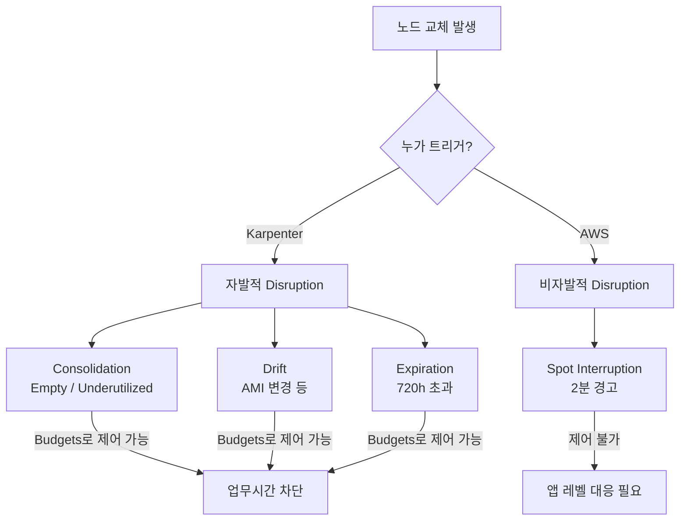

Karpenter는 비용 최적화 도구가 아니다. 노드 수명주기 관리 도구다. 비용 절감은 그 부산물이고, 본질은 "필요한 노드를 필요한 만큼, 최적의 상태로 유지하는 것"이다. 이 본질을 이해하지 못하면 Karpenter의 동작이 공격적으로 느껴지고, 사용자에게는 불안정한 환경으로 보인다.

beta 환경에서 QA 팀이 업무시간 중 잦은 Pod 재시작으로 불편을 호소했다. 원인을 추적하니 Karpenter의 비용 최적화 정책과 Spot 인스턴스, AMI 자동 업데이트가 복합적으로 작용하고 있었다. Karpenter의 Disruption 메커니즘을 이해하고, 비용과 안정성의 균형점을 찾은 과정을 공유한다.

## Karpenter란

[Karpenter](https://karpenter.sh/)는 Kubernetes 노드의 프로비저닝과 수명주기를 자동으로 관리하는 오픈소스 프로젝트다. 원래 AWS에서 시작했지만, 현재는 `kubernetes-sigs` 산하의 클라우드 중립 Core와 클라우드별 Provider로 분리되어 있다. AWS(EKS)와 Azure(AKS)에서 공식 지원한다.

기존 Cluster Autoscaler와의 핵심 차이는 **노드 그룹 없이 워크로드에 최적화된 인스턴스를 직접 선택**한다는 점이다. Pod가 스케줄링되지 못하면 필요한 스펙의 노드를 즉시 생성하고, 사용률이 낮아지면 노드를 정리(Consolidation)한다. 이 자동화된 노드 수명주기 관리가 비용 절감으로 이어진다.

Karpenter의 주요 리소스는 두 가지다.

| 리소스 | 역할 | 예시 설정 |
|--------|------|-----------|
| **NodePool** | 노드 프로비저닝/Disruption 정책 | 인스턴스 타입, Spot/On-Demand, Consolidation 정책 |
| **EC2NodeClass** (AWS) | 클라우드 리소스 스펙 | AMI, 서브넷, 보안그룹, 디스크 |

## 환경 구성

beta는 dev와 동일한 EKS 클러스터를 공유하며, 네임스페이스로 환경을 분리한다. 비용 효율을 위해 Karpenter + Spot 인스턴스를 사용하고 있다.

| 항목 | 설정 | 설명 |
|------|------|------|
| NodePool | `dev-service-karpenter` | Karpenter가 노드를 관리하는 단위. 프로비저닝/Disruption 정책을 정의한다 |
| Capacity Type | **Spot 전용** | On-Demand 대비 60~70% 저렴하지만, AWS가 언제든 회수할 수 있다 |
| Instance Category | c, t, m (8 vCPU) | Karpenter가 선택할 수 있는 인스턴스 패밀리. 다양할수록 Spot 확보 확률이 높다 |
| Consolidation Policy | `WhenEmptyOrUnderutilized` | 빈 노드뿐 아니라 리소스가 남는 노드도 정리한다. 가장 공격적인 정책 |
| ConsolidateAfter | `300s` (5분) | Underutilized 상태가 5분 지속되면 Consolidation을 시작한다 |
| ExpireAfter | `720h` (30일) | 노드 생성 후 30일이 지나면 교체한다. 보안 패치 적용과 리소스 프래그멘테이션 해소 목적 |
| AMI Selector | `amazon-eks-node-al2023-x86_64-standard-1.34*` (와일드카드) | 와일드카드로 최신 AMI를 자동 선택. 새 AMI 릴리스 시 기존 노드가 Drift 상태가 된다 |

핵심은 **Spot 전용 + 공격적 Consolidation (5분) + AMI 와일드카드**라는 조합이다. 각각은 합리적인 설정이지만, 결합되면 노드 교체 빈도가 높아질 수밖에 없는 구조다.

## 문제 상황

QA 팀에서 beta 환경의 서비스 A, 서비스 B가 업무시간 중 반복적으로 재시작된다는 리포트가 올라왔다. 확인해보니 Karpenter가 비용 최적화 판정으로 노드를 연쇄적으로 삭제하고 있었다.

```
06:19 UTC  ip-10-0-36-140  삭제 (Empty)
06:40 UTC  ip-10-0-47-248  삭제 (Underutilized, 생성 9분 만에 삭제)
06:55 UTC  ip-10-0-36-119  삭제 (Underutilized)
07:06 UTC  ip-10-0-33-88   삭제 (Underutilized)
07:11 UTC  ip-10-0-41-152  삭제 (Underutilized)
```

약 50분간 5개 노드가 순차적으로 삭제되면서, 서비스 A, 서비스 B Pod들이 eviction → 재스케줄링을 3~5회 반복했다. 동시에 삭제되는 것은 아니지만, 체감상 "계속 재시작되는" 상황이었다.

추가로 Redis 호환 캐시를 Pod로 운영하고 있었는데, Primary Pod가 eviction될 때 Replica의 liveness probe가 Primary 연결까지 체크하는 구조여서 연쇄 장애가 발생하기도 했다. 이 이슈는 probe 설정 변경으로 별도 해결했다.

## Karpenter Disruption 이해하기

이 문제를 해결하려면 Karpenter가 노드를 교체하는 모든 경로를 이해해야 한다. Karpenter에는 4가지 Disruption 트리거가 있다.

### 자발적 Disruption (Karpenter가 직접 실행)

**1. Consolidation — Empty**

Pod가 하나도 없는 빈 노드를 삭제한다. 가장 안전한 Disruption이다.

**2. Consolidation — Underutilized**

노드의 Pod들이 다른 노드에 수용 가능하다고 판단되면, 해당 노드의 Pod를 이동시키고 노드를 삭제한다. `consolidateAfter: 300s` 설정은 Underutilized 상태가 5분 이상 지속될 때 실행한다는 의미다.

여기서 중요한 점은 **Karpenter가 실제 CPU/메모리 사용량(usage)이 아니라 Pod의 resource requests 기준으로 판단**한다는 것이다. Prometheus나 Metrics Server를 참조하지 않는다. 노드에 배치된 Pod들의 requests 합산이 노드 용량 대비 작으면, 더 작은 노드로 교체하거나 다른 노드에 합칠 수 있다고 판단한다.

beta 환경에서는 서비스 A가 평시 0.1 코어만 사용하고 기동 시에만 2.5 코어 이상을 사용하는 구조였다. 평시 사용량이 낮으니 requests도 낮게 설정할 수밖에 없고, 그 결과 노드의 requests 합산이 작아져 Consolidation 대상이 되기 쉬운 구조였다.

**3. Drift**

노드의 실제 상태가 NodePool/EC2NodeClass 스펙과 다를 때 교체한다. 대표적인 케이스가 **AMI 버전 변경**이다.

```yaml
amiSelectorTerms:
  - name: amazon-eks-node-al2023-x86_64-standard-1.34*  # 와일드카드
```

이 설정은 `1.34` 패치의 최신 AMI를 자동으로 사용한다. AWS가 새 AMI를 릴리스하면(예: `v20260115` → `v20260128`), 기존 노드는 "Drifted" 상태가 되고 Karpenter가 새 AMI로 노드를 교체한다.

그렇다면 AWS는 AMI를 얼마나 자주 릴리스하는가? 실제 `ap-northeast-2` 리전의 EKS 1.34 AL2023 AMI 릴리스 이력을 조회했다.

| 버전 | 릴리스 날짜 | 간격 |
|------|------------|------|
| v20250915 | 2025-09-16 | - |
| v20250920 | 2025-09-20 | 4일 |
| v20251002 | 2025-10-03 | 13일 |
| v20251023 | 2025-10-24 | 7일 |
| v20251112 | 2025-11-14 | 5일 |
| v20251209 | 2025-12-10 | 20일 |
| v20260107 | 2026-01-07 | 21일 |
| v20260116 | 2026-01-16 | 1일 |
| v20260128 | 2026-01-28 | 7일 |

2025년 9월\~2026년 1월 총 18회 릴리스 중 일부를 발췌했다. **평균 1\~2주 간격**이지만 최단 1일, 최장 21일로 편차가 있다. 와일드카드 AMI selector를 사용하면 이 주기마다 전체 노드가 Drift 교체 대상이 된다. 보안 패치를 자동으로 적용할 수 있다는 장점과, 노드 교체 빈도가 높아진다는 단점이 공존한다.

**4. Expiration**

`expireAfter: 720h` (30일)이 지난 노드를 교체한다. 노드 수명 관리 차원의 교체이며, 보안 패치 적용이나 리소스 프래그멘테이션 해소 목적이다.

### 비자발적 Disruption (AWS가 실행)

**5. Spot Interruption**

AWS가 Spot 인스턴스를 회수할 때 발생한다. **2분 전 경고** 후 인스턴스가 종료된다. 이것은 Karpenter의 제어 범위 밖이다.

### Disruption 경로 정리



핵심은 **자발적 Disruption은 Budgets로 제어 가능하지만, Spot Interruption은 제어할 수 없다**는 점이다.

## 해결 방법 검토

여러 방법을 검토했다.

| 방법 | 설명 | 장점 | 단점 |
|------|------|------|------|
| **Disruption Budgets Schedule** | 업무시간에 자발적 Disruption 차단 | Consolidation, Drift, Expiration 모두 차단 | Spot Interruption은 못 막음 |
| **Karpenter 일시 중지** | NodePool 자체를 비활성화 | 확실한 차단 | 비용 최적화 중단, 신규 노드 프로비저닝도 중단 |
| **AMI 버전 고정** | 와일드카드 제거, 특정 버전 지정 | Drift 발생 방지 | 보안 패치 수동 관리 필요 |
| **do-not-disrupt 어노테이션** | 특정 Pod에 `karpenter.sh/do-not-disrupt: "true"` 설정 | Pod 단위로 보호 가능 | 해당 노드 전체가 Consolidation 대상에서 제외 |
| **전용 Managed Node Group** | 민감한 Pod를 Karpenter 관리 밖 노드에 배치 | 완전한 격리 | 추가 비용, On-Demand 과금 |
| **PodDisruptionBudget (PDB)** | 동시 eviction 수 제한 | 연쇄 삭제 방지 | 단일 replica에는 효과 제한적 |
| **Consolidation 정책 완화** | `WhenEmpty`로 변경, `consolidateAfter` 증가 | 빈도 감소 | 비용 절감 효과 감소 |

## 적용한 해결책: Disruption Budgets Schedule

검토 결과, **Disruption Budgets에 Schedule을 추가**하는 방법을 선택했다. 업무시간에는 자발적 Disruption을 차단하고, 야간/주말에는 기존대로 비용 최적화가 동작하도록 했다.

```yaml
apiVersion: karpenter.sh/v1
kind: NodePool
metadata:
  name: dev-service-karpenter
spec:
  disruption:
    consolidateAfter: 300s
    consolidationPolicy: WhenEmptyOrUnderutilized
    budgets:
      - nodes: 10%              # 기본: 동시 교체 노드 수 제한
      - nodes: "0"              # 업무시간: 자발적 Disruption 완전 차단
        schedule: "0 23 * * 0-4" # 일~목 23:00 UTC = 월~금 08:00 KST
        duration: 14h            # 14시간 = 08:00~22:00 KST
```

이 설정의 의미:

- **월~금 08:00~22:00 KST**: `nodes: "0"` → 자발적 Disruption이 0개 노드까지만 허용 = 완전 차단
- **야간/주말**: `nodes: 10%` → 전체 노드의 10%까지 동시 교체 허용
- **차단 대상**: Consolidation, Drift, Expiration 모두 포함

## 이 방법의 한계

Budgets Schedule은 "업무시간 안정성"이라는 목표에는 효과적이지만, 근본적인 한계가 있다.

### 1. Spot Interruption은 막을 수 없다

Spot 인스턴스 회수는 AWS 측 동작이다. Karpenter Budgets의 제어 범위 밖이며, 2분 경고 후 노드가 강제 종료된다. Spot 전용으로 운영하는 한 업무시간이라도 갑작스러운 Pod 재시작이 발생할 수 있다.

### 2. 야간에 밀린 Disruption이 몰릴 수 있다

업무시간에 차단된 Consolidation, Drift, Expiration이 22:00 KST 이후 한꺼번에 실행될 수 있다. `nodes: 10%` 제한이 있지만, 밀린 작업이 많으면 야간 동안 노드 교체가 집중된다.

### 3. 앱 자체의 내구성이 근본 해결책이다

Karpenter 정책을 아무리 조절해도, Pod가 재시작에 취약하면 문제는 반복된다. 안정적인 운영을 위해서는 앱과 K8s 설정 양쪽이 모두 갖춰져야 한다.

| 영역 | 설정 | 목적 |
|------|------|------|
| **Replica** | `replicaCount: 2` 이상 | 하나 죽어도 서비스 유지 |
| **Rolling Update** | `maxSurge: 1, maxUnavailable: 0` | 새 Pod Ready 후 구 Pod 제거 |
| **Startup Probe** | 충분한 `failureThreshold` | 기동이 느린 앱의 조기 kill 방지 |
| **Graceful Shutdown** | `server.shutdown: graceful` + `timeout-per-shutdown-phase` | 처리 중 요청 완료 후 종료 |
| **terminationGracePeriodSeconds** | `timeout-per-shutdown-phase`보다 크게 | Spring이 정리할 시간 확보 |
| **PDB** | `minAvailable: 1` | 동시 eviction 방지 |
| **Topology Spread** | `topologySpreadConstraints` | Pod를 여러 노드에 분산 |

하지만 이 케이스는 beta 환경의 특성상 **비용 제약이 강했다**. replica를 2개로 늘리면 비용이 2배가 되고, On-Demand를 쓰면 Spot 대비 60~70% 비용이 증가한다. 제한된 예산 안에서 Karpenter의 공격적 비용 최적화(`consolidateAfter: 300s`)와 Spot을 함께 사용할 수밖에 없는 환경이었다.

## 정리

Karpenter의 Disruption은 노드를 최적 상태로 유지하기 위한 정상 동작이다. 하지만 비용 최적화를 공격적으로 설정하면 안정성과 충돌할 수 있다.

| Disruption | 원인 | Budgets로 제어 | 빈도 |
|------------|------|:--------------:|------|
| Consolidation (Empty) | Pod 없는 노드 정리 | O | 높음 |
| Consolidation (Underutilized) | 리소스 여유 노드 정리 | O | 높음 |
| Drift | AMI 변경 등 스펙 불일치 | O | AMI 릴리스 시 |
| Expiration | 노드 수명 초과 (720h) | O | 30일마다 |
| Spot Interruption | AWS 인스턴스 회수 | **X** | 예측 불가 |

Budgets Schedule로 업무시간의 자발적 Disruption을 차단하는 것은 빠르고 효과적인 해결책이다. 하지만 Spot Interruption까지 감안하면 앱 레벨의 내구성(replica, graceful shutdown, PDB)이 함께 갖춰져야 한다.

비용 최적화와 안정성은 트레이드오프 관계다. 어디에 균형점을 둘지는 환경의 성격(dev/beta/prod)과 사용자(개발자/QA/고객)에 따라 달라진다.
