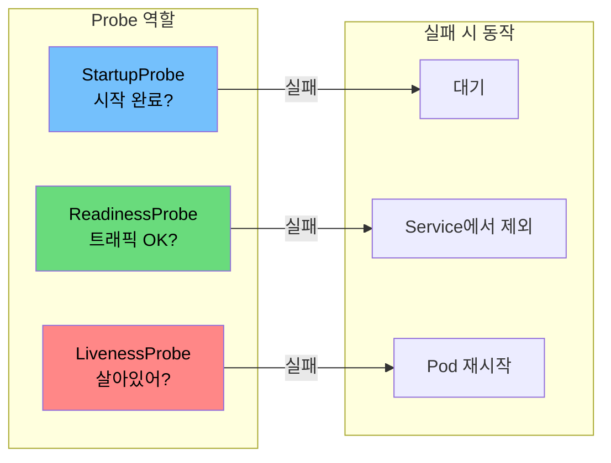
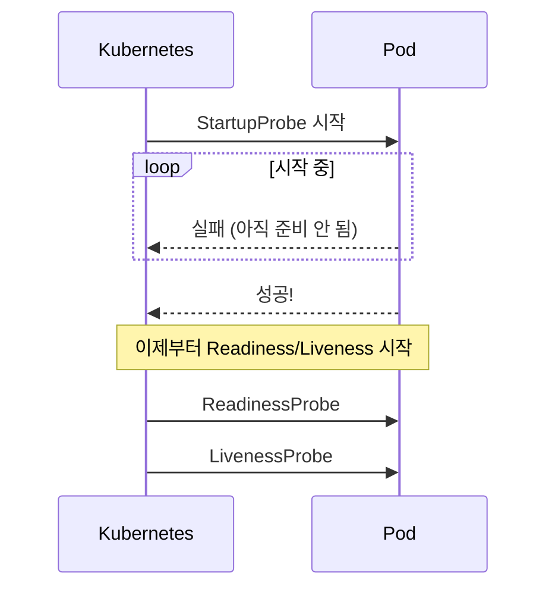

Kubernetes Probe 3종류가 항상 헷갈린다. StartupProbe, ReadinessProbe, LivenessProbe. 왜 3개로 나눠져 있고, 언제 어떤 걸 써야 할까?

## 한눈에 보기

| Probe | 질문 | 실패 시 |
|-------|------|---------|
| **StartupProbe** | "앱 시작 끝났어?" | 계속 대기 (다른 Probe 차단) |
| **ReadinessProbe** | "트래픽 받을 수 있어?" | Service에서 제외 (트래픽 차단) |
| **LivenessProbe** | "죽은 거 아니야?" | Pod 재시작 |



## 쉽게 외우기

```
StartupProbe   → 시작할 때만 (1회성)
ReadinessProbe → 트래픽 On/Off (반복)
LivenessProbe  → 죽으면 재시작 (반복)
```

## 왜 3개로 나눠져 있나

### StartupProbe가 없던 시절

JVM 애플리케이션은 시작이 느리다. Spring Boot + DB 연결까지 1~2분 걸리기도 한다.

```yaml
# 예전 방식: LivenessProbe에서 시작 대기
livenessProbe:
  httpGet:
    path: /health
  initialDelaySeconds: 120  # 2분 대기
  periodSeconds: 10
```

**문제:**
- 시작할 때는 2분 기다려줌 ✓
- 운영 중 장애 감지도 2분 걸림 ✗

앱이 죽어도 2분간 모른다.

### StartupProbe 도입 후

```yaml
# 시작할 때는 충분히 대기
startupProbe:
  httpGet:
    path: /health
  periodSeconds: 10
  failureThreshold: 18    # 최대 3분 대기

# 시작 후에는 빠르게 감지
livenessProbe:
  httpGet:
    path: /health
  periodSeconds: 10
  failureThreshold: 3
```

**StartupProbe가 성공하기 전까지 다른 Probe는 실행되지 않는다.**



## 각 Probe의 역할

### StartupProbe: 시작 완료 확인

**언제 사용:**
- JVM, .NET 등 시작 느린 앱
- 초기화에 오래 걸리는 앱

```yaml
startupProbe:
  httpGet:
    path: /health
    port: 8080
  initialDelaySeconds: 10
  periodSeconds: 10
  failureThreshold: 30    # 최대 5분 대기 (10초 × 30회)
```

### ReadinessProbe: 트래픽 제어

**언제 사용:**
- 거의 모든 앱에 권장
- 일시적으로 요청을 못 받는 상황 대응

**실패하면:**
- Service endpoint에서 제외
- 트래픽이 다른 Pod로 분산

```yaml
readinessProbe:
  httpGet:
    path: /ready
    port: 8080
  periodSeconds: 10
  failureThreshold: 3
```

**예시 상황:**
- DB 연결 끊김 → ReadinessProbe 실패 → 트래픽 차단
- DB 복구 → ReadinessProbe 성공 → 트래픽 복구

Pod 재시작 없이 트래픽만 제어한다.

### LivenessProbe: 죽은 앱 재시작

**언제 사용:**
- 앱이 완전히 멈출 수 있는 경우 (데드락 등)
- **신중하게 사용!**

**실패하면:**
- Pod 재시작

```yaml
livenessProbe:
  httpGet:
    path: /health
    port: 8080
  periodSeconds: 10
  timeoutSeconds: 5
  failureThreshold: 3
```

## LivenessProbe 주의점

### 재시작 폭풍

LivenessProbe를 잘못 설정하면 **재시작 폭풍**이 발생할 수 있다.

```yaml
# 위험한 설정
livenessProbe:
  httpGet:
    path: /health
  timeoutSeconds: 1      # 너무 짧음!
  failureThreshold: 1    # 1번 실패로 재시작
```

**시나리오:**
1. 트래픽 증가로 응답이 살짝 느려짐
2. LivenessProbe 1초 타임아웃 → 실패
3. Pod 재시작
4. 다른 Pod에 부하 전가
5. 또 타임아웃 → 또 재시작
6. **재시작 폭풍**


### LivenessProbe 권장 설정

```yaml
livenessProbe:
  httpGet:
    path: /health        # 단순한 체크만!
  timeoutSeconds: 5      # 여유있게
  failureThreshold: 3    # 3번 실패해야 재시작
  periodSeconds: 10
```

**핵심:**
- LivenessProbe는 **단순하게** - "앱이 살아있나?"만 확인
- DB 연결 체크 같은 건 ReadinessProbe에서

## 엔드포인트 분리

Probe마다 다른 엔드포인트를 사용하는 것이 좋다.

| Probe | 엔드포인트 | 체크 내용 |
|-------|-----------|----------|
| StartupProbe | `/startup` | 초기화 완료 (DB 연결 등) |
| ReadinessProbe | `/ready` | 요청 처리 가능 여부 |
| LivenessProbe | `/health` | 앱이 살아있는지 (단순) |

```java
// LivenessProbe - 단순하게
@GetMapping("/health")
public String health() {
    return "OK";
}

// ReadinessProbe - 의존성 체크
@GetMapping("/ready")
public String ready() {
    // DB 연결 확인
    jdbcTemplate.queryForObject("SELECT 1", Integer.class);
    return "OK";
}

// StartupProbe - 초기화 완료 확인
@GetMapping("/startup")
public String startup() {
    if (!initialized) {
        throw new RuntimeException("Not ready");
    }
    return "OK";
}
```

## 언제 어떤 Probe를 쓸까

| 상황 | StartupProbe | ReadinessProbe | LivenessProbe |
|------|:------------:|:--------------:|:-------------:|
| JVM 등 시작 느린 앱 | ✓ | ✓ | 선택 |
| 일반 웹 앱 | - | ✓ | 선택 |
| 데드락 가능성 있는 앱 | - | ✓ | ✓ |
| 단순 앱 (죽거나 살거나) | - | - | - |

**권장 조합:**
- **대부분의 경우**: ReadinessProbe
- **JVM 앱**: StartupProbe + ReadinessProbe
- **LivenessProbe**: 정말 필요한 경우만

## 정리

1. **StartupProbe** - 시작 대기용, 1회성
2. **ReadinessProbe** - 트래픽 제어, 거의 필수
3. **LivenessProbe** - 재시작용, 신중하게 사용

**기억할 것:**
- LivenessProbe는 **단순하게**, 타임아웃은 **여유있게**
- 복잡한 체크는 ReadinessProbe에서
- 3개 다 쓸 필요 없음, 상황에 맞게 선택
