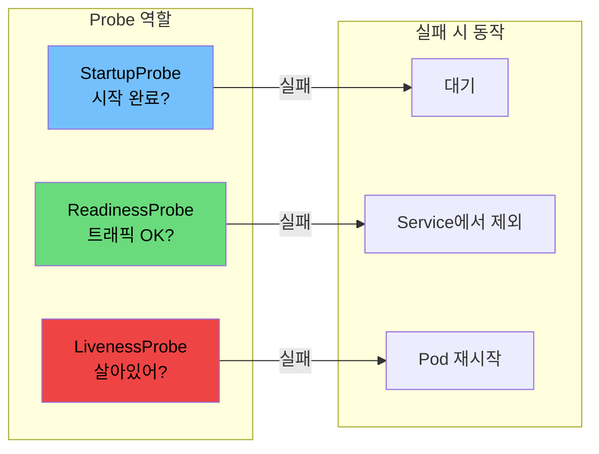
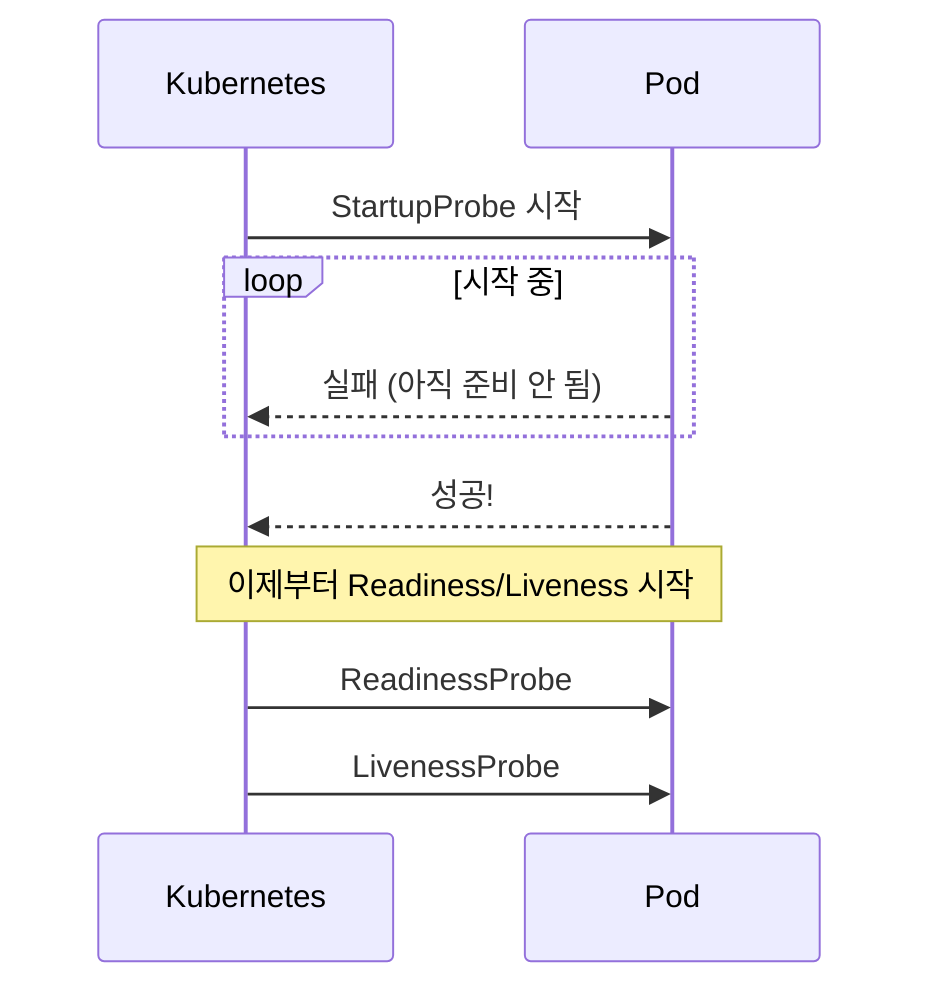
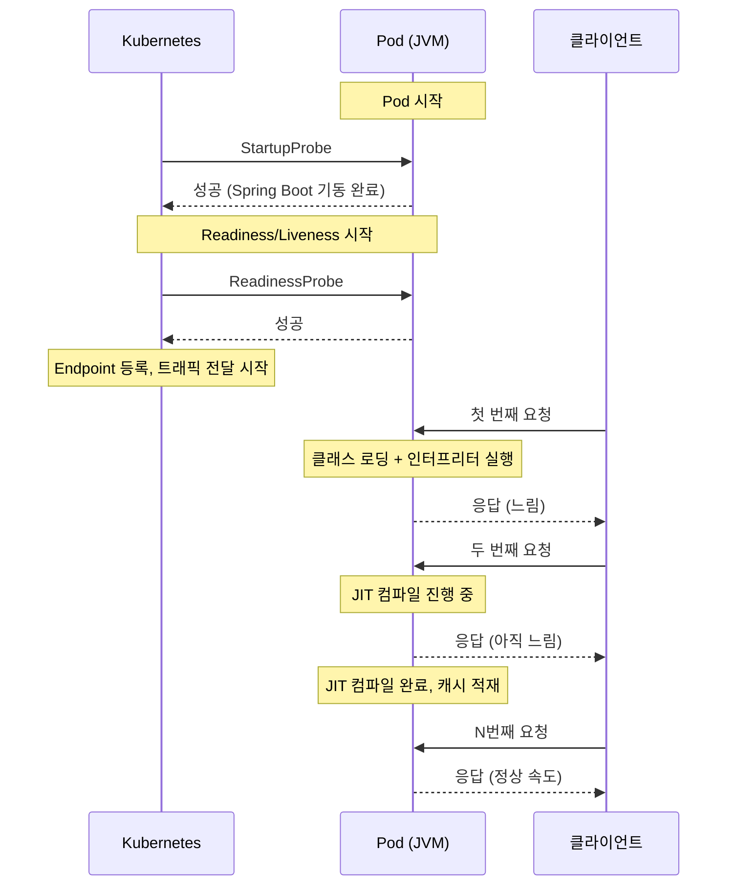
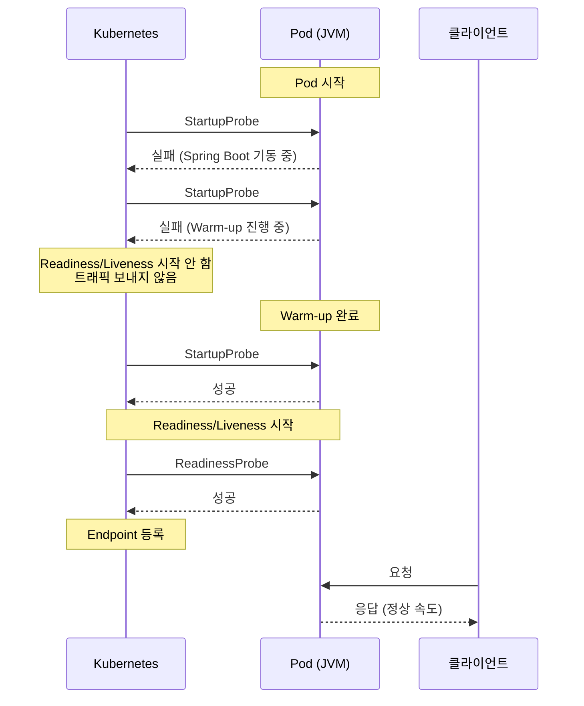
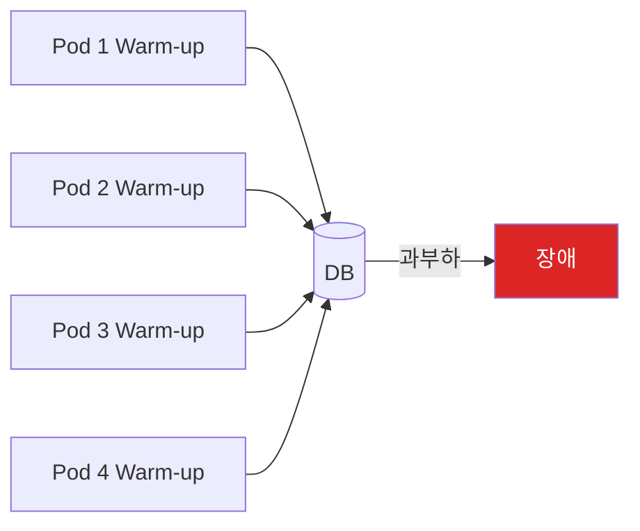

Kubernetes Probe 3종류가 항상 헷갈린다. StartupProbe, ReadinessProbe, LivenessProbe. 왜 3개로 나눠져 있고, 언제 어떤 걸 써야 할까?

## 한눈에 보기

| Probe | 질문 | 실패 시 |
|-------|------|---------|
| **StartupProbe** | "앱 시작 끝났어?" | 계속 대기 (다른 Probe 차단) |
| **ReadinessProbe** | "트래픽 받을 수 있어?" | Service에서 제외 (트래픽 차단) |
| **LivenessProbe** | "죽은 거 아니야?" | Pod 재시작 |



## 쉽게 외우기

```
StartupProbe   → 시작할 때만 (1회성)
ReadinessProbe → 트래픽 On/Off (반복)
LivenessProbe  → 죽으면 재시작 (반복)
```

## 왜 3개로 나눠져 있나

### StartupProbe가 없던 시절

JVM 애플리케이션은 시작이 느리다. Spring Boot + DB 연결까지 1~2분 걸리기도 한다.

```yaml
# 예전 방식: LivenessProbe에서 시작 대기
livenessProbe:
  httpGet:
    path: /health
  initialDelaySeconds: 120  # 2분 대기
  periodSeconds: 10
```

**문제:**
- 시작할 때는 2분 기다려줌 ✓
- Pod 재시작 시 다시 2분 공백 ✗

Pod가 재시작되면 `initialDelaySeconds` 때문에 다시 2분간 모니터링이 비게 된다.

### StartupProbe 도입 후

```yaml
# 시작할 때는 충분히 대기
startupProbe:
  httpGet:
    path: /health
  periodSeconds: 10
  failureThreshold: 18    # 최대 3분 대기

# 시작 후에는 빠르게 감지
livenessProbe:
  httpGet:
    path: /health
  periodSeconds: 10
  failureThreshold: 3
```

**StartupProbe가 성공하기 전까지 다른 Probe는 실행되지 않는다.**



## 각 Probe의 역할

### StartupProbe: 시작 완료 확인

**언제 사용:**
- JVM, .NET 등 시작 느린 앱
- 초기화에 오래 걸리는 앱

```yaml
startupProbe:
  httpGet:
    path: /health
    port: 8080
  initialDelaySeconds: 10
  periodSeconds: 10
  failureThreshold: 30    # 최대 약 5분 10초 대기 (10초 + 10초 × 30회)
```

### ReadinessProbe: 트래픽 제어

**언제 사용:**
- 거의 모든 앱에 권장
- 일시적으로 요청을 못 받는 상황 대응

**실패하면:**
- Service endpoint에서 제외
- 트래픽이 다른 Pod로 분산

```yaml
readinessProbe:
  httpGet:
    path: /ready
    port: 8080
  periodSeconds: 10
  failureThreshold: 3
```

**예시 상황:**
- DB 연결 끊김 → ReadinessProbe 실패 → 트래픽 차단
- DB 복구 → ReadinessProbe 성공 → 트래픽 복구

Pod 재시작 없이 트래픽만 제어한다.

### LivenessProbe: 죽은 앱 재시작

**언제 사용:**
- 앱이 완전히 멈출 수 있는 경우 (데드락 등)
- **신중하게 사용!**

**실패하면:**
- Pod 재시작

```yaml
livenessProbe:
  httpGet:
    path: /health
    port: 8080
  periodSeconds: 10
  timeoutSeconds: 5
  failureThreshold: 3
```

## LivenessProbe 주의점

### 재시작 폭풍

LivenessProbe를 잘못 설정하면 **재시작 폭풍**이 발생할 수 있다.

```yaml
# 위험한 설정
livenessProbe:
  httpGet:
    path: /health
  timeoutSeconds: 1      # 너무 짧음!
  failureThreshold: 1    # 1번 실패로 재시작
```

**시나리오:**
1. 트래픽 증가로 응답이 살짝 느려짐
2. LivenessProbe 1초 타임아웃 → 실패
3. Pod 재시작
4. 다른 Pod에 부하 전가
5. 또 타임아웃 → 또 재시작
6. **재시작 폭풍**


### LivenessProbe 권장 설정

```yaml
livenessProbe:
  httpGet:
    path: /health        # 단순한 체크만!
  timeoutSeconds: 5      # 여유있게
  failureThreshold: 3    # 3번 실패해야 재시작
  periodSeconds: 10
```

**핵심:**
- LivenessProbe는 **단순하게** - "앱이 살아있나?"만 확인
- DB 연결 체크 같은 건 ReadinessProbe에서

## 엔드포인트 분리

Probe마다 다른 엔드포인트를 사용하는 것이 좋다.

| Probe | 엔드포인트 | 체크 내용 |
|-------|-----------|----------|
| StartupProbe | `/startup` | 초기화 완료 (DB 연결 등) |
| ReadinessProbe | `/ready` | 요청 처리 가능 여부 |
| LivenessProbe | `/health` | 앱이 살아있는지 (단순) |

```java
// LivenessProbe - 단순하게
@GetMapping("/health")
public String health() {
    return "OK";
}

// ReadinessProbe - 의존성 체크
@GetMapping("/ready")
public String ready() {
    // DB 연결 확인
    jdbcTemplate.queryForObject("SELECT 1", Integer.class);
    return "OK";
}

// StartupProbe - 초기화 완료 확인
@GetMapping("/startup")
public String startup() {
    if (!initialized) {
        throw new RuntimeException("Not ready");
    }
    return "OK";
}
```

## 언제 어떤 Probe를 쓸까

| 상황 | StartupProbe | ReadinessProbe | LivenessProbe |
|------|:------------:|:--------------:|:-------------:|
| JVM 등 시작 느린 앱 | ✓ | ✓ | 선택 |
| 일반 웹 앱 | - | ✓ | 선택 |
| 데드락 가능성 있는 앱 | - | ✓ | ✓ |
| 단순 앱 (죽거나 살거나) | - | - | - |

**권장 조합:**
- **대부분의 경우**: ReadinessProbe
- **JVM 앱**: StartupProbe + ReadinessProbe
- **LivenessProbe**: 정말 필요한 경우만

## 실전: JVM Warm-up과 Probe 연동

여기까지가 Probe의 기본이다. 하지만 JVM 애플리케이션을 운영하면 한 가지 더 고민이 생긴다. **StartupProbe를 통과했는데도 첫 요청이 느리다.**

### StartupProbe 통과 ≠ 트래픽 준비 완료

JVM 애플리케이션은 시작이 느린 것뿐 아니라, **시작 직후에도 느리다.** StartupProbe가 통과하면 Kubernetes는 트래픽을 보내기 시작한다. 하지만 JVM은 아직 차가운 상태다.



이 구간에서 사용자는 평소보다 느린 응답을 경험한다. 배포할 때마다 반복된다.

### 왜 느린가: JVM 콜드 스타트

JVM이 시작 직후 느린 이유는 3가지다.

| 원인 | 설명 | 영향 |
|------|------|------|
| **클래스 로딩** | JVM은 클래스를 처음 사용할 때 로드한다 | 첫 호출이 수천 배 느림 |
| **JIT 컴파일** | 바이트코드는 인터프리터로 실행 후, 충분히 호출되면 네이티브 코드로 변환 | 변환 전까지 느림 |
| **I/O 커넥션 초기화** | DB 커넥션 풀, HTTP 클라이언트 등 첫 연결 수립 | 첫 I/O 호출이 느림 |

LINE Engineering의 사례에서, 배포 직후 평균 응답 시간의 **약 6배**에 달하는 지연이 발생했다고 한다.

### 해결: StartupProbe에 Warm-up 포함

Warm-up은 시작 시 1회만 필요한 작업이다. **StartupProbe가 Warm-up 완료까지 통과하지 않으면, Kubernetes는 Readiness/Liveness Probe를 시작하지 않고 트래픽도 보내지 않는다.**

ReadinessProbe에 Warm-up을 넣는 방법도 있지만([LINE Engineering 사례](https://engineering.linecorp.com/ko/blog/apply-warm-up-in-spring-boot-and-kubernetes)), 다음과 같은 이유로 StartupProbe가 더 적합하다고 생각한다.

| 항목 | StartupProbe에 Warm-up | ReadinessProbe에 Warm-up |
|------|----------------------|------------------------|
| 실행 횟수 | 성공하면 **끝** | Pod 수명 내내 **10초마다 반복** |
| LivenessProbe 간섭 | 원천 차단 (StartupProbe 전에는 동작 안 함) | Health Group 분리 필요 |
| Warm-up 실패 시 | failureThreshold 초과 → Pod 재시작 (자동 복구) | ReadinessProbe 영원히 실패 → 배포 멈춤 |
| 설계 원칙 | 1회성 관심사 → 1회성 Probe | 1회성 관심사를 반복 Probe에 배치 |



### Spring Boot Actuator 활용

StartupProbe 엔드포인트에 Warm-up 상태를 포함시킨다.

```java
@Component
public class WarmupHealthIndicator implements HealthIndicator {

    private volatile boolean warmupDone = false;

    @EventListener(ApplicationReadyEvent.class)
    public void onReady() {
        // 앱 시작 후 warm-up 실행
        runWarmup();
        warmupDone = true;
    }

    @Override
    public Health health() {
        if (warmupDone) {
            return Health.up().build();
        }
        return Health.down()
            .withDetail("reason", "Warm-up in progress")
            .build();
    }

    private void runWarmup() {
        // 1. 주요 API 내부 호출 (클래스 로딩 유도)
        // 2. DB 쿼리 실행 (커넥션 풀 초기화)
        // 3. 캐시 적재
    }
}
```

```yaml
# application.yml
management:
  endpoint:
    health:
      group:
        startup:
          include: livenessState, warmup    # warm-up 포함
        readiness:
          include: readinessState           # warm-up 제외 (이미 통과했으므로)
        liveness:
          include: livenessState            # warm-up 제외
```

StartupProbe에서 Warm-up을 포함하면 **Liveness/Readiness 그룹에서 warm-up을 제외하는 별도 설정이 필요 없다.** StartupProbe가 통과한 시점에 이미 Warm-up이 완료되었기 때문이다.

```yaml
# Kubernetes Probe 설정
startupProbe:
  httpGet:
    path: /actuator/health/startup    # warm-up 포함
  periodSeconds: 10
  failureThreshold: 30                # 최대 약 5분 대기

readinessProbe:
  httpGet:
    path: /actuator/health/readiness  # 트래픽 수신 가능 여부만
  periodSeconds: 10

livenessProbe:
  httpGet:
    path: /actuator/health/liveness   # 앱 생존 여부만
  periodSeconds: 10
```

각 Probe가 본래 역할에 맞게 분리된다:
- **StartupProbe**: 앱 기동 + Warm-up 완료 확인 (1회)
- **ReadinessProbe**: 트래픽 수신 가능 여부 (반복)
- **LivenessProbe**: 앱 생존 여부 (반복)

### Warm-up 시 주의사항

**1. 동시 배포 시 외부 시스템 부하**

Rolling Update로 여러 Pod가 동시에 시작되면, 모든 Pod가 동시에 warm-up을 실행한다. warm-up에서 외부 API나 DB를 호출한다면 **자체 DDoS**가 될 수 있다.



**대응:** warm-up 호출량을 최소화하거나, Pod 시작 간격을 두는 것이 좋다.

**2. Warm-up 실패 처리**

warm-up이 실패하면 StartupProbe가 계속 실패한다. `failureThreshold`를 초과하면 Kubernetes가 Pod를 재시작한다. ReadinessProbe 방식과 달리 배포가 영원히 멈추지는 않지만, 재시작이 반복될 수 있으므로 warm-up에 타임아웃과 fallback을 설정하는 것이 좋다.

- warm-up 없이 느린 것이, 재시작 루프에 빠지는 것보다 낫다

## 정리

1. **StartupProbe** - 시작 대기용, 1회성
2. **ReadinessProbe** - 트래픽 제어, 거의 필수
3. **LivenessProbe** - 재시작용, 신중하게 사용

**기억할 것:**
- LivenessProbe는 **단순하게**, 타임아웃은 **여유있게**
- 복잡한 체크는 ReadinessProbe에서
- 3개 다 쓸 필요 없음, 상황에 맞게 선택
- JVM 앱은 **Warm-up을 StartupProbe에 포함**시켜서, 시작 완료 전 트래픽 유입을 차단

## 참고

- [LINE Engineering - Spring Boot + Kubernetes 환경에서 Warm-up 적용기](https://engineering.linecorp.com/ko/blog/apply-warm-up-in-spring-boot-and-kubernetes)
- [Pod 종료 전략 - terminationGracePeriodSeconds와 preStop](/kubernetes/pod-graceful-shutdown/)
