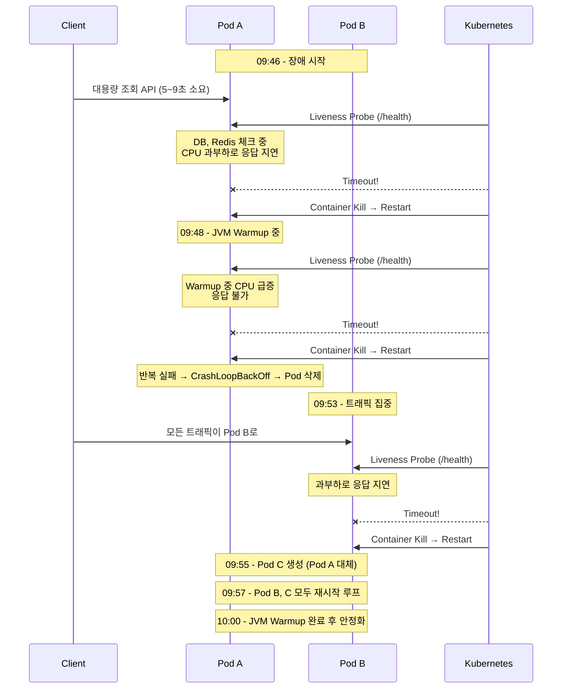

Liveness Probe는 죽은 Pod를 살리기 위한 것이다. 그런데 잘못 설정하면 **멀쩡한 Pod를 죽이는 도구**가 된다.

이론적으로는 알고 있었다. [Kubernetes Probe 3종류](/kubernetes/kubernetes-probes-explained/)에서도 "LivenessProbe는 단순하게"라고 정리했다. 그런데 실제로 겪고 나니 체감이 다르다. Datadog 메트릭으로 타임라인을 복원하고 원인을 분석한 과정을 공유한다.

## 증상

아침에 5xx 알람이 터졌다. Spring Boot API 서버에서 약 15분간 간헐적 에러가 발생했다.

```
[PROD] API 5xx Error Alert
Metric value: 0.6 (5분간 5xx 발생률)
```

확인해보니 Pod가 여러 번 재시작되어 있었다.

```bash
$ kubectl get pods
NAME                        READY   STATUS    RESTARTS        AGE
api-server-66c7f4d598-gk6kq   1/1     Running   2 (2d ago)    2d
api-server-66c7f4d598-vqd9k   1/1     Running   2 (2d ago)    2d
```

평소에 RESTARTS가 0이었는데 갑자기 2로 늘어났다.

## 원인 추적

### 변경점 확인

전날 배포에서 `/health` 엔드포인트가 변경되었다.

```java
// Before - 단순 응답
@GetMapping("/health")
public String health() {
    return "OK";
}

// After - DB, Redis 연결 체크 추가
@GetMapping("/health")
public String health() {
    jdbcTemplate.queryForObject("SELECT 1", Integer.class);
    redisTemplate.opsForValue().get("health-check");
    return "OK";
}
```

개발팀에서 "헬스체크가 너무 단순해서 실제 연결 상태를 반영 못 한다"고 변경한 것이었다.

의도는 좋았다. 문제는 이 `/health`가 **Liveness Probe에 연결되어 있었다**는 것이다.

### 메트릭 분석

Datadog에서 `kubernetes.containers.restarts` 메트릭을 Pod별로 조회했다.

```
Pod별 restart count 변화 (시간: KST)
───────────────────────────────────────

Pod A (9pfcn):
  09:46 → 1회 재시작
  09:48 → 2회 재시작
  09:50 → 메트릭 사라짐 (Pod 삭제됨)

Pod B (vqd9k):
  09:53 → 1회 재시작
  09:55 → 2회 재시작
  09:57 → 4회까지 증가
  이후 → 안정화

Pod C (gk6kq):
  09:55 → 새로 생성됨 (Pod A 대체)
  09:57 → 4회 재시작
  이후 → 안정화
```

## 타임라인 복원

메트릭과 APM 트레이스를 조합해서 타임라인을 복원했다.



### 연쇄 반응 분석

왜 한 Pod의 재시작이 다른 Pod까지 영향을 줬을까?

```
┌──────────────────────────────────────────────────────────┐
│  1. Pod A에서 대용량 API 처리 중 (5~9초)                 │
│                     ↓                                    │
│  2. 동시에 Liveness Probe 요청                          │
│     → DB, Redis 체크 → 응답 지연                        │
│                     ↓                                    │
│  3. Liveness timeout → Pod A 강제 종료                  │
│                     ↓                                    │
│  4. Pod B에 트래픽 집중 → 과부하                        │
│                     ↓                                    │
│  5. Pod B도 Liveness 실패 → 재시작                      │
│                     ↓                                    │
│  6. 새 Pod 생성 → JVM Warmup → CPU 급증 → 또 실패       │
│                     ↓                                    │
│  7. 재시작 루프 (최대 4회)                               │
└──────────────────────────────────────────────────────────┘
```

**핵심은 Liveness Probe가 "무거웠다"는 것이다.**

- 평소에는 문제없었다
- 부하 상황에서 DB/Redis 체크가 지연됐다
- JVM Warmup 중에는 더 심했다
- 재시작할수록 상황이 악화됐다

## Pod별 최종 상태

| Pod | 재시작 횟수 | 결과 |
|-----|------------|------|
| Pod A (9pfcn) | 2회 | 삭제됨 → Pod C로 대체 |
| Pod B (vqd9k) | 4회 | 살아남음 |
| Pod C (gk6kq) | 4회 | 새로 생성되어 안정화 |

Pod A는 CrashLoopBackOff에 빠져서 결국 삭제됐고, 새 Pod C가 생성됐다.

## 교훈

### Probe별 권장 설정

| Probe | 체크 내용 | 이유 |
|-------|----------|------|
| **Liveness** | 단순 200 응답 | 무거우면 부하 시 재시작 루프 |
| **Startup** | DB, Redis 체크 | 시작 시 한 번만 실행 |
| **Readiness** | 단순 200 권장 | 무거우면 트래픽 유실 |

```yaml
# 권장 설정
startupProbe:
  httpGet:
    path: /health/startup  # DB, Redis 체크
  periodSeconds: 10
  failureThreshold: 30     # 최대 5분 대기

livenessProbe:
  httpGet:
    path: /health          # 단순 200 응답
  periodSeconds: 10
  timeoutSeconds: 5
  failureThreshold: 3

readinessProbe:
  httpGet:
    path: /health          # 단순 200 응답
  periodSeconds: 10
  failureThreshold: 3
```

### 엔드포인트 분리

```java
// Liveness - 단순하게
@GetMapping("/health")
public String health() {
    return "OK";
}

// Startup - 초기화 검증
@GetMapping("/health/startup")
public String startup() {
    jdbcTemplate.queryForObject("SELECT 1", Integer.class);
    redisTemplate.opsForValue().get("health-check");
    return "OK";
}
```

### 기억할 것

1. **Liveness Probe는 "앱이 살아있나?"만 확인한다** - 의존성 체크는 Startup에서
2. **부하 상황을 시뮬레이션해야 한다** - 평소에 문제없어도 부하 시 터진다
3. **JVM Warmup 시간을 고려한다** - 재시작 후 CPU가 급증한다

## 조치 사항

1. `/health` → 단순 200 응답으로 롤백
2. `/health/startup` 엔드포인트 추가 (DB, Redis 체크)
3. StartupProbe 설정 추가
4. CPU limit 검토 (현재 1600m, 실사용 1400m 후반)

이론으로 알던 것과 실제로 겪는 것은 다르다. "Liveness Probe는 단순하게"라는 원칙이 왜 중요한지 체감한 장애였다.
