Liveness Probe는 죽은 Pod를 살리기 위한 것이다. 그런데 잘못 설정하면 **멀쩡한 Pod를 죽이는 도구**가 된다.

이론적으로는 알고 있었다. [Kubernetes Probe 3종류](/kubernetes/kubernetes-probes-explained/)에서도 "LivenessProbe는 단순하게"라고 정리했다. 그런데 실제로 겪고 나니 체감이 다르다. Karpenter 노드 교체와 무거운 Liveness Probe가 만나면서 연쇄 재시작이 발생했다. Datadog 메트릭으로 타임라인을 복원하고 원인을 분석한 과정을 공유한다.

## 증상

아침에 5xx 알람이 터졌다. Spring Boot API 서버에서 약 15분간 간헐적 에러가 발생했다.

```
[PROD] API 5xx Error Alert
Metric value: 0.6 (5분간 5xx 발생률)
```

확인해보니 Pod가 여러 번 재시작되어 있었다.

```bash
$ kubectl get pods
NAME                        READY   STATUS    RESTARTS        AGE
api-server-66c7f4d598-gk6kq   1/1     Running   2 (2d ago)    2d
api-server-66c7f4d598-vqd9k   1/1     Running   2 (2d ago)    2d
```

평소에 RESTARTS가 0이었는데 갑자기 2로 늘어났다.

## 원인 추적

### 트리거: Karpenter 노드 교체

먼저 노드 변화를 확인했다. `kubernetes.pods.running` 메트릭을 노드별로 조회하니 흥미로운 패턴이 보였다.

```mermaid
gantt
    title 노드별 Pod 존재 시간 (KST)
    dateFormat HH:mm
    axisFormat %H:%M

    section 장애 전 노드
    Node A (ip-10-2-26-193)    :a1, 04:10, 10:00
    Node B (ip-10-2-46-83)     :a2, 04:15, 09:45

    section 장애 중 임시 노드
    ip-10-2-0-80               :crit, b1, 09:40, 10:00
    ip-10-2-12-250             :crit, b2, 10:05, 10:20

    section 새 노드 (안정화)
    Node C (ip-10-2-16-180)    :done, c1, 09:55, 13:35
    Node D (ip-10-2-39-45)     :done, c2, 09:55, 13:35
```



**09:45 전후로 Node A, B가 동시에 드레인**되면서 2개 Pod가 동시에 새 노드로 이동했다.

**Karpenter가 AMI 버전 drift를 감지하고 2개 노드를 동시에 교체**한 것이었다. EKS에서 새 AMI 버전(v1.32.9)이 릴리스되면서 기존 노드(v1.32.3)가 drift 상태가 됐고, Karpenter가 자동으로 노드를 교체했다.

문제는 2개 노드가 **동시에** 드레인되면서 2개 Pod가 **동시에** 새 노드로 이동했다는 것이다.

### 복합 원인: 무거운 Liveness Probe

노드 교체 자체는 정상적인 운영이다. 문제는 전날 배포에서 `/health` 엔드포인트가 변경되어 있었다는 것이다.

```java
// Before - 단순 응답
@GetMapping("/health")
public String health() {
    return "OK";
}

// After - DB, Redis 연결 체크 추가
@GetMapping("/health")
public String health() {
    jdbcTemplate.queryForObject("SELECT 1", Integer.class);
    redisTemplate.opsForValue().get("health-check");
    return "OK";
}
```

개발팀에서 "헬스체크가 너무 단순해서 실제 연결 상태를 반영 못 한다"고 변경한 것이었다.

의도는 좋았다. 문제는 이 `/health`가 **Liveness Probe에 연결되어 있었다**는 것이다.

**두 가지가 만났다:**
1. Karpenter 노드 교체 → 2개 Pod 동시 재스케줄링
2. 무거운 Liveness Probe → JVM Warmup 중 응답 불가 → 재시작 루프

### 메트릭 분석

Datadog에서 `kubernetes.containers.restarts` 메트릭을 Pod별로 조회했다.

```
Pod별 restart count 변화 (시간: KST)
───────────────────────────────────────

Pod A (9pfcn):
  09:46 → 1회 재시작
  09:48 → 2회 재시작
  09:50 → 메트릭 사라짐 (Pod 삭제됨)

Pod B (vqd9k):
  09:53 → 1회 재시작
  09:55 → 2회 재시작
  09:57 → 4회까지 증가
  이후 → 안정화

Pod C (gk6kq):
  09:55 → 새로 생성됨 (Pod A 대체)
  09:57 → 4회 재시작
  이후 → 안정화
```

## 타임라인 복원

메트릭과 APM 트레이스를 조합해서 전체 타임라인을 복원했다.


### 왜 2개 Pod가 동시에 문제가 됐나

처음에는 "한 Pod가 죽어서 다른 Pod에 트래픽이 몰렸다"고 생각했다. 하지만 메트릭을 자세히 보니 **둘 다 동시에 문제**였다.

```
┌──────────────────────────────────────────────────────────┐
│  [트리거] Karpenter가 2개 노드 동시 드레인               │
│                     ↓                                    │
│  [상황] 2개 Pod가 동시에 새 노드로 이동                  │
│                     ↓                                    │
│  [문제] 둘 다 JVM Warmup → 둘 다 CPU 급증               │
│                     ↓                                    │
│  [악화] 둘 다 Liveness 실패 → 둘 다 재시작              │
│                     ↓                                    │
│  [연쇄] 한쪽 죽으면 다른 쪽 부하 증가 → 같이 죽음       │
│                     ↓                                    │
│  [루프] 재시작 → Warmup → 실패 → 재시작 (최대 4회)      │
└──────────────────────────────────────────────────────────┘
```

**핵심:**
- 평소에는 무거운 Liveness Probe도 문제없었다
- 노드 교체로 **동시에 Warmup 상태**가 되면서 문제 발생
- Warmup 중 CPU 사용량이 limit(1600m) 근처까지 치솟음
- 이 상태에서 DB, Redis 체크하는 Liveness Probe가 timeout

## Pod별 최종 상태

| Pod | 재시작 횟수 | 결과 |
|-----|------------|------|
| Pod A (9pfcn) | 2회 | 삭제됨 → Pod C로 대체 |
| Pod B (vqd9k) | 4회 | 살아남음 |
| Pod C (gk6kq) | 4회 | 새로 생성되어 안정화 |

Pod A는 CrashLoopBackOff에 빠져서 결국 삭제됐고, 새 Pod C가 생성됐다.

## 교훈

### 1. Liveness Probe는 단순하게

| Probe | 체크 내용 | 이유 |
|-------|----------|------|
| **Liveness** | 단순 200 응답 | 무거우면 부하 시 재시작 루프 |
| **Startup** | DB, Redis 체크 | 시작 시 한 번만 실행 |
| **Readiness** | 단순 200 권장 | 무거우면 트래픽 유실 |

```yaml
# 권장 설정
startupProbe:
  httpGet:
    path: /health/startup  # DB, Redis 체크
  periodSeconds: 10
  failureThreshold: 30     # 최대 5분 대기

livenessProbe:
  httpGet:
    path: /health          # 단순 200 응답
  periodSeconds: 10
  timeoutSeconds: 5
  failureThreshold: 3

readinessProbe:
  httpGet:
    path: /health          # 단순 200 응답
  periodSeconds: 10
  failureThreshold: 3
```

### 2. 엔드포인트 분리

```java
// Liveness - 단순하게
@GetMapping("/health")
public String health() {
    return "OK";
}

// Startup - 초기화 검증
@GetMapping("/health/startup")
public String startup() {
    jdbcTemplate.queryForObject("SELECT 1", Integer.class);
    redisTemplate.opsForValue().get("health-check");
    return "OK";
}
```

### 3. Karpenter 노드 교체 시 주의

Karpenter는 노드를 자동으로 교체한다. 평소에는 문제없지만, **여러 노드가 동시에 교체**되면 Pod들이 동시에 재스케줄링된다.

- JVM 앱은 Warmup 시간이 필요하다
- 동시 재스케줄링 시 모든 Pod가 Warmup 상태가 된다
- 이때 Liveness Probe가 무거우면 재시작 루프 발생

**대응:**
- Karpenter의 `disruption` 설정으로 동시 교체 Pod 수 제한
- PodDisruptionBudget(PDB)으로 최소 가용 Pod 수 보장
- Liveness Probe는 항상 가볍게 유지

### 기억할 것

1. **Liveness Probe는 "앱이 살아있나?"만 확인한다** - 의존성 체크는 Startup에서
2. **노드 교체 상황을 시뮬레이션해야 한다** - 평소에 문제없어도 동시 재스케줄링 시 터진다
3. **JVM Warmup 시간을 고려한다** - 재시작 후 CPU가 급증한다

## 조치 사항

1. `/health` → 단순 200 응답으로 롤백
2. `/health/startup` 엔드포인트 추가 (DB, Redis 체크)
3. StartupProbe 설정 추가
4. CPU limit 검토 (현재 1600m, 실사용 1400m 후반)
5. Karpenter disruption 설정 검토

이론으로 알던 것과 실제로 겪는 것은 다르다. "Liveness Probe는 단순하게"라는 원칙이 왜 중요한지, 그리고 **여러 요소가 동시에 작용**할 때 어떤 일이 벌어지는지 체감한 장애였다.
