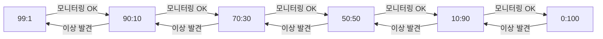

컨테이너 오케스트레이션 플랫폼을 바꾸는 건, 비행 중에 엔진을 교체하는 것과 같다. 핵심은 "어떻게 전환할 것인가"다. 한 번에 스위칭하면 빠르지만 위험하고, 너무 느리면 두 환경을 동시에 운영하는 비용이 커진다.

플랫폼 서버를 ECS에서 EKS로 마이그레이션했다. Big Bang 전환 대신 **가중치 기반 점진적 트래픽 전환** 전략을 택했다. 99:1에서 시작해 0:100까지, 각 단계마다 모니터링하고 이상이 없을 때만 다음 단계로 넘어가는 방식이다. 결과적으로 에러 없이 무중단으로 전환을 완료했다. 그 과정을 공유한다.

## 전환 전략 설계

### 왜 가중치 전환인가

마이그레이션 전환 방식은 크게 세 가지가 있다.

| 전환 방식 | 장점 | 단점 | 적합한 상황 |
|----------|------|------|------------|
| Big Bang | 빠름, 단순 | 롤백이 어렵고 위험 높음 | 트래픽이 적은 서비스 |
| Blue/Green | 즉시 롤백 가능 | 두 환경 동시 운영 비용 | 상태 없는 서비스 |
| **Canary (가중치)** | **점진적 검증, 즉시 롤백** | **전환 시간 길어짐** | **프로덕션 핵심 서비스** |

플랫폼 서버는 프로덕션 핵심 서비스다. 장애 시 영향 범위가 넓기 때문에 **가중치 기반 Canary 방식**을 선택했다.

### 전환 단계 설계

전환 비율은 다음과 같이 설계했다.

```
ECS : EKS
 99 : 1     ← 최소 트래픽으로 기본 동작 확인
 90 : 10    ← 소량 트래픽으로 안정성 확인
 70 : 30    ← 유의미한 트래픽으로 성능 검증
 50 : 50    ← 절반 트래픽으로 동등 검증
 10 : 90    ← EKS 주력 전환
  0 : 100   ← 전환 완료
```

각 단계에서 **최소 1시간 모니터링** 후 다음 단계로 넘어가는 것을 원칙으로 했다. 이상 징후 발생 시 즉시 이전 비율로 롤백한다.



## 작업 당일 실황

### 08:00 - 작업 시작, 99:1 적용

작업 시작과 동시에 최초 가중치 99:1을 적용했다. EKS로 전체 트래픽의 1%만 흘려보내는 단계다.

이 단계의 목적은 EKS 환경에서 **기본적인 요청/응답이 정상 동작하는지** 확인하는 것이다. DNS 연결, 로드밸런서 라우팅, 서비스 디스커버리, DB 연결 등 인프라 레벨의 문제를 잡아낸다.

### 08:20 - Datadog 모니터링 노이즈 제거

가중치 적용 직후 Datadog에서 `StatusController.checkServerStatus` 엔드포인트의 수집을 제외했다. Health check 엔드포인트는 로드밸런서가 지속적으로 호출하기 때문에, 실제 비즈니스 트래픽 패턴을 파악하는 데 노이즈가 된다.

모니터링 지표에서 health check를 제외하는 건 작지만 중요한 작업이다. 제외하지 않으면 health check 성공률이 전체 메트릭을 희석시켜, 실제 문제가 발생해도 지표상으로 정상처럼 보일 수 있다.

### 08:25 - 90:10으로 비율 조정

1% 트래픽에서는 요청 수가 너무 적어 유의미한 판단이 어려웠다. 에러가 없는 것을 확인한 후 **10%로 비율을 올렸다**.

이 결정은 사전에 설계한 단계(99:1 → 90:10)를 따른 것이다. 초기 단계에서 빠르게 유의미한 트래픽 수준으로 올리는 것이 전체 전환 시간을 단축하는 데 도움이 된다.

### 09:50 - 70:30으로 비율 조정

90:10 상태에서 약 1시간 30분 모니터링했다. 서버 에러가 없는 것을 확인한 후 30%로 비율을 올렸다.

이 단계부터는 EKS가 전체 트래픽의 **유의미한 비중**을 처리하기 시작한다. 레이턴시, 에러율, 리소스 사용량을 집중적으로 모니터링했다.

### 10:37 - 50:50으로 비율 조정

특이사항 없이 50:50으로 조정했다. 이 단계에서는 ECS와 EKS가 **동일한 부하**를 처리한다. 두 환경의 성능 지표를 직접 비교할 수 있는 단계다.

### 10:42 - 리소스 사용량 확인

CPU 사용량을 확인했다. Pod당 약 0.4 core로, HPA(Horizontal Pod Autoscaler) 스케일 아웃 기준의 30~40% 수준이었다.

| 지표 | 값 | 비고 |
|------|-----|------|
| Pod당 CPU | ~0.4 core | 안정적 |
| HPA 대비 사용률 | 30~40% | 스케일 아웃 여유 충분 |
| 서버 에러 | 0건 | 5xx 없음 |

HPA 여유가 충분했기 때문에, 이후 비율을 올려도 EKS 측에서 트래픽을 안정적으로 소화할 수 있다고 판단했다.

### 13:35 - 10:90으로 비율 조정

EKS가 전체 트래픽의 90%를 처리하는 단계다. 사실상 EKS가 주력이 되는 시점이다. 이 단계에서도 이상이 없으면 전환 완료로 간주한다.

## 전체 타임라인

```mermaid
gantt
    title ECS → EKS 트래픽 전환 타임라인
    dateFormat HH:mm
    axisFormat %H:%M

    section 트래픽 전환
    99:1 적용 및 모니터링        :a1, 08:00, 25min
    90:10 적용 및 모니터링       :a2, 08:25, 85min
    70:30 적용 및 모니터링       :a3, 09:50, 47min
    50:50 적용 및 모니터링       :a4, 10:37, 178min
    10:90 적용                  :a5, 13:35, 30min

    section 부가 작업
    Datadog 노이즈 제거         :b1, 08:20, 5min
    리소스 사용량 점검           :b2, 10:42, 10min
```



| 시간 | 비율 (ECS:EKS) | 판단 근거 |
|------|---------------|----------|
| 08:00 | 99:1 | 작업 시작, 기본 동작 확인 |
| 08:25 | 90:10 | 요청 수 적고 특이사항 없음 |
| 09:50 | 70:30 | 서버 에러 없음 |
| 10:37 | 50:50 | 특이사항 없음 |
| 13:35 | 10:90 | 지속적 안정 확인 |

## 가중치 전환 시 고려 사항

이번 전환을 진행하면서 느낀 핵심 포인트를 정리한다.

### 1. 모니터링 노이즈 제거가 먼저다

Health check 엔드포인트를 모니터링 지표에서 제외하지 않으면, 전환 과정에서 이상 징후를 감지하기 어렵다. 가중치 전환의 핵심은 **각 단계에서의 정확한 판단**이기 때문에, 노이즈 제거를 가장 먼저 해야 한다.

### 2. 초기 단계는 빠르게, 후반 단계는 신중하게

99:1에서 90:10까지는 25분 만에 올렸다. 소량 트래픽에서 오래 모니터링해도 유의미한 데이터를 얻기 어렵기 때문이다. 반면 50:50 이후에는 약 3시간 동안 충분히 관찰했다. 비율이 올라갈수록 문제 발생 시 영향 범위가 커지기 때문에 신중해야 한다.

### 3. HPA 여유 확인은 비율 상향 전 필수다

비율을 올리면 EKS 측 트래픽이 증가한다. HPA 스케일 아웃 여유가 충분한지 반드시 확인해야 한다. 이번에는 Pod당 CPU가 HPA 기준의 30~40%여서 여유가 충분했지만, 이 수치가 80% 이상이었다면 비율 상향 전에 HPA 설정을 먼저 조정했을 것이다.

### 4. 런북이 있어야 작업이 흔들리지 않는다

사전에 Confluence에 런북을 작성하고 공유했다. 런북이 있으면 작업자가 각 단계에서 무엇을 확인해야 하는지, 이상 시 어떻게 롤백하는지 명확하다. 당일 작업이 순조로웠던 것은 런북 덕분이기도 하다.

## 정리

ECS에서 EKS로의 마이그레이션을 가중치 기반 점진적 전환 방식으로 진행했다. 약 반나절 동안 99:1에서 10:90까지 단계적으로 트래픽을 전환했고, 전 과정에서 에러 없이 안정적으로 완료했다.

가중치 전환은 Big Bang에 비해 시간이 더 걸리지만, 프로덕션 핵심 서비스에서는 그 시간이 곧 안전 마진이다. 각 단계에서 문제를 발견하면 즉시 롤백할 수 있다는 것이 가장 큰 장점이다.
