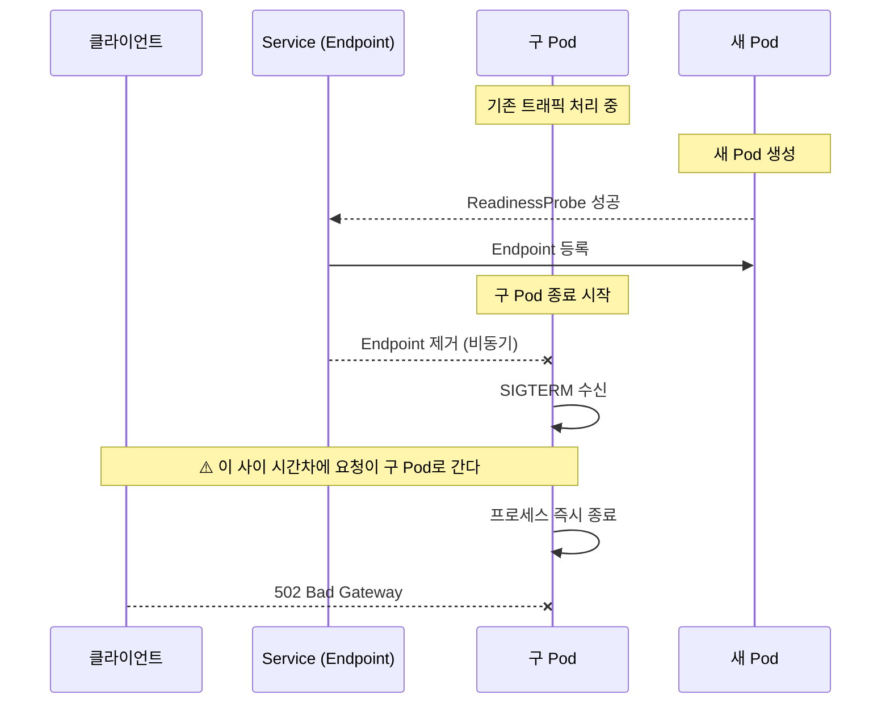
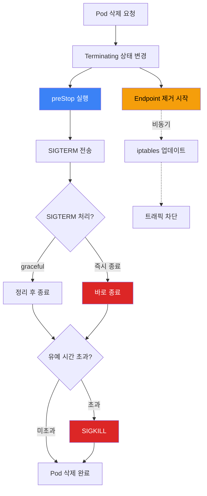
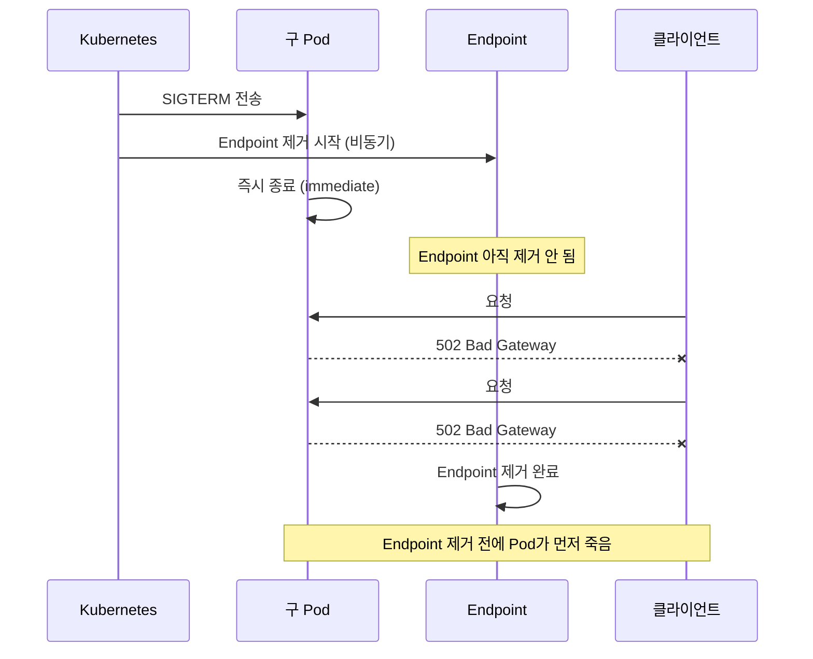
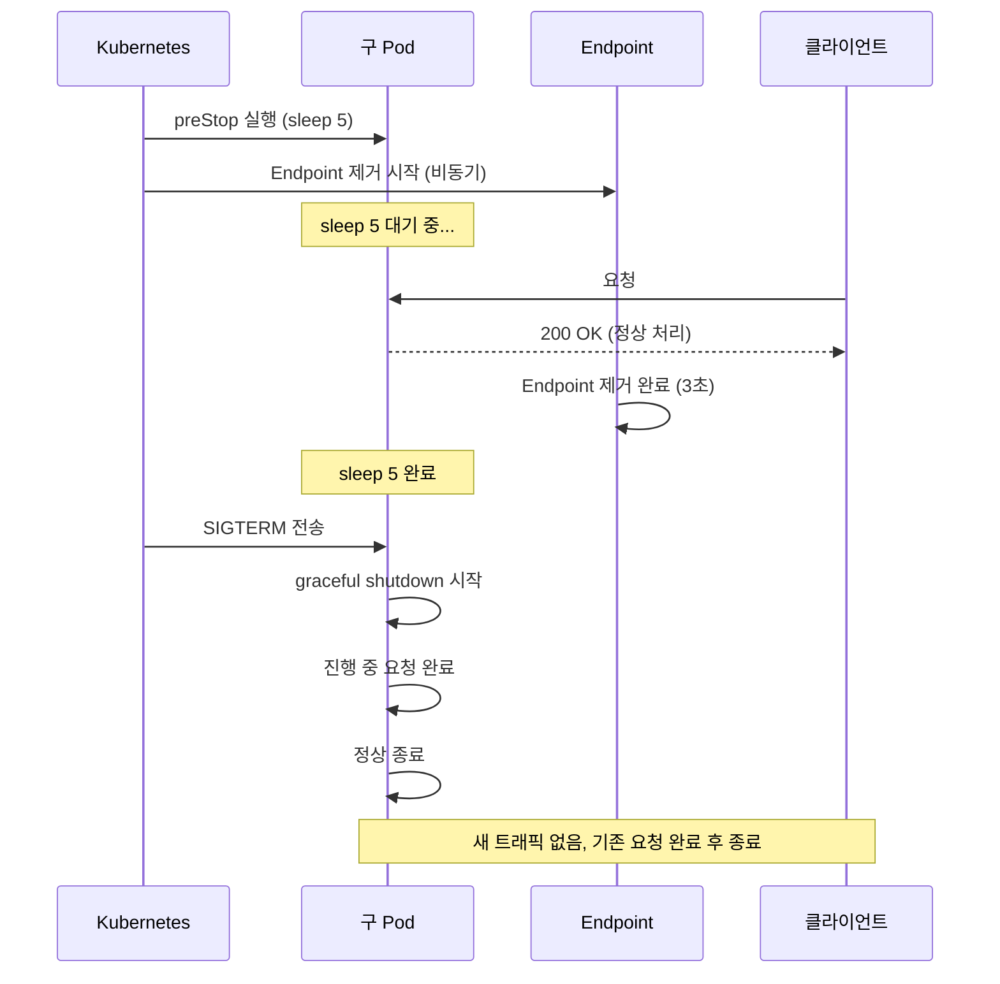

Kubernetes에서 애플리케이션을 운영할 때, 결국 핵심은 **Pod의 시작과 끝**이다. 얼마나 따뜻하게 시작하고, 얼마나 우아하게 끝내느냐. Probe와 Warmup으로 시작을 제어하고, Graceful Shutdown으로 끝을 제어한다. 이 두 가지가 안정적인 서비스 운영의 기반이다.

[Probe 설정](/kubernetes/kubernetes-probes-explained/)은 이전 글에서 다뤘다. 이번에는 **끝**에 대한 이야기다. 배포할 때마다 502 에러가 발생하는 서비스가 있었다. 원인은 Pod 종료 전략의 부재였다. `terminationGracePeriodSeconds`와 `preStop` hook을 적용해서 해결한 과정을 공유한다.

## 증상

Spring Boot API 서버를 배포할 때마다 간헐적으로 502 에러가 발생했다.

```
[PROD] API 5xx Error Alert
Metric value: 0.3 (5분간 5xx 발생률)
Duration: 배포 시작 후 약 1~2분
```

배포가 끝나면 자연스럽게 사라졌다. 매번 1~2분 정도, 짧지만 확실하게 발생했다.

## 원인 추적

### Rolling Update 중 무슨 일이 일어나는가

Deployment를 업데이트하면 Kubernetes는 Rolling Update를 수행한다. 새 Pod를 먼저 띄우고, 준비되면 구 Pod를 종료한다.



**문제의 핵심은 타이밍**이다. Kubernetes가 Pod에 SIGTERM을 보내는 것과, Service Endpoint에서 해당 Pod를 제거하는 것은 **비동기로 동시에** 일어난다. Endpoint 제거가 완료되기 전에 Pod가 먼저 종료되면, 그 사이에 들어온 요청은 502가 된다.

### 확인: 구 Pod가 바로 죽는가

구 Pod의 종료 과정을 확인했다.

```yaml
# 당시 Deployment 설정 (문제 상황)
spec:
  terminationGracePeriodSeconds: 30  # 기본값
  containers:
    - name: api-server
      # lifecycle 설정 없음
      # preStop 없음
```

- `terminationGracePeriodSeconds: 30` → SIGTERM 후 최대 30초 대기
- `preStop` hook → **없음**
- Spring Boot `server.shutdown` → **설정 안 됨** (기본값: immediate)

SIGTERM을 받으면 Spring Boot가 **즉시 종료**하고 있었다.

## Pod 종료 과정 이해

문제를 이해하려면 Pod가 종료되는 전체 흐름을 알아야 한다.

### 종료 시퀀스



**핵심 포인트:**
- `preStop` 실행과 Endpoint 제거는 **동시에 시작**된다
- SIGTERM은 `preStop` 완료 후에 전송된다
- `terminationGracePeriodSeconds`는 preStop + SIGTERM 대기를 **모두 포함**한다

### terminationGracePeriodSeconds

```yaml
spec:
  terminationGracePeriodSeconds: 30
```

이 값은 "SIGTERM 보내고 30초 기다린다"가 아니다. **preStop 실행 시간을 포함한 전체 유예 시간**이다.

```mermaid
gantt
    title terminationGracePeriodSeconds (30초)
    dateFormat s
    axisFormat %S초

    section 종료 과정
    preStop 실행          :a1, 0, 10s
    SIGTERM 수신           :milestone, m1, after a1, 0s
    앱 정리 (graceful)    :a2, after a1, 20s
    SIGKILL (시간 초과 시) :milestone, m2, after a2, 0s
```



preStop이 10초 걸리면, 앱이 SIGTERM을 처리할 수 있는 시간은 나머지 20초다.

### preStop hook

```yaml
lifecycle:
  preStop:
    exec:
      command: ["sh", "-c", "sleep 5"]
```

preStop은 SIGTERM **이전에** 실행된다. 이 시간 동안:
1. Kubernetes Endpoint Controller가 해당 Pod를 Endpoint에서 제거한다
2. kube-proxy가 iptables/IPVS 규칙을 업데이트한다
3. Ingress Controller가 upstream에서 해당 Pod를 제거한다

**preStop에서 sleep을 거는 이유**: Endpoint 제거가 완료될 때까지 기다리는 것이다. preStop이 끝난 후 SIGTERM이 전송되므로, 그 시점에는 이미 새 트래픽이 들어오지 않는다.

## 타임라인 비교

### Before: preStop 없음



SIGTERM과 동시에 앱이 종료되지만, Endpoint 제거는 아직 진행 중이다. 이 시간차에 들어온 요청이 502가 된다.

### After: preStop + Graceful Shutdown



preStop의 `sleep 5` 동안 Endpoint 제거가 완료된다. 그 후 SIGTERM을 받으면 Spring Boot가 graceful shutdown으로 진행 중인 요청을 마무리한다.

## 해결

### 1. preStop hook 추가

```yaml
spec:
  terminationGracePeriodSeconds: 30
  containers:
    - name: api-server
      lifecycle:
        preStop:
          exec:
            command: ["sh", "-c", "sleep 5"]
```

`sleep 5`: Endpoint 제거와 Ingress upstream 업데이트에 보통 2~3초 걸린다. 5초면 충분한 여유다.

### 2. Spring Boot Graceful Shutdown 설정

```yaml
# application.yml
server:
  shutdown: graceful

spring:
  lifecycle:
    timeout-per-shutdown-phase: 20s
```

| 설정 | 값 | 설명 |
|------|-----|------|
| `server.shutdown` | `graceful` | SIGTERM 수신 시 새 요청 거절, 진행 중 요청 완료 후 종료 |
| `timeout-per-shutdown-phase` | `20s` | graceful shutdown 최대 대기 시간 |

`graceful`로 설정하면 SIGTERM을 받았을 때:
1. 새로운 요청은 거절한다 (503 응답)
2. 진행 중인 요청은 완료될 때까지 기다린다
3. 최대 20초 후 강제 종료한다

### 3. 전체 타이밍 계산

```
terminationGracePeriodSeconds = 30초

[preStop: 5초] + [SIGTERM → graceful shutdown: 최대 20초] = 25초
                                                          < 30초 ✅
```

preStop(5초) + graceful shutdown(20초) = 25초. `terminationGracePeriodSeconds`(30초) 안에 여유 있게 들어간다.

| 단계 | 시간 | 누적 | 설명 |
|------|------|------|------|
| preStop | 5초 | 5초 | Endpoint 제거 대기 |
| SIGTERM 수신 | 즉시 | 5초 | Spring Boot graceful shutdown 시작 |
| 진행 중 요청 완료 | 최대 20초 | 25초 | 새 요청 거절, 기존 요청 마무리 |
| 여유 시간 | 5초 | 30초 | 예상치 못한 지연 대비 |
| SIGKILL | - | 30초 | 시간 초과 시 강제 종료 |

### 적용 후 Deployment

```yaml
apiVersion: apps/v1
kind: Deployment
metadata:
  name: api-server
spec:
  template:
    spec:
      terminationGracePeriodSeconds: 30
      containers:
        - name: api-server
          image: api-server:latest
          ports:
            - containerPort: 8080
          lifecycle:
            preStop:
              exec:
                command: ["sh", "-c", "sleep 5"]
          startupProbe:
            httpGet:
              path: /actuator/health/readiness
              port: 8080
            failureThreshold: 60
            periodSeconds: 5
          livenessProbe:
            httpGet:
              path: /actuator/health/liveness
              port: 8080
            periodSeconds: 30
            failureThreshold: 4
          readinessProbe:
            httpGet:
              path: /actuator/health/readiness
              port: 8080
            periodSeconds: 20
            failureThreshold: 3
```

## 적용 결과

배포 시 502 에러가 **완전히 사라졌다**. 이전에는 매 배포마다 1~2분간 5xx가 발생했는데, preStop + graceful shutdown 적용 후 배포 중에도 에러 없이 트래픽이 처리된다.

## 정리

### Pod 종료 전략 체크리스트

| 항목 | 설정 | 역할 |
|------|------|------|
| `preStop` | `sleep 5` | Endpoint 제거 완료 대기 |
| `server.shutdown` | `graceful` | 진행 중 요청 완료 후 종료 |
| `timeout-per-shutdown-phase` | `20s` | graceful shutdown 타임아웃 |
| `terminationGracePeriodSeconds` | `30` | 전체 유예 시간 (preStop 포함) |

### 기억할 것

1. **SIGTERM과 Endpoint 제거는 동시에 시작된다** - 이 비동기 타이밍이 502의 원인이다
2. **preStop은 SIGTERM 이전에 실행된다** - 이 시간 동안 Endpoint 제거가 완료된다
3. **terminationGracePeriodSeconds는 전체 유예 시간이다** - preStop + graceful shutdown을 모두 포함한다
4. **앱도 SIGTERM을 처리해야 한다** - Kubernetes가 시간을 줘도, 앱이 즉시 종료하면 의미 없다

Pod의 시작은 Probe로, 끝은 preStop + Graceful Shutdown으로 제어한다. 둘 다 설정하지 않으면 배포할 때마다 짧은 장애가 발생할 수 있다. 안정적인 운영은 이런 작은 설정에서 시작된다.

## 참고

- [Kubernetes 공식 문서 - Pod 라이프사이클](https://kubernetes.io/ko/docs/concepts/workloads/pods/pod-lifecycle/)
- [terminationGracePeriodSeconds와 preStop 실습](https://wlsdn3004.tistory.com/14)
- [Kubernetes Probe 3종류, 왜 나눠져 있는가](/kubernetes/kubernetes-probes-explained/)
