GPU 클러스터를 다루기 시작하면 반드시 마주치는 단어가 RDMA다. NCCL 로그에 IB가 찍히고, 스토리지 벤더는 NVMe-oF를 말하고, 네트워크 팀은 PFC 얘기를 꺼낸다. 이 글은 그 조각들이 어떻게 하나의 그림으로 이어지는지를, 용어 하나 빼놓지 않고 정리한 기록이다.

순서는 이렇게 잡았다. 먼저 RDMA가 무엇인지 보고, 어떤 객체들로 동작하는지 뜯어본 다음, RoCE가 그중 어떤 구현인지 위치를 잡는다. 이어서 왜 설정이 까다로운지를 짚고, 마지막으로 서버와 스위치에서 실제로 뭘 만지는지로 넘어간다.

---

## 1. RDMA란 무엇인가

**RDMA(Remote Direct Memory Access)** 는 한 서버의 메모리에서 다른 서버의 메모리로, **CPU와 OS 커널을 거치지 않고** 네트워크 카드가 직접 데이터를 옮기는 기술이다.

### 1.1 기존 TCP/IP는 어디서 시간을 쓰는가

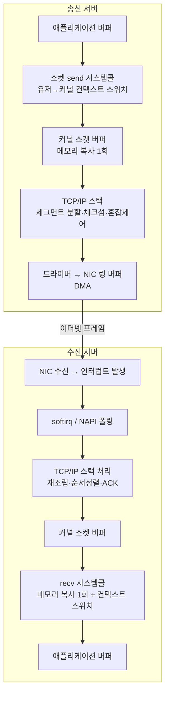

비용이 발생하는 지점이 셋이다.

| 비용 | 내용 |
|---|---|
| **메모리 복사** | 유저 버퍼 ↔ 커널 버퍼 사이 복사. 100Gbps를 채우려면 초당 12.5GB를 복사해야 한다 |
| **컨텍스트 스위치** | 시스템콜마다 유저/커널 모드 전환. 캐시와 TLB가 오염된다 |
| **프로토콜 처리** | 체크섬, 세그먼트 분할, 순서 정렬, 혼잡 제어를 전부 CPU가 한다 |
| **인터럽트** | 패킷마다 인터럽트가 뜨면 CPU가 인터럽트 처리에만 매달린다 |

경험칙으로 **1Gbps당 1GHz의 CPU가 필요하다**는 말이 있다. 100Gbps NIC를 소켓으로 꽉 채우려면 코어 여러 개를 통째로 네트워크에 헌납해야 한다는 뜻이다.

### 1.2 RDMA의 경로

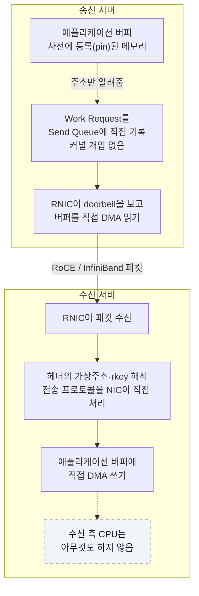

핵심 특성 세 가지로 요약된다.

- **Zero-copy**: 커널 버퍼를 거치는 복사가 없다. NIC이 애플리케이션 버퍼를 직접 읽고 쓴다
- **Kernel bypass**: 애플리케이션이 커널을 거치지 않고 NIC의 큐에 직접 명령을 넣는다
- **CPU offload / Transport offload**: 순서 보장, 재전송, ACK 같은 전송 계층 처리를 NIC 하드웨어가 담당한다

결과적으로 지연이 수십 마이크로초에서 **1~2μs** 수준으로 떨어지고, 100G 이상을 CPU 코어 하나 이하로 채운다.

### 1.3 왜 메모리를 “등록”해야 하는가

RDMA의 전제는 **NIC이 물리 주소로 DMA를 한다**는 것이다. 그런데 리눅스는 페이지를 언제든 스왑하거나 옮길 수 있다. NIC이 DMA 하는 도중에 페이지가 이동하면 엉뚱한 메모리를 덮어쓴다.

그래서 RDMA를 쓰려면 사전에 **Memory Registration(MR)** 을 해야 한다.

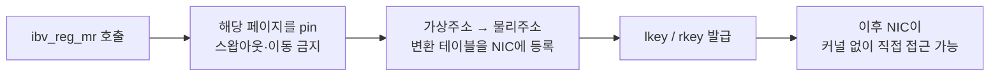

- **lkey (local key)**: 내 NIC이 내 로컬 버퍼에 접근할 때 쓰는 열쇠
- **rkey (remote key)**: 상대방 NIC이 내 버퍼에 접근할 때 제시해야 하는 열쇠. 이 값을 상대에게 알려줘야 원격 접근이 가능하다. 사실상 **접근 권한 토큰**이므로 보안 경계가 여기에 있다

메모리 등록은 비싼 연산(pin + 테이블 등록)이라, 실무에서는 애플리케이션 시작 시 큰 버퍼를 한 번 등록해두고 재사용한다.

---

## 2. 용어 사전: RDMA는 어떤 객체들로 동작하는가

RDMA 프로그래밍 인터페이스를 **verbs**라고 부른다. 소켓 API에 대응하는 개념이다. verbs가 다루는 객체들의 관계는 이렇다.

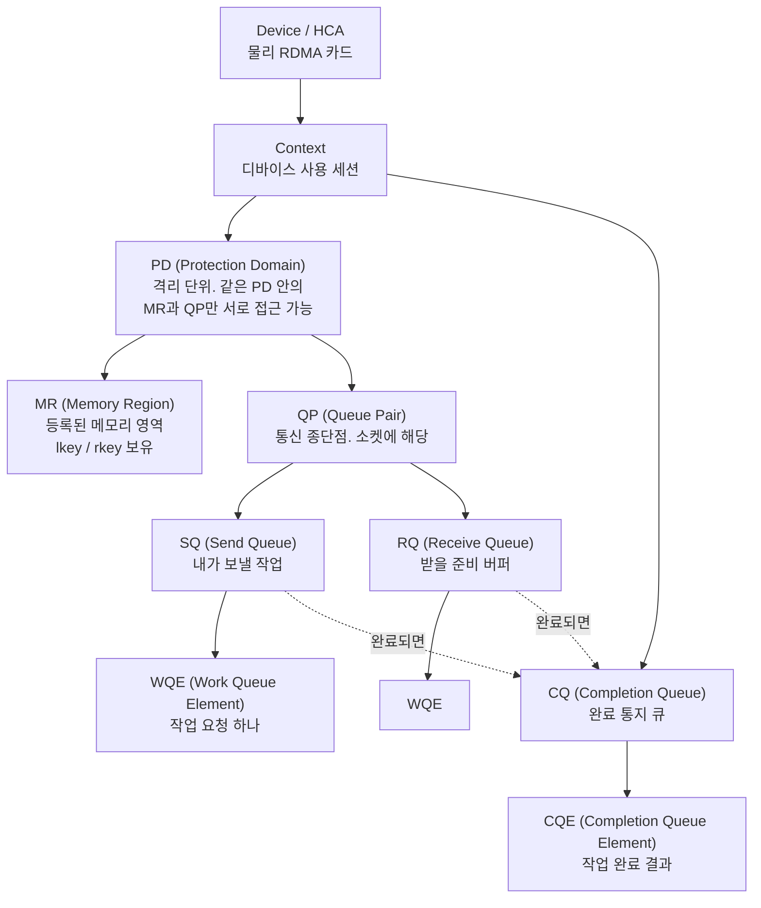

| 용어 | 설명 |
|---|---|
| **HCA (Host Channel Adapter)** | RDMA 카드 자체. 이더넷 쪽에서는 **RNIC(RDMA NIC)** 이라고 부른다 |
| **verbs** | RDMA API. `libibverbs` 라이브러리로 제공된다. 소켓의 `socket/bind/send` 자리에 `ibv_create_qp/ibv_post_send` 같은 함수가 온다 |
| **QP (Queue Pair)** | Send Queue와 Receive Queue의 쌍. 통신 종단점이며 소켓에 대응한다. QP 번호(QPN)로 식별한다 |
| **WQE (Work Queue Element)** | “이 버퍼를 저기로 보내라” 같은 작업 요청 하나. WR(Work Request)이라고도 한다. 흔히 “우키”라고 읽는다 |
| **CQ / CQE** | 작업 완료를 알리는 큐와 그 항목. 폴링하거나 이벤트로 받는다 |
| **doorbell** | 애플리케이션이 큐에 WQE를 넣은 뒤 NIC의 MMIO 레지스터를 두드려 “일감 생겼다”고 알리는 동작 |
| **PD (Protection Domain)** | MR과 QP를 묶는 격리 단위. 다른 PD의 메모리에는 접근할 수 없다 |
| **GID (Global Identifier)** | 128비트 주소. RoCE v2에서는 IP 주소를 매핑해서 쓴다. IPv4는 IPv4-mapped IPv6 형태로 들어간다 |
| **LID (Local Identifier)** | InfiniBand 서브넷 안의 16비트 지역 주소. RoCE에는 없다 |
| **PKey (Partition Key)** | InfiniBand의 논리 분할. VLAN과 비슷한 역할 |
| **RDMA-CM** | 연결 수립을 돕는 Connection Manager. IP 주소 기반으로 QP 정보를 교환해준다. 이게 없으면 QPN·GID를 애플리케이션이 직접 주고받아야 한다 |

### 2.1 두 가지 통신 방식: one-sided와 two-sided

RDMA를 이해하는 핵심 갈림길이다.

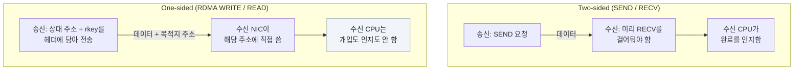

| 동작 | 유형 | 설명 |
|---|---|---|
| **SEND / RECV** | two-sided | 수신 측이 미리 RECV WQE를 올려둬야 한다. 안 올려두면 RNR(Receiver Not Ready) 에러가 난다 |
| **RDMA WRITE** | one-sided | 상대 메모리에 직접 쓴다. 상대 CPU는 모른다 |
| **RDMA READ** | one-sided | 상대 메모리를 직접 읽어온다 |
| **ATOMIC (CAS / FAA)** | one-sided | Compare-and-Swap, Fetch-and-Add를 원격 메모리에 원자적으로 수행. 분산 락 구현에 쓴다 |
| **WRITE with IMM** | 혼합 | WRITE를 하면서 4바이트 즉치값을 같이 보내 수신 측에 완료를 알린다. 순수 one-sided의 “상대가 모른다”는 문제를 우회하는 흔한 패턴 |

**one-sided 연산이 RDMA의 진짜 무기다.** 수신 서버의 CPU가 100% 사용 중이어도 원격 메모리 접근은 그대로 동작한다.

### 2.2 전송 타입 (Transport Type)

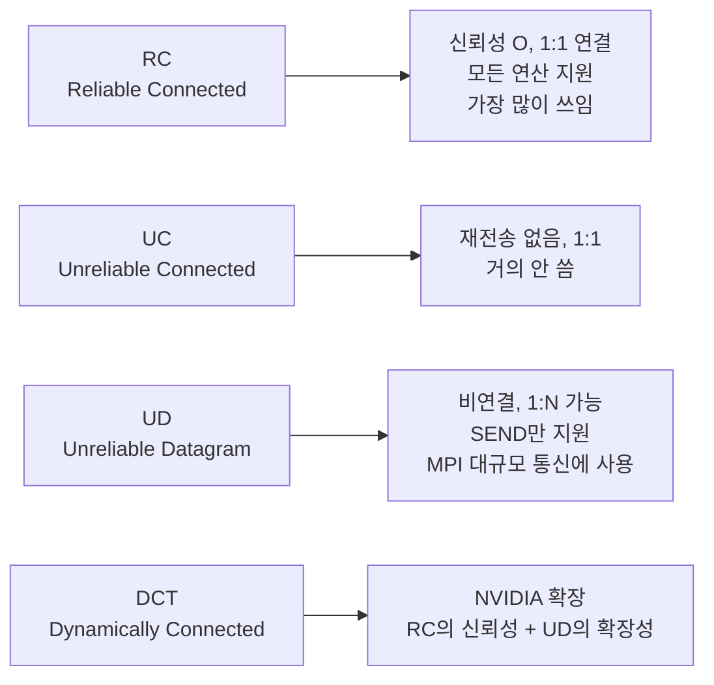

노드가 N개면 RC는 QP가 N²로 늘어나 메모리를 잡아먹는다. 이 **QP 폭발** 문제 때문에 대규모 클러스터에서 UD나 DCT를 쓴다. NCCL도 규모에 따라 전략을 바꾼다.

### 2.3 QP 상태 머신

QP는 생성 직후 바로 못 쓴다. 정해진 순서로 상태를 올려야 한다.

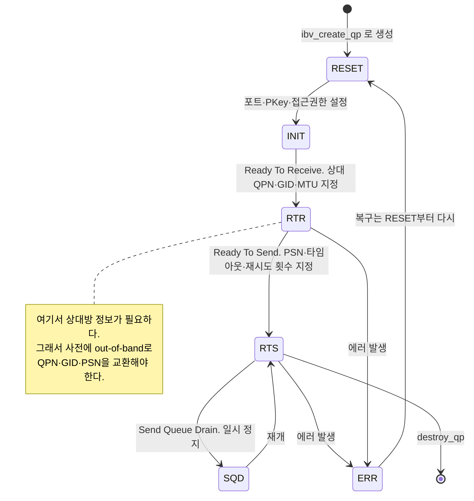

핵심은 **RTR로 가려면 상대 QP의 정보를 이미 알고 있어야 한다**는 점이다. 그래서 RDMA 연결은 항상 TCP나 RDMA-CM 같은 별도 경로로 정보를 먼저 교환한다. 이 과정을 **out-of-band exchange**라고 부른다.

### 2.4 연결부터 데이터 전송까지 전체 플로우

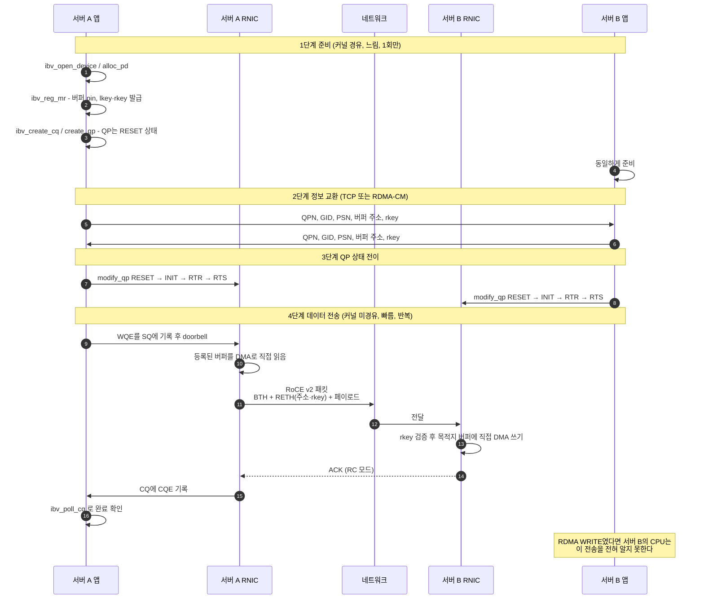

**준비 단계는 느리고 커널을 거치지만 한 번만 한다. 데이터 단계는 커널을 완전히 우회한다.** 이 분리가 RDMA 성능의 본질이다.

---

## 3. RDMA의 세 가지 구현

RDMA는 개념이고, 실제로 배선에 태우는 방식이 세 가지다.

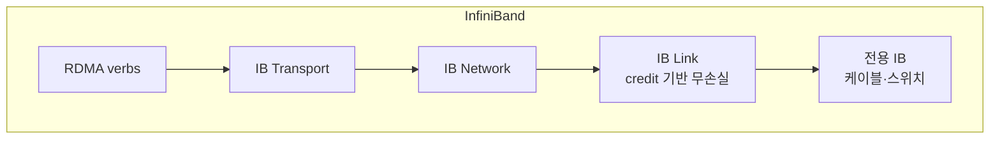

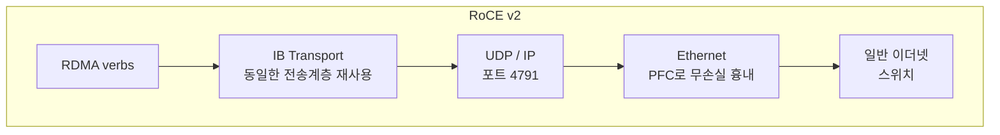

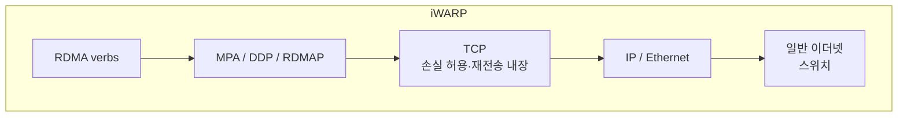

| | InfiniBand | RoCE v2 | iWARP |
|---|---|---|---|
| **물리 계층** | 전용 IB 스위치·케이블 | 일반 이더넷 | 일반 이더넷 |
| **전송 계층** | IB Transport | IB Transport (그대로) | TCP |
| **캡슐화** | 없음 | UDP/IP, 목적지 포트 4791 | TCP |
| **무손실 요구** | 링크 credit으로 원천 보장 | **PFC로 만들어야 함** | 불필요 (TCP가 처리) |
| **라우팅** | 서브넷 매니저(SM)가 관리 | 표준 IP 라우팅. L3를 넘어감 | 표준 IP 라우팅 |
| **성능** | 최상 | IB에 근접 | 다소 낮음 |
| **설정 난이도** | 중간 (SM 필요) | **높음** | 낮음 |
| **주 벤더** | NVIDIA(구 Mellanox) 사실상 독점 | 다수 | Chelsio, Intel X722 |

### 3.1 RoCE v1 vs v2

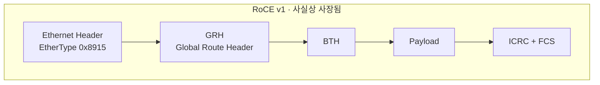

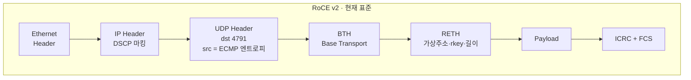

v1은 이더넷 프레임에 EtherType 0x8915로 바로 얹는다. 그래서 L2 브로드캐스트 도메인 안에서만 동작하고 라우터를 넘지 못한다. v2는 UDP/IP로 한 번 감싸서 표준 IP 라우팅을 타므로 데이터센터 전체로 확장된다. 라우팅이 된다는 뜻에서 RRoCE(Routable RoCE)라고도 부른다.

| 헤더 | 의미 |
|---|---|
| **BTH (Base Transport Header)** | 목적지 QPN, opcode(SEND/WRITE/READ), PSN(Packet Sequence Number)이 들어간다. RDMA 전송의 핵심 헤더 |
| **RETH (RDMA Extended Transport Header)** | one-sided 연산에만 붙는다. 상대 메모리의 **가상 주소, rkey, 길이**가 여기 담긴다 |
| **PSN** | 패킷 순서 번호. 이게 어긋나면 재전송이 발생한다 |
| **ICRC** | RDMA 계층의 무결성 검사값. 이더넷 FCS와 별개다 |
| **UDP source port** | 실제 포트가 아니라 QP별로 계산한 해시값을 넣는다. 스위치 ECMP가 이 값으로 경로를 분산시킨다 |

**UDP 4791**은 외워둘 만하다. 방화벽이나 ACL에서 이 포트가 막히면 RoCE가 안 붙는다.

---

## 4. RoCE는 왜 설정이 까다로운가

RoCE v2의 전송 계층은 InfiniBand의 것을 그대로 가져왔다. IB의 물리 계층은 credit 기반이라 **패킷이 애초에 버려지지 않는다.** 그 위에서 만들어진 전송 계층이라 손실 대응이 원시적이다.

3장에서 RoCE의 이더넷 계층을 “PFC로 무손실 흉내”라고 적었다. 흉내라고 쓴 이유가 여기 있다. IB와 이더넷은 무손실을 만드는 방식이 근본적으로 다르다.

InfiniBand는 **사전 허가** 방식이다. 수신 측이 “버퍼 10칸 비었으니 10개까지 보내라”고 credit을 먼저 준다. 송신 측은 받아줄 공간이 확인된 만큼만 보낸다. 손실이 안 나는 게 아니라, 넘칠 상황 자체가 만들어지지 않는다.

이더넷과 PFC는 **사후 정지** 방식이다. 일단 보내고, 수신 버퍼가 차면 그제서야 멈추라고 말한다. 말한 시점부터 상대가 실제로 멈추기까지 시간이 걸리고, 그 사이 날아온 패킷을 받아둘 여유 공간이 따로 필요하다. 뒤에 나올 headroom이 그것이다.

| | InfiniBand | 이더넷 + PFC |
|---|---|---|
| 방식 | 사전 허가 (credit) | 사후 정지 (PAUSE) |
| 무손실 | 구조적으로 보장 | 설정을 제대로 했을 때만 |
| headroom 부족 시 | 해당 없음 | 그대로 드롭 |
| 고유 부작용 | 없음 | HOL 블로킹, PFC storm, deadlock |

결과물은 무손실처럼 보이지만 원리가 다르고 조건부다. **원래 손실을 전제로 설계된 배선 위에, 손실을 전제하지 않는 프로토콜을 올리는 일**이라 그 간극을 사람이 설정으로 메워야 한다. RoCE 설정이 까다로운 근본 이유다.

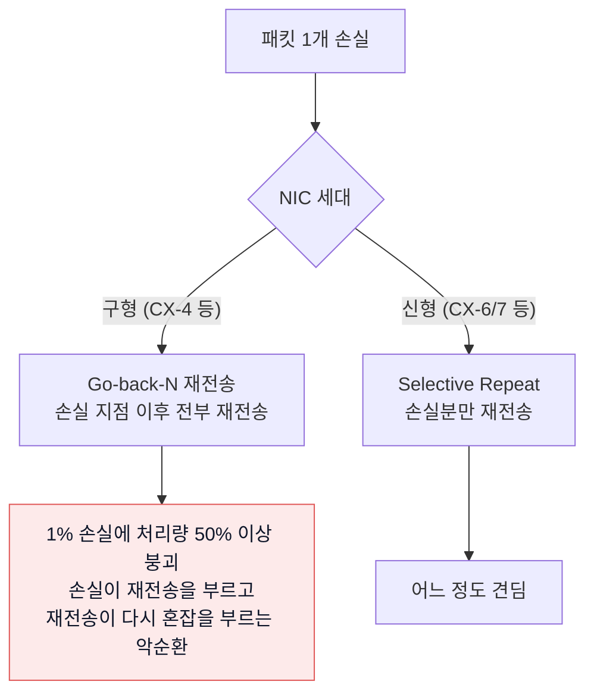

그래서 RoCE는 **네트워크를 무손실로 만들어야 한다.** 그 도구가 PFC와 ECN이다. 두 메커니즘은 동작 범위가 다르며, 이 차이를 이해하는 게 RoCE 설정의 전부라고 해도 된다.

여기서부터 약어가 쏟아지므로 먼저 정리해둔다. 이 글의 나머지는 사실상 이 표를 풀어쓴 것이다.

| 약어 | 원래 이름 | 뜻 |
|---|---|---|
| **PFC** | Priority Flow Control (IEEE 802.1Qbb) | 우선순위별로 “잠깐 멈춰”를 보내 버퍼 넘침을 막는 흐름 제어. 케이블 한 구간에만 적용된다 |
| **PAUSE** | PFC가 실제로 보내는 프레임 | 정지 신호 그 자체. 직접 연결된 옆 장비에게만 가고 라우팅되지 않는다 |
| **ECN** | Explicit Congestion Notification | 패킷을 버리는 대신 IP 헤더의 비트를 세워 “혼잡하다”고 표시하는 방식 |
| **CE** | Congestion Experienced | 스위치가 혼잡할 때 찍는 ECN 표시값 |
| **CNP** | Congestion Notification Packet | CE 표시를 본 수신 서버가 송신 서버에게 되돌리는 “속도 줄여” 패킷 |
| **DCQCN** | Data Center Quantized Congestion Notification | ECN 마킹, CNP 생성, 속도 조절을 하나로 묶은 RoCE의 혼잡 제어 알고리즘 |
| **hop-by-hop** | 홉 단위 | 케이블 한 구간씩 옆으로만 전달되는 방식. PFC가 여기 해당 |
| **end-to-end** | 종단 간 | 출발지에서 목적지까지 직행하는 방식. DCQCN이 여기 해당 |
| **flow** | 흐름 | 같은 출발지·목적지·포트를 공유하는 하나의 통신 단위 |

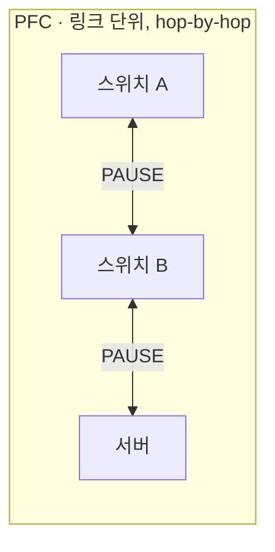

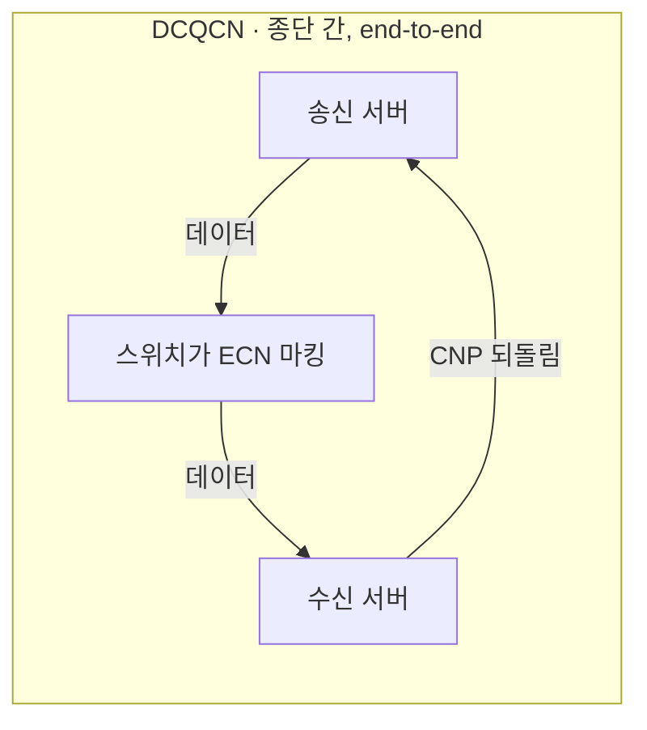

PFC는 즉각적이지만 무차별하다. 버퍼 넘침은 확실히 막는 대신 큐 전체를 세우기 때문에 누가 원인인지 가리지 못한다. DCQCN은 한 바퀴 도느라 느린 대신 정확하다. 진짜 원인이 되는 flow의 속도만 줄인다.

**PFC는 응급처치, DCQCN은 근본 치료다. 둘 다 있어야 한다.**

---

## 5. PFC (Priority Flow Control, 802.1Qbb) 상세

### 5.1 동작 방식

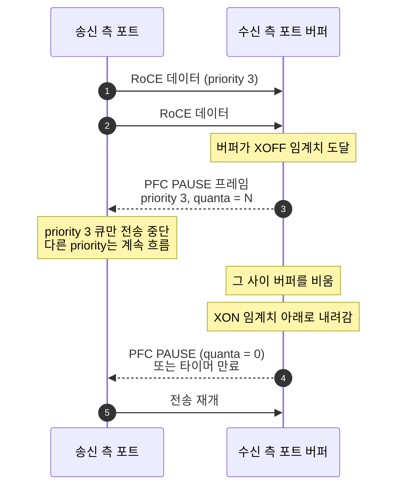

- **priority 단위로 멈춘다**는 게 기존 802.3x 글로벌 PAUSE와의 결정적 차이다. 글로벌 PAUSE는 링크 전체를 멈춰서 관리 트래픽까지 죽인다
- **quanta**: PAUSE 지속 시간 단위. 512비트 전송 시간에 해당한다
- **중요**: PFC를 켤 때 글로벌 PAUSE(802.3x)는 반드시 꺼야 한다. 둘은 상호 배타적이며 같이 켜면 오작동한다

### 5.2 PAUSE 프레임의 실제 모습

PFC PAUSE는 IP도 TCP도 아닌 **L2 MAC Control 프레임**이다. IP 헤더가 아예 없고 크기는 64바이트로 고정이다.

```text
오프셋  크기  필드
─────────────────────────────────────────────────────────────
  0     6    Destination MAC = 01:80:C2:00:00:01
  6     6    Source MAC (보내는 포트의 MAC)
 12     2    EtherType = 0x8808   MAC Control
 14     2    Opcode    = 0x0101   PFC. 글로벌 PAUSE는 0x0001
 16     2    Priority Enable Vector   어느 우선순위를 멈출지 비트맵
 18     2    Time[0]   priority 0 정지 시간
 20     2    Time[1]
 ...          ...
 32     2    Time[7]
 34    26    Padding
 60     4    FCS
```

priority 3만 최대 시간 멈추라는 프레임이면 이렇게 채워진다.

```text
Priority Enable Vector = 0x0008     비트 3만 1
Time[3]                = 0xFFFF
나머지 Time            = 0x0000     벡터 비트가 0이라 무시됨
```

**quanta: 시간 단위**

Time 필드의 단위는 초가 아니라 quanta다. 1 quanta는 해당 링크 속도로 512비트를 전송하는 시간이라, 링크가 빠를수록 같은 값이 짧은 시간이 된다.

| 링크 속도 | 1 quanta | 최대 정지 시간 (65535 quanta) |
|---|---|---|
| 10 Gbps | 51.2 ns | 약 3.35 ms |
| 25 Gbps | 20.48 ns | 약 1.34 ms |
| 100 Gbps | 5.12 ns | 약 335 μs |

Time이 0이 아니면 그만큼 정지(XOFF), 0이면 즉시 재개(XON)다. 실무에서 스위치는 한 번 크게 걸어두기보다, 혼잡이 지속되면 타이머 만료 전에 PAUSE를 갱신 발송하고 해소되면 quanta 0을 보내 즉시 풀어준다.

**전 과정이 하드웨어에서 끝난다**

스위치에서는 ASIC의 버퍼 관리 블록이 우선순위별 점유율을 감시하다가 XOFF 임계치에 닿으면 포트 MAC이 프레임을 만들어 보낸다. 서버에서는 NIC의 MAC이 프레임을 받아 해당 priority 큐의 송신 스케줄러를 세운다. **스위치 CPU도, 호스트 CPU도, 드라이버도, 커널도 개입하지 않는다.** 반응이 마이크로초 단위로 나오는 이유이고, 소프트웨어가 끼면 headroom이 감당하지 못한다.

같은 이유로 **tcpdump로는 PFC 프레임을 잡을 수 없다.** NIC의 MAC 계층에서 소비되고 끝나 호스트 네트워크 스택까지 올라오지 않는다. PFC 문제는 패킷 캡처가 아니라 양쪽 카운터 대조로 본다.

### 5.3 PAUSE는 왜 옆 사람에게만 가는가

목적지 MAC `01:80:C2:00:00:01` 이 답이다. 이 주소는 IEEE 802.1D의 예약 멀티캐스트 대역(`01:80:C2:00:00:00` ~ `01:80:C2:00:00:0F`)에 속하고, 표준을 따르는 브리지는 **이 대역의 프레임을 전달해서는 안 된다.** 받으면 그 자리에서 소비하고 끝이다. PAUSE가 라우팅되지 않는 것은 관행이 아니라 프로토콜 설계에 못 박힌 규칙이다.

그래서 혼잡은 목적지에서 출발지로 한 칸씩 뒤로 번진다.

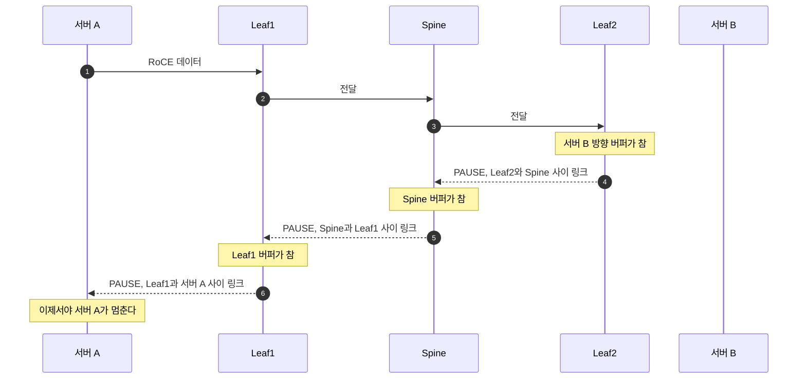

**Leaf2가 서버 A에게 직접 말하지 않는다.** 옆 사람에게만 말하고, 그것이 역방향으로 한 칸씩 번져 결국 서버 A까지 도달한다. 고속도로 정체가 뒤로 밀리는 것과 같다.

문제는 5번 단계다. Spine이 Leaf1을 세울 때 **그 링크의 priority 3 트래픽 전체가 멈춘다.** 혼잡한 서버 B와 아무 상관 없는, 전혀 다른 목적지로 가던 통신까지 같이 멈춘다. PFC는 누가 원인인지 구분할 능력이 없다. 큐 단위로 뭉뚱그려 세울 뿐이다. 5.6에서 볼 victim flow의 정체가 이것이다.

반면 CNP는 일반 IP 패킷이라 스위치를 그냥 통과해 송신 서버까지 직행한다. 원인이 되는 flow만 정확히 조준할 수 있는 이유다.

| | PAUSE (PFC) | CNP (DCQCN) |
|---|---|---|
| 범위 | 링크 단위, 한 칸씩 | 종단 간, 직행 |
| 형태 | L2 제어 프레임 | 일반 IP 패킷 |
| 스위치 | 전달하지 않음 | 그냥 통과 |
| 메시지 | 이 큐 전체 멈춰 | 너 이 flow 속도 줄여 |
| 정확도 | 무차별 | 원인 지목 |

PAUSE는 방향도 양쪽이다. 링크의 수신 측이면 누구든 보낸다. 스위치가 서버 NIC에게 보내고, 스위치끼리도 주고받고, **서버의 수신 버퍼가 차면 서버 NIC이 스위치에게 보낸다.** 스위치만 설정하면 절반만 한 것이고, 카운터를 `tx_prio3_pause`(내가 보낸 것)와 `rx_prio3_pause`(내가 받은 것)로 나눠 보는 이유도 여기 있다.

### 5.4 headroom: PAUSE는 즉시 멈추지 않는다

PAUSE 프레임을 보낸 순간부터 상대가 실제로 멈출 때까지 시간이 걸린다. 그 사이 날아오는 패킷을 받아둘 여유 버퍼가 **headroom**이다.

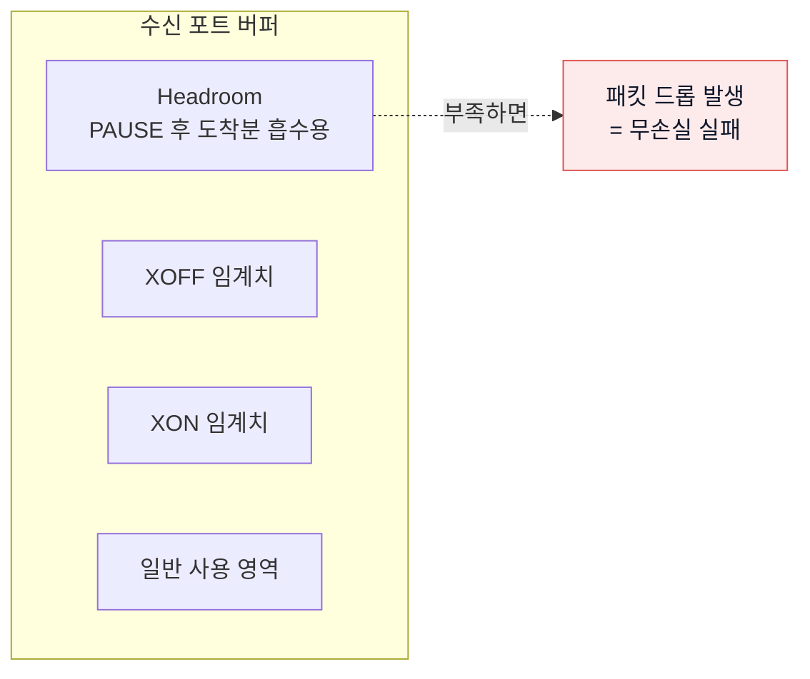

headroom에 필요한 크기는 이 네 가지의 합이다.

1. **케이블 전파 지연** (왕복). 광케이블에서 대략 5ns/m, 100m면 왕복 1μs
2. **송신 측 PAUSE 반응 시간** (MAC/PHY 처리)
3. **PAUSE 프레임 자체의 전송·수신 시간**
4. **현재 전송 중인 최대 프레임** (점보면 9KB)

그래서 스위치 설정에 **케이블 길이**를 넣는 항목이 있다. 서버 NIC 쪽에도 `mlnx_qos --cable_len` 이 있다. 케이블 길이를 실제보다 짧게 잡으면 headroom이 모자라 드롭이 나고, 무손실이 깨진다.

위 그림에는 아직 ECN 임계치가 없다. ECN을 다루고 나서 6.5에서 두 임계치의 순서 관계까지 포함한 전체 그림을 다시 본다. 실제 튜닝에서 가장 먼저 확인해야 하는 것이 그 순서다.

### 5.5 no-drop 우선순위는 어떻게 합의하나

어느 priority를 lossless로 다룰지는 링크 양끝이 같은 값을 알고 있어야 한다. 한쪽만 알고 있으면 PFC는 아무 일도 하지 않는다. 방법은 둘이다.

**DCBX (자동 협상)**

Data Center Bridging Capability Exchange. LLDP에 얹혀 다니는 확장이다. 스위치와 NIC이 “priority 3이 no-drop”이라는 설정을 주고받는다. IEEE 방식(802.1Qaz)과 표준 제정 이전의 CEE 방식 두 갈래가 있고, 벤더 조합에 따라 서로 안 맞는 경우가 있다.

**정적 설정**

`willing` 비트를 0으로 두고 양쪽에 같은 값을 못 박는다. 협상 실패로 인한 비결정적 동작을 피하려고 **프로덕션에서는 대개 이쪽을 택한다.** 노드가 수십 대를 넘어가면 협상의 편의보다 전 노드 동일성이 훨씬 중요해진다.

```bash
# 현재 PFC 상태 (iproute2의 dcb 도구)
dcb pfc show dev ens1f0

# DCBX로 협상된 값
lldptool -t -i ens1f0 -V PFC -c enabled

# 글로벌 PAUSE는 꺼져 있어야 한다
ethtool -a ens1f0
```

### 5.6 PFC의 부작용 세 가지

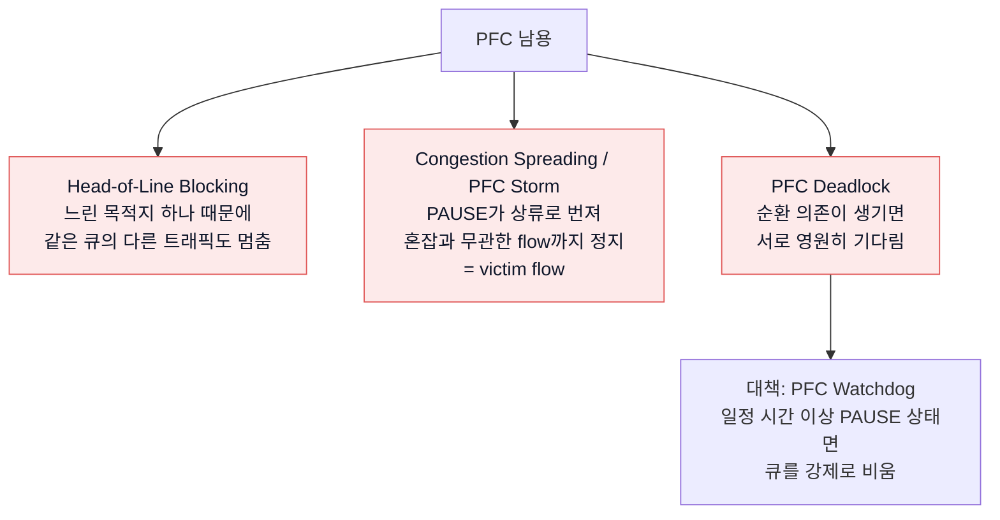

**PFC 카운터가 계속 올라간다면 이미 문제 상황이다.** 정상 운영에서 PAUSE는 어쩌다 한 번 나와야 한다. 상시로 나오면 DCQCN이 제 역할을 못 하고 있다는 신호다.

---

## 6. ECN과 DCQCN 상세

### 6.1 ECN (Explicit Congestion Notification)

패킷을 버려서 혼잡을 알리는 대신, **IP 헤더의 ECN 비트 2개를 세워서** 혼잡을 알린다. RoCE는 패킷을 버리면 안 되므로 이 방식이 필수다.

| ECN 코드포인트 | 값 | 의미 |
|---|---|---|
| Non-ECT | `00` | ECN 미지원 트래픽 |
| ECT(1) | `01` | ECN 지원 |
| ECT(0) | `10` | ECN 지원 (RoCE가 주로 사용) |
| **CE** | `11` | **Congestion Experienced. 스위치가 혼잡 시 이 값으로 바꾼다** |

ToS 바이트 8비트의 구성이 이렇다.

```
 7   6   5   4   3   2   1   0
+---+---+---+---+---+---+---+---+
|      DSCP (6비트)     | ECN(2) |
+---+---+---+---+---+---+---+---+
```

그래서 **DSCP 값에 4를 곱하면 ToS 값**이 된다. DSCP 26이면 ToS 104, 여기에 ECT(0)=`10`(=2)을 더해 106을 쓰는 설정 예시를 자주 본다.

### 6.2 DCQCN 폐루프

**DCQCN(Data Center Quantized Congestion Notification)** 은 ECN 마킹과 속도 조절을 묶은 알고리즘이다. 세 역할이 등장한다.

```mermaid
sequenceDiagram
    autonumber
    participant RP as 송신 NIC<br/>RP (Reaction Point)
    participant CP as 스위치<br/>CP (Congestion Point)
    participant NP as 수신 NIC<br/>NP (Notification Point)

    RP->>CP: RoCE 패킷 전송. ECN 비트는 ECT(0)
    Note over CP: 큐 길이가 WRED<br/>min 임계치 초과
    CP->>CP: ECN 비트를 CE 로 변경<br/>패킷은 버리지 않음
    CP->>NP: CE 마킹된 패킷 전달
    Note over NP: CE 감지
    NP-->>RP: CNP 생성 후 되돌림<br/>DSCP 48, priority 6
    Note over NP: min_time_between_cnps 간격으로<br/>과도한 CNP 생성 억제
    Note over RP: 전송률 감소<br/>alpha 값 기반 승산 감소
    RP->>CP: 낮아진 속도로 전송
    Note over RP: CNP가 한동안 안 오면<br/>Fast Recovery → Additive Increase<br/>→ Hyper Increase 순으로 회복
```

| 용어 | 설명 |
|---|---|
| **CP (Congestion Point)** | 혼잡이 발생한 스위치. ECN 마킹을 수행 |
| **NP (Notification Point)** | **수신 서버의 NIC.** CE를 보고 CNP를 만들어 되돌린다 |
| **RP (Reaction Point)** | **송신 서버의 NIC.** CNP를 받고 속도를 낮춘다 |
| **CNP (Congestion Notification Packet)** | 혼잡 신호 패킷. 페이로드 없는 작은 패킷이며 별도 우선순위로 보호해야 한다 |
| **WRED** | 스위치에서 큐 길이에 따라 확률적으로 마킹하는 방식. min/max 임계치와 마킹 확률로 설정 |

### 6.3 여기가 “받는 서버도 설정이 필요한” 이유

```mermaid
flowchart TD
    A["수신 서버에 ECN(np) 설정 누락"] --> B["CE 마킹을 봐도 CNP를 안 만듦"]
    B --> C["송신자는 혼잡을 모른 채<br/>계속 풀스피드 전송"]
    C --> D["스위치 버퍼 계속 상승"]
    D --> E["PFC PAUSE 발생"]
    E --> F["PAUSE가 상류로 전파"]
    F --> G["무관한 flow까지 느려짐<br/>fabric 전체 성능 붕괴"]

    style A fill:#fdeaea,stroke:#e05656,color:#0f172a
    style G fill:#fdeaea,stroke:#e05656,color:#0f172a
```

RoCE 클러스터에서 모든 노드는 송신자이자 수신자다. 따라서 **np와 rp를 모든 노드에 전부 켜야 한다.** 한 대만 빠져도 그 노드가 관련된 통신에서 문제가 시작된다.

### 6.4 CNP를 보호해야 하는 이유

CNP는 “혼잡하니 줄여라”는 신호다. 그런데 이 신호가 혼잡 때문에 지연되거나 버려지면 제어 자체가 무너진다. 그래서 이렇게 다룬다.

- **별도 우선순위**(관례상 priority 6, DSCP 48)에 배치
- **strict priority** 스케줄링으로 최우선 전송
- **PFC는 걸지 않는다.** 혼잡 신호가 혼잡으로 막히는 자기모순을 피하기 위함이다. CNP는 작고 드물어서 lossy로 둬도 실무상 문제되지 않는다

### 6.5 PFC와 DCQCN은 함께 쓴다: 임계치 순서가 전부다

여기서 자주 나오는 오해를 짚고 간다. PFC와 DCQCN은 **둘 중 하나를 고르는 게 아니라 둘 다 켜는 것**이다. 다만 역할이 다르다.

- **DCQCN이 주 제어 장치다.** 평상시 혼잡은 전부 여기서 처리되어야 한다
- **PFC는 안전망이다.** DCQCN이 미처 반응하지 못한 순간만 받아낸다

DCQCN은 폐루프다. 스위치가 마킹하고, 수신 서버까지 가고, CNP가 돌아오고, 그제서야 송신 속도가 내려간다. 최소 한 바퀴(RTT)가 필요하다. 그런데 마이크로버스트와 incast는 그 한 바퀴보다 빠르다. 여러 노드가 동시에 한 곳으로 쏘면 버퍼는 마이크로초 만에 찬다. **그 순간을 막는 것이 PFC의 존재 이유다.**

그래서 설정의 핵심은 둘 중 무엇을 켜느냐가 아니라 **임계치 순서**다. 5.4의 버퍼 그림에 ECN 임계치까지 얹으면 전체 그림이 이렇게 완성된다.

```mermaid
flowchart TB
    T["▲ 버퍼 점유율 높음"]
    HR["headroom<br/>절대 침범 금지. 침범하면 드롭"]
    XF["PFC XOFF 임계치<br/>여기까지 왔다면 이미 실패한 것"]
    GAP["여유 구간"]
    EMX["ECN max threshold<br/>거의 모든 패킷에 CE 마킹"]
    EMN["ECN min threshold<br/>DCQCN이 여기서 먼저 개입해야 정상"]
    NM["일반 사용 영역"]
    B["▼ 버퍼 점유율 낮음"]

    T --- HR --- XF --- GAP --- EMX --- EMN --- NM --- B

    style T fill:#f1f5f9,stroke:#94a3b8,color:#0f172a
    style B fill:#f1f5f9,stroke:#94a3b8,color:#0f172a
    style HR fill:#fdeaea,stroke:#e05656,color:#0f172a
    style XF fill:#fdeaea,stroke:#e05656,color:#0f172a
    style GAP fill:#f1f5f9,stroke:#94a3b8,color:#0f172a
    style EMX fill:#e7f6ec,stroke:#22a15d,color:#0f172a
    style EMN fill:#e7f6ec,stroke:#22a15d,color:#0f172a
    style NM fill:#f1f5f9,stroke:#94a3b8,color:#0f172a
```

**ECN 임계치는 PFC XOFF 임계치보다 충분히 낮아야 한다.** 순서가 뒤집히면, 즉 ECN 임계치가 PFC보다 높게 잡히면 DCQCN이 일할 기회를 얻기 전에 PFC가 먼저 터진다. 그러면 설정은 다 해놓고도 사실상 PFC만 켠 것과 같아진다. “왜 CNP도 나오는데 PAUSE가 계속 뜨지”의 흔한 원인이다.

**하나만 켰을 때 벌어지는 일**

| 구성 | 결과 |
|---|---|
| **PFC만** | 동작은 한다. 하지만 송신 속도를 줄이는 주체가 없어 PAUSE가 상시로 터진다. congestion spreading, victim flow, HOL 블로킹, 최악은 deadlock. 8노드는 되는데 64노드에서 무너지는 전형 |
| **DCQCN만** | 제어 루프가 도는 동안 버퍼가 넘쳐 드롭이 난다. 구형 NIC이면 go-back-N으로 처리량이 붕괴 |
| **둘 다 끄면** | 한가할 때는 잘 되다가 부하가 걸리면 무너진다 |

**정상인지 판정하는 법**

```bash
ethtool -S ens1f0 | grep -E 'prio3_pause|np_cnp_sent|rp_cnp_handled'
```

| 관측 | 해석 | 조치 |
|---|---|---|
| CNP 활발, PAUSE는 가끔 | **정상.** DCQCN이 주로 일하고 PFC는 안전망 역할만 | 없음 |
| CNP 활발, PAUSE도 상시 | ECN 임계치가 너무 높다 | min/max threshold를 낮춘다 |
| CNP는 0, PAUSE만 상시 | DCQCN이 아예 안 돌고 있다 | `roce_np`/`roce_rp` 설정과 DSCP 매핑 확인 |
| 둘 다 조용 | 아직 혼잡이 없거나 마킹 자체가 안 되고 있다 | 부하를 준 상태에서 재측정 |

**PFC 카운터는 0에 가까울수록 좋고, CNP 카운터는 돌고 있어야 정상이다.** PFC가 자주 발동한다는 것은 소방차가 매일 출동한다는 뜻이지 소방 시스템이 잘 돌아간다는 뜻이 아니다.

14장에서 볼 selective repeat이나 AWS SRD처럼 의도적으로 PFC를 빼는 구성도 있지만, 그것은 NIC과 패브릭이 손실을 감내하도록 설계되었을 때의 이야기다. **일반적인 RoCE v2 구축이라면 둘 다 켜고, ECN 임계치를 조여 PFC 발동을 최소화하는 방향으로 튜닝한다.**

---

## 7. 전체 QoS 파이프라인 한눈에 보기

```mermaid
flowchart TB
    subgraph TXS["송신 서버"]
        S1["애플리케이션 / NCCL"]
        S2["RDMA 트래픽에<br/>DSCP 26 마킹"]
        S3["prio 3 → TC 3 매핑"]
        S4["PFC prio3 활성<br/>DCQCN rp 활성"]
        S1 --> S2 --> S3 --> S4
    end

    subgraph LEAF1["Leaf 스위치 1"]
        L1["trust dscp<br/>DSCP 26 → 큐 3"]
        L2["큐 3: lossless, PFC on<br/>headroom 확보"]
        L3["큐 3: WRED/ECN 임계치"]
        L4["큐 6: CNP, strict priority, PFC off"]
        L1 --> L2 --> L3
    end

    subgraph SPINE["Spine 스위치"]
        SP1["동일한 trust / PFC / ECN 설정"]
        SP2["ECMP: UDP src port로 분산"]
    end

    subgraph LEAF2["Leaf 스위치 2"]
        L5["동일 설정"]
    end

    subgraph RXS["수신 서버"]
        R1["PFC prio3 활성"]
        R2["DCQCN np 활성<br/>CE 감지 시 CNP 생성"]
        R3["CNP를 DSCP 48로 마킹"]
        R1 --> R2 --> R3
    end

    S4 --> L1
    L3 --> SP1 --> SP2 --> L5 --> R1
    R3 -.->|"CNP 역방향 경로<br/>priority 6"| L4
    L4 -.-> S4

    style L4 fill:#cfe0f9,stroke:#2563eb,color:#0f172a
```

**이 그림에서 한 칸이라도 설정이 빠지면 그 구간이 lossy가 된다.** “8노드까지는 잘 되는데 16노드에서 무너진다”는 증상의 대부분이 특정 spine 포트나 특정 서버 한 대의 설정 누락이다.

---

## 8. 서버 BIOS 설정

RoCE 얘기를 하면 대부분 OS와 스위치만 다루는데, **BIOS에서 잘못 잡혀 있으면 아무리 튜닝해도 성능이 안 나온다.** NIC은 PCIe 장치이므로 PCIe와 전력 관리 설정이 그대로 성능에 반영된다.

```mermaid
flowchart TB
    subgraph B1["PCIe 경로"]
        A1["Max Payload Size (MPS)"]
        A2["Max Read Request Size (MRRS)"]
        A3["ASPM 전력 절감"]
        A4["Above 4G Decoding"]
        A5["ACS (Access Control Services)"]
        A6["PCIe Gen 속도·레인 수"]
        A7["Relaxed Ordering"]
    end
    subgraph B2["전력·클럭"]
        C1["C-State (특히 C6)"]
        C2["P-State / 전력 프로파일"]
        C3["Uncore / Infinity Fabric 주파수"]
    end
    subgraph B3["메모리·NUMA"]
        D1["Node Interleaving"]
        D2["Sub-NUMA Clustering / NPS"]
        D3["IOMMU (VT-d / AMD-Vi)"]
        D4["SR-IOV"]
    end
    subgraph B4["캐시"]
        E1["DDIO / DCA"]
    end
```

### 8.1 PCIe 관련

| 항목 | 권장값 | 이유 |
|---|---|---|
| **Max Payload Size (MPS)** | Auto가 아니라 **가능한 최대값**(256B 또는 512B) | 한 TLP에 실리는 데이터가 커져 PCIe 오버헤드가 줄어든다. 경로상 최소값으로 협상되므로 슬롯과 카드 모두 확인 |
| **Max Read Request Size (MRRS)** | **4096** | NIC이 호스트 메모리를 읽어올 때 한 번에 요청하는 크기. 작으면 요청 횟수가 늘어 대역폭이 안 나온다 |
| **PCIe ASPM (L0s/L1)** | **Disabled** | 링크를 저전력 상태로 내렸다 올리는 데 마이크로초가 든다. RDMA의 지연 이점을 그대로 날린다 |
| **Above 4G Decoding** | **Enabled** | 큰 BAR 공간 할당에 필요. GPUDirect RDMA를 쓰면 필수 |
| **Resizable BAR / Large BAR** | **Enabled** | GPU 메모리 전체를 BAR로 노출해 P2P DMA를 가능하게 한다 |
| **PCIe 링크 속도** | **Gen4 또는 Gen5 고정**, x16 확인 | 100G NIC은 Gen4 x16이 필요하다. x8 슬롯에 꽂으면 절반만 나온다 |
| **Relaxed Ordering** | **Enabled** (특히 AMD EPYC) | PCIe 트랜잭션 순서 제약을 완화해 처리량이 올라간다. AMD 플랫폼에서 체감 차이가 크다 |
| **ACS (Access Control Services)** | **GPUDirect를 쓸 거면 Disabled** | 아래 별도 설명 |

**ACS 이슈는 따로 짚어야 한다.**

```mermaid
flowchart LR
    subgraph ON["ACS 활성 - GPUDirect 불가"]
        G1["GPU"] --> RC1["Root Complex까지 올라감"] --> N1["NIC"]
        X1["경로가 길어져 성능 저하<br/>또는 P2P 자체가 실패"]
    end
    subgraph OFF["ACS 비활성 - GPUDirect 가능"]
        G2["GPU"] -->|"PCIe 스위치 내부 직접 전달"| N2["NIC"]
    end
    style X1 fill:#fdeaea,stroke:#e05656,color:#0f172a
```

ACS는 PCIe 장치 간 직접 통신(peer-to-peer)을 차단해 IOMMU 격리를 보장하는 **보안 기능**이다. 그런데 GPUDirect RDMA는 정확히 그 P2P DMA를 써야 동작한다. 그래서 GPU 노드에서는 ACS를 끄는 게 일반적이고, 대신 **가상화 격리 수준이 낮아진다는 트레이드오프**를 받아들이는 것이다. 베어메탈 학습 노드라면 대체로 수용 가능한 선택이다.

확인 명령:

```bash
# ACS가 켜져 있는지 확인 (ACSCtl 항목의 SrcValid 등이 + 면 활성)
sudo lspci -vvv | grep -i -A2 'Access Control'

# GPU와 NIC이 같은 PCIe 스위치 아래 있는지 확인
nvidia-smi topo -m     # PIX / PXB 면 좋고, SYS 면 CPU를 거치는 것
```

### 8.2 전력·클럭 관련

| 항목 | 권장값 | 이유 |
|---|---|---|
| **C-State (C6 등 deep C-state)** | **Disabled** 또는 C1까지만 | 코어가 깊은 절전 상태에서 깨어나는 데 수십 μs가 든다. 지연 편차(jitter)의 주범 |
| **전력 프로파일** | **Maximum Performance** | OS의 governor 이전에 펌웨어 레벨에서 성능 모드로 고정 |
| **Turbo Boost** | 워크로드에 따라. 지연 일관성이 중요하면 끄고 클럭 고정 | 터보는 클럭이 출렁여 지연 편차를 만든다 |
| **Uncore Frequency (Intel) / Infinity Fabric (AMD)** | **최대 고정** | PCIe와 메모리 컨트롤러가 여기 물려 있다. 낮으면 I/O 성능이 그대로 떨어진다 |

지연 측정 시 p50은 좋은데 p99가 튄다면 거의 항상 C-state와 주파수 스케일링이 원인이다.

### 8.3 NUMA·메모리·가상화

| 항목 | 권장값 | 이유 |
|---|---|---|
| **Node Interleaving** | **Disabled** (= NUMA 유지) | 인터리빙을 켜면 NUMA 구조가 사라져 NIC 로컬 노드에 프로세스를 고정할 수 없다. RDMA는 NIC-메모리 지역성이 성능을 좌우한다 |
| **Sub-NUMA Clustering (SNC) / NPS** | 대개 **끄거나 NPS1**. 정교하게 핀 고정할 자신이 있으면 세분화 | 노드를 잘게 쪼개면 정렬이 어긋났을 때 손해가 크다 |
| **IOMMU (VT-d / AMD-Vi)** | SR-IOV나 컨테이너 격리가 필요하면 **Enabled**, 순수 베어메탈이면 성능상 pass-through | 활성 시 커널 파라미터에 `iommu=pt` 를 주면 DMA 변환 오버헤드를 줄일 수 있다 |
| **SR-IOV** | VF를 컨테이너·VM에 붙일 거면 **Enabled** | 쿠버네티스에서 RDMA를 쓰려면 보통 SR-IOV VF + device plugin 조합 |
| **DDIO (Intel Data Direct I/O) / DCA** | **Enabled** | NIC의 DMA 데이터를 DRAM이 아니라 LLC에 직접 넣어 지연을 줄인다. 다만 LLC를 잠식하므로 워크로드에 따라 확인 |
| **Secure Boot** | 서명 안 된 OFED 커널 모듈을 쓸 거면 걸림돌 | 필요하면 모듈에 서명하거나 Secure Boot를 끈다 |

### 8.4 NUMA 정렬 확인

```bash
# NIC이 어느 NUMA 노드에 붙어 있는지
cat /sys/class/net/ens1f0/device/numa_node

# RDMA 디바이스 기준으로도 확인
cat /sys/class/infiniband/mlx5_0/device/numa_node

# 해당 노드의 CPU 목록
lscpu | grep NUMA

# 프로세스를 NIC과 같은 노드에 고정
numactl --cpunodebind=0 --membind=0 ./my_rdma_app
```

NIC이 NUMA 0에 붙어 있는데 프로세스가 NUMA 1에서 돌면, 모든 DMA가 소켓 간 링크(UPI/Infinity Fabric)를 건너간다. 대역폭이 눈에 띄게 떨어지고 지연 편차가 커진다. **GPU가 여럿인 노드에서는 GPU-NIC-CPU를 한 세트로 묶어 배치하는 게 정석이다.**

---

## 9. 서버 OS·NIC 설정

### 9.1 드라이버와 확인

```bash
# 설치 확인
ofed_info -s                 # DOCA-OFED / MLNX_OFED 버전
ibv_devinfo                  # RDMA 디바이스와 포트 상태 (state: PORT_ACTIVE 여야 함)
rdma link show               # 링크 상태
ibdev2netdev                 # RDMA 디바이스와 이더넷 인터페이스 매핑

# GID 테이블 확인 - RoCE v2 항목의 인덱스를 알아야 한다
show_gids
# 출력 예: mlx5_0  1  3  fe80::...  192.168.1.10  v2  ens1f0
#                    ↑ GID index          ↑ IP        ↑ RoCE 버전
```

`show_gids` 결과에서 **v2로 표시된 항목의 인덱스**를 애플리케이션이나 벤치마크에 넘겨야 한다. v1 인덱스를 쓰면 L3를 못 넘어 다른 랙과 통신이 안 된다.

### 9.2 QoS 매핑

**L2 PCP가 아니라 DSCP trust를 권장한다.** L3 라우팅을 넘어가도 마킹이 살아남기 때문이다. RoCE v2를 쓰는 이유 자체가 라우팅 가능성인데 L2 마킹을 쓰면 앞뒤가 안 맞는다.

관례적으로 이렇게 나눈다.

| 트래픽 | DSCP | Priority / TC | 큐 성격 |
|---|---|---|---|
| RoCE 데이터 | **26** | 3 | lossless, PFC on |
| CNP | **48** | 6 | strict priority, PFC off |
| 일반 TCP | 0 | 0 | lossy |

```bash
IFACE=ens1f0
RDEV=mlx5_0

# 1) 신뢰 모드를 DSCP로
mlnx_qos -i $IFACE --trust=dscp

# 2) priority 3만 PFC 활성 (0~7 순서, 1이 활성)
mlnx_qos -i $IFACE --pfc 0,0,0,1,0,0,0,0

# 3) DSCP 26을 priority 3으로 매핑
mlnx_qos -i $IFACE --dscp2prio set,26,3

# 4) priority → traffic class 매핑
mlnx_qos -i $IFACE --prio_tc=0,1,2,3,4,5,6,7

# 5) 케이블 길이 지정 (headroom 계산에 사용, 미터)
mlnx_qos -i $IFACE --cable_len=30

# 6) RDMA 트래픽 자체에 DSCP 26 찍기
#    traffic_class = DSCP << 2 = 26*4 = 104 (ECT 비트 포함 시 106)
echo 106 > /sys/class/infiniband/$RDEV/tc/1/traffic_class

# 7) RDMA-CM 경로를 쓰는 애플리케이션용
cma_roce_tos -d $RDEV -t 106
cma_roce_mode -d $RDEV -p 1 -m 2      # RoCE v2 강제

# 8) 글로벌 PAUSE는 반드시 끈다 (PFC와 상호 배타)
ethtool -A $IFACE rx off tx off

# 9) 현재 설정 확인
mlnx_qos -i $IFACE
```

### 9.3 DCQCN 설정

```bash
IFACE=ens1f0
PRIO=3

# Notification Point: CE 마킹을 보면 CNP를 생성 (수신자 역할)
echo 1 > /sys/class/net/$IFACE/ecn/roce_np/enable/$PRIO

# Reaction Point: CNP를 받으면 속도를 낮춤 (송신자 역할)
echo 1 > /sys/class/net/$IFACE/ecn/roce_rp/enable/$PRIO

# CNP를 DSCP 48로 마킹
echo 48 > /sys/class/net/$IFACE/ecn/roce_np/cnp_dscp

# CNP의 802.1p 우선순위
echo 6 > /sys/class/net/$IFACE/ecn/roce_np/cnp_802p_prio

# CNP 생성 최소 간격(마이크로초). 너무 잦은 CNP 억제
echo 4 > /sys/class/net/$IFACE/ecn/roce_np/min_time_between_cnps
```

모든 노드가 송신자이자 수신자이므로 **np와 rp를 둘 다 켠다.** 세부 튜닝 파라미터는 `/sys/class/net/$IFACE/ecn/roce_rp/` 아래에 있다.

| 파라미터 | 의미 |
|---|---|
| `rpg_ai_rate` | Additive Increase 단계의 증가폭 (Mbps) |
| `rpg_hai_rate` | Hyper Increase 단계의 증가폭 |
| `rpg_threshold` | 다음 회복 단계로 넘어가기 위한 조건 횟수 |
| `rpg_min_rate` | 감소의 하한. 너무 낮으면 회복이 느려진다 |
| `initial_alpha_value` | 감소 비율을 결정하는 alpha 초기값 |
| `clamp_tgt_rate` | CNP 수신 시 target rate까지 같이 낮출지 여부 |

기본값이 대체로 무난하다. 대규모 incast(다대일 집중)에서 문제가 생길 때만 손대는 게 좋다.

### 9.4 MTU

```bash
# 이더넷 MTU를 점보로 (헤더 여유 포함)
ip link set $IFACE mtu 9000

# RoCE의 IB MTU는 별개 값이며 256/512/1024/2048/4096 중 하나로 협상된다
ibv_devinfo -d mlx5_0 | grep -i mtu
# active_mtu: 4096 (5) 가 이상적
```

경로상 한 곳이라도 MTU가 작으면 그 값으로 떨어지거나 통신이 끊긴다. **스위치 MTU는 9216 정도로 넉넉히 잡는다.**

### 9.5 설정을 부팅 시 자동 적용

sysfs 설정은 재부팅하면 날아간다. systemd 유닛이나 udev 룰로 고정한다.

```ini
# /etc/systemd/system/roce-tune.service
[Unit]
Description=RoCE QoS tuning
After=network-online.target openibd.service
Wants=network-online.target

[Service]
Type=oneshot
RemainAfterExit=yes
ExecStart=/usr/local/sbin/roce-tune.sh

[Install]
WantedBy=multi-user.target
```

노드가 수십 대를 넘어가면 Ansible이나 부팅 이미지에 넣어 **전 노드 동일성**을 보장하는 게 중요하다. 앞서 본 것처럼 한 대만 달라도 전체가 영향을 받는다.

---

## 10. 스위치 설정

벤더마다 문법은 다르지만 만져야 하는 항목은 동일하다.

```mermaid
flowchart TD
    A["1. Trust DSCP<br/>서버가 찍은 마킹을 신뢰"] --> B["2. DSCP → Traffic Class 매핑<br/>26→TC3, 48→TC6"]
    B --> C["3. TC3에 PFC 활성<br/>lossless 큐 지정"]
    C --> D["4. 버퍼 / headroom 할당<br/>케이블 길이 반영"]
    D --> E["5. TC3에 ECN/WRED 임계치"]
    E --> F["6. TC6를 strict priority로<br/>PFC는 걸지 않음"]
    F --> G["7. MTU 9216"]
    G --> H["8. PFC Watchdog 활성"]
    H --> I["9. ECMP 해시에<br/>UDP src port 포함"]
```

### 10.1 항목별 설명

| 항목 | 왜 필요한가 | 빠뜨리면 |
|---|---|---|
| **Trust DSCP** | 기본값은 마킹을 못 믿고 0으로 덮어쓰는 경우가 많다 | 모든 RoCE 트래픽이 기본 큐로 떨어져 PFC/ECN이 전부 무의미해진다 |
| **DSCP → TC 매핑** | 스위치 내부 큐로 연결하는 고리 | 마킹은 살아 있는데 lossless 큐로 안 들어간다 |
| **PFC on TC3** | 무손실 보장 | 버퍼 넘칠 때 드롭 → go-back-N 폭발 |
| **버퍼·headroom** | PAUSE 반응 시간 동안의 in-flight 흡수 | PFC를 켜도 드롭이 난다 |
| **ECN/WRED** | 근본적인 혼잡 제어. 임계치는 PFC XOFF보다 낮게(6.5 참고) | PFC만으로 버티다 storm 발생 |
| **CNP 큐 strict priority** | 혼잡 신호 보호 | 제어 루프가 늦어져 진동 발생 |
| **MTU 9216** | 점보 프레임 통과 | 조각화 또는 드롭 |
| **PFC Watchdog** | deadlock 방지 | 순환 대기 시 fabric 전체 마비 |
| **ECMP 해시** | 다중 경로 활용 | 특정 링크에만 몰려 폴라라이제이션 발생 |

### 10.2 NVIDIA Cumulus Linux 예시

```bash
# RoCE 전용 프로파일 (lossless 기본 세트를 한 번에 적용)
nv set qos roce mode lossless
nv set qos roce enable on

# 개별 조정이 필요하면
nv set qos traffic-class 3 pfc mode on
nv set qos traffic-class 3 congestion-control mode ecn
nv set qos traffic-class 3 congestion-control min-threshold 150000
nv set qos traffic-class 3 congestion-control max-threshold 1500000
nv set interface swp1 link mtu 9216
nv config apply

# 확인
nv show qos roce
nv show qos roce counters
```

Cumulus의 `qos roce` 프로파일은 위 항목들을 검증된 조합으로 묶어준다. **직접 하나하나 잡기보다 벤더 검증 프로파일에서 출발하는 것을 권한다.**

### 10.3 Arista EOS 예시

```
! DSCP 신뢰 및 매핑
qos map dscp 26 to traffic-class 3
qos map dscp 48 to traffic-class 6
qos map traffic-class 3 to tx-queue 3
qos map traffic-class 6 to tx-queue 6

interface Ethernet1
   qos trust dscp
   mtu 9214
   priority-flow-control on
   priority-flow-control priority 3 no-drop
   priority-flow-control watchdog action errdisable
!
! ECN 임계치
policy-map type qos ROCE
   class tx-queue 3
      random-detect ecn minimum-threshold 150 kbytes maximum-threshold 1500 kbytes
!
! CNP는 strict priority
tx-queue 6
   priority strict
```

### 10.4 Cisco NX-OS 예시

```
! lossless 클래스 정의
class-map type qos match-all ROCE
  match dscp 26
class-map type qos match-all CNP
  match dscp 48

policy-map type qos ROCE-CLASSIFY
  class ROCE
    set qos-group 3
  class CNP
    set qos-group 6

! 네트워크 QoS: no-drop 지정
class-map type network-qos ROCE-NQ
  match qos-group 3
policy-map type network-qos ROCE-NQ-POLICY
  class type network-qos ROCE-NQ
    pause pfc-cos 3
    mtu 9216

! 큐잉 및 ECN
policy-map type queuing ROCE-OUT
  class type queuing c-out-8q-q3
    bandwidth remaining percent 80
    random-detect minimum-threshold 150 kbytes maximum-threshold 1500 kbytes ecn
  class type queuing c-out-8q-q6
    priority level 1

interface Ethernet1/1
  priority-flow-control mode on
  service-policy type qos input ROCE-CLASSIFY

! PFC watchdog
priority-flow-control watch-dog-interval on
```

### 10.5 ECMP와 경로 편중

RoCE는 flow 개수가 적다. GPU 8개짜리 노드 두 대가 통신하면 flow가 몇 개 안 되는데 각각이 수십 Gbps다. 이때 ECMP 해시가 겹치면 특정 링크만 포화되고 나머지는 논다.

```mermaid
flowchart TB
    subgraph BAD["해시 편중"]
        B1["flow A"] --> BL1["Link 1<br/>포화"]
        B2["flow B"] --> BL1
        B3["flow C"] --> BL1
        BL2["Link 2<br/>유휴"]
        BL3["Link 3<br/>유휴"]
    end
    subgraph GOOD["엔트로피 확보"]
        G1["flow A"] --> GL1["Link 1"]
        G2["flow B"] --> GL2["Link 2"]
        G3["flow C"] --> GL3["Link 3"]
    end
    style BL1 fill:#fdeaea,stroke:#e05656,color:#0f172a
```

대응 방법은 셋이다.

1. **UDP source port 엔트로피**: RoCE는 QP마다 src port를 다르게 계산한다. 스위치 ECMP 해시에 L4 포트를 반드시 포함시킨다
2. **QP 개수 늘리기**: NCCL의 `NCCL_IB_QPS_PER_CONNECTION` 을 올려 flow를 인위적으로 늘린다
3. **Adaptive Routing**: 스위치가 링크 부하를 보고 동적으로 경로를 바꾼다. InfiniBand와 NVIDIA Spectrum-X가 지원한다

---

## 11. 검증과 트러블슈팅

### 11.1 순서대로 확인

```mermaid
flowchart TD
    A["링크가 올라왔나?<br/>ibv_devinfo state=PORT_ACTIVE"] -->|No| A1["케이블·트랜시버·드라이버 확인"]
    A -->|Yes| B["RoCE v2 GID가 있나?<br/>show_gids"]
    B -->|No| B1["RoCE 모드·IP 설정 확인"]
    B -->|Yes| C["단순 통신이 되나?<br/>ib_write_bw"]
    C -->|No| C1["방화벽 UDP 4791<br/>MTU 불일치 확인"]
    C -->|Yes| D["대역폭이 회선 속도에 근접하나?"]
    D -->|No| D1["PCIe 설정·NUMA 정렬<br/>MTU 확인"]
    D -->|Yes| E["다중 노드에서도 유지되나?"]
    E -->|No| E1["PAUSE·CNP 카운터 확인<br/>스위치 QoS 점검"]
    E -->|Yes| F["정상"]

    style F fill:#e7f6ec,stroke:#22a15d,color:#0f172a
```

### 11.2 성능 측정

```bash
# 서버 측
ib_write_bw -d mlx5_0 -x 3 -F --report_gbits

# 클라이언트 측 (-x 3 은 show_gids에서 확인한 v2 GID 인덱스)
ib_write_bw -d mlx5_0 -x 3 -F --report_gbits <서버IP>

# 지연 측정
ib_send_lat -d mlx5_0 -x 3 -F <서버IP>

# 여러 QP로 동시에 부하 (실제 패턴에 가깝게)
ib_write_bw -d mlx5_0 -x 3 -q 8 -F --report_gbits <서버IP>

# 실제 학습 패턴으로 검증
all_reduce_perf -b 8 -e 8G -f 2 -g 8
```

### 11.3 카운터로 읽는 증상

```bash
IFACE=ens1f0

# PAUSE 프레임 (많으면 이미 혼잡)
ethtool -S $IFACE | grep -E 'prio3_pause|pause_duration'

# CNP 동작 여부
ethtool -S $IFACE | grep -E 'np_cnp_sent|rp_cnp_handled|rp_cnp_ignored'

# 버퍼 부족·순서 오류·재전송
ethtool -S $IFACE | grep -E 'out_of_buffer|out_of_sequence|packet_seq_err|local_ack_timeout'

# RDMA 계층 하드웨어 카운터
cat /sys/class/infiniband/mlx5_0/ports/1/hw_counters/*
```

| 증상 | 해석 | 조치 |
|---|---|---|
| `tx_prio3_pause` 급증 | 내 NIC이 계속 PAUSE를 보냄. 수신 버퍼가 못 따라감 | 수신 측 처리 능력, PCIe 대역폭, DCQCN 동작 확인 |
| `rx_prio3_pause` 급증 | 상류에서 PAUSE를 받고 있음. fabric 혼잡 | 스위치 ECN 임계치 조정, incast 패턴 완화 |
| `np_cnp_sent` = 0 인데 PAUSE는 발생 | **수신 측 ECN(np)이 꺼져 있음** | `roce_np/enable/3` 확인 |
| `rp_cnp_ignored` 증가 | 송신 측이 CNP를 무시. rp 설정 문제이거나 DSCP 불일치 | `roce_rp/enable/3`, CNP DSCP 매핑 확인 |
| `out_of_buffer` 증가 | RECV WQE 부족 (RNR) | 애플리케이션의 수신 큐 깊이 확대 |
| `packet_seq_err` 증가 | **패킷 손실 발생 = 무손실 실패** | PFC 설정 누락 구간, headroom 부족 추적 |
| `local_ack_timeout` 증가 | ACK 미수신. 심각한 혼잡이나 경로 문제 | 경로 전체 점검 |

**가장 흔한 실수 순위**는 이렇다.

1. 스위치가 `trust dscp` 가 아니어서 마킹이 덮어써짐
2. 특정 노드에서 ECN np/rp 설정 누락
3. MTU 불일치 (서버는 9000인데 스위치 일부가 1500)
4. 글로벌 PAUSE와 PFC를 동시에 켬
5. GID 인덱스를 v1으로 잡아 L3를 못 넘음
6. NUMA 미정렬로 대역폭이 절반만 나옴
7. 방화벽에서 UDP 4791 차단

---

## 12. GPUDirect RDMA

RDMA에서 한 발 더 나가, **GPU 메모리와 NIC을 직접 연결**하는 기술이다.

```mermaid
flowchart TB
    subgraph NOGDR["GPUDirect 없이"]
        W1["GPU 메모리"] -->|"1. cudaMemcpy"| W2["호스트 메모리"] -->|"2. RDMA"| W3["NIC"] --> W4["네트워크"]
        W5["복사 1회 + CPU 개입 + 지연 증가"]
    end
    subgraph GDR["GPUDirect RDMA"]
        V1["GPU 메모리"] -->|"PCIe P2P DMA"| V2["NIC"] --> V3["네트워크"]
        V4["호스트 메모리 미경유. CPU 미개입"]
    end
    style W5 fill:#fdeaea,stroke:#e05656,color:#0f172a
    style V4 fill:#e7f6ec,stroke:#22a15d,color:#0f172a
```

전제 조건이 여럿이다.

- **BIOS**: Above 4G Decoding 활성, ACS 비활성, Large BAR 활성
- **커널 모듈**: `nvidia-peermem` 로드 (또는 최신 스택의 DMABUF 경로)
- **토폴로지**: GPU와 NIC이 같은 PCIe 스위치 아래(`nvidia-smi topo -m` 에서 PIX/PXB)에 있어야 효과가 크다. SYS면 CPU를 경유해 이점이 줄어든다
- **NIC**: RDMA 지원 카드

```bash
# 모듈 확인
lsmod | grep nvidia_peermem

# 토폴로지 확인
nvidia-smi topo -m

# NCCL이 GPUDirect를 쓰는지 로그로 확인
export NCCL_DEBUG=INFO
# 로그에 [send] via NET/IB/0/GDRDMA 처럼 GDRDMA 표시가 나오면 동작 중
```

### 12.1 NCCL 관련 환경변수

RDMA 위에서 실제로 도는 건 대부분 NCCL이다. 자주 쓰는 값들.

| 변수 | 용도 |
|---|---|
| `NCCL_DEBUG=INFO` | 어떤 경로를 쓰는지 로그로 확인. 가장 먼저 켜볼 것 |
| `NCCL_IB_HCA=mlx5_0,mlx5_1` | 사용할 RDMA 디바이스 지정 |
| `NCCL_IB_GID_INDEX=3` | RoCE v2 GID 인덱스 지정. **RoCE에서 거의 필수** |
| `NCCL_IB_TC=106` | RDMA 트래픽의 ToS(DSCP 26). QoS 매핑과 맞춰야 함 |
| `NCCL_IB_SL=3` | Service Level |
| `NCCL_IB_QPS_PER_CONNECTION` | 연결당 QP 수. ECMP 분산 개선에 사용 |
| `NCCL_SOCKET_IFNAME` | 부트스트랩용 소켓 인터페이스 지정 |
| `NCCL_NET_GDR_LEVEL` | GPUDirect 사용 조건 강제 |

**`NCCL_IB_GID_INDEX` 와 `NCCL_IB_TC` 를 안 맞춰주면**, QoS를 아무리 정성껏 설정해도 NCCL 트래픽이 기본 큐로 흘러 lossless 큐를 못 탄다. 실무에서 정말 자주 놓치는 지점이다.

---

## 13. 그래서 웬만한 NIC은 RoCE v2를 지원하나?

**결론부터: 아니다.** RoCE는 RDMA 전송 엔진을 하드웨어로 구현한 특수한 NIC에서만 된다. 일반 서버 온보드 NIC이나 기본형 이더넷 카드로는 안 된다.

```mermaid
flowchart TD
    A["보유한 NIC"] --> B{"RDMA 엔진 탑재?"}
    B -->|No| C["RoCE 불가<br/>Realtek, Intel i350/X540,<br/>기본형 온보드 NIC 등"]
    B -->|Yes| D{"어떤 프로토콜?"}
    D -->|"RoCE v2"| E["NVIDIA ConnectX-4 이상<br/>Broadcom NetXtreme-E<br/>Intel E810<br/>Marvell FastLinQ"]
    D -->|"iWARP만"| F["Chelsio T5/T6<br/>Intel X722"]
    E --> G{"펌웨어·드라이버·<br/>라이선스 확인"}
    G --> H["사용 가능"]

    style C fill:#fdeaea,stroke:#e05656,color:#0f172a
    style H fill:#e7f6ec,stroke:#22a15d,color:#0f172a
```

### 13.1 벤더별 지원 현황

| 벤더·제품군 | RoCE v2 | 비고 |
|---|---|---|
| **NVIDIA ConnectX-4 / 5 / 6 / 7 / 8** | O | 사실상 표준. 생태계·문서·NCCL 최적화가 압도적. ConnectX-3 Pro는 RoCE v2 지원하나 구세대 |
| **NVIDIA BlueField DPU** | O | ConnectX 기능 포함 + 오프로드 |
| **Broadcom NetXtreme-E (BCM574xx, Thor 등)** | O | 지원하지만 펌웨어 설정과 라이선스 확인 필요. 클라우드 벤더가 많이 씀 |
| **Intel E810 (Columbiaville)** | O | `irdma` 드라이버로 RoCE v2와 iWARP 둘 다 지원. NVM 버전 확인 필요 |
| **Intel X722** | X | iWARP만 |
| **Intel X710 / XL710 / X540 / i350** | X | RDMA 미지원 |
| **Marvell(QLogic) FastLinQ 41000/45000** | O | RoCE와 iWARP 동시 지원 |
| **Chelsio T5 / T6** | X | iWARP 전용 |
| **일반 온보드 1G/10G NIC, Realtek 등** | X | 논외 |

### 13.2 현실적인 판단 기준

- **25GbE 이상의 데이터센터급 NIC**이라면 지원할 가능성이 높다
- **10GbE 이하나 온보드 NIC**이면 대체로 안 된다
- 다만 칩이 지원해도 **펌웨어 버전, 드라이버, 라이선스**가 걸릴 수 있다. Broadcom 일부 모델은 RoCE 기능이 별도 라이선스로 잠겨 있다
- **GPU 학습 클러스터를 새로 구성한다면 사실상 NVIDIA ConnectX 계열이 기본 선택지다.** 성능 때문만이 아니라 NCCL 최적화, 문서, 트러블슈팅 사례가 압도적으로 많아서다

### 13.3 내 카드가 되는지 확인하는 법

```bash
# 1) RDMA 디바이스가 잡히는지
ls /sys/class/infiniband/
ibv_devices

# 2) 잡혔다면 상세 정보
ibv_devinfo

# 3) 링크 타입 확인 (Ethernet이면 RoCE, InfiniBand면 IB)
ibv_devinfo | grep -E 'link_layer|transport'

# 4) RoCE 버전 확인
cat /sys/class/infiniband/mlx5_0/ports/1/gid_attrs/types/*
# RoCE v2 가 보이면 지원

# 5) PCI 레벨에서 카드 식별
lspci | grep -i -E 'ethernet|infiniband'
```

`/sys/class/infiniband/` 가 비어 있으면 그 서버에는 RDMA 가능한 카드가 없거나 드라이버가 안 올라온 것이다.

### 13.4 클라우드에서는

| 클라우드 | RDMA 제공 방식 |
|---|---|
| **AWS** | 일반 ENA는 RDMA 미지원. **EFA**가 별도로 있으나 RoCE가 아니라 **SRD**라는 자체 프로토콜. 손실 허용 + 다중경로라 PFC가 필요 없다. `libfabric` 으로 접근 |
| **Azure** | HPC/GPU SKU(HB, ND 시리즈 등)에 **InfiniBand**를 직접 제공. verbs 그대로 사용 가능 |
| **GCP** | A3/A4 등 GPU 인스턴스에서 GPUDirect-TCPX/TCPXO 및 RDMA 옵션 제공 |
| **국내 CSP** | 제공 여부가 상품별로 갈리므로 개별 확인 필요 |

클라우드에서는 **PFC 튜닝을 내가 하지 않는다**는 게 큰 차이다. 그 대신 프로토콜 선택권도 없다.

---

## 14. 요즘 흐름: PFC를 걷어내는 방향

PFC 튜닝이 워낙 고통스럽다 보니 업계는 반대 방향으로 움직이고 있다.

```mermaid
timeline
    title RDMA 이더넷의 진화
    2010년대 초 : RoCE v1 : L2 한정, 확장성 없음
    2014 : RoCE v2 : IP 라우팅 가능 : 하지만 PFC 의존
    2018 이후 : DCQCN 정착 : PFC + ECN 조합이 표준
    2020년대 : AWS SRD : 손실 허용 + 다중경로로 PFC 제거
    최근 : Selective Repeat 로 부분 손실 감내 : Spectrum-X 의 Adaptive Routing 과 텔레메트리 기반 제어
    진행중 : Ultra Ethernet : 새 전송 계층 표준화
```

| 방향 | 내용 |
|---|---|
| **AWS SRD** | RDMA verbs 대신 자체 전송 프로토콜. 순서 무관 전송 + 다중경로라 PFC 자체가 불필요 |
| **Selective Repeat** | ConnectX-6 이후 세대에서 go-back-N 대신 손실분만 재전송. 약간의 손실을 견딘다 |
| **NVIDIA Spectrum-X** | adaptive routing과 실시간 텔레메트리 기반 혼잡 제어로 PFC 의존도를 낮춘다 |
| **Ultra Ethernet Consortium (UEC)** | AI/HPC를 위한 새 이더넷 전송 계층 표준화. 다중경로, 순서 무관 전달, 개선된 혼잡 제어를 목표로 한다 |

즉 **“RoCE = PFC 필수”는 클래식한 구성**이고, 규모가 커질수록 lossy 기반 설계로 이동하는 중이다. 신규 클러스터를 검토한다면 이 선택지도 같이 봐야 한다.

---

## 15. 정리

```mermaid
mindmap
  root(("RoCE v2"))
    개념
      Zero-copy
      Kernel bypass
      Transport offload
    객체
      QP / CQ / WQE
      MR / lkey / rkey
      PD / GID
      one-sided vs two-sided
    무손실 만들기
      PFC
        hop-by-hop
        headroom
        watchdog
      DCQCN
        end-to-end
        CP / NP / RP
        CNP 보호
    서버
      BIOS
        PCIe MPS MRRS
        ASPM off
        ACS off
        C-state off
        NUMA 정렬
      OS
        NIC trust dscp
        pfc prio3
        ecn np 와 rp
        MTU 9000
        GID index v2
    스위치
      포트 trust dscp
      DSCP to TC
      PFC + 버퍼
      WRED ECN
      CNP strict priority
      ECMP 엔트로피
    검증
      ib_write_bw
      pause 카운터
      cnp 카운터
      packet_seq_err
```

이 글에서 반복해서 나온 문장 세 개만 남긴다면 이렇다.

1. **RoCE는 네트워크를 무손실로 만들어야 동작한다.** 그래서 경로상의 모든 서버와 모든 스위치가 같은 설정을 공유해야 한다. 한 곳만 빠져도 전체가 영향을 받는다
2. **PFC는 응급처치, DCQCN이 근본 치료다.** PAUSE가 상시로 발생한다면 그건 정상 동작이 아니라 DCQCN이 제 역할을 못 한다는 신호다
3. **받는 서버는 수동적이지 않다.** 혼잡을 감지해 CNP를 되돌리는 게 수신 NIC의 역할이며, 이 설정 하나가 빠지면 클러스터 전체가 느려진다

---

## 참고 자료

- IBTA, *InfiniBand Architecture Specification* Vol.1 Annex A17 (RoCEv2)
- Zhu et al., *Congestion Control for Large-Scale RDMA Deployments* (SIGCOMM 2015) : DCQCN 원논문
- Guo et al., *RDMA over Commodity Ethernet at Scale* (SIGCOMM 2016) : Microsoft의 대규모 운영 경험. PFC storm과 deadlock 사례가 여기 나온다
- IEEE 802.1Qbb (PFC), RFC 3168 (ECN)
- NVIDIA, *RDMA over Converged Ethernet (RoCE) Configuration Guide*
- NVIDIA, *NCCL User Guide* : 환경변수 전체 목록
