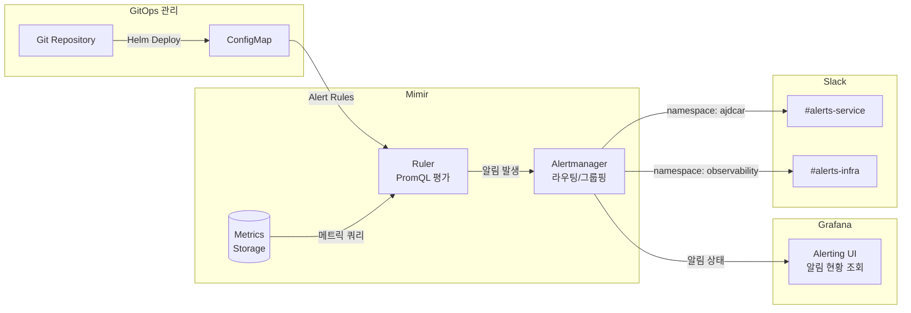

대시보드가 있어도 24시간 쳐다보고 있을 수는 없다. 문제가 생기면 알림이 와야 한다.

LGTM 스택에서는 Mimir에 내장된 Ruler와 Alertmanager를 사용한다. Prometheus Alertmanager와 동일한 방식으로 동작한다.

## 알림 아키텍처



Ruler가 주기적으로 메트릭을 쿼리하고, 조건이 충족되면 Alertmanager로 알림을 보낸다. Alertmanager는 알림을 그룹핑하고, 라우팅 규칙에 따라 적절한 Slack 채널로 전송한다. Grafana에서는 현재 발생 중인 알림을 조회하고 히스토리를 확인할 수 있다.

## 알림 구조 선택

알림을 설정하는 방법은 여러 가지가 있다.

| 옵션 | 설명 | 단점 |
|------|------|------|
| Grafana Alerting | Grafana UI에서 알림 룰 설정 | 설정이 Grafana DB에 저장, 휘발 가능 |
| Prometheus Alertmanager | Prometheus에서 직접 알림 | LGTM 스택에서는 Mimir 사용 |
| **Mimir Ruler** | 파일/ConfigMap 기반 알림 룰 | - |

**Mimir Ruler를 선택한 이유는 "휘발성" 문제 때문이다.**

Grafana UI에서 알림을 설정하면 편하지만, 설정이 Grafana의 내부 DB에 저장된다. Pod가 재시작되거나 PVC에 문제가 생기면 설정이 날아갈 수 있다.

Mimir Ruler는 알림 룰을 YAML 파일로 관리한다. 파일을 Git에 저장하고 ConfigMap으로 배포하면:
- 설정이 코드로 관리되어 휘발되지 않음
- 변경 이력 추적 가능
- 리뷰 후 배포하는 GitOps 워크플로우 적용 가능

대시보드와 마찬가지로 알림 룰도 "코드로 관리"하는 방향을 선택했다.

## 어떤 알림이 필요한가

운영 관점에서 "당장 확인해야 하는 상황"을 정의했다.

| 카테고리 | 상황 | 심각도 |
|---------|------|--------|
| Pod | CrashLoopBackOff, OOMKilled | critical |
| Pod | 재시작 빈번, Pending 지속 | warning |
| Node | NotReady, Memory/Disk Pressure | critical/warning |
| Deployment | 가용 Replica 0 | critical |

## 알림 룰 설계

### Pod 알림

Pod 상태 이상은 가장 흔하게 발생하는 문제다.

```yaml
# CrashLoopBackOff - 5분 이상 지속되면 알림
- alert: PodCrashLoopBackOff
  expr: kube_pod_container_status_waiting_reason{reason="CrashLoopBackOff"} == 1
  for: 5m
  labels:
    severity: critical
  annotations:
    summary: "Pod {{ $labels.namespace }}/{{ $labels.pod }} CrashLoopBackOff"
```

```yaml
# OOMKilled - 즉시 알림
- alert: ContainerOOMKilled
  expr: kube_pod_container_status_last_terminated_reason{reason="OOMKilled"} == 1
  for: 0m
  labels:
    severity: critical
  annotations:
    summary: "Container {{ $labels.container }} OOMKilled"
```

**PodNotReady 분리 전략**

처음엔 PodNotReady 하나로 만들었다가, 알림이 너무 많이 왔다. 새로 배포한 Pod가 시작하는 동안에도 알림이 오는 문제가 있었다.

해결책으로 신규 Pod와 기존 Pod를 분리했다:

```yaml
# 신규 Pod (생성 20분 이내) - 10분 대기 후 warning
- alert: PodNotReadyNew
  expr: |
    (kube_pod_status_ready{condition="true"} == 0)
    and on(pod, namespace) (kube_pod_status_phase{phase="Running"} == 1)
    and on(pod, namespace) ((time() - kube_pod_created) < 1200)
  for: 10m
  labels:
    severity: warning
```

```yaml
# 기존 Pod (생성 20분 이상) - 1분 대기 후 critical
- alert: PodNotReadyExisting
  expr: |
    (kube_pod_status_ready{condition="true"} == 0)
    and on(pod, namespace) (kube_pod_status_phase{phase="Running"} == 1)
    and on(pod, namespace) ((time() - kube_pod_created) >= 1200)
  for: 1m
  labels:
    severity: critical
```

신규 Pod는 시작에 시간이 걸릴 수 있으니 여유를 주고, 기존 Pod가 갑자기 NotReady가 되면 즉각 대응이 필요하다.

### Node 알림

노드 문제는 여러 Pod에 영향을 미친다.

```yaml
# Node NotReady
- alert: NodeNotReady
  expr: kube_node_status_condition{condition="Ready", status="true"} == 0
  for: 5m
  labels:
    severity: critical

# Memory Pressure
- alert: NodeMemoryPressure
  expr: kube_node_status_condition{condition="MemoryPressure", status="true"} == 1
  for: 5m
  labels:
    severity: warning
```

### Deployment 알림

서비스 가용성과 직결되는 알림이다.

```yaml
# 가용 Replica가 0이면 서비스 중단
- alert: DeploymentNoAvailableReplicas
  expr: kube_deployment_status_replicas_available == 0 and kube_deployment_spec_replicas > 0
  for: 5m
  labels:
    severity: critical

# 롤링 업데이트 진행 중 (정보성)
- alert: DeploymentRollingUpdate
  expr: kube_deployment_status_replicas_updated < kube_deployment_spec_replicas
  for: 0m
  labels:
    severity: info
```

## Alertmanager 설정

Mimir에 내장된 Alertmanager를 통해 Slack으로 알림을 전송한다. Helm values 파일에서 `fallbackConfig`로 설정한다.

### 라우팅 구조

```yaml
alertmanager:
  fallbackConfig: |
    global:
      resolve_timeout: 5m
    route:
      receiver: 'slack-default'
      group_by: ['alertname', 'namespace', 'pod']
      group_wait: 10s       # 같은 그룹의 알림을 모아서 보내기 전 대기 시간
      group_interval: 1m    # 같은 그룹에 새 알림 추가 시 재전송 간격
      repeat_interval: 1h   # 동일 알림 반복 전송 간격
      routes:
        # 네임스페이스별 라우팅 예시
        - match:
            namespace: 'observability'
          receiver: 'slack-observability'
```

`group_by`로 알림을 그룹핑한다. 같은 Pod에서 여러 알림이 동시에 발생하면 하나의 메시지로 묶어서 전송된다. 알림 폭탄을 방지하는 핵심 설정이다.

### Slack Receiver 설정

```yaml
    receivers:
      - name: 'slack-default'
        slack_configs:
          - api_url: 'https://hooks.slack.com/services/...'
            channel: '#alerts'
            send_resolved: true
            title: '{{ .Status | toUpper }} [{{ .CommonLabels.env | toUpper }}] [{{ .CommonLabels.severity }}] {{ .CommonLabels.alertname }}'
            text: |
              *Environment:* {{ .CommonLabels.env }}
              *Cluster:* {{ .CommonLabels.cluster }}
              *Namespace:* {{ .CommonLabels.namespace }}
              *Pod:* {{ .CommonLabels.pod }}
              *Summary:* {{ .CommonAnnotations.summary }}
              *Description:* {{ .CommonAnnotations.description }}
```

`send_resolved: true`로 설정하면 알림이 해소되었을 때도 알림이 온다. 장애가 복구되었는지 확인할 수 있다.

### 네임스페이스별 채널 분리

운영하다 보면 알림 채널을 분리하고 싶어진다. 모니터링 시스템 자체의 알림과 서비스 알림을 같은 채널에서 받으면 노이즈가 된다.

```yaml
      routes:
        - match:
            namespace: 'observability'
          receiver: 'slack-observability'
    receivers:
      - name: 'slack-default'
        slack_configs:
          - channel: '#alerts-service'
      - name: 'slack-observability'
        slack_configs:
          - channel: '#alerts-infra'
```

`routes`에서 조건을 걸고 다른 receiver로 보낼 수 있다. 나중에 팀별, 서비스별로 채널을 분리하기 좋은 구조다.

## 파일 구조

환경별로 파일을 분리했다. 임계값이나 채널이 다를 수 있기 때문이다.

```
observability/mimir/alert-rules/
├── eks-infrastructure-alerts-dev.yaml
└── eks-infrastructure-alerts-prod.yaml
```

## 결과

알림이 오면 대시보드를 열어 상황을 파악하고 대응한다. 알림 → 대시보드 → 로그 순서로 드릴다운하는 흐름이 만들어졌다.

아직 개선할 부분이 있다. 알림 피로도를 줄이기 위한 튜닝, 로그 기반 알림 추가 등은 운영하면서 점진적으로 보완할 예정이다.
