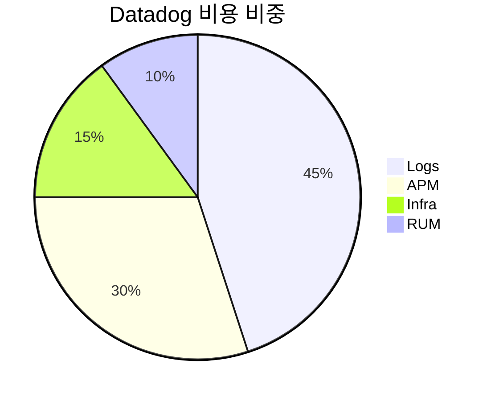
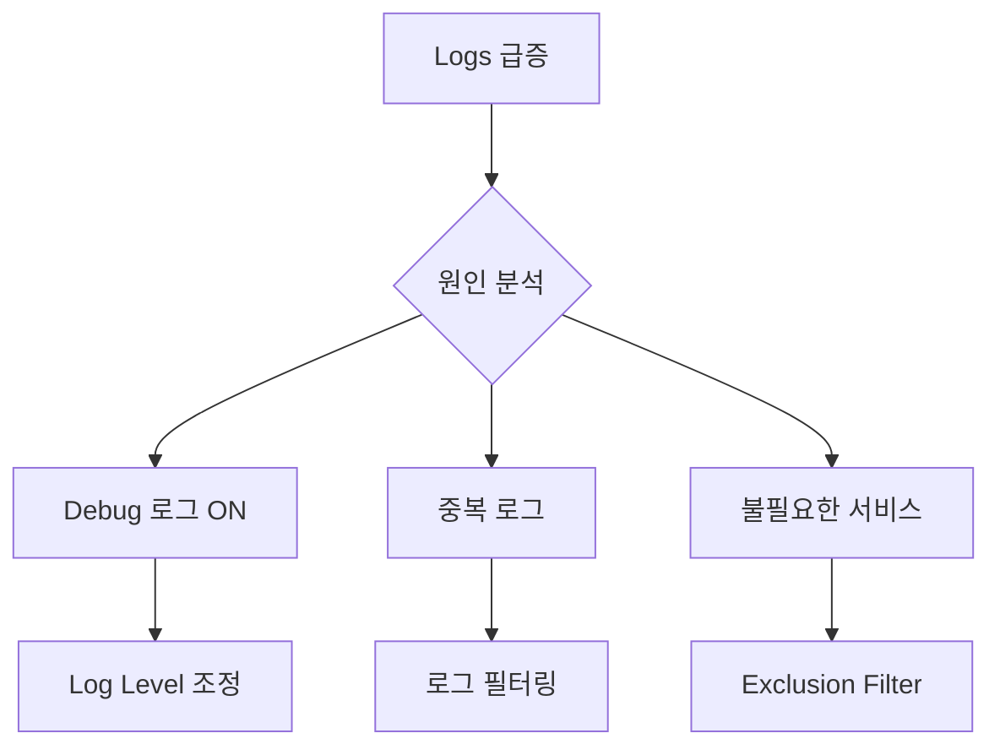

Datadog 비용이 예상보다 빠르게 증가해서 최적화를 진행한 경험을 공유합니다.

## 비용 구조 분석

## 문제 발견

| 월 | Logs (GB/day) | 비용 |
|----|---------------|------|
| 10월 | 50 | $2,500 |
| 11월 | 80 | $4,000 |
| 12월 | 120 | $6,000 |

## 원인 분석

## 결과

| 항목 | Before | After | 절감 |
|------|--------|-------|------|
| Logs/day | 120GB | 40GB | -67% |
| APM Spans | 100M | 70M | -30% |
| **월 비용** | $6,000 | $4,200 | **-30%** |
