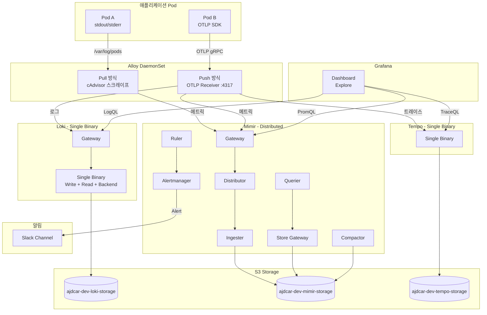

Observability는 선택이 아니라 필수다. 하지만 SaaS 모니터링 비용이 인프라 비용보다 높아지는 순간이 온다. 그때가 자체 구축을 고민할 타이밍이다.

Datadog을 메인으로 사용하고 있었지만, 모든 환경에 적용하기엔 비용 부담이 있었다. Observability가 아예 없는 환경이 생기는 것보다는, 오픈소스로라도 갖추는 게 낫다고 판단했다. LGTM 스택(Loki, Grafana, Tempo, Mimir)을 EKS에 구축한 과정을 공유한다.

## 배경

Datadog을 메인으로 사용하고 있지만, 모든 환경에 적용하기엔 비용 부담이 있었다. 특히 작은 규모의 계정들은 Observability가 아예 없는 상태로 운영되고 있었다.

오픈소스 대안을 검토한 결과, Grafana Labs의 LGTM 스택이 가장 성숙한 선택지였다. 우선 가장 작은 계정의 dev 환경에 적용하고, 점진적으로 확장해 나가기로 했다.

| 컴포넌트 | 역할 | 대체 대상 |
|---------|------|----------|
| **L**oki | 로그 집계 | Datadog Logs |
| **G**rafana | 시각화 | Datadog Dashboard |
| **T**empo | 분산 트레이싱 | Datadog APM |
| **M**imir | 메트릭 저장 | Datadog Metrics |

## 아키텍처



핵심은 **Alloy**다. Grafana Labs에서 만든 통합 수집기로, 기존 Promtail, OpenTelemetry Collector의 역할을 모두 대체한다. 2026년 3월 Promtail deprecated 예정이라 Alloy를 선택했다.

## 구성 포인트

### 1. Alloy - 통합 수집기

Alloy는 DaemonSet으로 배포하여 각 노드에서 로그와 메트릭을 수집한다.

```yaml
# alloy-values.yaml
controller:
  type: "daemonset"
  hostNetwork: true
```

River 설정으로 수집 파이프라인을 구성한다:

```river
// cAdvisor 메트릭 스크레이프
prometheus.scrape "kubelet_cadvisor" {
  targets = [{
    __address__ = "127.0.0.1:10250",
  }]
  forward_to = [prometheus.relabel.metrics_add_labels.receiver]
}

// 특정 네임스페이스만 필터링
prometheus.relabel "metrics_add_labels" {
  rule {
    source_labels = ["namespace"]
    regex         = "ajdcar|observability"
    action        = "keep"
  }
  forward_to = [prometheus.remote_write.mimir.receiver]
}
```

OTLP 수신도 지원하여 애플리케이션에서 직접 트레이스를 전송할 수 있다:

```river
otelcol.receiver.otlp "ingest" {
  grpc {
    endpoint = "0.0.0.0:4317"
  }
  output {
    traces  = [otelcol.processor.batch.default.input]
    logs    = [otelcol.processor.batch.default.input]
    metrics = [otelcol.processor.batch.metrics.input]
  }
}
```

### 2. Loki - 로그 저장

Dev 환경에서는 **Single Binary 모드**로 배포하여 리소스를 절약했다.

```yaml
# loki/values-dev.yaml
singleBinary:
  enabled: true
  replicas: 1
  resources:
    requests:
      cpu: 200m
      memory: 512Mi
```

S3를 백엔드로 사용하며, IRSA로 IAM 권한을 부여한다:

```yaml
serviceAccount:
  annotations:
    eks.amazonaws.com/role-arn: "arn:aws:iam::123456789012:role/loki-role"
```

### 3. Mimir - 메트릭 저장

Prometheus 호환 메트릭 저장소다. Alertmanager가 내장되어 있어 알림 설정이 가능하다.

```yaml
# mimir/values-common.yaml
alertmanager:
  fallbackConfig: |
    route:
      receiver: 'slack-notifications'
      group_by: ['alertname', 'namespace']
    receivers:
      - name: 'slack-notifications'
        slack_configs:
          - api_url: 'https://hooks.slack.com/...'
            channel: '#alerts'
```

### 4. 저장소 전략

모든 컴포넌트가 S3를 백엔드로 사용한다. 컴포넌트별로 버킷을 분리했다:

| 컴포넌트 | S3 버킷 | 보존 기간 |
|---------|--------|----------|
| Loki | ajdcar-dev-loki-storage | 7일 |
| Tempo | ajdcar-dev-tempo-storage | 7일 |
| Mimir | ajdcar-dev-mimir-storage | 7일 |

S3 Lifecycle Policy로 보존 기간을 관리한다.

## 결과

인프라 메트릭 수집과 알림 파이프라인이 구축되었다.

- **메트릭**: cAdvisor 기반 컨테이너 메트릭 수집, Grafana에서 PromQL 쿼리
- **알림**: Mimir Alertmanager → Slack 연동
- **로그/트레이스**: 저장소 준비 완료, 애플리케이션 SDK 적용 시 즉시 사용 가능

### 한계 및 다음 단계

현재 구성은 작은 환경에서의 기본 동작 검증에 초점을 맞췄다. 스케일 이슈는 아직 고려되지 않았다.

다음 단계는 더 큰 환경에 적용하면서 트래픽 증가에 따른 성능과 안정성을 점검할 예정이다.
