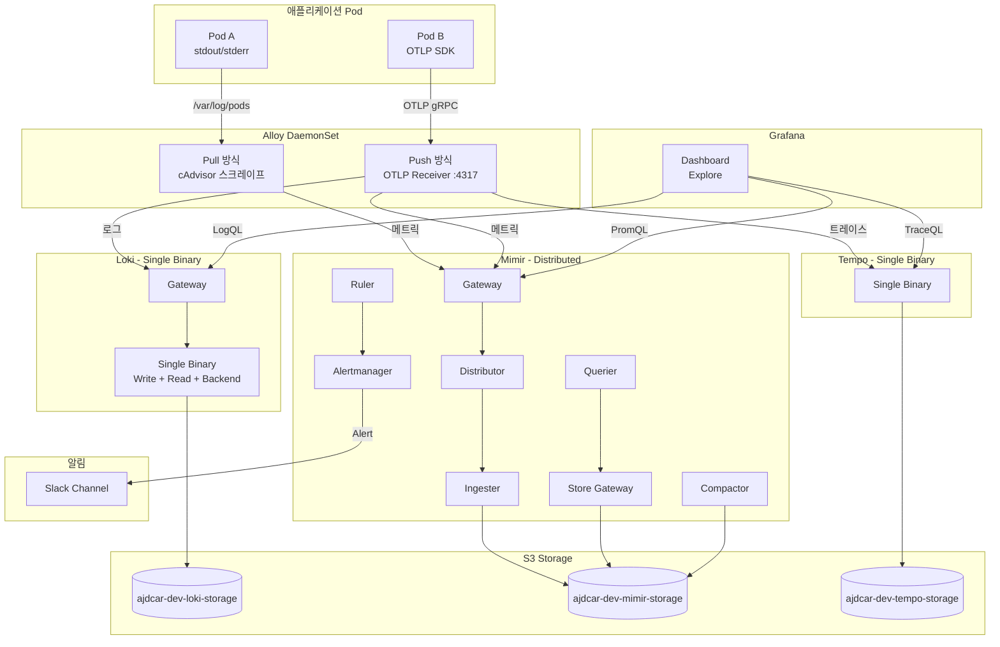

Datadog 비용 부담으로 자체 관측성 플랫폼을 검토하게 되었다.
이 글에서는 EKS 환경에 LGTM 스택을 구축한 과정을 공유한다.

## 배경

기존에는 Datadog을 사용하고 있었다. 로그, 메트릭, 트레이스를 한 곳에서 볼 수 있어 편리했지만, 서비스가 성장하면서 비용이 급격히 증가했다. 특히 로그 인제스트 비용이 부담이었다.

오픈소스 대안을 검토한 결과, Grafana Labs의 LGTM 스택이 가장 성숙한 선택지였다.

| 컴포넌트 | 역할 | 대체 대상 |
|---------|------|----------|
| **L**oki | 로그 집계 | Datadog Logs |
| **G**rafana | 시각화 | Datadog Dashboard |
| **T**empo | 분산 트레이싱 | Datadog APM |
| **M**imir | 메트릭 저장 | Datadog Metrics |

## 아키텍처



핵심은 **Alloy**다. Grafana Labs에서 만든 통합 수집기로, 기존 Promtail, OpenTelemetry Collector의 역할을 모두 대체한다. 2026년 3월 Promtail deprecated 예정이라 Alloy를 선택했다.

## 구성 포인트

### 1. Alloy - 통합 수집기

Alloy는 DaemonSet으로 배포하여 각 노드에서 로그와 메트릭을 수집한다.

```yaml
# alloy-values.yaml
controller:
  type: "daemonset"
  hostNetwork: true
```

River 설정으로 수집 파이프라인을 구성한다:

```river
// cAdvisor 메트릭 스크레이프
prometheus.scrape "kubelet_cadvisor" {
  targets = [{
    __address__ = "127.0.0.1:10250",
  }]
  forward_to = [prometheus.relabel.metrics_add_labels.receiver]
}

// 특정 네임스페이스만 필터링
prometheus.relabel "metrics_add_labels" {
  rule {
    source_labels = ["namespace"]
    regex         = "ajdcar|observability"
    action        = "keep"
  }
  forward_to = [prometheus.remote_write.mimir.receiver]
}
```

OTLP 수신도 지원하여 애플리케이션에서 직접 트레이스를 전송할 수 있다:

```river
otelcol.receiver.otlp "ingest" {
  grpc {
    endpoint = "0.0.0.0:4317"
  }
  output {
    traces  = [otelcol.processor.batch.default.input]
    logs    = [otelcol.processor.batch.default.input]
    metrics = [otelcol.processor.batch.metrics.input]
  }
}
```

### 2. Loki - 로그 저장

Dev 환경에서는 **Single Binary 모드**로 배포하여 리소스를 절약했다.

```yaml
# loki/values-dev.yaml
singleBinary:
  enabled: true
  replicas: 1
  resources:
    requests:
      cpu: 200m
      memory: 512Mi
```

S3를 백엔드로 사용하며, IRSA로 IAM 권한을 부여한다:

```yaml
serviceAccount:
  annotations:
    eks.amazonaws.com/role-arn: "arn:aws:iam::123456789012:role/loki-role"
```

### 3. Mimir - 메트릭 저장

Prometheus 호환 메트릭 저장소다. Alertmanager가 내장되어 있어 알림 설정이 가능하다.

```yaml
# mimir/values-common.yaml
alertmanager:
  fallbackConfig: |
    route:
      receiver: 'slack-notifications'
      group_by: ['alertname', 'namespace']
    receivers:
      - name: 'slack-notifications'
        slack_configs:
          - api_url: 'https://hooks.slack.com/...'
            channel: '#alerts'
```

### 4. 저장소 전략

모든 컴포넌트가 S3를 백엔드로 사용한다. 컴포넌트별로 버킷을 분리했다:

| 컴포넌트 | S3 버킷 | 보존 기간 |
|---------|--------|----------|
| Loki | ajdcar-dev-loki-storage | 7일 |
| Tempo | ajdcar-dev-tempo-storage | 7일 |
| Mimir | ajdcar-dev-mimir-storage | 7일 |

S3 Lifecycle Policy로 보존 기간을 관리한다.

## 결과

Dev 환경에서 안정적으로 운영 중이다.

- **로그**: Grafana Explore에서 LogQL로 쿼리
- **메트릭**: PromQL로 쿼리, 기존 Prometheus 대시보드 그대로 사용
- **트레이스**: 서비스 맵, 트레이스 상세 조회

Datadog 대비 비용은 S3 저장 비용 + EC2 리소스 정도로, 월 비용이 크게 줄었다.

Prod 환경 적용은 HA 구성(Write/Read 분리, 다중 복제본)을 검토 중이다.
