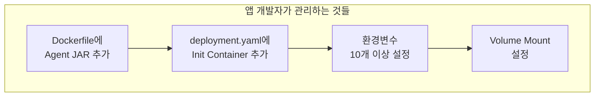
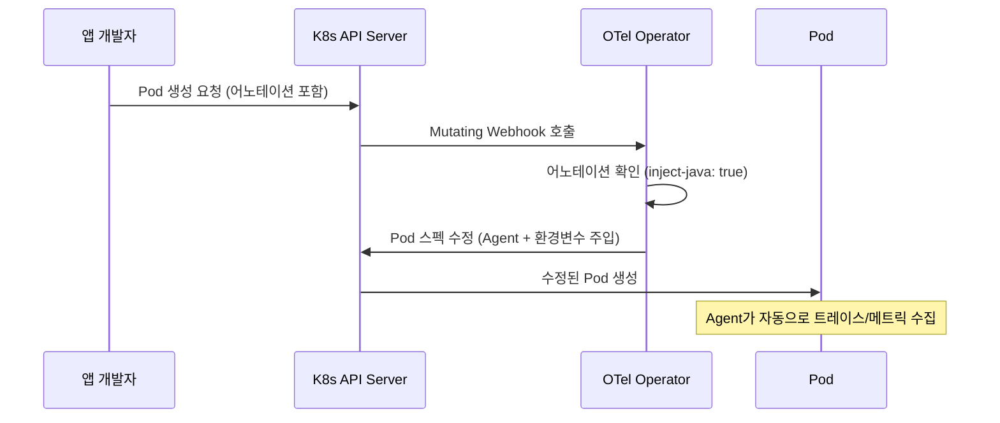
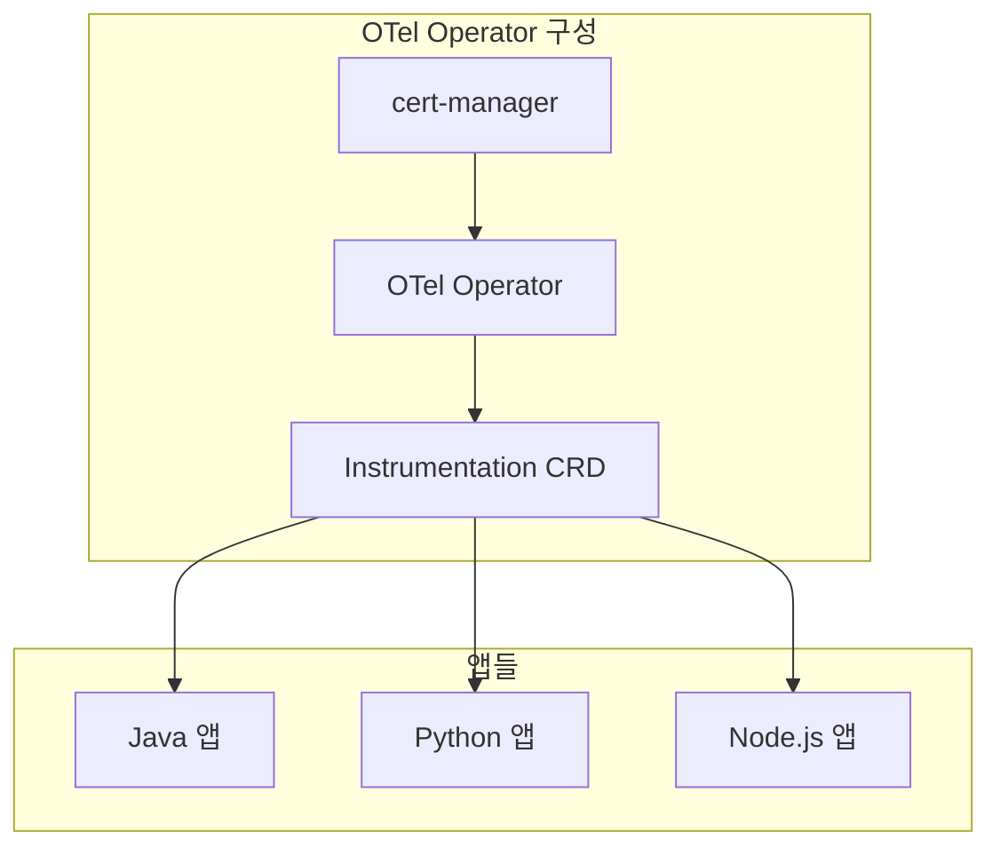

관측성(Observability)은 앱의 관심사가 아니다. 인프라가 책임져야 한다.

OpenTelemetry 커뮤니티와 Grafana Labs가 공통적으로 강조하는 원칙이다. 앱 개발자는 비즈니스 로직에 집중하고, 로그/트레이스/메트릭 수집은 플랫폼이 알아서 처리해야 한다. 하지만 현실은 그렇지 않은 경우가 많다. Dockerfile에 Agent를 넣고, Init Container를 설정하고, 환경변수를 10개 넘게 직접 입력하는 작업을 앱 개발자가 하고 있다면, 관심사 분리가 안 되고 있는 것이다.

이 글에서는 Init Container / 이미지 내장 방식에서 OTel Operator 방식으로 전환해야 하는 이유와 동작 원리를 정리한다.

## 현재 상태 — 무엇이 문제인가

일반적으로 Java 앱에 OpenTelemetry를 적용하는 방식은 크게 두 가지다.

**이미지 내장 방식**: Dockerfile에서 Agent JAR을 복사하고, `JAVA_TOOL_OPTIONS`에 javaagent 경로를 설정한다. 빌드할 때마다 Agent가 포함되므로 이미지가 무거워지고, Agent 버전 관리가 앱 팀의 몫이 된다.

**Init Container 방식**: deployment.yaml에 Init Container를 추가하여, Pod 시작 전에 Agent JAR을 복사한다. 앱 코드 수정은 불필요하지만, 앱마다 Init Container + 환경변수 + Volume 설정이 반복된다.

둘 다 결국 **앱 개발자가 관측성 설정을 직접 관리**해야 한다는 점에서 같은 문제를 안고 있다.



비유하자면, 아파트 건물에 새 세입자가 들어올 때마다 세입자가 직접 수도관을 사서 설치하는 것과 같다. 어떤 집은 최신 배관, 어떤 집은 낡은 배관. 고장 나면 세입자가 알아서 고쳐야 한다. 수도관은 건물 관리인이 일괄로 관리하는 게 당연한 것처럼, 관측성도 플랫폼 팀이 중앙에서 관리해야 한다.

## OTel Operator — 어노테이션 한 줄로 끝

OTel Operator는 쿠버네티스에서 관측성 자동 주입기 역할을 한다. 앱 Pod에 어노테이션 한 줄만 붙이면, Operator가 자동으로 Agent를 주입하고 환경변수를 설정한다. 앱 코드나 Dockerfile을 건드릴 필요가 없다.


비유를 이어가면, 새 세입자는 관리사무소에 "수도 연결해주세요"라고 메모(어노테이션) 한 장만 남기면 된다. 관리인이 알아서 최신 배관을 설치하고, 고장 나면 관리인이 수리한다.

## Before vs After

| 항목 | Before (Init Container) | After (Operator) |
|------|------------------------|------------------|
| 앱 코드 변경 | Init Container, 환경변수, Volume 직접 설정 | 어노테이션 1줄 |
| Dockerfile | Agent JAR 포함 (이미지 내장 시) | 변경 없음 |
| Agent 버전 관리 | 앱마다 개별 관리, 파편화 | CRD 한 곳에서 일괄 관리 |
| 새 앱 온보딩 | 30줄 이상 YAML 복붙 | 어노테이션 1줄 추가 |
| On/Off | 재빌드 또는 YAML 수정 | 어노테이션 제거하면 끝 |

코드로 보면 차이가 더 명확하다.

**Before — deployment.yaml (30줄 이상 추가)**

```yaml
initContainers:
  - name: otel-agent
    image: otel/opentelemetry-javaagent:latest
    command: ["cp", "/javaagent.jar", "/agent"]
    volumeMounts:
      - name: otel-agent
        mountPath: /agent
env:
  - name: JAVA_TOOL_OPTIONS
    value: "-javaagent:/agent/javaagent.jar"
  - name: OTEL_SERVICE_NAME
    value: "my-api"
  - name: OTEL_EXPORTER_OTLP_ENDPOINT
    value: "http://..."
  # ... 환경변수 7개 더 ...
volumes:
  - name: otel-agent
    emptyDir: {}
```

**After — values.yaml (1줄 추가)**

```yaml
podAnnotations:
  instrumentation.opentelemetry.io/inject-java: "true"
```

## 동작 원리 — Mutating Webhook

OTel Operator는 쿠버네티스의 Mutating Webhook을 사용한다. Pod 생성 요청이 API Server에 도착하면, Operator가 중간에 끼어들어 Pod 스펙을 수정(Agent 주입)한 뒤 Pod를 생성한다.



Operator가 Pod 스펙을 수정할 때 실제로 하는 일은 다음과 같다:

1. Init Container 추가 (Agent JAR 복사)
2. `JAVA_TOOL_OPTIONS` 등 환경변수 자동 설정
3. Volume Mount 자동 설정

결국 Init Container 방식과 동일한 결과물이 만들어지지만, **그 설정을 사람이 아니라 Operator가 자동으로 생성**한다는 것이 핵심이다.

## 핵심 컴포넌트

Operator 방식에 필요한 컴포넌트는 3가지다.



| 컴포넌트 | 역할 |
|---------|------|
| **cert-manager** | Webhook에 필요한 TLS 인증서 자동 발급/갱신 |
| **OTel Operator** | Pod 생성 감시 + 어노테이션 기반 Agent 자동 주입 |
| **Instrumentation CRD** | Agent 이미지 버전, OTLP 엔드포인트, 전파 방식 등 설정 정의 |

Agent 버전을 업그레이드하고 싶으면 Instrumentation CRD의 이미지 태그만 변경하면 된다. 해당 CRD를 참조하는 모든 앱이 다음 재시작 시 자동으로 새 버전을 사용한다.

## 지원 언어

OTel Operator는 Java만 지원하는 것이 아니다. 주요 언어를 모두 지원한다.

| 언어 | 지원 | 어노테이션 | 방식 |
|-----|------|----------|------|
| **Java** | O | `inject-java` | javaagent JAR 주입 |
| **Python** | O | `inject-python` | Python 패키지 주입 |
| **Node.js** | O | `inject-nodejs` | Node.js SDK 주입 |
| **.NET** | O | `inject-dotnet` | .NET profiler 주입 |
| **Go** | △ | `inject-go` | eBPF 기반 (실험적) |
| **GraalVM Native** | X | - | AOT 컴파일이라 바이트코드 조작 불가 |

Instrumentation CRD에 언어별 Agent 이미지를 정의하면 된다.

```yaml
apiVersion: opentelemetry.io/v1alpha1
kind: Instrumentation
metadata:
  name: otel-instrumentation
spec:
  exporter:
    endpoint: http://alloy.observability.svc.cluster.local:4317
  propagators:
    - tracecontext
    - baggage
  java:
    image: ghcr.io/open-telemetry/opentelemetry-operator/autoinstrumentation-java:2.14.0
  python:
    image: ghcr.io/open-telemetry/opentelemetry-operator/autoinstrumentation-python:0.44b0
  nodejs:
    image: ghcr.io/open-telemetry/opentelemetry-operator/autoinstrumentation-nodejs:0.49.1
```

GraalVM Native Image는 AOT 컴파일 특성상 런타임 바이트코드 조작이 불가능하므로 Operator 자동 주입이 동작하지 않는다. 이 경우 빌드 시점에 OTEL SDK를 직접 의존성으로 추가해야 한다. 다만 일반 JVM 위에서 돌리는 GraalVM(JIT 모드)이면 Java와 동일하게 동작한다.

## 관측성 관리 방식 비교

| 순위 | 방식 | 장점 | 단점 |
|-----|------|------|------|
| **1순위** | OTel Operator | 앱 코드 제로, 중앙 관리, 일괄 업데이트 | 초기 Operator 설치 필요 |
| **2순위** | Init Container | Operator 없이 동작, 앱 코드 수정 불필요 | 앱별 YAML 중복, 버전 파편화 |
| **3순위** | 이미지 내장 | 단순한 구조 | 이미지 비대화, 앱 팀 관리 부담 |

1순위와 2순위의 최종 결과물(Pod 스펙)은 사실상 동일하다. 차이는 그 결과물을 **사람이 만드느냐, Operator가 자동으로 만드느냐**다.

## 셀프 체크리스트

현재 환경에 OTel Operator 도입이 적합한지 확인하는 체크리스트다.

- 3개 이상의 앱에 OpenTelemetry Agent가 적용되어 있는가?
- 앱마다 Agent 버전이 다른가? (파편화)
- 새 앱 온보딩 시 Init Container / 환경변수 설정을 복붙하고 있는가?
- Agent 버전 업그레이드 시 앱마다 개별 수정이 필요한가?
- Java 외에 Python, Node.js 등 다른 언어 앱에도 관측성이 필요한가?

3개 이상 해당된다면, OTel Operator 도입을 검토할 시점이다.

## 다음 단계

이 글은 OTel Operator의 개념과 필요성을 정리한 것이다. 실제 도입 과정에서는 다음을 추가로 고려해야 한다.

- **cert-manager 설치**: Operator Webhook에 필요한 TLS 인증서 관리
- **Alloy Service 포트 설정**: Instrumentation CRD의 OTLP 엔드포인트가 실제로 열려 있는지 확인
- **기존 Init Container 제거**: Operator 도입 후 기존 수동 설정과 충돌하지 않도록 정리
- **점진적 전환**: 한 앱에 먼저 적용하고, 안정성 확인 후 전체 확대

---

*이 글은 [LGTM 스택 구축기](/observability/lgtm-stack/)의 후속편이다. LGTM으로 백엔드를 갖췄다면, 다음은 앱에서 텔레메트리를 보내는 방법을 표준화할 차례다.*
