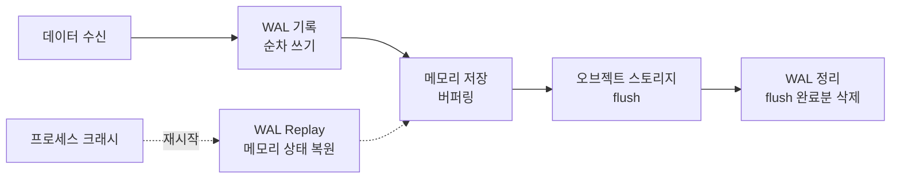
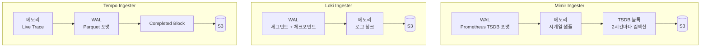

데이터베이스의 신뢰성은 결국 "쓰기를 잃지 않는 것"에서 시작한다. PostgreSQL, MySQL, SQLite 모두 WAL(Write-Ahead Logging)이라는 동일한 원칙을 사용한다. 최종 저장소에 반영하기 전에 먼저 로그에 기록하라.

LGTM 스택도 같은 문제를 안고 있다. Ingester는 수신한 데이터를 메모리에 버퍼링했다가 주기적으로 오브젝트 스토리지(S3 등)에 flush한다. 이 사이에 프로세스가 죽으면? 메모리의 데이터는 사라진다. Mimir 기준으로 최대 2시간, Loki는 flush 주기만큼의 로그가 유실될 수 있다. WAL은 이 간극을 메운다.

## WAL의 기본 원리

WAL의 핵심은 단순하다. **데이터를 처리하기 전에 먼저 디스크에 기록한다.**



| 특성 | 설명 |
|------|------|
| **순차 쓰기(Sequential Write)** | 랜덤 I/O 없이 append-only로 기록. 디스크 성능 부담이 적다 |
| **Append-only** | 기존 데이터를 수정하지 않는다. 새 데이터만 추가한다 |
| **체크포인트(Checkpoint)** | 주기적으로 메모리 상태의 스냅샷을 저장. Replay 시간을 단축한다 |
| **트렁케이션(Truncation)** | flush가 완료된 WAL 세그먼트를 삭제하여 디스크를 관리한다 |

프로세스가 크래시하면 재시작 시 WAL을 처음부터 재생(replay)하여 메모리 상태를 복원한다. 체크포인트가 있으면 체크포인트부터 시작하므로 복구가 더 빠르다.

## LGTM 스택에서의 WAL

LGTM 스택의 세 Ingester(Mimir, Loki, Tempo)는 각각 WAL을 사용하지만, 데이터 특성에 따라 구현이 다르다.



### Mimir - 메트릭

Mimir의 Ingester는 Prometheus TSDB WAL 포맷을 기반으로 한다. WAL과 TSDB 블록이 같은 디렉토리(`tsdb.dir`)에 저장되며 분리할 수 없다.

**데이터 흐름:**
1. Distributor가 샘플을 3개 Ingester에 복제 전송 (replication factor 3)
2. 각 Ingester가 **WAL에 먼저 기록** 후 메모리에 저장
3. 약 2시간마다 메모리 데이터를 TSDB 블록으로 컴팩션
4. 블록을 S3에 업로드
5. 업로드 완료된 WAL 세그먼트를 트렁케이션

```yaml
# Mimir Ingester 주요 설정
blocks_storage:
  tsdb:
    dir: /tmp/mimir/tsdb        # WAL + TSDB 블록 저장 경로
    retention_period: 13h        # 로컬 블록 보존 기간
    block_ranges_period: 2h      # TSDB 블록 생성 주기
```

Mimir에는 **WBL(Write-Behind Log)**이라는 개념도 있다. WAL이 순서대로 도착하는 샘플(in-order)을 기록하는 반면, WBL은 순서가 어긋난 샘플(out-of-order)을 별도로 기록한다.

**Replay 순서:**
1. 가장 최근 체크포인트를 메모리에 로드
2. 체크포인트 이후의 WAL 세그먼트를 순차 replay
3. 메모리 상태 복원 완료 후 정상 동작 재개

### Loki - 로그

Loki의 WAL은 v2.2에서 도입되었다. 로그 데이터를 chunk store에 flush하기 전에 로컬 디스크에 기록한다. Two-Pass 아키텍처로 동작한다.

**1st Pass - 세그먼트:** 들어오는 쓰기를 순차적 세그먼트 파일에 기록한다.

```
data/wal/
├── 000000              # 세그먼트 파일
├── 000001
├── 000002
└── checkpoint.000001   # 체크포인트
```

**2nd Pass - 체크포인트:** 주기적으로 세그먼트들을 통합하여 체크포인트를 생성한다. 체크포인트 완료 후 이전 세그먼트를 삭제한다.

WAL에는 두 가지 레코드 타입이 기록된다.

| 레코드 타입 | 내용 | 생성 시점 |
|------------|------|----------|
| **Stream Record** | UserID, Labels, Fingerprint | 새 로그 스트림 수신 시 |
| **Logs Record** | UserID, Fingerprint, timestamp/line 목록 | 각 push마다 |

```yaml
# Loki Ingester WAL 설정
ingester:
  wal:
    enabled: true
    dir: /loki/wal                  # WAL 저장 경로 (격리된 디스크 권장)
    checkpoint_duration: 5m         # 체크포인트 생성 주기
    replay_memory_ceiling: 4GB      # 메모리 limit의 ~75% 권장
  flush_on_shutdown: true           # 셧다운 시 chunk store로 flush
```

`replay_memory_ceiling`은 중요한 설정이다. WAL replay 중 메모리 사용량이 이 값을 초과하면 Ingester가 먼저 스토리지로 flush한 뒤 replay를 재개한다. 설정하지 않으면 거대한 WAL replay 시 OOM으로 크래시 루프에 빠질 수 있다.

### Tempo - 트레이스

Tempo의 WAL은 다른 두 컴포넌트와 흐름이 약간 다르다. 데이터가 수신 즉시 WAL에 기록되는 것이 아니라, **live trace가 idle 상태가 된 후** WAL로 이동한다.

**트레이스 라이프사이클:**
1. 스팬 수신 → 메모리에 live trace로 보관
2. `trace_idle_period`(기본 10s) 동안 새 스팬이 없으면 → WAL로 flush (Parquet 포맷)
3. WAL의 트레이스들이 모여 completed block을 형성
4. Completed block을 오브젝트 스토리지에 업로드

```yaml
# Tempo Ingester 설정
ingester:
  trace_idle_period: 10s          # idle 후 WAL flush까지 대기 시간
  max_block_duration: 30m         # 블록 최대 지속 시간
  flush_check_period: 10s         # live → WAL → block 스윕 주기

storage:
  trace:
    wal:
      path: /var/tempo/wal        # WAL 저장 경로
      v2_encoding: snappy         # 인코딩 (snappy 권장)
```

WAL 인코딩은 **snappy**가 권장된다. 약간의 CPU 오버헤드가 있지만 디스크 I/O를 절감하고 checksum을 추가해 무결성을 보장한다.

## 컴포넌트별 비교

| 항목 | Mimir | Loki | Tempo |
|------|-------|------|-------|
| **WAL 포맷** | Prometheus TSDB WAL | 자체 세그먼트 + 체크포인트 | Parquet |
| **기록 시점** | 수신 즉시 | 수신 즉시 | live trace idle 후 |
| **체크포인트** | 있음 (chunk 단위) | 있음 (5분 주기) | 없음 |
| **flush 주기** | ~2시간 (블록 컴팩션) | 설정에 따라 다름 | 블록 완성 시 |
| **인코딩** | - | - | snappy |
| **WAL 없이 유실 가능 범위** | 최대 2시간 | flush 주기만큼 | idle period + block duration |

## WAL이 데이터를 살리는 시나리오

### 시나리오 1: Ingester 크래시

가장 기본적인 시나리오다. 프로세스가 예기치 않게 종료되었을 때.

| | WAL 없음 | WAL 있음 |
|---|---------|---------|
| **Mimir** | 최대 2시간 메트릭 유실 | WAL replay로 복원 |
| **Loki** | flush 안 된 로그 유실 | WAL replay로 복원 |
| **Tempo** | 메모리의 live trace 유실 | idle 이후 WAL에 기록된 트레이스는 복원 |

### 시나리오 2: Rolling Restart (업그레이드)

K8s 환경에서 가장 흔한 시나리오다. Helm upgrade나 이미지 변경 시 Pod가 순차적으로 재시작된다.

- **Mimir**: 재시작된 Ingester가 WAL replay 하며 약 수 분간 디스크 read 활동 증가
- **Loki**: `flush_on_shutdown: true` 설정 시 셧다운 전에 chunk store로 flush. Replay 부담 감소
- **Tempo**: `flush_all_on_shutdown: true`로 셧다운 시 모든 트레이스를 백엔드로 전송 가능

### 시나리오 3: WAL 손상(Corruption)

디스크 장애나 비정상 종료로 WAL 파일이 손상될 수 있다.

| 컴포넌트 | 손상 시 동작 | 데이터 영향 |
|---------|------------|-----------|
| **Mimir** | 손상 지점 이후 모든 레코드 폐기 | 단일 Ingester면 replication이 커버. 다수 동시 손상 시 유실 가능 |
| **Loki** | 복구 가능한 만큼 복구하고 시작 진행 (가용성 우선) | `loki_ingester_wal_corruptions_total` 메트릭으로 추적 |
| **Tempo** | WAL 디렉토리 손상 시 해당 블록 유실 | 완성된 블록은 이미 S3에 업로드되어 안전 |

### 시나리오 4: 디스크 풀

WAL 디스크가 가득 차면 상황이 복잡해진다.

- **Loki**: WAL 쓰기를 건너뛰고 메모리에서만 처리한다 (`loki_ingester_wal_disk_full_failures_total` 메트릭). 이 상태에서 크래시하면 데이터 유실이 발생한다.
- **Mimir**: WAL 트렁케이션 실패 → 재시작 시 거대한 WAL replay → OOM → 크래시 루프에 빠질 수 있다. 디스크 용량 모니터링이 필수다.

## 운영 체크리스트

| 항목 | 권장 사항 | 이유 |
|------|----------|------|
| **스토리지** | SSD, 격리된 디스크 | WAL 순차 쓰기 성능이 전체 write path에 직결 |
| **K8s 배포** | StatefulSet + PVC | 재시작 시 동일 볼륨 재연결 필수 |
| **메모리 설정** | `replay_memory_ceiling` = 메모리 limit의 ~75% (Loki) | OOM 크래시 루프 방지 |
| **셧다운** | `flush_on_shutdown: true` (Loki, Tempo) | 정상 종료 시 WAL replay 부담 감소 |
| **모니터링** | WAL corruption, disk full 메트릭 알림 | 유실 발생 전 감지 |
| **디스크 용량** | 여유 있게 확보, 100% 사용 금지 | 디스크 풀 시 보호 기능 저하 |
| **WAL 공유 금지** | 하나의 WAL 디렉토리에 하나의 Ingester만 | 두 Ingester가 같은 WAL을 쓰면 데이터 손상 |

## 정리

WAL은 LGTM 스택에서 "메모리 버퍼링"이라는 구조적 약점을 보완하는 핵심 메커니즘이다. 수신 즉시 디스크에 기록하고, 크래시 후 replay로 복원한다는 단순한 원칙이지만, 컴포넌트마다 데이터 특성에 맞게 구현이 다르다.

운영 관점에서 WAL은 "켜 놓으면 끝"이 아니다. 디스크 용량 모니터링, replay memory ceiling 설정, flush_on_shutdown 활성화 등 WAL이 제대로 동작하기 위한 조건을 갖춰야 한다. 특히 디스크 풀 상태에서 크래시가 발생하면 WAL이 있어도 데이터를 잃을 수 있다. WAL의 한계를 이해하고 운영하는 것이 중요하다.
