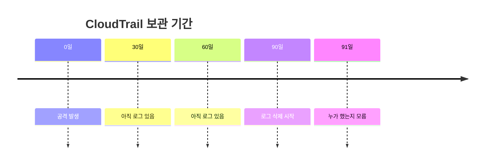

AWS IAM 키가 탈취되면 어떤 일이 벌어질까? 공격자는 평소 사용하지 않는 리전에 리소스를 생성해서 숨는다. AWS 리전이 30개가 넘는데, 대부분 1~2개 리전만 사용한다. 나머지 리전은 모니터링 사각지대다.

## 공격 패턴

### 1단계: IAM 키 탈취

공격자가 IAM Access Key를 얻는 방법:
- GitHub에 실수로 커밋된 키
- 피싱으로 탈취
- EC2 인스턴스 메타데이터 서비스(IMDS) 악용
- 취약한 애플리케이션에서 유출

### 2단계: 미사용 리전에 리소스 생성


**왜 미사용 리전인가?**
- AWS 리전이 30개 이상
- 대부분 서울(ap-northeast-2) 정도만 사용
- 도쿄(ap-northeast-1), 오레곤(us-west-1) 등은 안 봄
- **모니터링 사각지대**

실제 사례에서 공격자는 `ap-northeast-1`(도쿄)에 50개 이상의 EC2 인스턴스를 생성해서 한 달간 크립토마이닝을 돌렸다. 피해자는 청구서를 보고서야 알았다.

### 3단계: 지속성 확보

공격자는 들키지 않고 오래 머물기 위해:

**Lambda 활용:**
```
- Lambda 함수 생성 (인증 없이 호출 가능하게)
- Function URL로 외부 접근 경로 확보
- EventBridge로 주기적 실행 설정
```

**IAM 백도어:**
```
- 새 IAM 사용자 생성
- 기존 Role에 악성 Trust Policy 추가
- 외부 AWS 계정에서 AssumeRole 가능하게
```

### 공격 속도

2025년 11월에 탐지된 대규모 캠페인에서:
- 최초 접근 후 **10분 내** 크립토마이너 가동
- 한 번에 **999개 EC2 인스턴스** 생성
- **50개 이상의 ECS 클러스터** 생성

## 왜 찾기 어려운가

### CloudTrail 90일 한계

AWS CloudTrail Event History는 **90일**만 보관된다.



**문제:**
- 90일 전에 Trail 설정을 안 했으면 로그가 없음
- 공격자가 누구 권한으로 뭘 했는지 추적 불가
- 사후에 Trail 설정해도 과거 로그는 복구 안 됨

| 설정 | 보관 기간 |
|------|----------|
| Event History (기본) | 90일 |
| Trail → S3 | 무제한 (S3 수명주기 정책 따름) |
| CloudTrail Lake | 최대 7~10년 |

### 리전별 모니터링 부재

CloudTrail 기본 설정은 **현재 리전만** 기록한다.

```
❌ 서울 리전만 Trail 설정
   → 도쿄에서 EC2 생성해도 로그 안 남음

✓ 모든 리전 Trail 설정 필요
   → AWS 콘솔에서 "Apply trail to all regions" 활성화
```

## 대응 방법

### 1. 미사용 리전 비활성화

AWS는 신규 리전을 기본 비활성화로 제공한다 (ap-east-1 홍콩부터).

**추가로 할 수 있는 것:**
- IAM에서 미사용 리전의 STS 토큰 발급 비활성화
- SCP(Service Control Policy)로 특정 리전 차단

```json
{
  "Version": "2012-10-17",
  "Statement": [
    {
      "Effect": "Deny",
      "Action": "*",
      "Resource": "*",
      "Condition": {
        "StringNotEquals": {
          "aws:RequestedRegion": ["ap-northeast-2", "us-east-1"]
        }
      }
    }
  ]
}
```

### 2. 모든 리전 CloudTrail 설정

```
AWS 콘솔 → CloudTrail → Trails → Create trail
→ "Apply trail to all regions" 체크
→ S3 버킷에 저장 (장기 보관)
```

### 3. GuardDuty 활성화

GuardDuty는 의심스러운 활동을 자동 탐지한다:
- 미사용 리전에서 API 호출
- 비정상적인 EC2/Lambda 생성
- 크립토마이닝 패턴

**모든 리전**에서 GuardDuty를 활성화해야 한다.

### 4. 알람 설정

CloudWatch 알람으로 이상 징후 감지:

```
모니터링할 API:
- ec2:RunInstances (특히 미사용 리전)
- ecs:CreateCluster
- lambda:CreateFunction
- iam:CreateUser
- iam:CreateRole
- iam:AttachRolePolicy
```

## 체크리스트

| 항목 | 확인 |
|------|------|
| CloudTrail 모든 리전 활성화 | ☐ |
| CloudTrail 로그 S3 장기 보관 | ☐ |
| GuardDuty 모든 리전 활성화 | ☐ |
| 미사용 리전 SCP로 차단 | ☐ |
| IAM 키 대신 IAM Role 사용 | ☐ |
| MFA 필수 설정 | ☐ |
| 이상 API 호출 알람 설정 | ☐ |

## 정리

AWS IAM 키가 탈취되면:

1. **미사용 리전**에 리소스를 생성해서 숨김
2. **CloudTrail 90일 한계**로 늦게 발견하면 추적 불가
3. **10분 내**에 크립토마이너 가동 가능

**핵심 대응:**
- CloudTrail **모든 리전** 설정 + S3 장기 보관
- GuardDuty **모든 리전** 활성화
- 미사용 리전 **SCP로 차단**
- IAM 키 대신 **IAM Role + MFA** 사용

90일 지나면 끝이다. 미리 설정해두자.
