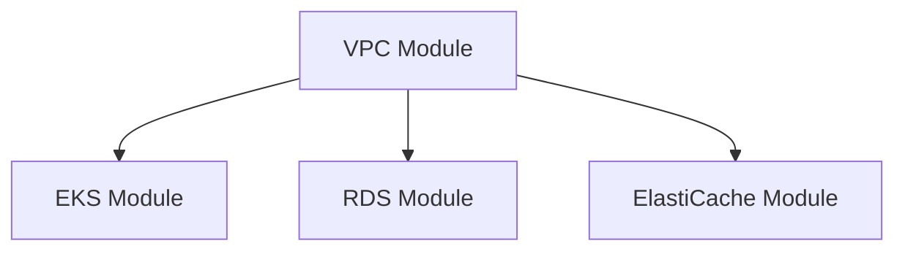

대규모 인프라를 관리하기 위한 Terraform 모듈 설계 패턴을 공유합니다.

## 모듈 구조

```
terraform/
├── modules/
│   ├── vpc/
│   ├── eks/
│   ├── rds/
│   └── elasticache/
├── environments/
│   ├── dev/
│   ├── staging/
│   └── prod/
└── global/
    └── iam/
```

## 모듈 의존성



## VPC 모듈 예시

```hcl
module "vpc" {
  source  = "terraform-aws-modules/vpc/aws"
  version = "~> 5.0"

  name = var.name
  cidr = var.cidr

  azs             = var.azs
  private_subnets = var.private_subnets
  public_subnets  = var.public_subnets

  enable_nat_gateway = true
  single_nat_gateway = var.environment != "prod"
}
```

## 핵심 원칙

| 원칙 | 설명 |
|------|------|
| DRY | 중복 코드 제거, 모듈화 |
| 환경 분리 | dev/staging/prod 완전 분리 |
| 버전 관리 | 모듈 버전 명시적 지정 |
| 최소 권한 | IAM 최소 권한 원칙 |
